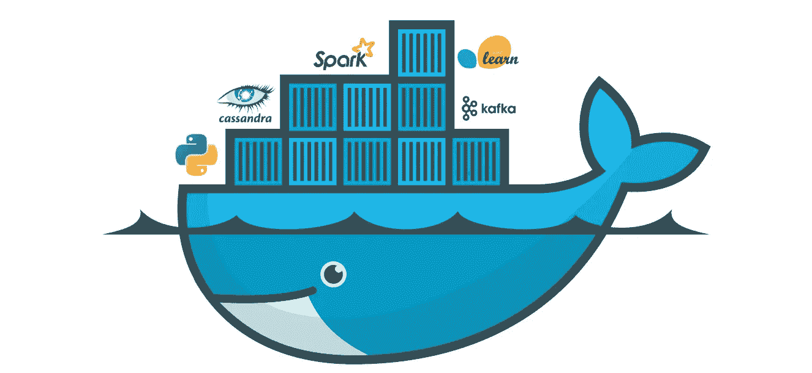

# Docker 中作为微服务的机器学习模型

> 原文：<https://towardsdatascience.com/machine-learning-models-as-micro-services-in-docker-a798e1f068a5?source=collection_archive---------5----------------------->



机器学习开发中最大的被低估的挑战之一是在生产中以可扩展的方式部署训练好的模型。我读过的一个关于它的笑话是“如今机器学习最常见的部署方式是 powerpoint 幻灯片:)”。

# **为什么是 Docker？**

[Docker](https://www.docker.com/get-started) 是一个容器化平台，它将一个应用程序&及其所有依赖项打包到一个容器中。

*激活该容器导致应用程序被激活*。

当你有一大堆以隔离方式工作的服务，并作为 web 应用程序的数据提供者时，就使用 Docker。根据负载情况，可以根据设置的规则按需剥离实例。

# **为什么要用 Docker 做机器学习模型？**

常规软件应用程序的生产部署非常困难。如果那个软件是机器学习管道，那就更糟糕了！在今天的情况下，你无法摆脱机器学习，因为这是你在业务中可以获得的最大竞争优势。在生产中，一个机器学习驱动的应用程序可能会出于多种目的使用多个模型。可以通过 docker 处理的机器学习模型部署中的一些主要实际挑战有:

1.  **不同型号的环境不一致。**

有些情况下，对于一个模型，您需要将 LANG_LEVEL 设置为“c ”,而对于另一个模型，LANG_LEVEL 应该为“en_us”。UTF 8 英尺高。将不同的模型放入不同的容器中，以便获得不同模型的**隔离环境**。

**2。模型间不一致的库需求。**

您已经使用 tensorflow 1.10 开发了一个文本摘要器。现在我们想用 tensorflow2.0 支持的迁移学习进行情感分析(假设)。将它们放在不同的容器中不会破坏应用程序。

另一个主要的用例是，你用 python 开发 ML 模型。但是你想用 Go 语言做的应用(为了一些技术优势)，那么通过 docker 把 ml 模型暴露给 app 就解决了。

**3。不同型号的资源需求不一致。**

你有一个非常复杂的对象检测模型，需要 GPU，你有 5 个不同的神经网络，用于其他目的，适合在 CPU 上运行。然后在容器中部署模型时，您可以根据需求灵活地分配资源。

**4。跨模型的不一致流量。**

假设您有一个问题标识符模型和答案生成模式，前者调用频繁，而后者调用不频繁。那么你需要比答案生成器更多的问题标识符实例。这可以由 docker 轻松处理。

另一个场景是，上午 10 点你的模型有 10000 个请求，而晚上 8 点只有 100 个。因此，您需要根据您的需求剥离更多的服务实例，这在 docker 中更容易。

**5。模型级缩放**

假设你有一个每秒处理 100000 个请求的统计模型，而一个每秒能够处理 100 个请求的深度学习模型。那么对于 10000 个请求，你只需要纵向扩展深度学习模型。这可以由 docker 来完成。

现在让我们看看如何创建深度学习模型的容器。在这里，我建立的模型是在 http://cogcomp.org/Data/QA/QC/的[可用的问题分类器数据集上的问题主题标识符。Google 的通用句子编码器用于单词嵌入。](http://cogcomp.org/Data/QA/QC/)

为模型创建容器时，通常必须遵循的工作流程是:

1.  建立和训练模型。
2.  创建模型的 API。(这里我们把它放在一个 flask API 中)。
3.  创建包含所有必需库的需求文件。
4.  使用必要的环境设置和启动操作创建 docker 文件。
5.  建立 docker 形象。
6.  现在运行容器，并在完成后跳舞:)

[](https://github.com/sambit9238/QuestionTopicAnalysis) [## sambit 9238/QuestionTopicAnalysis

### 发现问题主题在各种用例中起着重要的作用，从问答系统到回答…

github.com](https://github.com/sambit9238/QuestionTopicAnalysis) 

**建立并训练模型。**

为了建立和训练模型，基本的工作流程是获取数据，对数据进行清理和处理，然后将数据提供给模型架构，以获得训练好的模型。

例如，我在 http://cogcomp.org/Data/QA/QC/[的 TREC 数据集上建立了一个问题意图分类器模型。训练数据有 6 个意图，每个意图的实例数如下:](http://cogcomp.org/Data/QA/QC/)

```
Counter({'DESC': 1162,
         'ENTY': 1250,
         'ABBR': 86,
         'HUM': 1223,
         'NUM': 896,
         'LOC': 835})
```

可以在[https://github . com/sambit 9238/QuestionTopicAnalysis/blob/master/question _ topic . ipynb](https://github.com/sambit9238/QuestionTopicAnalysis/blob/master/question_topic.ipynb)查看模型创建

这里遵循的处理步骤是:

1.  处理宫缩就像我会，我已经等。
2.  处理超链接、邮件地址等。
3.  处理数字和身份证。
4.  处理标点符号。

对于嵌入，[使用了来自 tensorflow-hub 的 Google 通用句子编码器。](/use-cases-of-googles-universal-sentence-encoder-in-production-dd5aaab4fc15)

遵循的模型结构是具有两个隐藏层的神经网络，每个隐藏层具有 256 个神经元。为了避免过度拟合，使用 L2 正则化。

```
Layer (type)                 Output Shape              Param #   
=================================================================
input_1 (InputLayer)         (None, 1)                 0         
_________________________________________________________________
lambda_1 (Lambda)            (None, 512)               0         
_________________________________________________________________
dense_1 (Dense)              (None, 256)               131328    
_________________________________________________________________
dense_2 (Dense)              (None, 256)               65792     
_________________________________________________________________
dense_3 (Dense)              (None, 6)                 1542      
=================================================================
Total params: 198,662
Trainable params: 198,662
Non-trainable params: 0
_________________________________
```

该模型存储在. h5 文件中以供重用。标签编码器存储在 pickle 文件中以供重用。

**创建模型的 API。(这里我们把它放在一个 flask API 中)。**

存储的模型放在 Flask api 中，以便可以在生产中使用([https://github . com/sambit 9238/QuestionTopicAnalysis/blob/master/docker _ question _ topic/app . py](https://github.com/sambit9238/QuestionTopicAnalysis/blob/master/docker_question_topic/app.py))。)

API 需要一个文本列表，因为在实时使用时会出现多个句子。它经过清洗和处理后被送入预测系统。预测结果被缩放以表示每个意图的置信度百分比。然后，缩放后的结果以 JSON 格式发送。

举个例子，

输入:【“你工资多少？”]

输出:{'ABBR': 0.0012655753，' DESC': 0.0079659065，' ENTY': 0.011016952，'哼':0.028764706，' LOC': 0.013653239，' NUM': 0.93733364}

这意味着模型有 93%的把握认为这个问题的答案应该是一个**数字**。

**创建包含所有所需库的需求文件。**

为了创建 Docker 映像来服务我们的 API，我们需要创建一个需求文件，其中包含所有使用过的库及其版本。

**创建具有必要环境设置和启动操作的 Dockerfile 文件。**

一个 **Dockerfile** 是一个文本文档，它包含用户可以在命令行上调用的所有命令来组合一个图像。

对于我们的示例，预构建的 python-3.6 映像被用作基础映像。然后，已经下载了预先训练的通用语句编码器模型文件，随后安装了所需的库。docker 的 5000 端口是公开的，这是 flask app 在默认配置下运行的端口。

**打造 docker 形象。并运行容器**

现在我们在一个目录中有了 Dockerfile、flask API 和经过训练的模型文件。因此，我们需要从中创建 docker 图像。该命令可以是:

```
docker build -t question_topic .
#the last option is location of the directory. Since I am in the directory so '.' is put, which represents current directory in unix.
```

现在 docker 映像已经创建，我们需要在容器`docker run -p 8888:5000 --name question_topic question_topic`中运行该映像

它将使创建的 docker 映像运行。docker 中的端口 5000 映射到主机的 8888 端口。因此，API 将在端口 8888 接收和响应请求。如果您想在后台运行 docker 并将其从命令提示符中分离出来(这将是实时的情况)，请使用'-d '选项运行它。

为了检查 docker 的输出，让我们使用 curl 发送一个 post 请求。

输入:

为了提供输入，curl—request POST
—URL[http://0 . 0 . 0 . 0:8888/predict _ topic](http://0.0.0.0:8888/predict_topic)
—header ' content-type:application/JSON '
—data ' { " raw text _ list ":["您现在在哪里工作？"，“你的工资是多少？”]}'

输出:

{

" input": "['你现在在哪里工作？'，‘你的工资是多少？’]",

“output”:“[{ ' ABBR ':0.0033528977，' DESC': 0.0013749895，' ENTY': 0.0068545835，'哼':0.7283039，' LOC': 0.25804028，' NUM': 0.0020733867}，

{'ABBR': 0.0012655753，' DESC': 0.0079659065，' ENTY': 0.011016952，'哼':0.028764706，' LOC': 0.013653239，' NUM': 0.93733364} ]"

}

看来 docker 运行良好:)

**备注:**

提到的例子还没有准备好投入生产。但是，通过以下几个步骤，它就可以投入生产了:

1.  在模型级别，可以进行更多的处理和模型超参数调整，以使模型更好。
2.  在 API 级别，不需要在每次请求时初始化会话和变量。通过大幅缩短 API 的响应时间，可以在应用启动时完成一次。
3.  在 docker 级别，Docker 文件没有优化，因此 Docker 映像在大小上可能比要求的要大。