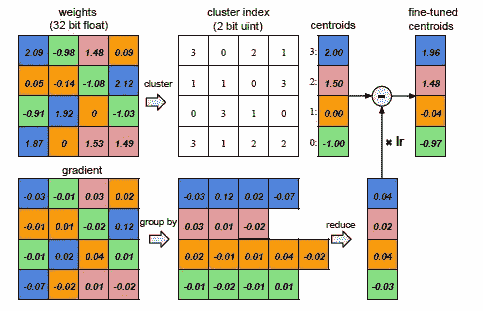

# 深度学习—模型优化和压缩:简化

> 原文：<https://towardsdatascience.com/machine-learning-models-compression-and-quantization-simplified-a302ddf326f2?source=collection_archive---------10----------------------->

## 看看最先进的机器学习模型的压缩、修剪和量化领域

## 这是什么？

我们周围的世界充满了神经网络和深度学习模型，它们在创造*奇迹*！！但是这些模型既计算量大又耗能。如此昂贵，以至于人们已经开始要求 AI/ML 对他们的碳排放负责，数字 ***不好看！！***

 [## 训练一个人工智能模型在它们的一生中可以排放相当于五辆汽车的碳

### 人工智能行业经常被比作石油行业:一旦被开采和提炼，数据就像石油一样，可以…

www.technologyreview.com](https://www.technologyreview.com/s/613630/training-a-single-ai-model-can-emit-as-much-carbon-as-five-cars-in-their-lifetimes/?utm_medium=tr_social&utm_source=facebook&utm_campaign=site_visitor.unpaid.engagement&fbclid=IwAR04gQbmXY7OxR3vx8BRb52-pYhlqhXhxorXGSkgGkygu8jUVgbF_CJxYwI) 

更多研究人员转向模型压缩的另一个主要原因是在硬件资源有限的系统上部署这些模型的困难。虽然这些模型已经成功地成为头条新闻并实现了非凡的性能，但它们需要昂贵的高速 GPU 的支持才能工作，这限制了它们的应用。

能够压缩这些高度复杂的模型，将它们传输到硬件设备，并结束它们对巨大计算资源的依赖，是该领域的主要目标之一。这些进步可以帮助我们将人工智能融入到我们周围的每个小型嵌入式系统中。

## 为什么不直接用 GPU 服务器？

是的*当然！！随着像谷歌和亚马逊这样的互联网巨头提供在线计算服务，人们确实想知道进行远程计算是否是一条出路。虽然人们已经开始像使用拐杖一样使用这些云服务进行繁重的计算，但它也带来了自己的一系列问题。*

云计算的一个主要问题是网络连接。该系统需要一直在线才能顺利工作。但是这并不总是能够保证的，因此在本地进行计算对于不能承受任何网络延迟的系统来说是极其重要的。

使用这些云服务的另一个问题是牺牲“空气间隙”。“空气间隙”是一个技术术语，用来表示没有连接到互联网的系统，因此无法被远程攻破。访问这些配置中的数据需要通过物理方式完成，*不可能完成的任务风格*！！:P

对于极度保护隐私和安全的系统来说，放弃这种“空气间隙”是不理想的，因此他们更喜欢本地计算而不是云服务。

## 但这些都不会影响到我！！

*这是大多数 ML 社区相信的，但不是真的！！*如果您是 ML 的初学者，希望开发最先进的模型，并且不受处理能力的限制，那么您可能会认为高度复杂和深度的模型总是最佳选择。

但这是一个巨大的误解。高度复杂和深度的模型不能保证性能。更不用说，这些模型可能需要几个小时甚至几天的训练时间(即使是在 GPU 上)。对修剪和量化的研究表明，模型中真正重要的连接只占整个蜘蛛网的一小部分！！

例如，像 AlexNet 和 VGG-16 这样的著名 ImageNet 模型已经被压缩到其原始大小的 40-50 倍，而准确性没有任何损失(实际上略有增加)。这极大地提高了他们的推理速度，以及他们适应各种设备的便利性。

## 有足够的说服力，让我们谈谈所涉及的技术！！

模型压缩可以分为两大类，

**修剪**:移除架构中存在的冗余连接。剪枝包括切除不重要的权重(通常定义为绝对值小的权重)。

显然，所形成的新模型将具有较低的准确性，因为该模型实际上是为原始连接而训练的。这就是为什么模型在修剪后被微调以重新获得准确性。值得注意的是，全连接层和 CNN 通常可以达到 **90%的稀疏度**，而不会损失任何精度。

**量化**:量化包括通过聚类或四舍五入将权重捆绑在一起，这样相同数量的连接可以用更少的内存来表示。

通过聚类/捆绑进行量化，从而使用较少数量的不同浮点值来表示更多数量的特征，这是最常用的技术之一。形成许多量化方法框架的另一种常见技术是通过舍入将浮点权重转换为定点表示。

同样，正如修剪一样，我们需要在量化后对模型进行微调。这里重要的一点是，量化时赋予权重的属性也应该通过微调来保持。这就是为什么要使用特定的微调方式来匹配量化方法。

请看上图，这是一个通过聚类进行量化的例子。相同颜色的权重聚集在一起，用它们的质心来表示。这减少了表示这些权重所需的数据量。早期需要 32 位*16 = 512 位来表示它们。现在只需要 32 位* 4+2 位*16 = 160 位来表示它们。在微调期间，属于同一颜色的所有权重的梯度被相加，然后从质心中减去。这确保了在量化期间进行的聚类通过微调得以保持。

## 下一步是什么？

深度学习模型剪枝和量化是相对较新的领域。虽然在这一领域取得了重大成功，但仍有很长的路要走。该领域的下一个重点应该是创建开源和易于访问的管道，用于将常见的深度学习模型转移到 FPGAs 等嵌入式系统。

这个博客是为机器学习领域创建简化介绍的努力的一部分。点击此处的完整系列

 [## 机器学习:简化

### 在你一头扎进去之前就知道了

towardsdatascience.com](/machine-learning-simplified-1fe22fec0fac) 

*或者干脆阅读系列的下一篇博客*

 [## 带人工智能的高频交易(HFT):简化

### 让我们来看看高频交易这个竞争激烈的世界，以及人工智能是如何成为其中一部分的。

towardsdatascience.com](/high-frequency-trading-hft-with-ai-simplified-a24c00da72e0) 

## 参考

*[1]韩、宋、、毛和威廉·j·戴利。"深度压缩:压缩深度神经网络与剪枝，训练量化和霍夫曼编码."arXiv 预印本 arXiv:1510.00149 (2015)。
[2]贾，海鹏，等.“模型压缩中的丢弃问题”arXiv 预印本 arXiv:1812.02035 (2018)。
[3]王、硕等，“C-lstm:在 fpgas 上使用结构化压缩技术实现高效 lstm。”2018 年 ACM/SIGDA 现场可编程门阵列国际研讨会论文集。ACM，2018。*