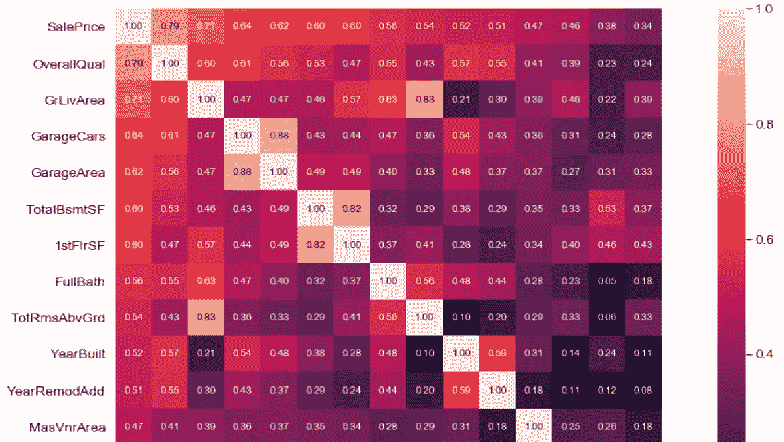

# 分类变量上的机器学习

> 原文：<https://towardsdatascience.com/machine-learning-on-categorical-variables-3b76ffe4a7cb?source=collection_archive---------4----------------------->

## **如何正确运行和评估模型**


Photo by [v2osk](https://unsplash.com/@v2osk?utm_source=medium&utm_medium=referral) on [Unsplash](https://unsplash.com?utm_source=medium&utm_medium=referral)

乍一看，分类变量和数字变量没什么不同。但是，一旦你开始深入挖掘，并在代码中实现你的机器学习(和预处理)思想，你就会每分钟都停下来问一些问题，比如“我在训练集和测试集上都做特征工程吗？”或者“我听说了一些关于[基数](https://stackoverflow.com/questions/10164608/how-do-you-count-cardinality-of-very-large-datasets-efficiently-in-python)的事情——那是什么，我应该用谷歌搜索更多相关信息吗？”

让我们看看我们是否可以通过一个行动计划来澄清这一点，即如何处理具有许多分类变量的数据集并训练几个模型。

Kaggle 将作为我们的数据源:它有一个[优秀的房价数据集](https://www.kaggle.com/c/house-prices-advanced-regression-techniques)。准备花些时间浏览[提供的数据字典](https://storage.googleapis.com/kaggle-competitions-data/kaggle/5407/205873/data_description.txt?GoogleAccessId=web-data@kaggle-161607.iam.gserviceaccount.com&Expires=1564839056&Signature=f5rA1N%2B30QoGsRGpUq8B4PuRuAPXgwHDtJ34IkFb4NGCjxoBvsUnmKuDFTqtK3SJ0JOS31A%2BZmmBlw5aKBoRu6Zjd5870t4LhPYT0SAbUPvfCmEJEPkLyjH55AUfFcP%2BzbcdihTDX47q1NdjDg%2FfBx%2FK2%2FNqd2QthD4J2AXX3BIm0Foxi0bYBUCU%2FQd4jw9yN6grKjRgDWU9eePGciBC%2FDPvqBQEFiqVgZuBW%2BMxOMoy3ElgIVJgs7PyxoACeywYutFtRV01uU5JlwYYsLumJI6M5W4o7hlXWOgZXSxZ0WUGWvacdhqmjqJWyY3ZA7JmHSk%2FSxXRfWNXhqn9J2teOw%3D%3D)。您可以在单独的浏览器窗口中打开它。我们还会将其加载到 Jupyter 笔记本中。在本练习中，我们将根据房屋的各种参数预测列 *SalePrice* 中的值。

和往常一样，所有代码都可以在 [GitHub](https://github.com/nastyh/Feature-Engineering--House-Prices) 上获得(你需要工作簿[Features _ for _ mlops . ipynb](https://github.com/nastyh/Feature-Engineering--House-Prices/blob/master/Features_for_MLOps.ipynb))。它还有一些额外的图表，我们在这里没有涉及，但对于更好地理解这个过程是有用的。

让我们加载依赖项和数据:

```
# Loading necessary packages
import pandas as pd
import numpy as np
import matplotlib.pyplot as plt
import scipy.stats as st
import seaborn as sns
import pandas_profiling
import requests 
%matplotlib inlinetrain = pd.read_csv(r'train.csv')
test = pd.read_csv(r'test.csv')
```

如果您想在 GUI 中有一个数据字典:

```
response = requests.get('[https://storage.googleapis.com/kaggle-competitions-data/kaggle/5407/205873/data_description.txt?GoogleAccessId=web-data@kaggle-161607.iam.gserviceaccount.com&Expires=1564407075&Signature=Iduf4UDvx2Cei5S9B7A%2B%2Fz3u%2Ff8GG0RxvpfMu5IHRtJOFBsjq806B2sSr6zucZBwJeBNSOuIpOssfa4i%2BYS8ybrJgaHnA%2Fqkcox6ZsD8BLIl3yTHjwmfkie2ohGSI0bdZLiXblBWps8xJ8sGZPnmTegLYLhFgrA7O0BEF5dIXrFVYufTcndkOeOyYm3fopGjTablaxWOUyhmd43WfOxADJInaMqUk37SBzVD4jD1bj%2F%2B%2FJkK7OeTvUIBJOR3EXij97rhVqcZNdxTttF91t0W3HFcqJrRhrw5%2BKvZmHNzsT5AO164QSjlFqT5kU3dZWoZqxdDOxImVvr%2Fw2m4IRZGCw%3D%3D'](https://storage.googleapis.com/kaggle-competitions-data/kaggle/5407/205873/data_description.txt?GoogleAccessId=web-data@kaggle-161607.iam.gserviceaccount.com&Expires=1564407075&Signature=Iduf4UDvx2Cei5S9B7A%2B%2Fz3u%2Ff8GG0RxvpfMu5IHRtJOFBsjq806B2sSr6zucZBwJeBNSOuIpOssfa4i%2BYS8ybrJgaHnA%2Fqkcox6ZsD8BLIl3yTHjwmfkie2ohGSI0bdZLiXblBWps8xJ8sGZPnmTegLYLhFgrA7O0BEF5dIXrFVYufTcndkOeOyYm3fopGjTablaxWOUyhmd43WfOxADJInaMqUk37SBzVD4jD1bj%2F%2B%2FJkK7OeTvUIBJOR3EXij97rhVqcZNdxTttF91t0W3HFcqJrRhrw5%2BKvZmHNzsT5AO164QSjlFqT5kU3dZWoZqxdDOxImVvr%2Fw2m4IRZGCw%3D%3D'))
dict = response.text
print(dict)
```

我们现在可以进行快速数据分析:

```
train.describe().T
test.describe().T
```

和往常一样，我推荐[熊猫简介包](https://github.com/pandas-profiling/pandas-profiling)。

```
pandas_profiling.ProfileReport(train)
```

有很多缺失的值。除了逐一检查每个特性并决定如何处理它们之外，没有什么灵丹妙药可以解决这个问题。我们用以下方式清洁它们:

```
dr = ['Alley','Fence','FireplaceQu','MiscFeature','PoolQC']
train.drop(labels = dr, axis = 1, inplace = True)
test.drop(labels = dr, axis = 1, inplace = True)train['LotFrontage'].fillna(train['LotFrontage'].mean(), inplace = True)
train['GarageQual'].fillna('NA', inplace = True)
train['GarageFinish'].fillna('NA', inplace = True)
train['GarageCond'].fillna('NA', inplace = True)
train['GarageYrBlt'].fillna(train['GarageYrBlt'].mean(), inplace = True)
train['GarageType'].fillna('NA', inplace = True)
train['MasVnrType'].fillna('None', inplace = True)
train['MasVnrArea'].fillna(train['MasVnrArea'].mean(), inplace = True)
train['BsmtQual'].fillna('NA', inplace = True)
train['BsmtCond'].fillna('NA', inplace = True)
train['BsmtExposure'].fillna('NA', inplace = True)
train['BsmtFinType1'].fillna('NA', inplace = True)
train['BsmtFinType2'].fillna('NA', inplace = True)
train['Electrical'].fillna('SBrkr', inplace = True) # substituting with the majority class# and for the test settest['LotFrontage'].fillna(train['LotFrontage'].mean(), inplace = True)
test['GarageQual'].fillna('NA', inplace = True)
test['GarageFinish'].fillna('NA', inplace = True)
test['GarageCond'].fillna('NA', inplace = True)
test['GarageYrBlt'].fillna(train['GarageYrBlt'].mean(), inplace = True)
test['GarageType'].fillna('NA', inplace = True)
test['MasVnrType'].fillna('None', inplace = True)
test['MasVnrArea'].fillna(train['MasVnrArea'].mean(), inplace = True)
test['BsmtQual'].fillna('NA', inplace = True)
test['BsmtCond'].fillna('NA', inplace = True)
test['BsmtExposure'].fillna('NA', inplace = True)
test['BsmtFinType1'].fillna('NA', inplace = True)
test['BsmtFinType2'].fillna('NA', inplace = True)
test['Electrical'].fillna('SBrkr', inplace = True) # substituting with the majority class
```

有趣的是，测试集有缺失值，而训练集没有。这意味着我们需要做额外的清洁工作:

```
test['MSZoning'].fillna('RL', inplace = True)
test['Utilities'].dropna(inplace = True)
test['Exterior1st'].dropna(inplace = True)
test['Exterior2nd'].dropna(inplace = True)
test['BsmtFinSF1'].fillna(test['BsmtFinSF1'].mean(), inplace = True)
test['BsmtFinSF2'].fillna(test['BsmtFinSF2'].mean(), inplace = True)
test['BsmtUnfSF'].fillna(test['BsmtUnfSF'].mean(), inplace = True)
test['TotalBsmtSF'].fillna(test['TotalBsmtSF'].mean(), inplace = True)
test['BsmtFullBath'].fillna(test['BsmtFullBath'].mean(), inplace = True)
test['BsmtHalfBath'].fillna(test['BsmtHalfBath'].mean(), inplace = True)
test['KitchenQual'].dropna(inplace = True)
test['Functional'].dropna(inplace = True)
test['GarageCars'].fillna(round(float(test['GarageCars'].mean()),1), inplace = True)
test['GarageArea'].fillna(test['GarageArea'].mean(), inplace = True)
test['SaleType'].dropna(inplace = True)test.drop(test.index[[95,45,485,756,1013,1029]], inplace = True)
test.drop(test.index[[455,691]], inplace = True)
test.drop(test.loc[test['Id']==1916].index, inplace = True)
test.drop(test.loc[test['Id']==2152].index, inplace = True)
```

在这个过程之后，没有 nan 留下:

```
train.columns[train.isna().any()].tolist()
```


It’s an empty list that would have had columns with NaNs if there were any

```
test[test.isna().any(axis=1)]
```


The Test set is also good to go

# 分类变量的未来工程

这就是你在这里的原因。这是我们将遵循的清单:

*   确保分类变量被如此对待。这同样适用于数字变量
*   检查分类要素的基数
*   查看“可疑”列如何与目标变量交互
*   查看是否有任何高度相关的要素可以删除
*   看看有没有可以组合的功能
*   考虑基数，对分类变量进行一次性编码或频率编码

## 分类变量的类型为“类别”

如果您查看一些列，如 *MSSubClass* ，您会意识到，虽然它们包含数值(在本例中为 20、30 等。)，它们实际上是分类变量。从数据字典中可以清楚地看出:


Numbers don’t always mean numbers

我们怀疑这样的柱子不止一根。我们来确认一下:

```
[col for col in train.columns.tolist() if train[col].dtype not in ['object']]
```

它返回非对象列的列表。在阅读了对它们每一个的描述后，我们决定进行以下转换:

```
train['Id'] = train['Id'].astype('category') 
train['MSSubClass'] = train['MSSubClass'].astype('category')
# train['YearBuilt'] = train['YearBuilt'].astype('category')
# train['YrSold'] = train['YrSold'].astype('category')
# train['YearRemodAdd'] = train['YearRemodAdd'].astype('category')
train['GarageYrBlt'] = train['GarageYrBlt'].astype('category')
train['Fence'] = train['Fence'].astype('category')
train['MiscFeature'] = train['MiscFeature'].astype('category')
train['MiscVal'] = train['MiscVal'].astype('category')
```

您将很快看到为什么三个与年份相关的列还没有被转换。

## 基数

如果您有显示高基数的分类要素，您可能会面临某些问题。最有可能的情况是，您将使用一键编码器，您的数据集可能会突然变得非常宽和稀疏。这不利于计算(尤其是当列数接近观察数时)，不利于任何基于树的方法(很可能，树会向一个方向生长)，并且可能导致过度拟合和数据泄漏。

你可以从概念上**或者技术上**来解决这个问题。****

**概念方法**:检查每一个变量，对它们进行 *value_counts()* 运算，决定是否可以牺牲一些不常用的值，将它们放在“其他”项下。

```
top = test['GarageType'].isin(test['GarageType'].value_counts().index[:5])
test.loc[~top, 'GarageType'] = "other"
```

我们刚刚在这里做的: *index()* 返回给定元素在列表中的位置。在我们的例子中，该列中所有不在频率前五位的**值现在都在“其他”中。理想情况下，您希望对每一列都这样做。之后，你做一个热编码。然而，如果你对自己的时间很吝啬，你可能会用一种纯粹的**技术**方法。最有可能的是，你的计算机将能够处理一个非常广泛的数据集，并相对快速地处理它。所以只要调用 get_dummies()就可以了，希望一切顺利。你可能需要忘记[基于森林的](https://roamanalytics.com/2016/10/28/are-categorical-variables-getting-lost-in-your-random-forests/)或者降维方法，但是，在大多数情况下，你可以忍受它。Sklearn 的 *OneHotEncoder()* 在这里提供了一些[额外的功能](https://scikit-learn.org/stable/modules/generated/sklearn.preprocessing.OneHotEncoder.html)可能会有用。它有一个参数 *n_values()* ，您可以用它来指定每一列可以保留的值的最大数量。**

在这个特定的数据集中，我们首先调查了训练列和测试列是否具有不同的基数:

```
for col in train.columns:
    if train[col].dtype == "object":
        print("For column {} cardinality in Train minus cardinality in Test equals: {}".format(col, train[col].nunique()-test[col].nunique())) 
```

然后决定通过研究条形图来研究这些信息:

```
# Gathering columns for which cardinality isn't the same into a list in order to make charts
cols_list = []
for col in train.columns:
     if train[col].dtype == "object" and (train[col].nunique()-test[col].nunique()) != 0:
        cols_list.append(col)

# looking at values in these columns
for l in cols_list:
    sns.catplot(x=l, hue='Status', kind='count', data=combo)
    plt.xticks(rotation=45)
```


Example of a variable’s values in the train and test datasets

幸运的是，一般来说，没有一个列有很多不同的分类值，测试集和训练集也没有表现出很高的基数。正因为如此，我们能够继续进行一个普通的独热编码。

## “可疑”栏

正如我们上面所说的，高基数的情况没有那么糟糕，只适用于相应列中的较小值。因此，我们将保持原样。不过，我们仍然可以检查它们是如何影响销售价格的。

我们将构建盒子图*(可能需要一些时间来渲染)*:

```
# list w/ categorical variables
cater_cols = train.select_dtypes(include='category').columns.to_list()for cols in cater_cols:
    plt.figure()
    sns.boxplot(x = cols, y = 'SalePrice', data = train)
```

一个好主意是在以下情况后关闭图表:

```
plt.clf()
plt.close()
```

无法检测到任何可见的异常值。

## 相关

我们将把数字特征与*销售价格*联系起来，希望了解哪些可以删除，哪些可以合并。查看每个特性可能不是一个好主意，所以让我们关注前 15 个(但是您可以在下面的代码中将这个数字更改为任何其他值)最相关的变量:

```
corrmat = train.corr()
plt.figure(figsize=(20,10))
k = 15 #number of variables for heatmap
cols = corrmat.nlargest(k, 'SalePrice')['SalePrice'].index
cm = np.corrcoef(train[cols].values.T)
sns.set(font_scale=1.25)
hm = sns.heatmap(cm, cbar=True, annot=True, square=True, fmt='.2f', annot_kws={'size': 10}, yticklabels=cols.values, xticklabels=cols.values)
plt.show()
```



Top categories affecting *SalePrice*

同样，你需要运用一些常识。例如， *GarageCars* 和 *GarageArea* 都在讲述一个关于你停放车辆的地方有多大的故事。关于平方英尺的信息分布在不同的列中，并且可能被汇总。平方英尺的浴池可以跟随诉讼。一个时代的房子和他们何时被改造也应该齐头并进。让我们来实现它:

```
train['Remodeled Y/N'] = np.where(train['YearRemodAdd'] ==train['YearBuilt'], 'No', 'Yes')
train['Age when Sold'] = train['YrSold'] - train['YearRemodAdd']
train['Remodeled Y/N'] = train['Remodeled Y/N'].astype('category')train['totSqFt'] = train['TotalBsmtSF'] + train['GrLivArea'] + train['1stFlrSF'] + train['2ndFlrSF']train['totBath'] = train['FullBath'] + 0.5*train['HalfBath'] + train['BsmtFullBath'] + 0.5*train['BsmtHalfBath']
```

我们刚刚创建了一个新列， *totSqFt* ，它合并了三个现有的值。我们可以检查它是否可以作为一个正确的近似:

```
fig = plt.figure(figsize=(20,10))
ax1 = fig.add_subplot(121)
ax2 = fig.add_subplot(122)ax1.scatter(train['totSqFt'],train['SalePrice'], color = 'crimson', label = 'totSqFt')ax2.scatter(train['GrLivArea'],train['SalePrice'], color = 'teal', alpha = 0.3, label ='GrLivArea')
ax2.scatter(train['TotalBsmtSF'],train['SalePrice'], color = 'midnightblue', label = 'TotalBsmtSF')
ax2.scatter(train['1stFlrSF'],train['SalePrice'], color = 'coral', alpha = 0.4, label = '1stFlrSF')ax1.legend()
ax2.legend()
plt.show()
```

看起来很准确:


Sum of three columns on the left; original features on the right

完成后，我们可以删除进入新变量的列:

```
# Remove variables that were used to create new features
cols_2_remove = ['GrLivArea','TotalBsmtSF','1stFlrSF','YearRemodAdd','YearBuilt','YrSold','Id','2ndFlrSF',
                'FullBath','HalfBath','BsmtFullBath','BsmtHalfBath','GarageYrBlt']
train_rem = train.copy()
train_rem.drop(cols_2_remove, axis = 1, inplace = True)
```

我们有独立变量，情况很好，但是让我们再看看*销售价格*。

```
# Building normality plots
from statsmodels.graphics.gofplots import qqplot
from matplotlib import pyplot
```


Normality plot for SalePrice

这张 [q-q 图](https://data.library.virginia.edu/understanding-q-q-plots/)显示，非常便宜和非常昂贵的房子并不真正遵循正态分布。对 *totSqFt* 的额外检查证实了这一点:


q-q plot for totSqFt

你可以探索这些又大又贵(或者又小又便宜)的房子:

```
train_rem[train_rem['totSqFt']>10000]
train_rem[train_rem['SalePrice']>700000]
```

它们没有什么特别的，所以我们应该对从集合中移除它们感到相对安全:

```
train_rem.drop(train_rem[train_rem.totSqFt>10000].index, inplace = True)
train_rem.drop(train_rem[train_rem.SalePrice>700000].index, inplace = True)
```

之后，q-q 图看起来更正常。

这是有效处理具有大量分类特征的数据集的方法。我们已经做了大量的数据探索和预处理，这将在 ML 阶段有所帮助。

现在这里最重要的部分:**你必须对合并的数据集进行任何编码！**为什么？假设您有一个列“颜色”，它在训练集中的值为“蓝色”、“绿色”和“黑色”。同时测试也有“黄色”和“红色”您的编码器必须看到所有可能的值，才能充分利用它们。

操作的顺序是:

*   在新列*状态*中分别标记训练集和测试集
*   组合列车和测试装置，从列车部分移除*销售价格*
*   对分类特征进行一次性编码(但不包括*状态*
*   使用*状态*将接头组拆分回列车并测试

没有理由保留分类列的*对象*类型。让我们把它们变成 [*类别*](https://pandas.pydata.org/pandas-docs/stable/user_guide/categorical.html) 。

```
# turning object columns into category columns
for i in train.select_dtypes(include='object').columns.to_list():
    train[i] = train[i].astype('category')
```

和主要部分:

```
# list w/ categorical variables
cater_cols = train.select_dtypes(include='category').columns.to_list()#Add new column Status to both sets to differentiate between the two
train_1 = train_rem.copy()
train_1.drop(labels = 'SalePrice', axis = 1, inplace = True)
train_1['Status'] = 'Train Set' # adding a column Status to differentiate between Train and Test in the combined set
test_1 = test_rem.copy()
test_1['Status'] = 'Test Set'
combo = train_1.copy()
combo = combo.append(test_1)
```

确保每件事都做对的一个好方法是不断检查你的数据帧的形状:

```
train_1.shape
test_1.shape
combo.shape
```

这里我们单独保存了*状态*并从 X:

```
X = combo.copy()
St = X['Status']
X.drop('Status', axis = 1, inplace = True)
```

以及编码:

```
X_cat = X.select_dtypes(include=['category'])
X_num = X.select_dtypes(exclude=['category'])
X_encoded = pd.get_dummies(X_cat)
```

现在我们有三块: *X_encoded* (编码后的分类变量) *X_num* (没变的数值变量) *St* (就一列，*状态*)。

检查它们的大小是否匹配:

```
print("X_encoded = {}\nX_num = {}\nSt = {}".format(X_encoded.shape,X_num.shape, St.shape))
```

将它们组合在一起(并进行最终尺寸检查):

```
frames = [X_encoded, X_num, St]
combo_enc = pd.concat(frames, axis = 1)print('Combined set is {}'.format(combo_enc.shape))
```

现在，我们可以将组合集分为训练集和测试集，并继续机器学习:

```
train_enc = combo_enc.loc[combo_enc['Status']=='Train Set']
test_enc = combo_enc.loc[combo_enc['Status']=='Test Set']print('Encoded Train set is {}\nEncoded Test set is {}'.format(train_enc.shape,test_enc.shape))
```

这种事实上的方法是透明的，在各种文章和书籍中都有描述。然而，让我们避免使我们的数据集太宽。怎么会？通过频率编码。

## 频率编码

```
X_cat_freq = X_cat.copy()for c in X_cat_freq.columns.to_list():
    X_cat_freq[c] = X_cat_freq.groupby(c).transform('count')/len(X_cat_freq[c])
```

频率编码并不难理解或实现。我们计算一列中不同值的数量，然后除以该列的总长度。结果，我们得到了每一个值的“份额”,这些值在任何 ML 算法中都能很好地发挥作用。

下面的代码看起来应该很熟悉:我们需要区分训练集和测试集，然后将它们合并在一起，

```
frames_freq = [X_cat_freq, X_num, St]
combo_enc_freq = pd.concat(frames_freq, axis = 1)combo_enc_freq.shape
# All features and Status are together#cut combo_enc_freq by Train and Test. Add SalePrice back to the Train portion
train_freq = combo_enc_freq.loc[combo_enc_freq['Status']=='Train Set']
test_freq = combo_enc_freq.loc[combo_enc_freq['Status']=='Test Set']# adding SalePrice to Encoded Train set
fr = [train_freq, sp]
train_freq = pd.concat(fr, axis = 1)# Checking sizes 
print("Respective sizes of the train set: {}\nOf the test set: {}\nOf the prices array:{}".format(train_freq.shape,
                                                                                                 test_freq.shape,
                                                                                                 sp.shape))
```

为了便于您比较哪种编码类型会产生更好的结果，我们创建了使用频率和一键编码方法编码的数据帧:

```
features_freq = train_freq.drop(['SalePrice','Status'], axis = 1)
result_freq = np.exp(train_freq['SalePrice'])X_train_freq, X_test_freq, y_train_freq, y_test_freq = train_test_split(features_freq, result_freq, test_size = 0.2, random_state = 12)features = train_enc.drop(['SalePrice','Status'], axis = 1)
result = train_enc['SalePrice']X_train, X_test, y_train, y_test = train_test_split(features, result, test_size = 0.2, random_state = 12)
```

# 机器学习

这一部分在其他资料中有详细解释；此外，GitHub 上的工作簿包含了几个不同模型的实现:从使用 one-hot 编码数据集的回归到 Lasso 和 XGBoost。下面我们将探讨线性回归和 XGBoost，我们在经过频率编码的集合上运行。

```
import xgboost as xgb
from sklearn.linear_model import LinearRegression
from sklearn.model_selection import StratifiedKFold
import math
```

加载完依赖项后，我们可以开始建模了。

```
regr_freq = LinearRegression()
regr_freq.fit(X_train_freq, y_train_freq)print("RMSE is: {:.2f}\nR_squared is {:.2f}%".format(math.sqrt(np.mean((regr_freq.predict(X_test_freq) - y_test_freq) ** 2)),
                                                   regr_freq.score(X_test_freq,y_test_freq)*100))
```

回归给了我们:


Not bad for the simplest method possible

和 XGBoost:

```
xgb_freq = xgb.XGBRegressor(n_estimators=100, learning_rate=0.08, gamma=0, subsample=0.75,
                           colsample_bytree=1, max_depth=7)xgb_freq.fit(X_train_freq,y_train_freq)
predictions_xgb_freq = xgb_freq.predict(X_test_freq)
print(explained_variance_score(predictions_xgb_freq,y_test_freq))
```

现成的结果几乎与回归结果一致:


如果我们优化参数，会有帮助吗？运行以下代码需要几分钟时间:

```
# TAKES TIME
n_estimators = [80, 100, 120, 140, 160]
max_depth = [4, 5, 6, 7, 8, 9, 10]
learning_rate = [0.0001, 0.001, 0.005, 0.01, 0.1, 0.2, 0.3, 0.04]
param_grid = dict(max_depth = max_depth, n_estimators = n_estimators, learning_rate=learning_rate)
kfold = StratifiedKFold(n_splits = 10, shuffle = True, random_state = 10)
grid_search_xg_freq = GridSearchCV(xgb_freq, param_grid, scoring = 'r2', n_jobs = -1, cv=kfold, verbose = 1)
result_gcv_xgb_freq = grid_search_xg_freq.fit(X_train_freq, y_train_freq.astype(int))print("Best score: %f using %s" % (result_gcv_xgb_freq.best_score_, result_gcv_xgb_freq.best_params_))
means = result_gcv_xgb_freq.cv_results_['mean_test_score']
stds = result_gcv_xgb_freq.cv_results_['std_test_score']
params = result_gcv_xgb_freq.cv_results_['params']
```

让我们使用最佳参数:


Results of GridSearchCV

```
# Rebuilding using the best parameters:
xgb_freq = xgb.XGBRegressor(n_estimators=110, learning_rate=0.1, gamma=0, subsample=0.75,
                           colsample_bytree=1, max_depth=5)xgb_freq.fit(X_train_freq,y_train_freq)
predictions_xgb_freq = xgb_freq.predict(X_test_freq)
print("R squared is {}".format(explained_variance_score(predictions_xgb_freq,y_test_freq)))
```

我们可以进一步调整模型，但这不是主要的学习成果。主要的一点是，通过以明智和准确的方式对待分类特征，我们可以在没有非常花哨的机器学习方法或过度计算能力的情况下获得体面的结果。