# Python 中的主成分分析示例

> 原文：<https://towardsdatascience.com/machine-learning-part-15-dimensionality-reduction-with-principal-component-analysis-a5b3bb7353bc?source=collection_archive---------9----------------------->


Photo by [Markus Spiske](https://unsplash.com/@markusspiske?utm_source=medium&utm_medium=referral) on [Unsplash](https://unsplash.com?utm_source=medium&utm_medium=referral)

主成分分析或 PCA 用于在不损失太多信息的情况下减少特征的数量。拥有过多维度的问题在于，它使得数据难以可视化，并且使得训练模型在计算上更加昂贵。

为了让我们对 PCA 有一个直观的理解，假设我们想要建立一个预测房价的模型。我们将从收集该地区房屋的数据开始。假设我们收集了数以千计的样本，每个样本都包含了一个给定房屋的属性信息。这些属性包括卧室数量、浴室数量和面积。常识会让我们相信，卧室的数量、浴室的数量和房子的面积之间存在某种关系。换句话说，我们怀疑房子的面积越大，包含的卧室和浴室就越多。如果变量高度相关，我们真的有必要为同一基本特征(即大小)设置三个独立的变量吗？主成分分析用于确定哪个变量(即浴室数量或平方英尺)占房价的最大差异，并将它们结合起来。

假设我们绘制了一个任意变量的三个样本。

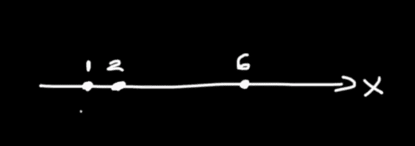

平均值等于所有数据点的总和除以样本总数。

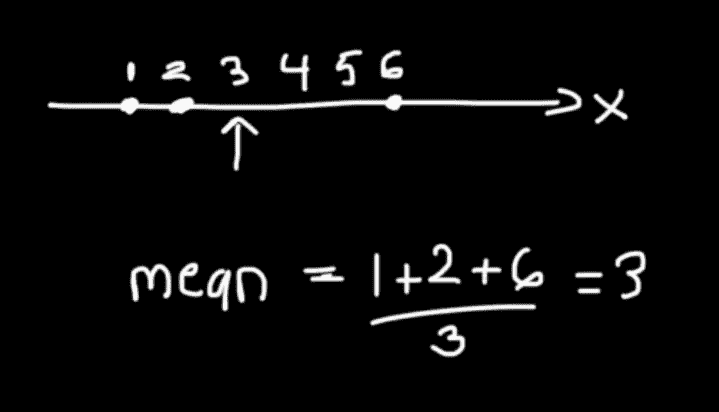

单个数据点的方差就是它与平均值的距离。

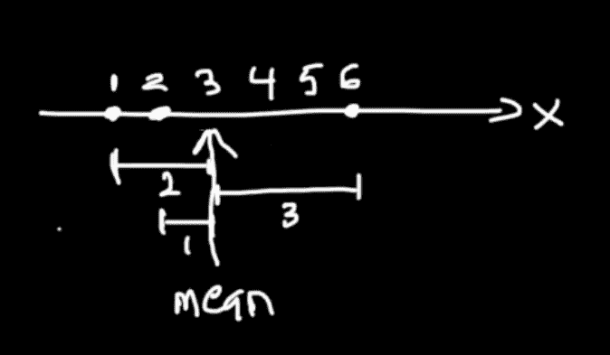

整个数据集的方差是所有这些距离的平方和除以样本总数。我们最终将这些值平方，因为在坐标系中，平均值左侧的距离将为负，并且会与平均值右侧的距离抵消。


在二维空间中，为了计算其中一个变量的方差，我们将数据点投影到它的轴上，然后遵循与前面相同的过程。一个特征(即薪水)的均值和方差是相同的，不管它所绘制的其他特征是什么。

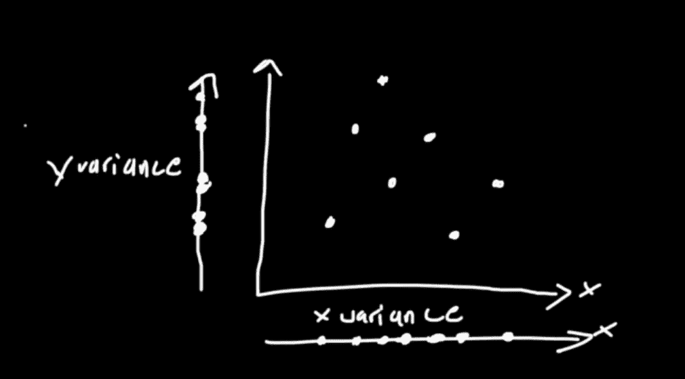

可惜的是，***x*** 和***y*** 方差本身并没有包含足够的信息。

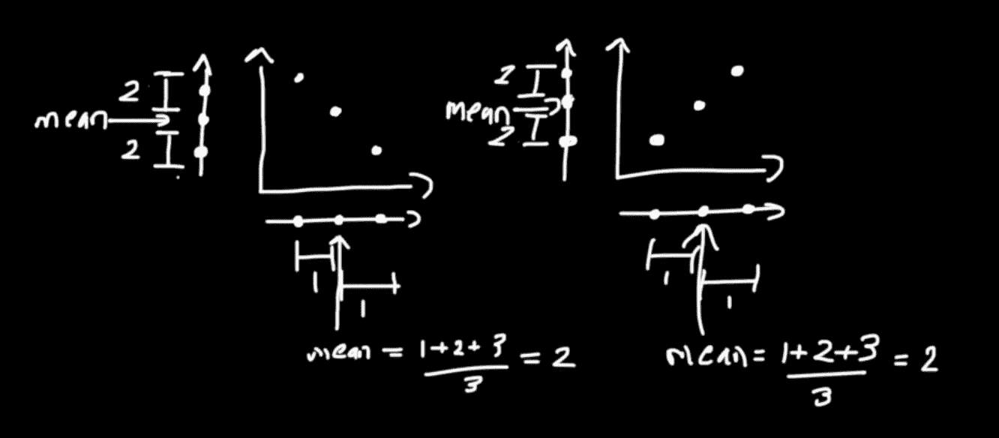

尽管两个图有明显的差异，但它们导致相同的 ***x*** 和***y*** 方差。


因此，我们利用另一个叫做协方差的性质。计算协方差时，我们将 x 和 y 坐标相乘，而不是取平均值的距离的平方。

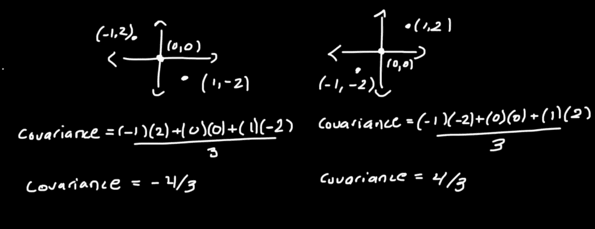

协方差和相关性是不同的概念。然而，它们都描述了两个变量之间的关系。更具体地说，两个变量之间的相关性实际上是协方差除以第一个变量的方差的平方根乘以第二个变量的方差。因此，当相关或协方差为负时，x 的增加导致 y 的减少，当相关或协方差为正时，x 的增加导致 y 的增加。


两个变量**的**协方差矩阵**由左上角第一个变量的方差、右下角第二个变量的方差和对角线上剩余两个位置的协方差组成。**


作为 PCA 算法的一部分，协方差矩阵用于计算特征值和特征向量。

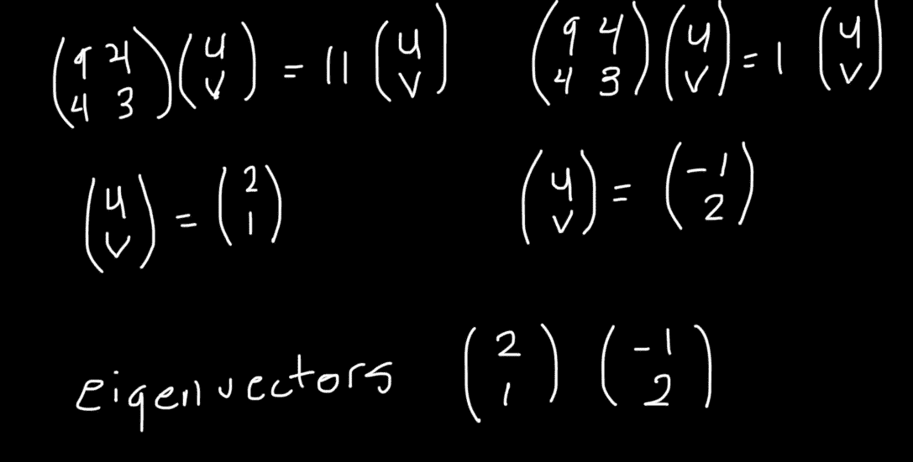

假设我们画出了两个不同变量之间的关系。


首先，我们将数据居中。


接下来，我们在特征向量的方向上画两个向量，它们的大小与特征值相等。

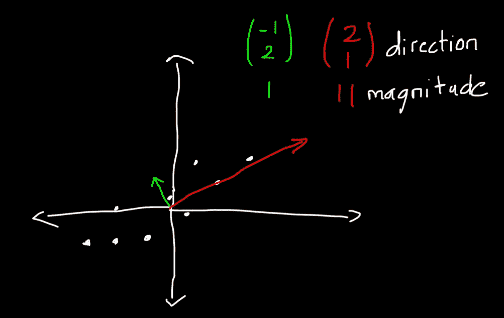

然后我们选择方差最大的一个，因为当我们删除另一个维度时，它会导致最少的信息损失。

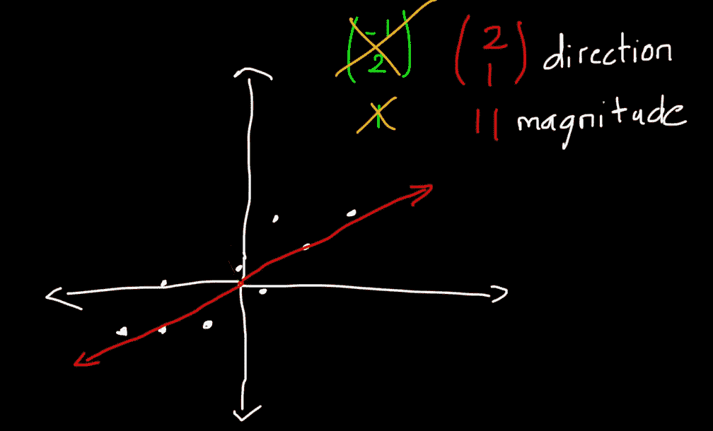

然后，数据点被投影到直线上。


后者用作新特征的一维图。


# 密码

让我们看看如何用 python 实现主成分分析。首先，导入所有必需的库。

```
import pandas as pd
import numpy as np
from matplotlib import pyplot as plt
from sklearn.decomposition import PCA
from sklearn.preprocessing import StandardScaler
from sklearn.datasets import load_iris
```

在本例中，我们将使用 iris 数据集，该数据集可以通过 sklearn API 轻松导入。

```
iris = load_iris()X = pd.DataFrame(iris.data, columns=iris.feature_names)
y = pd.Categorical.from_codes(iris.target, iris.target_names)
```

正如你所见，有 4 个特点。凭直觉，我们可以预测萼片长度和萼片宽度之间有很强的相关性，花瓣长度和花瓣宽度之间也有很强的相关性。因此，我们应该能够将维数从 4 减少到 2。

```
X.head()
```


正如我们前面看到的，方差是通过从平均值中取距离的平方和来计算的。因此，如果一个要素的尺度比另一个要素大得多，那么即使相对离差可能较小，它的方差也会大得多。因此，我们必须扩展数据。在缩放数据时，平均值设置为 0，标准偏差设置为 1。

```
scaler = StandardScaler()
X = scaler.fit_transform(X)
```

接下来，我们将使用 PCA 将维数从 4 减少到 2。

```
pca = PCA(n_components=2)principal_components = pca.fit_transform(X)new_X = pd.DataFrame(data = principal_components, columns = ['PC1', 'PC2'])
```

让我们来看看这两个新特性。

```
new_X.head()
```

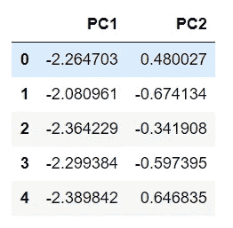

最后，我们可以使用一个 scree 图来可视化每个主成分解释的方差的百分比。

```
per_var = np.round(pca.explained_variance_ratio_ * 100, decimals=1)labels = ['PC' + str(x) for x in range(1, len(per_var) + 1)]plt.bar(x=range(1, len(per_var)+1), height=per_var, tick_label=labels)
plt.ylabel('percentange of explained variance')
plt.xlabel('principal component')
plt.title('scree plot')
plt.show()
```

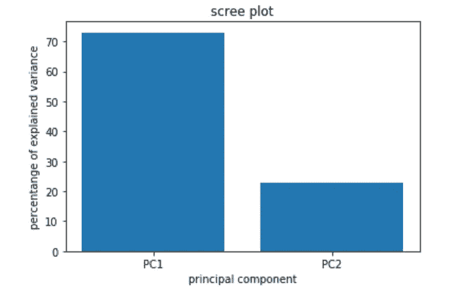

# 最后的想法

总而言之，我们采用一个多维数据集并绘制它(虽然我们不能可视化任何大于 3 维的东西，但数学仍然会解决)。然后我们计算协方差矩阵和特征向量/特征值。后者将告诉我们哪些特征是高度相关的，并且可以在没有太大信息损失的情况下被压缩。产生的特征可用于训练我们的模型。

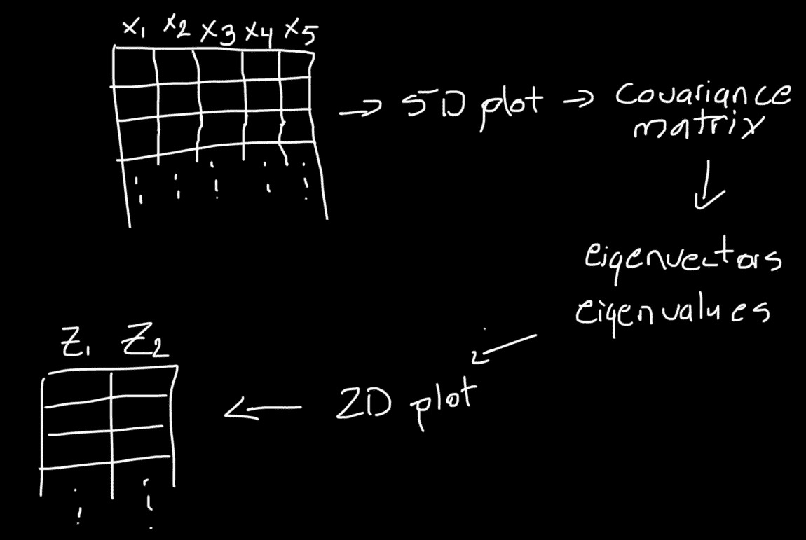