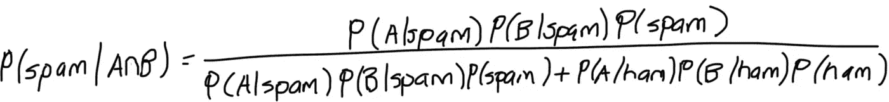

# 朴素贝叶斯分类器

> 原文：<https://towardsdatascience.com/machine-learning-part-16-naive-bayes-classifier-in-python-c9d3fa496fa4?source=collection_archive---------17----------------------->


Photo by [Green Chameleon](https://unsplash.com/@craftedbygc?utm_source=medium&utm_medium=referral) on [Unsplash](https://unsplash.com?utm_source=medium&utm_medium=referral)

与其他通过多次迭代来收敛到某个解决方案的机器学习算法相比，朴素贝叶斯仅基于条件概率对数据进行分类。朴素贝叶斯有以下优点:

*   训练和预测速度极快
*   可解释的
*   不需要超参数调整

在决定是否使用朴素贝叶斯时，您应该考虑朴素假设是否实际成立(在实践中非常罕见)，以及您正在处理的数据是否具有很高的维数。

# 贝叶斯定理

很多时候，我们想知道某个事件发生的概率，假设另一个事件已经发生。这可以象征性地表示为 P(E|F)。如果两个事件不是独立的，那么这两个事件发生的概率由下面的公式表示。


例如，假设您从一副标准的 52 张牌中抽取两张牌。这副牌中一半是红色的，一半是黑色的。这些事件不是独立的，因为第二次抽签的概率取决于第一次抽签的结果。

P(E) = P(第一次抽黑牌)= 25/52 = 0.5

P(F|E) = P(第二次抽黑牌|第一次抽黑牌)= 25/51 = 0.49

利用这些信息，我们可以计算连续抽两张黑牌的概率，如下所示:


Baye 定理是条件概率最常见的应用之一。例如，baye 定理被用来计算一个在特定疾病筛查测试中呈阳性的人实际患有该疾病的概率。贝叶斯定理可以表示为:


如果你已经知道 P(A)，P(B)和 P(B|A ),但想知道 P(A|B ),你可以使用这个公式。例如，假设我们正在测试一种罕见的疾病，这种疾病会感染 1%的人口。医学专家已经开发了一种高度敏感和特异的测试，但还不十分完善。

*   99%的病人测试呈阳性
*   99%的健康患者测试呈阴性

贝叶斯定理告诉我们:


假设我们有 10，000 人，100 人生病，9，900 人健康。此外，在对所有人进行测试后，我们会让 99 名病人进行测试，但也让 99 名健康人进行测试。因此，我们会以下面的概率结束。

## p(生病)= 0.01

## p(没病)= 1 - 0.01 = 0.99

## p(+|有病)= 0.99

## p(+|未患病)= 0.01


# 针对单个单词的垃圾邮件过滤器

朴素贝叶斯通常用于构建垃圾邮件过滤器，将电子邮件分类为垃圾邮件或 ham(非垃圾邮件)。例如，我们可能会开发一个垃圾邮件过滤器，根据某个单词的出现将一封电子邮件归类为垃圾邮件。例如，如果一封电子邮件包含单词 ***【伟哥】*** ，我们将其归类为垃圾邮件。另一方面，如果一封电子邮件包含单词 money，那么它有 80%的可能是垃圾邮件。

根据贝叶斯定理，给定包含“*单词*”的邮件是垃圾邮件的概率。


虽然我们不知道分母的值，但可以用下面的公式计算出来。简单地说，找到该单词的概率是在垃圾邮件中找到该单词的概率乘以电子邮件是垃圾邮件的概率，加上在垃圾邮件中找到该单词的概率乘以电子邮件是垃圾邮件的概率。


因此，公式变为:


训练集包含足够的信息量来计算等式的右边。

## p(垃圾邮件)

被归类为垃圾邮件的电子邮件数量

## 火腿

被归类为垃圾邮件(非垃圾邮件)的电子邮件数量

## p(word|spam)

包含“*单词*的垃圾邮件数量

## p(单词|火腿)

包含“*单词”*的垃圾邮件数量

# 结合单词的垃圾邮件过滤器

实际上，仅仅根据一个单词的出现来进行分类是不够的。有些词本身是无害的。当它们与特定的其他单词结合使用时，我们更应该将其归类为垃圾邮件。例如，根据包含单词“ ***女孩*** ”的事实来过滤电子邮件，最终会将与您女儿的足球队相关的电子邮件放入您的垃圾邮件文件夹中。理想情况下，我们能够针对特定的句子，如“ ***你所在地区的漂亮女孩*** ”。

## 天真的假设

通常，在我们的训练集中，我们不会有带有适当标签的准确句子。换句话说，如果我们试图确定一封包含“ ***你所在地区的漂亮女孩*** ”的电子邮件是否应该被归类为垃圾邮件，我们会查看我们的训练数据，看看是否有任何包含该句子的电子邮件已经被归类为垃圾邮件。如果没有，我们有两个选择，要么获取更多的数据，要么通过查看句子中的每个单词来计算给定的概率。

为了使数学更简单，我们做了简单的*假设，文本中的单词是相互独立的**。换句话说，文本中包含某些单词的事实对在文本中找到给定单词的概率没有影响。然而在现实中，某些词往往会被组合在一起使用。例如，如果你在一篇关于机器学习的文章中找到单词*，很可能你也会找到单词*和 ***训练*** 。*****

********

****假定一封电子邮件同时包含单词“有吸引力的”和“女孩”,则该电子邮件包含垃圾邮件的概率可以写为:****

********

# ****密码****

****我们将从导入所需的库开始。****

```
**from sklearn.datasets import fetch_20newsgroups
from sklearn.feature_extraction.text import TfidfVectorizer
from sklearn.naive_bayes import MultinomialNB
from sklearn import metrics**
```

****在前面的例子中，我们将使用新闻文章的语料库。幸运的是，sklearn 提供了一个简单的 API 来导入数据。****

```
**newsgroups = fetch_20newsgroups()**
```

****顾名思义，新闻文章分为 20 类。****

```
**print(newsgroups.target_names)**
```

********

****语料库包含超过 11，000 个文档。****

```
**print(newsgroups.filenames.shape)**
```

********

****为了了解我们在做什么，让我们打印第一个文档。****

```
**print(newsgroups.data[0])**
```

********

****为了简单起见，我们将使用类别的子集。****

```
**categories = ['alt.atheism', 'talk.religion.misc', 'comp.graphics', 'sci.space']train_newsgroups = fetch_20newsgroups(subset='train', categories=categories)
train_X = train_newsgroups.data
train_y = train_newsgroups.targettest_newsgroups = fetch_20newsgroups(subset='test', categories=categories)
test_X = test_newsgroups.data
test_y = test_newsgroups.target**
```

****接下来，我们使用 TfidfVectorizer 类来解析每个文档中包含的单词，并根据相关性对它们进行排序。如果你想了解更多关于 TF-IDF 是如何工作的，我会在后续文章中详细介绍。****

****[](https://medium.com/@corymaklin/natural-language-processing-feature-engineering-using-tf-idf-e8b9d00e7e76) [## 自然语言处理:使用 TF-IDF 的特征工程

### 自然语言处理(NLP)是人工智能的一个子领域，处理理解和处理…

medium.com](https://medium.com/@corymaklin/natural-language-processing-feature-engineering-using-tf-idf-e8b9d00e7e76) 

```
vectorizer = TfidfVectorizer()
train_vectors = vectorizer.fit_transform(train_X)
test_vectors =  vectorizer.transform(test_X)
```

我们使用多维朴素贝叶斯，因为我们试图将数据分为多个类别。与其他机器学习算法相比，朴素贝叶斯的训练过程几乎是瞬时的。

```
classifier = MultinomialNB()
classifier.fit(train_vectors, train_y)
```

我们使用 f1 分数来衡量我们模型的性能。

```
predictions = classifier.predict(test_vectors)score = metrics.f1_score(test_y, predictions, average='macro')
```


另外，我们可以写一个函数来预测一个句子属于哪一类。

```
def predict_category(sentence):
    sentence_vector = vectorizer.transform([sentence])
    prediction = classifier.predict(sentence_vector)
    return train_newsgroups.target_names[prediction[0]]
```

正如你所看到的，这个模型正确地将这个句子归类到了计算机图形学中。

```
predict_category('determining the screen resolution')
```


# 最后的想法

朴素贝叶斯特别适合对具有大量特征的数据进行分类。与其他机器学习模型不同，朴素贝叶斯几乎不需要训练。当试图做出一个包含多个特征的预测时，我们通过做出*天真的*假设这些特征是独立的来简化数学。****