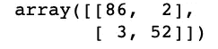

# Python 中的 AdaBoost 分类器示例

> 原文：<https://towardsdatascience.com/machine-learning-part-17-boosting-algorithms-adaboost-in-python-d00faac6c464?source=collection_archive---------2----------------------->


Photo by [Franki Chamaki](https://unsplash.com/@franki?utm_source=medium&utm_medium=referral) on [Unsplash](https://unsplash.com?utm_source=medium&utm_medium=referral)

boosting 方法背后的一般思想是顺序训练预测器，每个预测器都试图纠正其前任。两种最常用的增强算法是 AdaBoost 和梯度增强。在接下来的文章中，我们将介绍 AdaBoost。在高层次上，AdaBoost 类似于随机森林，因为它们都汇总了森林中每个决策树所做的预测，以决定最终的分类。然而，还是有一些细微的差别。例如，在 AdaBoost 中，决策树的深度为 1(即 2 个叶子)。此外，每个决策树做出的预测对模型做出的最终预测有不同的影响。

# 算法

在前面的例子中，我们将使用一个数据集，该数据集根据某些特征对人进行分类。


## 步骤 1:初始化样品重量

在 AdaBoost 的第一步中，每个样本都与一个权重相关联，该权重指示它对于分类的重要性。最初，所有样本都具有相同的权重(1 除以样本总数)。


## 第二步:用每个特征建立一个决策树，对数据进行分类并评估结果

接下来，对于每个特性，我们构建一个深度为 1 的决策树。然后，我们使用每一个决策树对数据进行分类。然后，我们将每棵树的预测与训练集中的实际标签进行比较。在分类训练样本方面做得最好的特征和对应的树成为森林中的下一棵树。

例如，假设我们建立了一棵树，将聪明的人归类为有吸引力的，不聪明的人归类为没有吸引力的。


决策树错误地将一个人归类为有吸引力的人，因为他们很聪明。我们对所有的树重复这个过程，并选择错误预测最少的树。

## 步骤 3:计算树在最终分类中的重要性

一旦我们决定了决策树。我们用前面的公式来计算在最后的分类中它的数量。


其中总误差是错误分类样本的权重之和。


回到我们的例子，总误差等于如下。


通过将误差代入我们的公式，我们得到:


正如我们将在后面看到的，这个数字用于确定整个森林所做的预测。

## 步骤 4:更新样本权重，以便下一个决策树将考虑前一个决策树产生的错误

我们查看当前树分类不正确的样本，并使用以下公式增加它们的相关权重。


这里没什么特别的。我们将 ***e*** 提升到上一步中计算的显著性的幂，因为我们希望新的样本权重呈指数增长。


然后，我们查看树正确分类的样本，并使用以下公式减少它们的关联权重。


这个等式和之前的一样，只是这次我们把 ***e*** 提升到负指数的幂。


这里的要点是，先前残肢错误分类的样本应该与较大的样本权重相关联，而正确分类的样本应该与较小的样本权重相关联。

请注意，如果我们将所有样本的权重相加，我们会得到一个小于 1 的数字。因此，我们对新的样本权重进行归一化，使它们加起来等于 1。


## 步骤 5:形成新的数据集

我们首先创建一个与原始数据集大小相同的新的空数据集。然后，想象一个轮盘赌台，其中每个口袋对应一个样品重量。我们随机选择 0 到 1 之间的数字。每个数字所在的位置决定了我们将哪个样本放入新数据集中。


因为被错误分类的样本相对于其他样本具有更高的权重，所以随机数落入它们的分布部分的可能性更大。因此，新数据集将倾向于包含被之前的树错误分类的样本的多个副本。因此，当我们返回到评估每个决策树所做预测的步骤时，得分最高的决策树将会正确地对前一个决策树误分类的样本进行分类。


## 步骤 6:重复步骤 2 到 5，直到迭代次数等于超参数指定的次数(即估计数)

## 步骤 7:使用决策树森林对训练集之外的数据进行预测

AdaBoost 模型通过让森林中的每棵树对样本进行分类来进行预测。然后，我们根据他们的决定把树分成组。对于每个组，我们把组内每棵树的重要性加起来。森林作为一个整体所做的最终分类是由具有最大总和的组确定的。


# 密码

让我们看看如何在 Python 中实现 AdaBoost。首先，我们导入以下库。

```
from sklearn.ensemble import AdaBoostClassifier
from sklearn.tree import DecisionTreeClassifier
from sklearn.datasets import load_breast_cancer
import pandas as pd
import numpy as np
from sklearn.model_selection import train_test_split
from sklearn.metrics import confusion_matrix
from sklearn.preprocessing import LabelEncoder
```

在这个例子中，我们将使用 AdaBoost 将肿瘤分类为恶性或良性。我们使用 scikit-learn API 将数据集导入我们的程序。

```
breast_cancer = load_breast_cancer()X = pd.DataFrame(breast_cancer.data, columns=breast_cancer.feature_names)
y = pd.Categorical.from_codes(breast_cancer.target, breast_cancer.target_names)
```

每当我们处理分类特征时，我们必须把它编码成数字。对于这个问题，我们将恶性设为 1，良性设为 0。

```
encoder = LabelEncoder()
binary_encoded_y = pd.Series(encoder.fit_transform(y))
```

我们将数据分为训练集和测试集，以评估模型的性能。

```
train_X, test_X, train_y, test_y = train_test_split(X, binary_encoded_y, random_state=1)
```

接下来，我们构建模型并使其适合训练集。`max_depth=1`用于告诉我们的模型，我们希望我们的森林由具有单个决策节点和两片叶子的树组成。`n_estimators`用于指定森林中的树木总数。

```
classifier = AdaBoostClassifier(
    DecisionTreeClassifier(max_depth=1),
    n_estimators=200
)classifier.fit(train_X, train_y)
```

我们使用我们的模型来预测肿瘤是恶性的还是良性的。

```
predictions = classifier.predict(test_X)
```

最后，我们使用混淆矩阵评估模型。该模型以 2 个假阳性和 3 个假阴性结束。

```
confusion_matrix(test_y, predictions)
```



# 最后的想法

像随机森林一样，AdaBoost 通过对每个样本应用多个决策树并结合各个树的预测来进行预测。然而，在 AdaBoost 算法中，每个决策树对最终预测的贡献是不同的，而不是取森林中每个决策树所做预测的平均值(或分类情况下的大多数)。