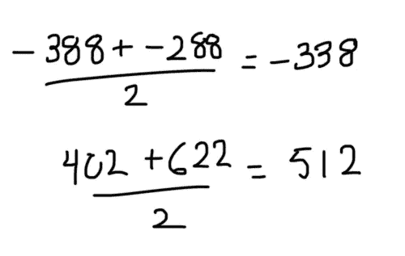

# 梯度推进决策树算法讲解

> 原文：<https://towardsdatascience.com/machine-learning-part-18-boosting-algorithms-gradient-boosting-in-python-ef5ae6965be4?source=collection_archive---------1----------------------->


Photo by [NeONBRAND](https://unsplash.com/@neonbrand?utm_source=medium&utm_medium=referral) on [Unsplash](https://unsplash.com?utm_source=medium&utm_medium=referral)

在接下来的文章中，我们将看看如何在 Python 中实现渐变增强。梯度增强类似于 AdaBoost，因为它们都使用决策树的集合来预测目标标签。然而，与 AdaBoost 不同，梯度增强树的深度大于 1。在实践中，您通常会看到梯度增强的最大叶子数在 8 到 32 之间。

# 算法

在我们深入研究代码之前，重要的是我们要理解梯度增强算法是如何实现的。假设，我们试图根据房子的年龄、面积和位置来预测房子的价格。


## 步骤 1:计算目标标签的平均值

当处理回归问题时，我们从一片叶子开始，它是我们想要预测的变量的平均值。在接下来的步骤中，这一页将用作接近正确解决方案的基线。


## 第二步:计算残差

对于每个样本，我们用下面的公式计算残差。

> 残差=实际值-预测值

在我们的示例中，预测值等于上一步中计算的平均值，实际值可以在每个样本的 price 列中找到。计算残差后，我们得到下表。


## 步骤 3:构建决策树

接下来，我们构建一棵树，目标是预测残差。换句话说，每片叶子将包含一个关于残差值的预测(不是期望的标签)。


如果残差比叶子多，一些残差将在同一个叶子中结束。当这种情况发生时，我们计算它们的平均值，并将其放入叶子中。



这样，树就变成了:


## 步骤 4:使用集合中的所有树预测目标标签

每个样本通过新形成的树的决策节点，直到它到达给定的线索。所述叶中的残差用于预测房价。

通过实验表明，朝着解决方案采取小的增量步骤可以实现具有较低总体方差的可比偏差(较低的方差导致训练数据之外的样本具有更好的准确性)。因此，为了防止过度拟合，我们引入了一个叫做学习率的超参数。当我们做一个预测时，每个残差都要乘以学习率。这迫使我们使用更多的决策树，每一棵都向最终解决方案迈出一小步。


## 步骤 5:计算新的残差

我们通过从上一步的预测中减去实际房价来计算一组新的残差。如步骤 3 所述，残差将用于下一个决策树的叶子。


## 步骤 6:重复步骤 3 到 5，直到迭代次数与超参数指定的次数(即估计数)相匹配


## 步骤 7:一旦训练完毕，使用集合中的所有树对目标变量的值进行最终预测

最终预测将等于我们在第一步中计算的平均值，加上组成森林的树木预测的所有残差乘以学习率。


# 密码

在本教程中，我们将使用来自 **scikit-learn** 库中的**GradientBoostingRegressor**类。

```
from sklearn.ensemble import GradientBoostingRegressor
import numpy as np
import pandas as pd
from sklearn.model_selection import train_test_split
from sklearn.metrics import mean_squared_error
from sklearn.datasets import load_boston
from sklearn.metrics import mean_absolute_error
```

对于前面的示例，我们将使用波士顿房价数据集。

```
boston = load_boston()
X = pd.DataFrame(boston.data, columns=boston.feature_names)
y = pd.Series(boston.target)
```

为了评估我们模型的性能，我们将数据分为训练集和测试集。

```
X_train, X_test, y_train, y_test = train_test_split(X, y)
```

接下来，我们构建并拟合我们的模型。`max_depth`是指每棵树的叶子数量(即 4 片),而`n_estimators`是指集合中树的总数。如前所述，`learning_rate`超参数缩放每棵树的贡献。如果将其设置为较低的值，集合中将需要更多的树来适应训练集，但总体方差会更低。

```
regressor = GradientBoostingRegressor(
    max_depth=2,
    n_estimators=3,
    learning_rate=1.0
)
regressor.fit(X_train, y_train)
```

`staged_predict()`方法测量每个训练阶段的验证误差(即一棵树、两棵树……)，以找到最佳的树数。

```
errors = [mean_squared_error(y_test, y_pred) for y_pred in regressor.staged_predict(X_test)]best_n_estimators = np.argmin(errors)
```

现在，我们可以使用最佳数量的树来构建和拟合我们的模型。

```
best_regressor = GradientBoostingRegressor(
    max_depth=2,
    n_estimators=best_n_estimators,
    learning_rate=1.0
)
best_regressor.fit(X_train, y_train)
```

Sklearn 提供了许多指标来评估我们的机器学习模型的性能。我发现特别有用的是，他们根据适用的问题领域对每个指标进行分类。例如，精度只在分类的上下文中有意义。


[https://scikit-learn.org/stable/modules/model_evaluation.html](https://scikit-learn.org/stable/modules/model_evaluation.html)

我们使用平均绝对误差，它可以解释为预测值和实际值之间的平均距离。

```
y_pred = best_regressor.predict(X_test)mean_absolute_error(y_test, y_pred)
```

