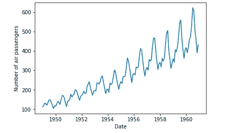

# ARIMA 模型 Python 示例-时间序列预测

> 原文：<https://towardsdatascience.com/machine-learning-part-19-time-series-and-autoregressive-integrated-moving-average-model-arima-c1005347b0d7?source=collection_archive---------0----------------------->


[https://www.pexels.com/photo/white-printer-paper-590011/](https://www.pexels.com/photo/white-printer-paper-590011/)

基于历史观察做出预测的能力创造了竞争优势。例如，如果一个组织有能力更好地预测一种产品的销售量，它将在优化库存水平方面处于更有利的地位。这可以增加组织现金储备的流动性，减少营运资本，并通过减少积压订单来提高客户满意度。

在机器学习领域，有一组特定的方法和技术特别适合于根据时间预测因变量的值。在接下来的文章中，我们将讨论自回归综合移动平均(ARIMA)。

我们将按时间顺序索引(或绘制)的一系列数据点称为**时间序列**。时间序列可以分解成 3 个部分。

*   **趋势:**向上&数据在很长一段时间内随时间的向下移动(即房屋升值)
*   **季节性:**季节性差异(即夏季对冰淇淋的需求增加)
*   **噪声:**尖峰信号&随机间隔的低谷信号


[https://commons.wikimedia.org/wiki/File:Mae.timeseries_decomposition.commonswiki.svg](https://commons.wikimedia.org/wiki/File:Mae.timeseries_decomposition.commonswiki.svg)

在对时间序列应用任何统计模型之前，我们希望确保它是平稳的。

数据是静止的意味着什么？

序列的平均值不应该是时间的函数。下面的红色图表不是静止的，因为平均值会随着时间的推移而增加。


序列的方差不应该是时间的函数。这种性质称为同质性。请注意红色图表中数据随时间变化的分布。


最后，第(i+m)项的第 I 项的协方差不应该是时间的函数。在下图中，你会注意到随着时间的增加，传播变得越来越近。因此，对于红色系列，协方差随时间不是常数。


如果一个时间序列是平稳的，并且在给定的时间间隔内具有特定的行为，那么可以有把握地假设它在以后的某个时间点将具有相同的行为。大多数统计建模方法假设或要求时间序列是平稳的。

# 密码

`statsmodels`库提供了一套处理时间序列数据的函数。

```
import numpy as np
import pandas as pd
from matplotlib import pyplot as plt
from statsmodels.tsa.stattools import adfuller
from statsmodels.tsa.seasonal import seasonal_decompose
from statsmodels.tsa.arima_model import ARIMA
from pandas.plotting import register_matplotlib_converters
register_matplotlib_converters()
```

我们将使用一个包含某一天飞机乘客数量的数据集。

```
df = pd.read_csv('air_passengers.csv', parse_dates = ['Month'], index_col = ['Month'])df.head()plt.xlabel('Date')
plt.ylabel('Number of air passengers')
plt.plot(df)
```



如前所述，在我们建立模型之前，我们必须确保时间序列是平稳的。有两种主要方法来确定给定时间序列是否是平稳的。

*   **滚动** **统计**:绘制滚动平均值和滚动标准差。如果时间序列随时间保持不变，则时间序列是静止的(用肉眼观察这些线是否是直的并且平行于 x 轴)。
*   **扩展的 Dickey-Fuller 检验**:如果 p 值较低(根据零假设),并且 1%、5%、10%置信区间的临界值尽可能接近 ADF 统计值，则认为时间序列是平稳的

对于那些不理解平均价格和滚动平均价格之间区别的人来说，10 天的滚动平均价格是作为第一个数据点的前 10 天的收盘价的平均值。下一个数据点将删除最早的价格，添加第 11 天的价格并取平均值，依此类推，如下所示。


```
rolling_mean = df.rolling(window = 12).mean()
rolling_std = df.rolling(window = 12).std()plt.plot(df, color = 'blue', label = 'Original')
plt.plot(rolling_mean, color = 'red', label = 'Rolling Mean')
plt.plot(rolling_std, color = 'black', label = 'Rolling Std')
plt.legend(loc = 'best')
plt.title('Rolling Mean & Rolling Standard Deviation')
plt.show()
```


如您所见，滚动平均值和滚动标准差随着时间的推移而增加。因此，我们可以得出结论，时间序列不是平稳的。

```
result = adfuller(df['Passengers'])print('ADF Statistic: {}'.format(result[0]))
print('p-value: {}'.format(result[1]))
print('Critical Values:')
for key, value in result[4].items():
    print('\t{}: {}'.format(key, value))
```


ADF 统计值远离临界值，p 值大于阈值(0.05)。因此，我们可以得出结论，时间序列不是平稳的。

取因变量的对数是降低滚动平均值增长率的简单方法。

```
df_log = np.log(df)
plt.plot(df_log)
```


让我们创建一个函数来运行这两个测试，以确定给定的时间序列是否是平稳的。

```
def get_stationarity(timeseries):

    # rolling statistics
    rolling_mean = timeseries.rolling(window=12).mean()
    rolling_std = timeseries.rolling(window=12).std()

    # rolling statistics plot
    original = plt.plot(timeseries, color='blue', label='Original')
    mean = plt.plot(rolling_mean, color='red', label='Rolling Mean')
    std = plt.plot(rolling_std, color='black', label='Rolling Std')
    plt.legend(loc='best')
    plt.title('Rolling Mean & Standard Deviation')
    plt.show(block=False)

    # Dickey–Fuller test:
    result = adfuller(timeseries['Passengers'])
    print('ADF Statistic: {}'.format(result[0]))
    print('p-value: {}'.format(result[1]))
    print('Critical Values:')
    for key, value in result[4].items():
        print('\t{}: {}'.format(key, value))
```

我们可以对时间序列进行多种变换，使其保持平稳。例如，我们减去滚动平均值。

```
rolling_mean = df_log.rolling(window=12).mean()
df_log_minus_mean = df_log - rolling_mean
df_log_minus_mean.dropna(inplace=True)get_stationarity(df_log_minus_mean)
```


我们可以看到，减去均值后，滚动均值和标准差是近似水平的。p 值低于阈值 0.05，ADF 统计值接近临界值。因此，时间序列是平稳的。

应用指数衰减是另一种转换时间序列使其稳定的方法。

```
rolling_mean_exp_decay = df_log.ewm(halflife=12, min_periods=0, adjust=True).mean()
df_log_exp_decay = df_log - rolling_mean_exp_decay
df_log_exp_decay.dropna(inplace=True)get_stationarity(df_log_exp_decay)
```


指数衰减比减去滚动平均值表现更差。然而，它仍然比原来更稳定。

让我们再尝试一种方法来确定是否存在更好的解决方案。当应用时移时，我们用前一个点减去每个点。

***空、(x1 x0)、(x2 x1)、(x3 x2)、(x4 x3)、……、(xn xn 1)***

```
df_log_shift = df_log - df_log.shift()
df_log_shift.dropna(inplace=True)get_stationarity(df_log_shift)
```


时间偏移的效果不如减去滚动平均值。然而，它仍然比原来更稳定。

## 自回归模型

自回归模型在过去的值对当前值有影响的前提下运行。AR 模型通常用于分析自然、经济和其他时变过程。只要假设成立，我们就可以建立一个线性回归模型，根据前几天的值，尝试预测因变量今天的值。


AR 模型的阶数对应于公式中包含的天数。

## 移动平均模型

假设当天因变量的值取决于前一天的误差项。该公式可以表示为:


你还会遇到这样的等式:


其中μ是级数的平均值， *θ* 1、…、 *θq* 是模型的参数， *εt* 、*εt*—1、…、*εt*—q 是白噪声误差项。 *q* 的值称为 MA 模型的阶数。

## 自回归移动平均

ARMA 模型是 AR 和 MA 模型的简单组合。


## 自回归综合移动平均模型(ARIMA)

ARIMA(又名 Box-Jenkins)模型增加了 ARMA 模型的差异。差分从以前的值中减去当前值，可用于将时间序列转换为静态时间序列。例如，一阶差分处理线性趋势，并采用转换`zi = yi — yi-1`。二阶差分处理二次趋势，并采用一阶差分的一阶差分，即`zi = (yi — yi-1) — (yi-1 — yi-2)`，等等。


三个整数(p，d，q)通常用于参数化 ARIMA 模型。

*   ***p:**自回归*项数(AR 顺序)**
*   ***d:**非季节性差异数(差异顺序)***
*   ***问:**移动平均线数量*(MA 顺序)**

## 自相关函数

当前时间点的观测值与所有先前时间点的**的观测值之间的相关性。我们可以使用 ACF 来确定 **MA** 项的最佳数量。术语的数量决定了模型的顺序。**

## 部分自相关函数(PACF)

顾名思义，PACF 是 ACF 的一个子集。PACF 表示在**两个时间点**进行的观察之间的相关性，同时考虑来自其他数据点的任何影响。我们可以使用 PACF 来确定在 **AR** 模型中使用的最佳项数。术语的数量决定了模型的顺序。

让我们看一个例子。回想一下，PACF 可以用来计算 AR 模型的最佳阶数。水平蓝色虚线代表显著性阈值。垂直线代表在时间点的 ACF 和 PACF 值。只有超过水平线的垂直线被认为是显著的。


因此，我们将在自回归方程中使用前两天。

回想一下，ACF 可以用来计算 MA 模型的最佳阶数。


因此，我们在移动平均方程式中只使用昨天。

回到我们的例子，我们可以用 2 阶 AR、1 阶差分和 2 阶 MA 来创建和拟合 ARIMA 模型。

```
decomposition = seasonal_decompose(df_log) 
model = ARIMA(df_log, order=(2,1,2))
results = model.fit(disp=-1)
plt.plot(df_log_shift)
plt.plot(results.fittedvalues, color='red')
```


然后，我们可以看到该模型如何与原始时间序列进行比较。

```
predictions_ARIMA_diff = pd.Series(results.fittedvalues, copy=True)
predictions_ARIMA_diff_cumsum = predictions_ARIMA_diff.cumsum()
predictions_ARIMA_log = pd.Series(df_log['Passengers'].iloc[0], index=df_log.index)
predictions_ARIMA_log = predictions_ARIMA_log.add(predictions_ARIMA_diff_cumsum, fill_value=0)
predictions_ARIMA = np.exp(predictions_ARIMA_log)
plt.plot(df)
plt.plot(predictions_ARIMA)
```


假设我们有过去 12 年每个月的数据，并希望预测未来 10 年的乘客数量，我们使用(12 x12)+ (12 x 10) = 264。

```
results.plot_predict(1,264)
```


## 最后的想法

在机器学习的领域中，有一套操作和解释依赖于时间的变量的技术。其中包括 ARIMA，它可以删除趋势成分，以准确预测未来值。