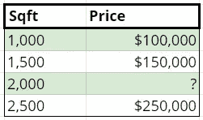
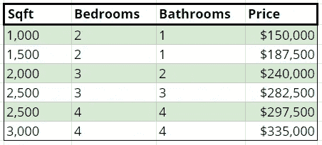

# 机器学习，第 2 部分:监督学习

> 原文：<https://towardsdatascience.com/machine-learning-part-2-supervised-learning-632621f77188?source=collection_archive---------16----------------------->

Image by the author

# 机器学习基础

1.  [基本概念](/machine-learning-part-1-essential-concepts-c2556fb2f3e1)
2.  监督学习(你在这里)
3.  [无监督学习](/machine-learning-part-3-unsupervised-learning-6d9e59924c34)
4.  [强化学习](/machine-learning-part-4-reinforcement-learning-43070cbd83ab)

# 介绍

我们在第一部分讨论了基本的、通用的机器学习概念。现在我们转向机器学习问题，这里我们有一个带标签的数据集的好处——我们知道所有输入示例的期望输出值。有两个主要的监督问题:分类和回归。

# 监督分类法

监督分类可能是最常用的机器学习技术。顾名思义，它是“受监督的”:它利用已标记的训练集来建立逻辑，然后最终将该逻辑用于未标记的数据。

它解决的问题是分类。**分类**是将每个训练样本分配到不同的类别。一个类本质上是一个个体例子的特征(就像一个动物的种类)，有一些特殊的条件。具体来说，类的数量是有限的，并且我们知道并且拥有我们期望分类的所有类的例子。如果我们有一个没有训练例子的班级，我们就不知道在分类的时候要找什么。每个例子只属于一个类。我们不能说一个例子属于*不属于*类，同样，我们也不能把它归为*多于*一类。

给定一个这样的问题，我们如何找到一个逻辑来将项目分类？我们通常寻找符合两个标准的预测值:1)同一类中的所有示例都具有与该类中的其他示例相似的属性值。2)同一类中的所有示例都具有与不同类中的示例不同的属性值。

监督分类算法对数据使用统计方法，并寻找其值与特定类别不同的特征(或特征组合)。独特的值实现了上述两个目标:它们将一个类的项目分组，并将其他类的项目分开。

## 例子

假设我们在一个园艺中心工作，在那里我们种植两种植物，百日菊和矮牵牛。该中心的所有者刚刚购买了一台机器，它可以测量三样东西:植物的`height`和`color`，以及土壤的`ph`水平。他们聘请我们编写一个程序，根据这些测量值自动区分这两种植物。

由于这是一个监督问题，我们得到了一个包含这三个预测值的数据集，所有的例子都标有`species`。不要深入任何特定算法的细节，让我们只考虑如果要求手动操作，我们将如何解决这个问题。

或许我们可以从一些统计数据开始。具体来说，我们将数据分为百日菊和矮牵牛，并查看每组的汇总统计数据。希望在这些汇总统计数据中，我们能找到以下值:1)同类花之间的相似值，2)牵牛花和百日菊之间的不同值，以及 3)足够不同的*值，我们可以用它们来区分两者。*

*在此过程中，我们发现了一些值得注意的事情。首先，土壤`ph`似乎和`species`没有任何关系，最好忽略掉。这并不是说`ph`完全没用。如果我们试图回答一个不同的问题，如植物的健康，这样的数据点可能是有用的，但对于我们分离物种的问题来说，它是没有用的。*

*其他功能更好。就目前而言，百日菊几乎总是超过 12 英寸高，牵牛花几乎总是低于 12 英寸。也许最有用的是，牵牛花总是红色、紫色或白色，而百日菊总是红色、橙色或黄色。*

*有了这些信息，我们可以设计一个简单的分类器。如果一朵花是白色或紫色的，那它就是矮牵牛花。橙色或黄色的花是百日菊。对于红色的花来说，如果 T9 大于 12”，它可能是百日菊，如果它小于 12”，它可能是矮牵牛。我们不能完全有把握地区分红花，但这种方法在大多数情况下是正确的。使用这套简单的规则，我们只用最少量的信息就能得到非常准确的分类器。*

*每种机器学习分类算法的方法都不同，但其中一些算法执行的步骤几乎与我们刚刚做的完全相同。**决策树**算法寻找将数据分成比前一组更“纯净”的组的方法。即使不理解它背后的确切术语或数学，这也是我们已经做的:我们发现使用`color`允许我们生成几个完全纯的组。最后一组，红色的花，不能使用任何属性完全纯，但`height`得到最接近完美的分离。*

*从这个例子中需要记住的一件重要事情是，标签对我们的过程至关重要。如果没有标签，我们可能会意识到有高的和矮的花，甚至可以认识到黄色的花通常是高的。然而，如果没有标签，我们无法确切地说出那群高大的黄色花朵意味着什么。*

# *监督回归*

*在监督回归中，就像在监督分类中一样，我们有一个可用于改进模型的标注数据集。分类和回归的不同之处在于输出的类型，或者说“响应”在回归分析中，答案是一个数字，这个区别比可能立即显现的差异更大。首先，让我们来谈谈如何识别回归问题，作为一个数字的回答是一个很大的线索，但是*有可能有一个数字的回答是*而不是*回归问题。**

*在回归中，响应是一个数字，可以像数字一样对待。我们可以用它来做数学运算，较大的值和较小的值相比意味着什么。此时你可能会问“什么样的数字*不能像数字一样处理？”这种情况最常见的例子是当数字被用作 id 或类标签时。**

*例如，以邮政编码 80123 和 60652 为例。80123 变大意味着什么吗？一点也不，它只是科罗拉多州一个地方的数字代码，而 60652 是伊利诺伊州。同样，如果我们减去这两个，我们将得到 19471。巧合的是，这是宾夕法尼亚州的一个邮政编码，但它没有任何实际意义。没有公式或说明来计算邮政编码。*

*除此之外，你看到的大多数数字都像数字一样。如果我们看两栋价格分别为 40 万美元和 20 万美元的房子:40 万美元越大，意味着房子越值钱，具体来说，我们可以用 40 万美元/20 万美元(即:用它们做数学计算)找到 2 倍多的房子。我们也可以通过取`$400K-$200K = $200K`来找出价格的差异。乘法`$400K*$200K`呢？这实际上并没有给我们一个有意义的输出，但没关系，不是每个操作者都必须给出有意义的输出。*

*所以回归反应首先是一个数字。我们稍后会谈到为什么这很重要。回归问题的第二个要求是响应是连续的 T2。在实际意义上，这意味着三件事:有无限多的响应，任何一组输入都应该导致有效的输出，类似地，任何有效的输出都有一组输入会导致有效的输出。连续输出使得这个问题与分类如此不同。*

*回想一下，在分类中，我们说过类是有限的，并且每个类都有一个例子。在回归中，可能的响应数量可以是*无限个*，自然，我们*不会有*这些输出的例子。*

*如何使用有限数量的训练样本来预测潜在的无限数量的输出？如果我们继续使用监督分类中的假设，这是不可能的，因为在分类中，我们需要总结单个输出的所有示例，以寻找共同因素。*

*那么，我们需要的是一套新的关于问题如何工作的假设，允许处理无限数量的可能输出。在回归中，核心假设是被解决的问题包含**趋势**并且预测器和响应具有**函数关系**。换句话说，趋势可以用一个数学函数来描述，利用这个函数，我们可以预测*任何*输入的*任何*输出值，而不仅仅是我们之前已经看到的组合。如果我们可以在训练数据的帮助下近似这个函数，那么我们已经使用了有限的数据来总结无限数量的输出。*

## *例子*

*这很容易通过例子看出。考虑下面的数据，它描述了相对于房子大小的价格:*

**

*A simple regression dataset*

*一栋 2000 平方英尺的房子价格是多少？…*

*如果你说 200，000 美元，那么恭喜你，你已经为一个我们没有数据的输入值预测了一个我们从未见过的输出值。尽管这一壮举令人印象深刻，但它可能并不觉得很难。人类可能不像我们一样擅长识别趋势和关系，但对我们来说仍然相当直观，在这个例子中，趋势非常明显。*

*至于你是如何做出评估的，你可能是通过两种方式中的一种来完成的。第一，你意识到价格只是平方英尺乘以 100 美元，然后算了一下。第二，你注意到 2000 平方英尺介于 1500 和 2500 之间，于是你选择了介于这两个价格之间的价格，即 20 万美元。*

*这两种方法都可行，而且实际上都得到了相同的基本概念——我们的预测可以通过在由下式定义的直线上找到一个点来生成:*

*`price = sqft * 100`*

*此外，一旦我们有了这个等式，我们就可以为`sqft`的任意值生成一个预测。回归就是要找到这些方程，或者更具体地说，是要找到与预测值相关的一组**系数**。系数可以解释为将预测值增加 1 的效果。这里我们只有一个预测器，`sqft`，它的系数是`100`。因此，如果我们将`sqft`值增加 1，我们预计价格会上涨`$100`。*

*让我们看一个更复杂的例子。这可以用纸和笔来解决，但显然比上一个要困难得多。*

**

*A more complex regression dataset*

*你可以试着自己解决这个问题。看看两栋房子之间只有一点不同的例子会特别有帮助。*

*系数的正确值为:*

*   *每平方英尺 75 美元*
*   *每间卧室 1 万美元*
*   *每个浴室 5000 美元*
*   *所有房屋的固定费用为 50，000 美元*

*您可能会认为这些系数的值本身就很有趣。你不会是第一个；这一观察导致了**回归分析**领域的出现，在该领域，关注的重点不是生成最准确的预测，而是找到最准确的系数。*

*你有没有看到过这样的广告或新闻:“获得这个学位可以为你的工资每年增加 10，000 美元！”？这个数字(希望)是通过回归分析计算出来的，用包括`degree_earned`在内的多个预测因子预测`yearly_income`，发现该学位的系数值大约为 10，000 美元。换句话说，如果两个人之间的唯一区别是一个人有学位，而另一个人没有，那么模型预测有学位的人会多挣大约 1 万美元。*

*回归分析本身是一个深入而广泛的领域。生成良好的系数估计需要很多东西，我们没有时间在这里讨论，但我想提到它，因为它是一种非常有用和广泛使用的方法，值得进一步研究。*

*到目前为止，明显缺少的是对计算机如何找到这些系数值的解释。原因是，答案远不如监督分类那么直接，并且涉及大量的高等数学，我不想在介绍性的帖子中深入讨论。*

*然而，简单的版本是我们定义一个叫做**成本函数**的函数，它告诉我们我们的预测有多远。在成本函数中，值越低越好，因此目标是找到成本函数的最低可能值。在有噪声的数据集中，该值将*而不是*为零，因为不是所有的点都可以完美拟合。*

*在此之后，主要有两种方法。使用线性代数可以(当数据集不太大时)直接使用**正规方程**找到最小化成本函数的系数值。不然可以用**渐变下降**更直观一点。*

*本质上，梯度下降是利用微积分寻找成本更低的方向。换句话说，我们是否需要提高或降低一个给定的系数来制作一个更好的模型？通过找到这些“梯度”,并在每一步将系数在这些方向上移动一小段，我们逐渐将模型移动得越来越接近最佳系数。经过(通常)数千次迭代，我们的模型“收敛”在最优值上。*

*更简单地说，梯度下降的诀窍是，虽然我们不知道最佳系数，但我们*知道如何建立一个比我们当前模型略好的模型。通过一遍又一遍地重复这个小的改进，我们最终得到了一个我们无法改进的模型，我们知道我们已经达到了最佳状态。**

# *结论*

*监督分类和回归涵盖了大量的机器学习问题。监督分类本身可能是最常见的最大似然问题，如果监督回归排在第二位，我也不会感到惊讶。特别是分类，有一系列令人眼花缭乱的算法可以用来实现这一点，虽然我们没有在这里涵盖其中的绝大多数，但它们都遵循相同的基本逻辑，即在数据和标签中寻找模式之间的联系。接下来我们讨论无监督学习，我们仍然在寻找模式，但我们不再有标签来帮助指导我们对这些模式的解释。*