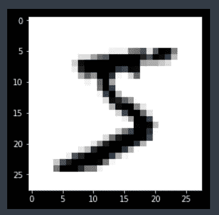

# Keras 中的神经网络脱层解释

> 原文：<https://towardsdatascience.com/machine-learning-part-20-dropout-keras-layers-explained-8c9f6dc4c9ab?source=collection_archive---------3----------------------->


[https://www.pexels.com/photo/colleagues-looking-at-survey-sheet-3183153/](https://www.pexels.com/photo/colleagues-looking-at-survey-sheet-3183153/)

机器学习最终用于在给定一组特征的情况下预测结果。因此，我们可以做的任何概括模型性能的事情都被视为净收益。放弃是一种用于防止模型过度拟合的技术。Dropout 的工作原理是在训练阶段的每次更新时，将隐藏单元(组成隐藏层的神经元)的输出边缘随机设置为 0。如果你看一下 Keras 关于辍学层的文档，你会看到一个由 Geoffrey Hinton 和 friends 撰写的白皮书的链接，该白皮书探讨了辍学背后的理论。

# 密码

在前面的例子中，我们将使用 Keras 构建一个神经网络，目标是识别手写数字。

```
from keras.datasets import mnist
from matplotlib import pyplot as plt
plt.style.use('dark_background')
from keras.models import Sequential
from keras.layers import Dense, Flatten, Activation, Dropout
from keras.utils import normalize, to_categorical
```

我们使用 Keras 将数据导入我们的程序。数据已经分为训练集和测试集。

```
(X_train, y_train), (X_test, y_test) = mnist.load_data()
```

让我们看看我们在做什么。

```
plt.imshow(x_train[0], cmap = plt.cm.binary)
plt.show()
```



在我们完成模型的训练后，它应该能够识别前面的图像为 5。

我们必须事先进行一点预处理。我们将像素(特征)归一化，使它们的范围从 0 到 1。这将使模型更快地收敛到一个解。接下来，我们将给定样本的每个目标标签转换为 1 和 0 的数组，其中数字 1 的索引表示图像代表的数字。我们这样做是因为，否则我们的模型会将数字 9 解释为比数字 3 具有更高的优先级。

```
X_train = normalize(X_train, axis=1)
X_test = normalize(X_test, axis=1)
y_train = to_categorical(y_train)
y_test = to_categorical(y_test)
```

## 没有辍学

在将二维矩阵输入神经网络之前，我们使用一个展平层，通过将每个后续行附加到其前面的行，将其转换为一维数组。我们将使用两个由 128 个神经元组成的隐藏层和一个由 10 个神经元组成的输出层，每个神经元代表 10 个可能的数字中的一个。softmax 激活函数将返回样本代表给定数字的概率。

```
model = Sequential()
model.add(Flatten(input_shape=(28, 28)))
model.add(Dense(128))
model.add(Activation('relu'))
model.add(Dense(128))
model.add(Activation('relu'))
model.add(Dense(10))
model.add(Activation('softmax'))model.summary()
```


因为我们试图预测类别，所以我们使用分类交叉熵作为损失函数。我们将使用准确性来衡量模型的性能。

```
model.compile(
    loss='categorical_crossentropy',
    optimizer='adam',
    metrics=['accuracy']
)
```

我们留出 10%的数据进行验证。我们将用它来比较一个模型在有和没有辍学的情况下过度适应的趋势。批量大小为 32 意味着在通过神经网络传递 32 个样本后，我们将计算梯度并在梯度方向上迈出一步，其幅度等于学习速率。我们总共这样做 10 次，具体次数由历元数决定。

```
history = model.fit(
    X_train,
    y_train,
    epochs=10,
    batch_size=32,
    validation_split=0.1,
    verbose = 1,
    shuffle=True
)
```


我们可以通过使用由 *fit* 函数返回的历史变量来绘制每个时期的训练和验证精度。

```
loss = history.history['loss']
val_loss = history.history['val_loss']
epochs = range(1, len(loss) + 1)
plt.plot(epochs, loss, 'y', label='Training loss')
plt.plot(epochs, val_loss, 'r', label='Validation loss')
plt.title('Training and validation loss')
plt.xlabel('Epochs')
plt.ylabel('Loss')
plt.legend()
plt.show()
```

正如你所看到的，在没有丢失的情况下，验证损耗在第三个时期后停止下降。


```
acc = history.history['acc']
val_acc = history.history['val_acc']
plt.plot(epochs, acc, 'y', label='Training acc')
plt.plot(epochs, val_acc, 'r', label='Validation acc')
plt.title('Training and validation accuracy')
plt.xlabel('Epochs')
plt.ylabel('Accuracy')
plt.legend()
plt.show()
```

如您所见，在没有丢失的情况下，验证精度往往在第三个历元左右趋于平稳。


使用这个简单的模型，我们仍然能够获得超过 97%的准确率。

```
test_loss, test_acc = model.evaluate(X_test, y_test)
test_acc
```


## 拒绝传统社会的人

关于 dropout 应该放在 activation 函数之前还是之后还有一些争论。根据经验，对于除*之外的所有激活功能，将 dropout 放在 activate 功能之后。在传递 0.5 时，每个隐藏单元(神经元)以 0.5 的概率被设置为 0。换句话说，有 50%的变化，给定神经元的输出将被强制为 0。*

```
*model_dropout = Sequential()
model_dropout.add(Flatten(input_shape=(28, 28)))
model_dropout.add(Dense(128))
model_dropout.add(Dropout(0.5))
model_dropout.add(Activation('relu'))
model_dropout.add(Dense(128))
model_dropout.add(Dropout(0.5))
model_dropout.add(Activation('relu'))
model_dropout.add(Dense(10))
model_dropout.add(Activation('softmax'))model_dropout.summary()*
```

**

*同样，由于我们试图预测类别，我们使用分类交叉熵作为损失函数。*

```
*model_dropout.compile(
    loss='categorical_crossentropy',
    optimizer='adam',
    metrics=['accuracy']
)*
```

*通过提供验证分割参数，模型将分离训练数据的一部分，并将在每个时期结束时评估该数据的损失和任何模型度量。如果 dropout 背后的前提成立，那么我们应该会看到与以前的模型相比，验证准确性有显著的不同。洗牌参数将在每个时期之前洗牌训练数据。*

```
*history_dropout = model_dropout.fit(
    X_train,
    y_train,
    epochs=10,
    batch_size=32,
    validation_split=0.1,
    verbose = 1,
    shuffle=True
)*
```

**

*如您所见，验证损失明显低于使用常规模型获得的损失。*

```
*loss = history_dropout.history['loss']
val_loss = history_dropout.history['val_loss']
epochs = range(1, len(loss) + 1)
plt.plot(epochs, loss, 'y', label='Training loss')
plt.plot(epochs, val_loss, 'r', label='Validation loss')
plt.title('Training and validation loss')
plt.xlabel('Epochs')
plt.ylabel('Loss')
plt.legend()
plt.show()*
```

**

*正如您所看到的，该模型收敛得更快，并在验证集上获得了接近 98%的准确性，而之前的模型在第三个时期左右达到稳定。*

```
*acc = history_dropout.history['acc']
val_acc = history_dropout.history['val_acc']
plt.plot(epochs, acc, 'y', label='Training acc')
plt.plot(epochs, val_acc, 'r', label='Validation acc')
plt.title('Training and validation accuracy')
plt.xlabel('Epochs')
plt.ylabel('Accuracy')
plt.legend()
plt.show()*
```

**

*在测试集上获得的准确性与从没有丢失的模型中获得的准确性没有太大的不同。这很可能是由于样本数量有限。*

```
*test_loss, test_acc = model_dropout.evaluate(X_test, y_test)
test_acc*
```

**

# *最后的想法*

*Dropout 可以通过将给定神经元的输出随机设置为 0 来帮助模型泛化。在将输出设置为 0 时，成本函数对改变反向传播过程中权重更新方式的相邻神经元变得更加敏感。*