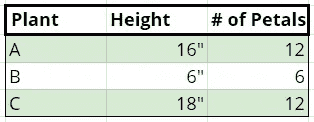

# 机器学习，第 3 部分:无监督学习

> 原文：<https://towardsdatascience.com/machine-learning-part-3-unsupervised-learning-6d9e59924c34?source=collection_archive---------15----------------------->

Image by the author

# 机器学习基础

1.  [基本概念](/machine-learning-part-1-essential-concepts-c2556fb2f3e1)
2.  [监督学习](/machine-learning-part-2-supervised-learning-632621f77188)
3.  无监督学习(你在这里)
4.  [强化学习](/machine-learning-part-4-reinforcement-learning-43070cbd83ab)

# 介绍

在无监督学习中，我们被给予一个未标记的数据集来分析。就像在监督学习中，我们在这些数据中发现模式，但是没有标签，我们不一定能解释这些模式。相反，无监督学习利用了关于数据模式的假设:像聚类、相关性和异常值这样的东西都代表了一些重要的东西，即使我们并不立即知道那是什么。我们将在这里讨论两个最常见的无监督问题:聚类和离群点分析。

# 使聚集

聚类有时被称为“无监督分类”，我对这个术语有一种复杂的感觉，原因我将很快介绍，但它对这个问题提供了足够好的解释，值得介绍。

首先，问题是**无监督的**——我们不会有一个带标签的数据集来指导我们的逻辑。其次，我们希望根据预测因素将项目分成**类**(从技术上讲，它们不是预测因素，它们在这里是“特征”，因为没有响应)。不同之处在于，在*监督*分类中，类结构是已知的并被标记，而在聚类中，我们仅从特征值*发明类结构*。

如何处理这个问题？在监督分类中，我们使用标签来挑选出一个类，并寻找具有两种品质的预测值:1)它们对于该类的每个示例都具有相当共同的值，2)它们将该类与其他类分开。

在集群中，我们基本上反过来执行这个过程。我们正在寻找基于特征值的点组，这些点 1)彼此相似，2)与其余数据不同。在足够简单的数据集中，像这样的组显示为点的**簇**，因此得名。

基本的想法是，如果我们能够识别这些彼此相似而与其他点不相似的点群，那么我们就*可能*识别出了数据中的一些潜在结构。换句话说，即使没有标签，我们仍然希望识别数据中的类结构。

## 例子

在关于监督分类的文章中，我们考虑了花的数据。在那个数据集中，我们有`zinnia`朵花，它们通常高于 12 英寸，可能是红色、橙色或黄色。我们还有一般比 12 英寸短的花，可以是紫色、白色或红色。

想象一下在没有任何`species`标签的情况下将这些数据*可视化。从数据上看还是很明显的，有一簇矮的例子，也有一簇高的例子。我们可以合理地假设这两个集群代表不同的类。在这种情况下，我们知道假设是正确的。*

从人类的角度来看，我们可能会直观地解决简单的聚类问题(3 维或更少的数据)——实际上是在我们的数据中寻找点的聚类。计算机做不到这一点，那么我们如何用计算机可以处理的方式来处理这个问题呢？IE:我们如何用数学方法解决这个问题？

所有聚类算法都利用了一个叫做**距离函数**或**距离度量**的概念，它测量两点之间的距离。一个常见而简单的距离度量是**曼哈顿距离**，它只是两个观察值(每个特征)之间差异的绝对值之和。例如，假设我们有:

`A`和`B`之间的距离是:

`abs(16-6) + abs(12 -6) = 16`

而`A`和`C`之间的距离为 2。从这些距离可以明显看出`A`比`B`更像`C`。即使没有数学，光看表格就能直观地看出这一点。聚类算法都使用这样的距离度量来寻找相似的点。从这里开始，就要决定如何将相似的点分成不同的簇。不同的算法以不同的方式处理这一步，我们没有时间去深入研究它们，但是我们可以涵盖流行的 **k-means** 算法。

在 k-means 中，数据科学家必须首先选择一些聚类。然后，我们将那个数量的**质心**插入到数据中，以表示每个聚类的中心。形心只是一个代表群集精确中心的点。放置质心可以完全随机进行，也可以使用随机元素。从这里开始，我们循环如下:

1.  对于每个点，测量到所有质心的距离，并将该点指定给最近的质心。一个聚类由分配给该质心的所有点定义。
2.  在分配点之后，质心可能不再位于簇中所有点的实际中心。因此，我们取聚类中所有点的平均值，并将质心移动到该位置，这就是聚类的实际中心。
3.  因为我们已经移动了质心，所以一些点可能更靠近不同的质心，而不是它们最初被指定的质心。换句话说，一些点可能已经移动到不同的集群。在这种情况下，我们将所有的点重新分配到最近的质心，并跟踪有多少点改变了聚类。
4.  如果任何*点在步骤 3 中改变了聚类，那么质心不会都在它们各自聚类的精确中心，所以我们循环回到步骤 2 并继续该过程。如果没有点改变聚类，那么从现在开始什么都不会改变，并且算法已经完成。*

K-means 是一种在数据中创建聚类的简单而直观的方法。它确实有两个缺点:首先，被要求选择集群的数量使它容易出错。事实上，我们使用集群意味着我们*不知道有多少类，所以这是一个非常试错的过程。*

第二，质心的随机放置会导致最终出现一组不同的簇。专业术语是算法是**非确定性** — 它可以对同一个问题给出不同的答案。这又一次增加了试错的因素，使得聚类算法的最终输出不如数据科学家理想的精确。

## “聚类”与“无监督分类”

前面我说过我不喜欢用“无监督分类”这个术语来描述聚类，让我们来解释一下为什么。聚类背后的逻辑基本上是“如果它看起来像一个类，它可能是一个类”，但有大量的情况下，聚类版本的“类”和监督分类版本的“类”是非常不同的。

在监督分类中，我们*知道*有一个潜在的类结构，我们*知道*那些类是什么，我们有每一个类的例子。在集群中，我们只*怀疑*有一个底层的类结构，我们通常*不*知道它是如何构造的。毕竟，如果我们确切地知道类是什么，我们就可以标记数据集并使用监督分类来代替。

在我们上面的花的例子中，很明显我们有两组花，由高度分开。然而，当我们考虑花的颜色时，事情就变得更棘手了。我们是不是应该把所有的短白花都分到它们自己的簇里？那些高高的橙色的怎么样？红色的花可以是高的*和矮的*，那么哪一个更重要，是花的颜色相同还是它们的高度相似？在我们介绍的 k-means 算法中，我们必须选择要创建的聚类数。在 flower 示例中，`k=2`和`k=6`都工作得很好，但是像`k=3`这样的东西会导致非常奇怪的输出。在实际问题中，不像在我们的花的例子中，我们不知道潜在的模式是什么，所以选择`k`变得不那么明显。

所以很多聚类归结于对数据的底层和未知结构的有根据的猜测。仅仅因为我们生成了一组集群，难道*不*就意味着它们代表了底层的类结构，在某些情况下，它们可能根本没有任何意义。这就是为什么我更喜欢使用术语“聚类”,因为我们总是获得一组聚类，而我们可能并不总是获得有效的类。

这并不是说输出没有用。上面的批评指出，聚类不一定会在我们已经知道类结构的数据集*中找到底层的类结构。*然而，如果我们使用集群，这通常意味着我们对底层的类结构一无所知。

因此，另一种选择并不是真正的“聚类与分类”，而是“聚类与无”，即:将整个数据集视为单个类。自然，提供任何一种有效的结构都会改善我们的结果。在花的例子中，即使我们错误地根据颜色将数据分成五个不同的种类，我们仍然得到四个捕获单一种类的花的类，和一个错误地将它们组合在一起的类(红色的花)。总的来说，对于未标记的数据来说，这是一个不错的结果。

另一个例子:假设我们试图将杂货店的顾客分成相似的群体，这样我们就可以有针对性地投放广告。可能存在一个理想的基础结构，如果我们知道它，它会比所有其他结构表现得更好。但实际上，任何聚类都比仅仅将客户视为一个大型同质群体表现得更好。聚类取得了如此大的成功，因为在许多情况下，监督学习是不可能的，但任何基于数据的结构，即使是不完美的结构，都比没有结构要好。

最后，我应该指出，因为聚类依赖于距离，所以它会受到数据中噪声的严重影响。噪声会导致聚类散开，变得无法识别，它会导致两个独立的聚类看起来像一个聚类，通常它会使我们想要找到的趋势更难识别。这是不可能完全避免的，但是有一系列的调整和工具可以使聚类算法在有噪声的情况下表现得更好。集群的大部分是一个尝试不同的东西，看看什么最有效的过程，处理噪音也不例外。

# 异常检测/异常值分析

在异常检测中，我们试图发现异常。一个**异常**是一个罕见的、已知的兴趣点。自然，这可能意味着很多事情，但在实践中，异常通常是不好的——欺诈性的信用卡交易、服务器崩溃、机器故障等。异常检测的目标是在**正常**数据的海洋中找到这些不经常出现的点，这些点就是任何非异常点。对于我们列出的例子，目标通常是在异常导致问题之前识别出异常*——例如识别欺诈交易并在交易进行之前取消交易。*

我们可以想象异常可能表现出的许多不同的模式，其中只有一些是可检测的。在一个极端，异常可能是完全随机的，没有共同点。我们不能指望能够探测到这些点。在另一个极端，我们可能有大量的已知异常，这些异常彼此之间有很多共同点，并且与正常数据明显分离。如果我们确信所有可能的异常都与这个已知的组相似，那么我们甚至可以将这个问题视为监督分类。

然而，最常见的是，异常很少且分散；他们有共同的特征，但只是一小部分。像这样的异常最常见的特征之一是，它们是正常数据其余部分的异常值。异常值的特征值远远超出正常范围。

例如，假设一个银行客户通常在加利福尼亚发布信用卡交易，平均每笔交易 30 美元，通常在上午 8 点到晚上 10 点之间。现在假设我们在凌晨 4 点从中国得到一笔 5000 美元的交易。即使不对这个新数据点应用任何数学或算法，也很容易看出它是可疑的。**异常值分析**就是利用这种“极端和/或异常值可疑”的直觉，并以数学方式将其应用于数据集。因此，许多异常检测问题可以通过离群点分析来解决，尽管它们不一定是同一个问题。

值得一提的是，即使我们可以使用这种方法识别异常值，如果没有某种后续措施，我们通常也不会知道它们是否真的是异常。因此异常值分析实际上是关于识别潜在的异常。这方面的一般策略是“标记和跟进”如果你在进行了一笔大额购买或者在另一个城市进行了一次购买之后，接到了银行的电话，那么你的交易就会被标记出来并被跟踪。

## 与监督分类的比较

异常检测的一个独特之处是，我们正在处理一个部分标记为的**数据集。对于已知异常的点，我们有标签，但是对于其余的点，我们没有标签。一般来说，我们假设几乎所有这些都是代表非异常的“正常”数据点。这导致许多人在遇到这个问题时会问同一个问题:“我们可以只将未标记的点标记为‘正常’并使用监督分类吗？”**

简而言之，答案是否定的。长的答案很长，也很专业，所以我不会在这里详细讨论。中间版本是，尽管它们之间有表面上的相似性，监督分类是一个与异常检测非常不同的问题，我们将在这里讨论其中的一些原因。

在监督分类中，我们希望以最大化分类准确性的方式在不同的类之间划出严格的界限。这是有道理的，因为在之前的帖子中，我们提到大多数监督问题在每个类中涉及大致相等数量的数据点。假设我们有三个类，A、B 和 C，每个类占全部例子的 33%。如果我们的分类器达到 99%的准确率，那么我们知道我们在所有三个类别上都做得很好。如果我们完全不能对 C 类进行分类，那么我们只能达到大约 67%的准确率。高水平的准确性要求我们做好每一个级的*。*

然而，在异常检测中，通常 99%以上的数据都是非异常的，只有非常少的已知异常点。我们可以完全忽略异常点，仍然获得 99%以上的准确率，这正是许多监督算法所做的。因为异常检测的全部目的是识别少量的异常点，所以这完全失败了。

一个相关但不相同的问题是，监督分类倾向于将所有点视为相等。如果我们将一些东西从 A 类中误分类，这与将一些东西从 b 类中误分类没有什么不同。这允许监督算法在类之间设置静态的、不可改变的决策边界。在异常检测中，将异常错误分类为正常点的成本(假阴性)高于将正常点错误分类为异常的成本(假阳性)，*和*这些成本因问题而异。因此，我们需要一种算法，允许我们改变边界，并适应不同的成本和假阳性与假阴性之间的权衡。

最后，监督分类做出了一个隐含的假设，即我们用来训练模型的数据是它将*永远*接收到的所有数据的本质上准确的视图。在我们的监督分类示例中，我们正在对花卉进行分类。在那些数据中，白花总是矮牵牛花，矮牵牛花总是矮的。因此，如果我们看到一朵白色的花，我们会自动将其归类为矮牵牛，我们可以推断它也很短。

如果我们收到一个真正不寻常的数据点，这可能会在现实世界中遇到问题。假设我们有一朵 60 英寸高的白色花朵。我们的监督分类算法会毫不犹豫地把它归类为矮牵牛花。然而，任何人类观察者都不会认为这是一个糟糕的决定。要么数据点只是错误的(也许身高实际上是 6.0”并且输入不正确)，要么我们正在看到一朵我们从未见过的花。不管怎样，我们都不应该把它当成矮牵牛。

换句话说，当我们输入的数据不同于我们以前见过的任何数据时，监督分类并不总是符合逻辑的。异常值分析旨在标记*任何不寻常的*点，即使我们以前从未见过这样的例子。

## 方法

所以，让我们回顾一下上一节:我们想要识别的异常通常是正常数据的异常值。至于识别异常值，我们需要一个算法来做三件事:

1.  即使异常点数量很少，也不会忽略它们。
2.  允许数据科学家定义正常点和我们标记为异常的点之间的阈值。
3.  将任何*异常值识别为潜在异常值，即使我们以前从未见过这样的异常值。*

那么我们如何解决这个问题呢？事实证明，统计学中最成功和最广泛使用的技术之一，**假设检验**，本身就是一种异常值分析的形式，并且适用于我们的问题。假设检验的基本问题是这样的:假设我们得到一组我们*知道*都来自同一个来源的数据观察。接下来，我们得到一个新的观察结果，而我们*不*知道这个观察结果来自哪里。我们能决定新的观察结果是否来自同一个来源吗？

这适用于异常检测，因为我们可以检测到的异常通常来自不同于正常数据的数据源。在上面的信用卡示例中，正常数据的来源是持卡人，而异常数据来自欺诈者。

假设检验背后的数学和概念太复杂了，无法在这里完全解释，但它们对统计学和机器学习来说都是非常基础的，所以我强烈建议更深入地了解它们。下面是[两个](https://www.khanacademy.org/math/statistics-probability/significance-tests-one-sample/idea-of-significance-tests/v/simple-hypothesis-testing)不同的[资源](https://stattrek.com/hypothesis-test/hypothesis-testing.aspx)。

简短的版本是这样的:我们在数据科学中观察到的许多值都有钟形概率分布(也称为“钟形曲线”)。这也称为高斯或正态分布数据。对于像这样的数据，大多数观察值将相当接近于集合的平均值，并且当我们远离平均值时，观察值会更少。这使得概率分布呈现独特的钟形，如下所示:

Courtesy of Dan Kernler and [Wikipedia](https://en.wikipedia.org/wiki/Normal_distribution)

我们对数据分布的了解允许我们提出另一个问题:假设我们被给定一个新值，并需要回答这个问题:“这个新值属于那组正态分布的数据吗？”我们的答案在很大程度上取决于与平均值的距离。离平均值越远，我们越不确定该数据点属于该数据集。

根据**标准偏差**测量与平均值的距离，标准偏差是所有点与平均值的平均距离。在正态分布中，我们预计所有样本中有 68%是平均值的+/- 1 标准偏差，95%在 2 以内，99.7%在 3 以内。有了这些知识，让我们考虑一个使用这种方法发现异常值的例子。

## 例子

假设我们被一个古怪的亿万富翁雇佣，他建造了一个大型的、先进的鸟舍，专门用来饲养蓝鸟。这个鸟舍很先进，因为它有电子门，当鸟儿落在旁边的传感器上时，可以让它们进出。

不幸的是，对我们古怪的雇主来说，讨厌的鸟已经进来了。他们希望我们开发一个软件补丁，只允许蓝鸟使用这个门，禁止其他鸟类进入。为了实现这一点，我们可以使用来自传感器的重量输入来知道试图使用门的鸟的质量。我们有大量关于蓝鸟体重的信息，但只有几个“异常”鸟类的例子。我们能用这样一个稀疏的、倾斜的数据集来实现我们的目标吗？

我们将从简单地构建一个异常模型开始。我们通过测量得知，成年蓝鸟的体重呈正态分布，有`mean = 80g`和`std = 10g`。幼鸟呆在鸟舍里，所以我们只需要担心成年鸟。有了这些数字，我们可以根据与平均值的距离来选择阈值。让我们首先将阈值设置在三个标准差的范围内。这给了我们一个`80 +/- 3 * 10`的范围，给了我们低端的`50g`和高端的`110g`值。

接下来，我们必须根据预期的假阳性和假阴性的数量来评估该模型。假阳性是当我们不应该让一只异常的鸟进来时，假阴性是当我们应该让一只蓝松鸦进来时。

对于假阴性，我们只考虑我们期望包含的分布的百分比。在三个标准差下，我们得到了 99.7%的蓝鸟。假设鸟舍能容纳 2000 只鸟，那就相当于排除了三只最小的和三只最大的鸟(总共 6 只)，这还不算太糟糕。

至于假阳性*我们需要查看我们的异常数据。我们只有 12 点:*

`[23g, 25g, 33g, 38g, 48g, 52g, 64g, 80g, 96g, 120g, 148g, 322g]`

这些点中的四个在范围`50g-110g`内，因此我们将错过示例异常点的 1/3。正如我们上面所说的，这是“好”还是“坏”真的取决于问题，以及我们分配给假阳性/假阴性的成本。在这种情况下，让我们假设错误种类的鸟进入鸟舍比排除更多的蓝鸟成本更高，所以让我们尝试一个更严格的门槛。

把它改成两个标准差，我们就得到一个范围`60g-100g`。这只排除了一个我们之前没有排除的异常，我们现在会从 2000 只鸟中排除大约 100 只。这是否是一个好的权衡是值得讨论的。同样值得注意的是，因为一个异常正好位于平均值处，所以不管我们选择什么样的阈值，都不能用这种方法排除它。在异常检测中，点与正常数据非常相似以至于无法排除是很常见的。

## 更复杂的模型

我们已经介绍了在只有一个特征的问题中用于异常检测的最常见的算法，但是事实上，当使用更多的特征时，它不会变得非常复杂。通常，我们为每个特征*单独构建异常值模型*，并根据特征值在同一分布中的可能性生成一个介于 0 和 1.0 之间的数字(分数越高越好)。然后我们把所有的特征值相乘。由于任何单个要素的值的范围在 0.0 到 1.0 之间，这种相乘的过程永远不会使该数字大于其最小值，因此作为单个要素的异常值仍然会导致较低的分数。

当然，这种方法并不适合每一个问题，对于更复杂的问题有许多更复杂的方法，但是它们背后的大概念都符合我们上面讨论的内容。它们都必须处理相同的问题，如类别不平衡、重叠以及误报和漏报的不同成本。

# 结论

虽然无监督学习的方法与有监督学习有很大的不同，但是潜在思想的相似之处在这里是显而易见的。所有这些方法都依赖于相关观察的数据集，并进一步假设这些相关观察中存在有意义的模式，可以解释数据集中不存在的东西(如观察的类)。

主要的区别是我们处理问题的方向:在监督学习中，我们从正确的答案开始，并寻找解释它们的模式。在无监督学习中，我们寻找模式，然后试图辨别它们的含义以及它们解释了什么样的事情。这两种方法都有价值。

接下来，我们将讨论强化学习，这在很多方面与我们已经讨论过的内容有很大的不同。