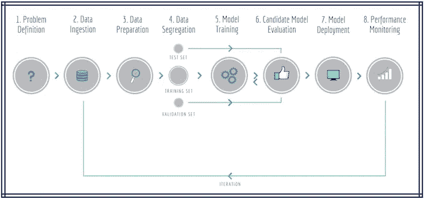
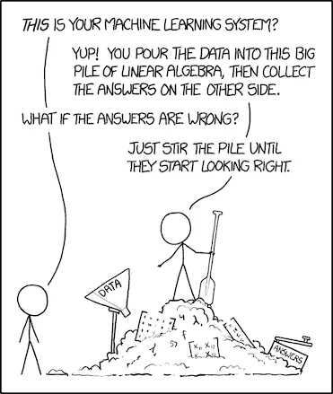

# 机器学习——完美总是从错误开始

> 原文：<https://towardsdatascience.com/machine-learning-perfection-always-starts-with-mistakes-d2dd50a9f1c7?source=collection_archive---------13----------------------->

## *有抱负的数据科学家需要知道什么来避免常见的 ML 错误*

Photo by [chuttersnap](https://unsplash.com/@chuttersnap?utm_source=medium&utm_medium=referral) on [Unsplash](https://unsplash.com?utm_source=medium&utm_medium=referral)

有很多文章解释新数据科学家犯的常见错误，主要集中在**实践**上，而不是机器学习(ML) **过程**本身。

这篇文章将涵盖这一点:

> 数据科学家在 ML 管道中会犯什么样的错误，以及解决这些错误的几种方法…

## 修订本

在我们开始之前，请确保您了解 ML 管道的步骤:

 [## 又一篇关于机器学习的文章！

### 你能和你的老板进行一次对话，简单解释一下机器学习的基础知识吗？现在你可以…

towardsdatascience.com](/not-yet-another-article-on-machine-learning-e67f8812ba86) 

特别要记住 ML 管道图，因为我们将引用各个步骤:

ML Pipeline

# 错误的影响

ML 过程中的大多数错误很难识别和解决，因为它们不会直接抛出错误或异常，但它们会影响我们项目的**最终结果**，从而影响我们的洞察力。

ML 管道本质上是迭代的，但是简单的错误会导致额外的**修改**和来回的修改。限制它们可以提高我们过程的效率和洞察的质量，因为我们可以专注于真正的任务而不是故障排除。

不要误解我的意思:每个人都会犯错误，如果把它们作为**学习经历**的一部分，它们将是无价的！随着我们作为数据科学家的成长，我们将建立在这种经验的基础上，并能够避免它们或尽早识别和补救它们。

# 错误类型

ML 管道中最常见的错误类型与以下一个或多个方面有关:

## 数据准备—数据清理

不言而喻,“脏数据”是数据科学家面临的最大障碍之一，数据清理是 ML 项目中最耗时的部分，占总时间的 60%,其次是 20%的数据摄取——在项目的初始阶段总共花费了 80%!
有个笑话声称:

> 80%的机器学习在清理数据，20%在抱怨清理数据*😃*

处理**缺失值**是数据清理最重要的任务之一，因此可能会导致错误。我们需要检查缺少值的列，并查看它们如何与数据集的其余部分相关，尤其是目标值。一种常见的技术是使用现有值的**平均值/中值/众数**，但也有可能这不是正确的指标，我们需要想出其他的方法。

此外，当涉及分类时，我们需要考虑数据集的类别结构，因为我们可以引入新的“**未定义的**类别，或者另一种可能性是使用 ML 算法来预测缺失值。
最后，我们可以记下这些空值，并选择一个能够**满足**需求的算法。

这里的任何错误都可能会在以后扭曲最终结果，因此建议将该过程拆分为单独的步骤，并可能在我们的代码中引入**策略**或**工厂设计模式**的组合，以便我们可以在所有这些填充方法之间互换。

## 数据准备—特征工程

特征工程是特征提取、构造和选择的超集。在这里，数据科学家使用业务经验和数据驱动的洞察力来识别哪些列与目标相关。

可以通过分配分数然后对它们进行排序来导出特征重要性:可以选择那些具有最高分数的特征来包含在训练数据集中，而其余的可以忽略。我们也可以使用这些信息来构建新的特征，或者降低它们的维数。

选择正确的功能非常关键，因为拥有更好的功能意味着:

1.  更灵活地选择不太复杂的**型号**
2.  更灵活地选择次优**模型参数**
3.  更好的**结果**

尽管这可能简单或复杂，但记住特征选择直接影响模型选择是很重要的，因为我们不希望无意中将**偏差**引入我们的模型，这会导致**过度拟合**。这个阶段的任何错误都会直接影响模型的精度。

在这里，明智的做法是**保留一份我们所做的所有假设的记录**，这样如果遇到错误，我们可以回去重新审视它们。拥有大量的文档将有助于整个项目，尤其是在模型的验证和部署方面。

[https://xkcd.com/1838/](https://xkcd.com/1838/)

## 数据分离—取样

这方面的主要误差与使用单一或有限数量的样本**有关**，这会在模型的训练和测试中引入可测量的偏差。

另一种错误是没有从数据集中选择具有代表性的**样本，因此没有获得特征/特性的比例。例如，如果人口中有 35%的黑人和 65%的白人，那么我们的样本应该反映这个百分比。**

## 候选模型评估

在这个流水线步骤中，一个常见的错误是数据科学家没有花足够的时间来评估模型，而是直接使用它。模型评估对于确保不存在偏见非常重要。这一步与取样步骤密切相关:验证程序需要重复多次才能产生更好的结果。

## 最后但同样重要的是:选择正确的模型

为 ML 项目选择正确的模型是一个需要特别关注的过程，因为有无数的模型可以处理我们的数据，但这并不一定意味着它们对我们试图解决的问题是**合适的**。与型号选择流程相关的主要错误有:

选择型号是因为:

*   它在数据科学社区中的**受欢迎程度**
*   其**精度**(作为唯一标准)
*   其返回结果的**速度**(作为唯一标准)
*   与其他选项相比，**易于使用**

# 结局

*Forget the Mistake — Remember the Lesson!*

错误是学习过程中不可或缺的一部分——我们应该接受它们，因为它们是驱动我们不断前进的引擎。我们对 ML 管道越小心，我们就越不容易犯可能危及整个项目的错误。

我们还可以通过彻底研究一个 ML 案例来加强我们的学习，观察它如何处理管道的各个步骤，更不用说:

> 熟能生巧！！！

感谢阅读！

*我定期在* [*媒体*](https://medium.com/@semika) *上撰写关于技术&的数据——如果你想阅读我未来的帖子，只需“关注”我！*