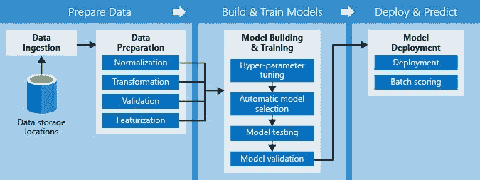
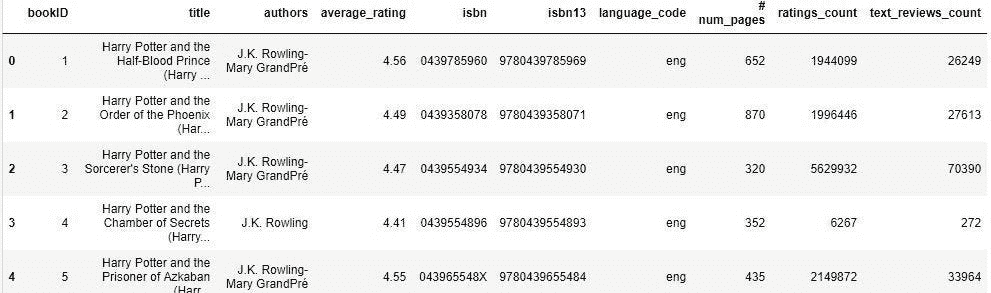
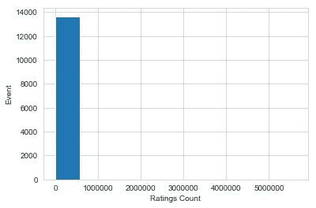
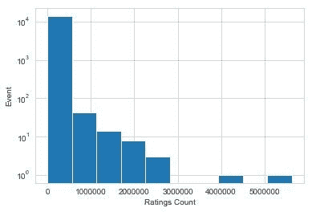
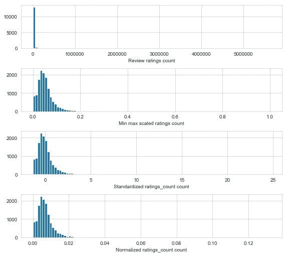

# 机器学习管道:特征工程编号

> 原文：<https://towardsdatascience.com/machine-learning-pipelines-feature-engineering-numbers-29f53aaec82a?source=collection_archive---------15----------------------->


任何机器学习模型真正重要的一部分是数据，尤其是使用的特征。在本文中，我们将讨论特征工程在机器学习管道中的位置，以及如何使用宁滨、变换和归一化对数字进行一些特征工程。特征工程的真正好处是能够改进模型的预测，而不会使模型变得更加复杂。在本文中，我们将使用我在 Kaggle.com[1]发现的来自 Goodreads.com 的数据进行一些动手编码。

> 本文使用的数据是关于书籍评级的，数据可以在这里下载:[https://www.kaggle.com/jealousleopard/goodreadsbooks](https://www.kaggle.com/jealousleopard/goodreadsbooks)

# 机器学习管道的高级概述

一般的机器学习流水线由 5 个步骤组成:

1.  **询问** —企业或客户想要做什么(例如，预测下一季度的销售额，检测癌症等。)
2.  **数据**——数字形式的现实。比如一个季度的销售数量。
3.  **特性** —用数字转换的数据，以便模型可以理解。你们中的一些人可能会说，“嘿，我的模型接受红色或绿色作为特征！”在您的模型中，代码实际上将红色或绿色转换为 0 或 1，这通常是通过一次热编码完成的。
4.  **模型选择** —模型是您用来弥合数据和预测之间差距的工具。对于那些熟悉数学的人来说，把它想象成一个函数。你的数据是输入，模型是函数，你的预测是输出。
5.  **预测** —解决“提问”请求的答案与上面 ask 中的示例相关，第一季度(Q1)销售了 10，000 台，或者患者 XYZ 患有癌症。

下图显示了构建机器学习管道的类似过程，取自微软*【2】*:



对于下面显示的其余特征工程技术(如宁滨、对数变换、特征缩放)，它们只是您操纵数据以便有望做出更好预测的额外工具。

# 扔掉

当你有一个数据集需要聚集成组时，宁滨是很棒的。创建这些组或箱有助于模型提高预测准确性。例如，你有一个收入范围来预测信用违约。应用宁滨的一种方法是对不同的收入水平进行分组。现在，我们将开始使用宁滨直方图对图书计数评级。

```
#Load Packages
import numpy as npimport pandas as pd
import matplotlib.pyplot as plt
import seaborn as sns
from sklearn import linear_model 
from sklearn.model_selection import cross_val_score
import sklearn.preprocessing as pp#load data into dataframe
books_file = pd.read_csv('books.csv', error_bad_lines=False)
```

将“error_bad_lines”代码放在 pd.read_csv 函数中，因为有一些不干净的行。不然 Python 会吼我们的。

```
#Taking a look at the data
books_file.head()
```



现在，我们将开始绘制直方图。

```
#Plotting a histogram - no feature engineering
sns.set_style('whitegrid') #Picking a background color
fig, ax =plt.subplots()
books_file['ratings_count'].hist(ax=ax, bins=10) #State how many bins you want
ax.tick_params(labelsize=10)
ax.set_xlabel('Ratings Count')
ax.set_ylabel('Event') #How many times the specific numbers of ratings count happened
```



这里怎么了？看起来大多数计数的权重都较低。有道理，因为有很多书只得到几个评级。如果我们想在我们的图表中捕捉更多的受欢迎的书评呢？答案是:对数标度。

# 对数变换

```
#Plotting a histogram - log scale
sns.set_style('whitegrid') #Picking a background color
fig, ax =plt.subplots()
books_file['ratings_count'].hist(ax=ax, bins=10) #State how many bins you want
ax.set_yscale('log') #Recaling to log, since large numbers can mess up the weightings for some models
ax.tick_params(labelsize=10)
ax.set_xlabel('Ratings Count')
ax.set_ylabel('Event') #How many times the specific numbers of ratings count happened
```



现在，我们将根据额定值的正常值和对数转换值进行额定值预测。

对于下面的代码，我们添加+1，因为 0 的日志是未定义的，这将导致我们的计算机爆炸(开玩笑，有点)。

```
books_file['log_ratings_count'] = np.log10(books_file['ratings_count']+1)#Using ratings count to predict average rating.  Cross Validation (CV) is normally 5 or 10.
base_model = linear_model.LinearRegression()
base_scores = cross_val_score(base_model, books_file[['ratings_count']], 
                              books_file['average_rating'], cv=10)
log_model = linear_model.LinearRegression()
log_scores = cross_val_score(log_model, books_file[['log_ratings_count']], 
                              books_file['average_rating'], cv=10)#Display the R^2 values.  STD*2 for 95% confidence level
print("R^2 of base data: %0.4f (+/- %0.4f)" % (base_scores.mean(), base_scores.std()*2))
print("R^2 of log data: %0.4f (+/- %0.4f)" % (log_scores.mean(), log_scores.std()*2))
```

> 基础数据的 r:-0.0024(+/-0.0125)
> 
> 日志数据的 r:0.0107(+/-0.0365)

这两个模型都相当糟糕，这从仅使用一个特征来看并不太令人惊讶。从标准统计学 101 的角度来看，我觉得看到负的 R 平方有点可笑。在我们的例子中，负的 R 平方意味着一条直线，假设一个特征实际上预测更差(也就是不遵循直线/线性回归的趋势)。

# 特征缩放

我们将讨论三种特征缩放方法:最小最大缩放、标准化和 L2 归一化。

```
#Min-max scaling
books_file['minmax'] = pp.minmax_scale(books_file[['ratings_count']])
#Standarization
books_file['standardized'] = pp.StandardScaler().fit_transform(books_file[['ratings_count']])
#L2 Normalization
books_file['l2_normalization'] = pp.normalize(books_file[['ratings_count']], axis=0) #Needs axis=0 for graphing
#Plotting histograms of scaled features
fig, (ax1, ax2, ax3, ax4) = plt.subplots(4,1, figsize=(8, 7))
fig.tight_layout(h_pad=2.0)#Normal rating counts
books_file['ratings_count'].hist(ax=ax1, bins=100)
ax1.tick_params(labelsize=10)
ax1.set_xlabel('Review ratings count', fontsize=10)#Min max scaling
books_file['minmax'].hist(ax=ax2, bins=100)
ax2.tick_params(labelsize=10)
ax2.set_xlabel('Min max scaled ratings count', fontsize=10)#Standardization
books_file['standardized'].hist(ax=ax3, bins=100)
ax3.tick_params(labelsize=10)
ax3.set_xlabel('Standardized ratings_count count', fontsize=10)#L2 Normalization
books_file['l2_normalization'].hist(ax=ax4, bins=100)
ax4.tick_params(labelsize=10)
ax4.set_xlabel('Normalized ratings count count', fontsize=10)
```



The graph above shows a histogram of the normal data, min max scaled transformation, standardized transformation, and normalization transformation. Overall, the transformations are pretty similar, but you would want to pick one over the other dependent upon other features in your dataset.

现在，我们将从 3 个特征比例数据中进行预测。

```
#Using ratings count to predict average rating. Cross Validation (CV) is normally 5 or 10.
base_model = linear_model.LinearRegression()
base_scores = cross_val_score(base_model, books_file[['ratings_count']], 
books_file['average_rating'], cv=10)
minmax_model = linear_model.LinearRegression()
minmax_scores = cross_val_score(log_model, books_file[['minmax']], 
books_file['average_rating'], cv=10)
standardized_model = linear_model.LinearRegression()
standardized_scores = cross_val_score(base_model, books_file[['standardized']], 
books_file['average_rating'], cv=10)
l2_normalization_model = linear_model.LinearRegression()
l2_normalization_scores = cross_val_score(log_model, books_file[['l2_normalization']], 
books_file['average_rating'], cv=10)#Display R^2 values. STD*2 for 95% confidence level
print("R^2 of base data: %0.4f (+/- %0.4f)" % (base_scores.mean(), base_scores.std()*2)) 
print("R^2 of minmax scaled data: %0.4f (+/- %0.4f)" % (minmax_scores.mean(), minmax_scores.std()*2))
print("R^2 of standardized data: %0.4f (+/- %0.4f)" % (standardized_scores.mean(), standardized_scores.std()*2)) 
print("R^2 of L2 normalized data: %0.4f (+/- %0.4f)" % (l2_normalization_scores.mean(), l2_normalization_scores.std()*2))
```

> 基础数据的 r:-0.0024(+/-0.0125)
> 
> 最小最大比例数据的 r:0.0244(+/-0.0298)
> 
> 标准化数据的 r:0.0244(+/-0.0298)
> 
> L2 标准化数据的相对误差:0.0244 (+/- 0.0298)

对日志转换稍有改进。由于大多数缩放类型在图形上产生相同的形状，所以它们给出相同的 R 平方值也就不足为奇了。每种缩放方法都有一些需要注意的地方。最小最大值有利于使所有特征值介于 0 到 1 之间。标准化有利于缩放特征的方差，因此使均值= 0，方差= 1(也称为正态分布风格)。L2 归一化的工作原理是将要素缩放到欧几里德或 XY 平面范数。重要说明:要素缩放不会改变要素的形状，因为在遮光罩下它会除以一个常数。

# 结论

太棒了，我们讨论了机器学习管道的简要概述以及特征工程的适用范围。然后我们讨论了宁滨、对数变换和各种形式的特征缩放。一路上，我们还通过书评观察了特征工程如何影响线性回归模型预测。

就个人而言，我发现在处理其他数据集中大多数其他要素的概率分布时，最小最大值工作得很好。类似地，标准化和 L2 归一化用于将数字从非常大的数字缩小到与所选分析数据集相关的相似特征。

免责声明:本文陈述的所有内容均为我个人观点，不代表任何雇主。

[1] Kaggle，Goodreads-books (2019)，[https://www.kaggle.com/jealousleopard/goodreadsbooks](https://www.kaggle.com/jealousleopard/goodreadsbooks)
【2】微软，什么是机器学习管道？(2019)，[https://docs . Microsoft . com/en-us/azure/machine-learning/service/concept-ml-pipelines](https://docs.microsoft.com/en-us/azure/machine-learning/service/concept-ml-pipelines)