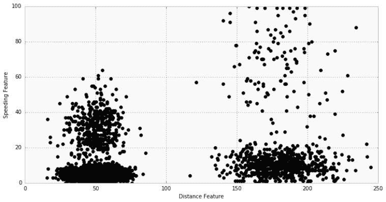
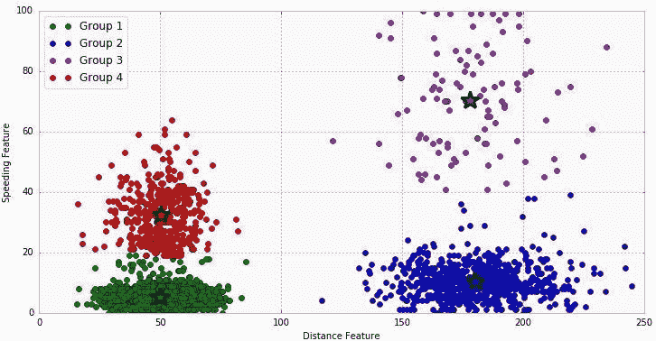
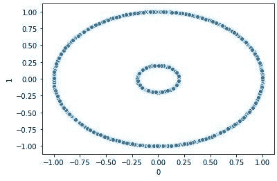
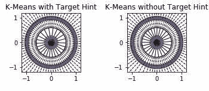
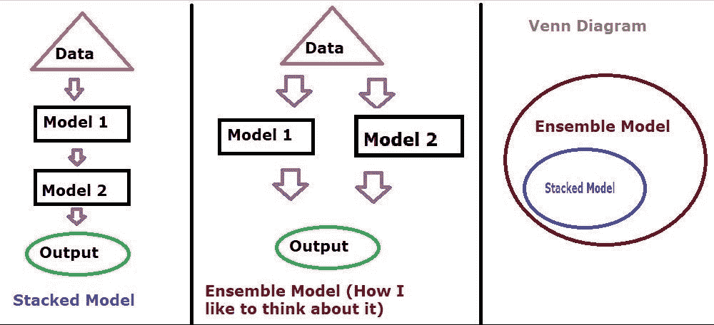
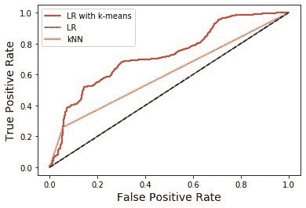

# 机器学习管道:非线性模型堆叠

> 原文：<https://towardsdatascience.com/machine-learning-pipelines-nonlinear-model-stacking-668f2b720344?source=collection_archive---------19----------------------->


通常，我们面对的数据集是相当线性的，或者可以被处理成一个数据集。但是，如果我们正在检查的数据集真的应该以非线性的方式来看待呢？步入非线性特征工程的世界。首先，我们来看看非线性数据的例子。接下来，我们将简要讨论作为非线性特征工程手段的 K-means 算法。最后，我们将在逻辑回归的基础上应用 K-means 来构建一个优秀的分类模型。

# 非线性数据的例子

非线性数据在商业世界中经常出现。示例包括:分组群体行为(营销)、群体活动的库存模式(销售)、以前交易的异常检测(财务)等。[1].举一个更具体的例子(供应链/物流)，我们甚至可以在卡车司机超速行驶数据的可视化中看到它[1]:



快速浏览一下，我们可以看到这个数据集中至少有 2 个组。一组分为 100 米以上和 100 米以下。直观地，我们可以看到，在这里拟合一个线性模型将是可怕的。因此，我们需要一个不同类型的模型。应用 K-means，我们实际上可以找到如下所示的四个组[1]:



借助 K-means，我们现在可以对上述驾驶员数据集进行额外分析，以产生预测性见解，帮助企业对驾驶员的行驶距离和超速模式进行分类。在我们的例子中，我们将 K-means 应用于我们自己的虚拟数据集，以节省更多的特征工程现实生活数据的步骤。

# k 均值

在我们开始构建我们的数据之前，让我们花一些时间来回顾一下 K-means 实际上是什么。K-means 是一种在未标记的数据集内寻找一定数量的聚类的算法[2]。注意“未标记”这个词。这意味着 K-means 是一个无监督的学习模型。当你得到数据却不知道如何标注时，这非常有用。K-means 可以帮你标记群组——非常酷！

# 应用非线性特征工程

对于我们的数据，我们将使用来自 sklearn [3]的 make_circles 数据。好吧，让我们来看看例子:

```
#Load up our packages
import pandas as pd
import numpy as np
import sklearn
import scipy
import seaborn as sns
from sklearn.cluster import KMeans
from sklearn.preprocessing import OneHotEncoder
from scipy.spatial import Voronoi, voronoi_plot_2d
from sklearn.data sets.samples_generator import make_circles
from sklearn.linear_model import LogisticRegression
from sklearn.neighbors import KNeighborsClassifier
import matplotlib.pyplot as plt
%matplotlib notebook
```

我们的下一步是使用创建一个 K-means 类。对于那些不熟悉类(不是你在学校学的科目)的人来说，把编码中的类想象成一个超级函数，里面有很多函数。现在，我知道 sklearn 中已经有一个 k-means 聚类算法，但是我非常喜欢 Alice Zheng 的这个类，因为它有详细的注释和我们很快就会看到的可视化效果[4]:

```
class KMeansFeaturizer:
    """Transforms numeric data into k-means cluster memberships.

    This transformer runs k-means on the input data and converts each data point
    into the id of the closest cluster. If a target variable is present, it is 
    scaled and included as input to k-means in order to derive clusters that
    obey the classification boundary as well as group similar points together. Parameters
    ----------
    k: integer, optional, default 100
        The number of clusters to group data into. target_scale: float, [0, infty], optional, default 5.0
        The scaling factor for the target variable. Set this to zero to ignore
        the target. For classification problems, larger `target_scale` values 
        will produce clusters that better respect the class boundary. random_state : integer or numpy.RandomState, optional
        This is passed to k-means as the generator used to initialize the 
        kmeans centers. If an integer is given, it fixes the seed. Defaults to 
        the global numpy random number generator. Attributes
    ----------
    cluster_centers_ : array, [k, n_features]
        Coordinates of cluster centers. n_features does count the target column.
    """ def __init__(self, k=100, target_scale=5.0, random_state=None):
        self.k = k
        self.target_scale = target_scale
        self.random_state = random_state
        self.cluster_encoder = OneHotEncoder().fit(np.array(range(k)).reshape(-1,1))

    def fit(self, X, y=None):
        """Runs k-means on the input data and find centroids. If no target is given (`y` is None) then run vanilla k-means on input
        `X`.        If target `y` is given, then include the target (weighted by 
        `target_scale`) as an extra dimension for k-means clustering. In this 
        case, run k-means twice, first with the target, then an extra iteration
        without. After fitting, the attribute `cluster_centers_` are set to the k-means
        centroids in the input space represented by `X`. Parameters
        ----------
        X : array-like or sparse matrix, shape=(n_data_points, n_features) y : vector of length n_data_points, optional, default None
            If provided, will be weighted with `target_scale` and included in 
            k-means clustering as hint.
        """
        if y is None:
            # No target variable, just do plain k-means
            km_model = KMeans(n_clusters=self.k, 
                              n_init=20, 
                              random_state=self.random_state)
            km_model.fit(X) self.km_model_ = km_model
            self.cluster_centers_ = km_model.cluster_centers_
            return self # There is target information. Apply appropriate scaling and include
        # into input data to k-means            
        data_with_target = np.hstack((X, y[:,np.newaxis]*self.target_scale)) # Build a pre-training k-means model on data and target
        km_model_pretrain = KMeans(n_clusters=self.k, 
                                   n_init=20, 
                                   random_state=self.random_state)
        km_model_pretrain.fit(data_with_target) # Run k-means a second time to get the clusters in the original space
        # without target info. Initialize using centroids found in pre-training.
        # Go through a single iteration of cluster assignment and centroid 
        # recomputation.
        km_model = KMeans(n_clusters=self.k, 
                          init=km_model_pretrain.cluster_centers_[:,:2], 
                          n_init=1, 
                          max_iter=1)
        km_model.fit(X)

        self.km_model = km_model
        self.cluster_centers_ = km_model.cluster_centers_
        return self

    def transform(self, X, y=None):
        """Outputs the closest cluster id for each input data point. Parameters
        ----------
        X : array-like or sparse matrix, shape=(n_data_points, n_features) y : vector of length n_data_points, optional, default None
            Target vector is ignored even if provided. Returns
        -------
        cluster_ids : array, shape[n_data_points,1]
        """
        clusters = self.km_model.predict(X)
        return self.cluster_encoder.transform(clusters.reshape(-1,1))

    def fit_transform(self, X, y=None):
        """Runs fit followed by transform.
        """
        self.fit(X, y)
        return self.transform(X, y)
```

不要让大量的文本困扰你。我只是把它放在那里，以防你想在你自己的项目中试验它。之后，我们将创建我们的训练/测试集，并将种子设置为 420 以获得相同的结果:

```
# Creating our training and test set
seed = 420training_data, training_labels = make_circles(n_samples=2000, factor=0.2)kmf_hint = KMeansFeaturizer(k=100, target_scale=10, random_state=seed).fit(training_data, training_labels)kmf_no_hint = KMeansFeaturizer(k=100, target_scale=0, random_state=seed).fit(training_data, training_labels)def kmeans_voronoi_plot(X, y, cluster_centers, ax):
    #Plots Voronoi diagram of k-means clusters overlaid with data
    ax.scatter(X[:, 0], X[:, 1], c=y, cmap='Set1', alpha=0.2)
    vor = Voronoi(cluster_centers)
    voronoi_plot_2d(vor, ax=ax, show_vertices=False, alpha=0.5)
```

现在，让我们来看看未标记的非线性数据:

```
#looking at circles data
df = pd.DataFrame(training_data)
ax = sns.scatterplot(x=0, y=1, data=df)
```



就像我们司机的 into 数据集一样，我们的圈内圈外绝对不是线性数据集。接下来，我们将应用 K-means 比较视觉结果，给它一个关于我们所想的提示和没有提示:

```
#With hint
fig = plt.figure()
ax = plt.subplot(211, aspect='equal')
kmeans_voronoi_plot(training_data, training_labels, kmf_hint.cluster_centers_, ax)
ax.set_title('K-Means with Target Hint')#Without hint
ax2 = plt.subplot(212, aspect='equal')
kmeans_voronoi_plot(training_data, training_labels, kmf_no_hint.cluster_centers_, ax2)
ax2.set_title('K-Means without Target Hint')
```



我发现在有提示和没有提示的情况下，结果相当接近。如果您想要更多的自动化，那么您可能不想应用任何提示。但是如果你能花些时间看看你的数据集给它一点提示，我会的。原因是它可以节省你运行模型的时间，所以 k-means 花更少的时间自己计算。给 k-means 一个提示的另一个原因是，您在您的数据集中有领域专业知识，并且知道有特定数量的聚类。

# 用于分类的模型堆叠

有趣的部分到了——制作堆叠模型。有些人可能会问，堆叠模型和系综模型有什么区别。集成模型将多个机器学习模型结合起来，形成另一个模型[5]。所以，不多。我认为模型堆叠在这里更精确，因为 k-means 正在进入逻辑回归。如果我们能画一个文氏图，我们会在系综模型的概念中找到堆叠的模型。我在谷歌图片上找不到一个好的例子，所以我运用 MS paint 的魔力来呈现一个粗略的插图，供你观赏。



好了，美术课结束，回到编码。我们要做一个 kNN 的 ROC 曲线，逻辑回归(LR)，k 均值馈入逻辑回归。

```
#Generate test data from same distribution of training data
test_data, test_labels = make_moons(n_samples=2000, noise=0.3, random_state=seed+5)training_cluster_features = kmf_hint.transform(training_data)
test_cluster_features = kmf_hint.transform(test_data)training_with_cluster = scipy.sparse.hstack((training_data, training_cluster_features))
test_with_cluster = scipy.sparse.hstack((test_data, test_cluster_features))#Run the models
lr_cluster = LogisticRegression(random_state=seed).fit(training_with_cluster, training_labels)classifier_names = ['LR',
                    'kNN']
classifiers = [LogisticRegression(random_state=seed),
               KNeighborsClassifier(5)]
for model in classifiers:
    model.fit(training_data, training_labels)   

#Plot the ROC
def test_roc(model, data, labels):
    if hasattr(model, "decision_function"):
        predictions = model.decision_function(data)
    else:
        predictions = model.predict_proba(data)[:,1]
    fpr, tpr, _ = sklearn.metrics.roc_curve(labels, predictions)
    return fpr, tprplt.figure()
fpr_cluster, tpr_cluster = test_roc(lr_cluster, test_with_cluster, test_labels)
plt.plot(fpr_cluster, tpr_cluster, 'r-', label='LR with k-means')for i, model in enumerate(classifiers):
    fpr, tpr = test_roc(model, test_data, test_labels)
    plt.plot(fpr, tpr, label=classifier_names[i])

plt.plot([0, 1], [0, 1], 'k--')
plt.legend()
plt.xlabel('False Positive Rate', fontsize=14)
plt.ylabel('True Positive Rate', fontsize=14)
```



好吧，我第一次看到 ROC 曲线的时候，我就想我该怎么读这个东西？你想要的是最快到达左上角的模型。在这种情况下，我们最精确的模型是堆叠模型——带 k 均值的线性回归。我们的模型工作的分类是挑选哪里，哪个数据点属于大圆或小圆。

# 结论

唷，我们在这里讨论了相当多的事情。首先，我们来看看现实世界中可能会遇到的非线性数据和例子。其次，我们将 k-means 作为一种工具来发现更多以前没有的数据特征。接下来，我们将 k-means 应用于我们自己的数据集。最后，我们将 k-means 堆叠到逻辑回归中以建立一个更好的模型。总的来说很酷。需要注意的是，我们没有对模型进行调优，这会改变性能，我们也没有比较那么多模型。但是，将无监督学习结合到监督模型中可能会证明非常有用，并帮助您提供通过其他方式无法获得的洞察力！

免责声明:本文陈述的所有内容均为我个人观点，不代表任何雇主。还撒了附属链接。

[1] A，特雷维尼奥，K-means 聚类介绍(2016)，【https://www.datascience.com/blog/k-means-clustering 

[2] J，VanderPlas，Python 数据科学手册:处理数据的基本工具(2016)，[https://amzn.to/2SMdZue](https://amzn.to/2SMdZue)

[3] Scikit-learn 开发者，sk learn . data sets . make _ circles(2019)， [](https://datalab.cc/foundations/toc?source=post_page---------------------------) [https://Scikit-learn . org/stable/modules/generated/sk learn . data sets . make _ circles . html # sk learn . data sets . make _ circles](https://scikit-learn.org/stable/modules/generated/sklearn.datasets.make_circles.html#sklearn.datasets.make_circles)

[4] A，郑等，面向机器学习的特征工程:面向数据科学家的原理与技术(2018)，

[5] F，Gunes，为什么堆叠系综模型会赢得数据科学竞赛？(2017)，[https://blogs . SAS . com/content/subcivily musings/2017/05/18/stacked-ensemble-models-win-data-science-competitions/](https://blogs.sas.com/content/subconsciousmusings/2017/05/18/stacked-ensemble-models-win-data-science-competitions/)