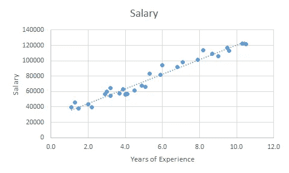
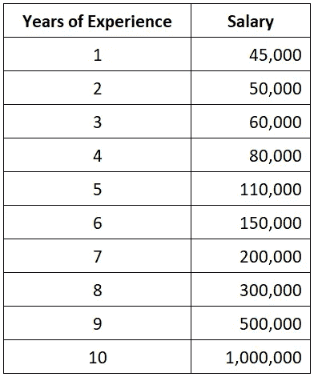
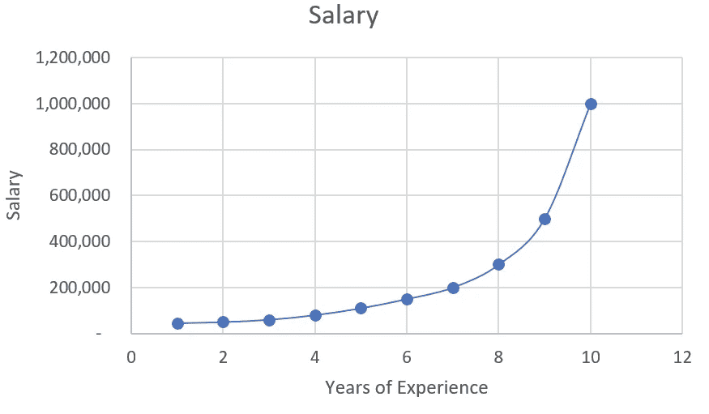
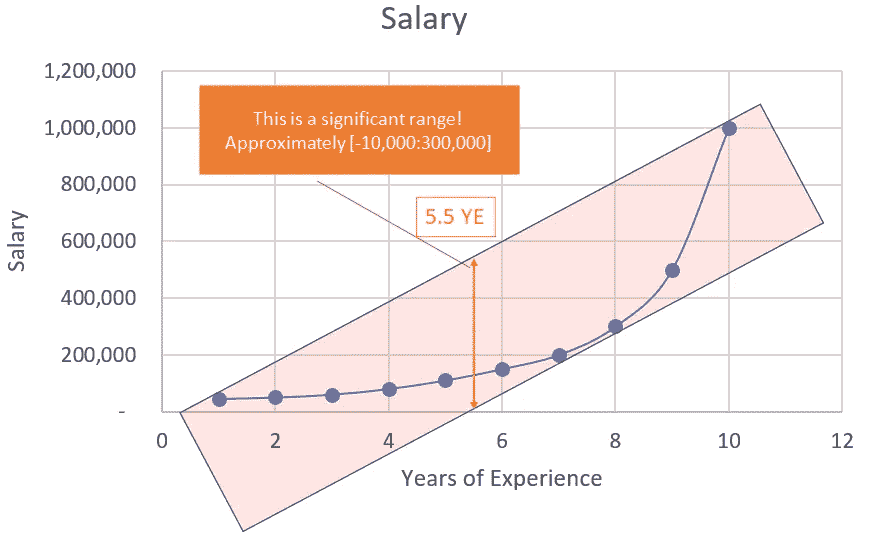
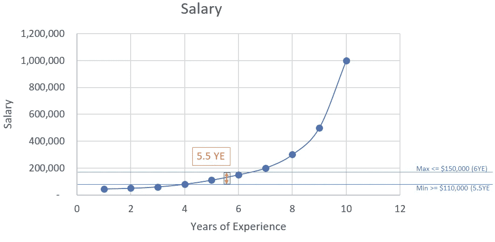
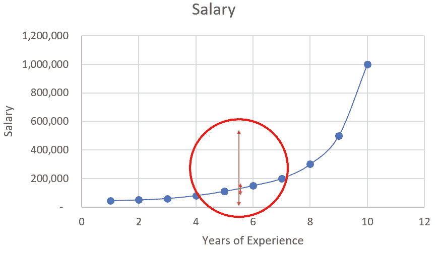
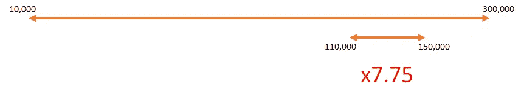
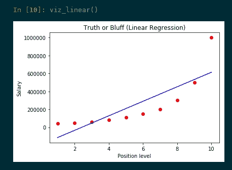
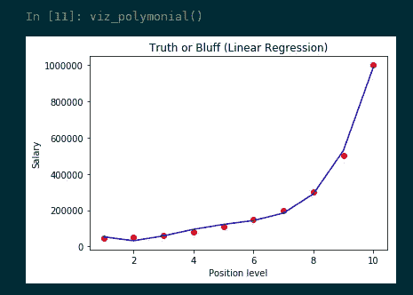
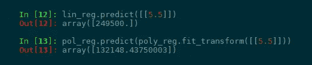

# 机器学习:用 Python 实现多项式回归

> 原文：<https://towardsdatascience.com/machine-learning-polynomial-regression-with-python-5328e4e8a386?source=collection_archive---------3----------------------->

## 在这篇文章中，我们将指导你使用多项式回归进行机器学习的中间步骤。

*本帖中使用的缩写:*

*   *叶:多年经验*

# 先看看线性回归

在我之前的帖子中，我们讨论了关于[线性回归](/machine-learning-simple-linear-regression-with-python-f04ecfdadc13)。让我们回顾一下。对其值为**线性**的数据集应用线性回归，如下例:

Salary based on Years of Experience ([salary_data.csv](https://s3.us-west-2.amazonaws.com/public.gamelab.fun/dataset/salary_data.csv))

而现实生活并没有那么简单，尤其是当你从不同行业的很多不同公司去观察的时候。1 个叶老师和 1 个叶工程师工资不一样；甚至 1 叶土木工程师不同于机械工程师；如果你比较两个不同公司的机械工程师，他们的工资也大不相同。那么如何才能预测一个应聘者的薪资呢？

今天，我们将使用另一个数据集来表示多项式形状。

Salary based on Years of Experience ([position_salaries.csv](https://s3.us-west-2.amazonaws.com/public.gamelab.fun/dataset/position_salaries.csv))

为了了解工资增长的总体情况，让我们将数据集可视化为一个图表:

Salary based on Years of Experience — Plotting

让我们想想我们的候选人。他有 5 叶。如果我们在这个例子中使用[线性回归](/machine-learning-simple-linear-regression-with-python-f04ecfdadc13)会怎么样？

Linear visualization

根据上图，我们候选人的工资范围大概是从 ***减去****【10，000 美元到 300，000 美元*。为什么？看，这种情况下的工资观察不是线性的。**它们呈弧形！**这就是为什么在这个场景中应用[线性回归](/machine-learning-simple-linear-regression-with-python-f04ecfdadc13)不能给出正确的值。是时候进行**多项式回归**了。

# 为什么要多项式回归？

因为要准确得多！

我们已经知道 5 叶的工资是 11 万美元，6 叶是 15 万美元。意思是 5.5 叶的工资应该在他们之间！最佳价值应该是这样的:

Polynomial visualization

让我们比较一下使用线性和多项式之间的差距。注意红色圆圈:

Comparison between Linear and Polynomial

太小看不见？缩小它！

Gaps between Linear and Polynomial

比用[线性回归](/machine-learning-simple-linear-regression-with-python-f04ecfdadc13)准确的多 **7.75 倍**！

那么我们 5.5 叶候选人的工资怎么算呢？我们可以用平均值来快速计算。因为 5.5 是 5 和 6 的平均值，所以工资可以计算为:

> (150，000 + 110，000)/2 =**130，000 美元**

***注:如果你不知道什么是均值，请阅读我之前关于* [*均值、中位数、众数*](https://medium.com/@nhan.tran/mean-median-an-mode-in-statistics-3359d3774b0b) *的帖子。谢了。***

**但是不是最高准确率而且太手动！让我们应用机器学习来获得更精确和灵活的计算。是时候启动您的 Spyder IDE 了！**

# **用 Python 实现多项式回归**

**在这个例子中，我们必须使用 4 个库作为`numpy`、`pandas`、`matplotlib`和`sklearn`。现在我们必须先导入库并获取数据集:**

**代码解释:**

*   **`dataset`:该表包含了我们 csv 文件中的所有值**
*   **`X`:第 2 列，包含年经验数组**
*   **`y`:包含薪资数组的最后一列**

**让我们分割我们的`dataset`来得到训练集和测试集(每个集的`X`和`y`值)**

**代码解释:**

*   **`test_size=0.2`:我们将把`dataset` (10 个观察值)分成两部分(训练集、测试集)，并且**测试集**与`dataset`的比率为 0.2 (2 个观察值将被放入**测试集**)。你可以放 1/5 得到 20%或者 0.2，它们是一样的。我们不应该让测试集太大；如果它太大，我们将缺乏数据来训练。通常情况下，我们应该选择 5%到 30%左右。**
*   **`train_size`:如果我们已经使用了 test_size，剩余的数据将自动分配给 train_size。**
*   **`random_state`:这是随机数发生器的种子。我们也可以放一个`RandomState`类的实例。如果我们将其留空或为 0，将使用由`np.random`使用的`RandomState`实例。**

**我们已经有了训练集和测试集，现在我们必须建立回归模型。首先，我们将建立一个线性回归模型并将其可视化(在您的练习中不需要包括这一步，我们这样做只是为了比较线性和多项式):**

**调用`viz_linear()`函数后，可以看到如下图:**

****

**Linear Regression model visualization**

**另一方面，我们将构建多项式回归模型，并将其可视化以查看差异:**

**调用`viz_polynomial()`函数后，可以看到如下图:**

****

**Polynomial Regression model visualization**

**最后一步，让我们使用线性回归模型和多项式回归模型来预测候选值(5.5 YE):**

**你可以看到，使用线性回归模型和多项式回归模型的预测值是完全不同的！**

****

**Comparison between `lin_reg` and `pol_reg`**

**让我们向上滚动，再次检查我们得到了什么？根据我们的数据集，我们的工资应该是:**

> **11 万美元< the salary < $150,000**

**But the predicted salary using Linear Regression 【 is **24.95 万美元**。无法接受*(但根据线性回归还是在-1 万到 30 万的范围内)*！用多项式回归怎么样？我们的`pol_reg`值为**132，148.43750 美元**，非常接近我们的**平均值 130，000 美元**。**

**答对了。是时候让我们的候选人知道我们将为他提供 132，148 美元的最高工资了！**

**在结束我的帖子之前，这里是我们完整的源代码和数据集，供你在操场上练习:**

*   **[position _ salary . CSV](https://s3.us-west-2.amazonaws.com/public.gamelab.fun/dataset/position_salaries.csv)**
*   **[多项式 _ 回归. py](https://gist.github.com/panicpotatoe/dcc956002ed879394e91d184c227a520)**

**天天快乐学习！**