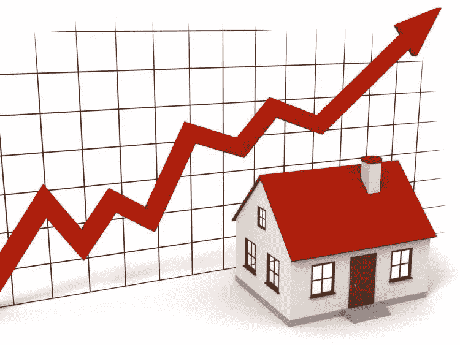

# 机器学习——用回归预测房价

> 原文：<https://towardsdatascience.com/machine-learning-predicting-house-prices-with-regression-2388bb876a6f?source=collection_archive---------26----------------------->

运行算法以获得最准确的结果

本文是我关于住房数据集的系列文章的最后一篇。对于门外汉，我已经在前两篇文章中介绍了 [EDA](/exploratory-data-analysis-unravelling-a-story-with-data-b01d70069035) 和[特性工程](/feature-engineering-translating-the-dataset-to-a-machine-ready-format-af4788d15d6c)。

总结到目前为止的工作——我们在第二篇文章中讨论了 EDA 中极其平凡的数据管理工作和细致的功能再造。我们研究了所有的变量，根据变量与目标值的相关性决定保留什么，放弃什么。我们最终选择了 64 个精心挑选的特征来训练数据集并预测最终的房价！



首先，我们将数据集以 80:20 的比例分成训练和测试。

```
X_train, X_test, y_train, y_test = train_test_split(X, y, test_size = .20, random_state = 42)
```

接下来，我们使用随机森林回归器来训练数据集，并使用随机搜索 CV 来获得最佳超参数。

```
rf = RandomForestRegressor(random_state = 42)#Hyperparamater tuning using RanodomSearchCV

random_grid = { 
    'n_estimators': [int(x) for x in np.linspace(start = 200, stop = 2000, num = 10)],
    'max_features': ['auto', 'sqrt', 'log2'],
    'max_depth' : [6,7,8,9,10],
    'min_samples_split' : [2, 5, 10],
    'min_samples_leaf' : [1, 2, 4]
}rf_random = RandomizedSearchCV(estimator = rf, param_distributions = random_grid, n_iter = 100, cv = 5, verbose=2, random_state=42, n_jobs = -1)
```

最后，我们在训练集上拟合模型，并获得可能的最佳分数。

```
rf_random.fit(X_train, y_train)
print(rf_random.best_params_)
print(rf_random.best_score_)
```

最好成绩是 0.87。在进行网格搜索时，最佳得分略微增加到 0.88。

```
#Hyperparameter tuning using GridSearchCVparam_grid = { 
    'n_estimators': [int(x) for x in np.linspace(start = 600, stop = 2000, num = 10)],
    'max_features': ['auto', 'sqrt', 'log2'],
    'max_depth' : [7,8,9,10],
    'min_samples_split' : [2, 5],
    'min_samples_leaf' : [1, 2]
}grid_search = GridSearchCV(estimator = rf, param_grid = param_grid, 
                          cv = 3, n_jobs = -1, verbose = 2)grid_search.fit(X_train, y_train)
print(grid_search.best_params_)
print(grid_search.best_score_)
```

Lasso 回归和随机搜索给出了一个差得多的最佳分数 0.85。

XGBoost 回归和随机搜索 CV 给出了更高的分数 0.9。

然而我用岭回归得到了最好的分数。

```
#Ridge Regressorparams_ridge ={
        'alpha':[0.25,0.5,1],
        'solver':['auto', 'svd', 'cholesky', 'lsqr', 'sparse_cg', 'sag', 'saga']
        }ridge = Ridge()
ridge_random = RandomizedSearchCV(estimator = ridge, param_distributions = params_ridge,
                               n_iter=50, cv=5, n_jobs=-1,random_state=42, verbose=2)
ridge_random.fit(X_train, y_train)
print(ridge_random.best_params_)
print(ridge_random.best_score_)ridge_grid = GridSearchCV(estimator = ridge, param_grid = params_ridge, cv = 5, n_jobs = -1, verbose = 2)ridge_grid.fit(X_train, y_train)
print(ridge_grid.best_params_)
print(ridge_grid.best_score_)
```

随机搜索和网格搜索给我的最高分都是 0.92。

因此，我们从最佳估计量着手，对测试集进行预测。

```
model_ridge = ridge_random.best_estimator_
y_pred_ridge = np.exp(model_ridge.predict(X_test))
output_ridge = pd.DataFrame({'Id': test['Id'], 'SalePrice': y_pred_ridge})
output_ridge.to_csv('prediction_ridge.csv', index=False)
```

这让我在 Kaggle 上得了 0.12460 分！

完整代码请参考以下链接:[https://github . com/pritha 21/ka ggle/blob/master/House _ prices . ipynb](https://github.com/pritha21/Kaggle/blob/master/House_Prices.ipynb)

你可能需要使用[https://nbviewer.jupyter.org/](https://nbviewer.jupyter.org/)来查看

任何帮助我提高分数的建议都欢迎！