# 机器学习—概率和统计

> 原文：<https://towardsdatascience.com/machine-learning-probability-statistics-f830f8c09326?source=collection_archive---------5----------------------->

## 机器学习的基本概率与统计

机器学习是一个跨学科领域，它使用统计、概率和算法从数据中学习，并提供可用于构建智能应用程序的见解。在本文中，我们将讨论机器学习中广泛使用的一些关键概念。


概率和统计是数学的相关领域，它们关注于分析事件的相对频率。

> *概率*处理预测未来事件发生的可能性，而*统计*涉及对过去事件发生频率的分析。

# 可能性

大多数人对概率的程度都有一个直观的认识，这也是为什么我们在日常对话中会使用“大概”和“不太可能”这样的词，但我们会谈到如何对那些程度做出量化的主张[1]。

在概率论中，一个**事件**是一个实验的一组结果，一个概率被分配给这些结果。如果`**E**`代表一个事件，那么`**P(E)**`代表`**E**`发生的概率。`**E**`可能发生(*成功*)或可能不发生(*失败*)的情况称为 ***试验*** 。

这个事件可以是任何事情，比如*扔硬币、掷骰子*或者*从袋子里拿出一个彩球。*在这些例子中，事件的结果是随机的，所以代表这些事件结果的变量被称为**随机变量。**

让我们考虑一个抛硬币的基本例子。如果硬币是公平的，那么它出现正面的可能性和出现反面的可能性一样大。换句话说，如果我们要反复投掷硬币很多次，我们预计大约一半的投掷是正面，一半是反面。在这种情况下，我们说得到人头的概率是 1/2 或者 0.5。

事件的**经验概率**由事件发生的次数除以观察到的事件总数得出。如果对于`**n**`试验，我们观察到`**s**`成功，成功的概率是 s/n。任何投掷硬币的顺序都可能有多于或少于 50%的正面。

**另一方面，理论概率**由特定事件发生的方式数除以可能结果的总数得出。所以头可能出现一次，可能的结果是两次(头，尾)。人头的真实(理论)概率是 1/2。

## 联合概率

用`**P(A and B) or P(A ∩ B)**`表示的事件 A 和 B 的概率是事件 A 和 B 都发生的概率。`**P(A ∩ B) = P(A). P(B)**` **。**这仅适用于`**A**`和`**B**`相互独立的情况，也就是说，如果`**A**`发生，并不改变`**B**`的概率，反之亦然。

## 条件概率

让我们考虑 A 和 B 都不是独立的，因为如果 A 发生了，B 的概率就更高。当 A 和 B 不独立时，计算条件概率 P (A|B)往往很有用，P 是给定 B 发生的概率:`**P(A|B) = P(A ∩ B)/ P(B)**` **。**

> 以事件 B 为条件的事件 A 的概率被表示和定义`P(A|B) = P(A∩B)/P(B)`

同理，`**P(B|A) = P(A ∩ B)/ P(A)**` **。**我们可以把 A 和 B 的联合概率写成`**P(A ∩ B)= p(A).P(B|A)**`，意思是:*“两个事情发生的几率就是第一个发生的几率，然后给第一个发生的几率第二个。”*

# 贝叶斯定理

贝叶斯定理是两个事件的条件概率之间的关系。例如，如果我们想找出在炎热晴朗的日子里卖冰淇淋的概率，贝叶斯定理为我们提供了工具，让我们利用先验知识来判断在任何其他类型的日子里(下雨、刮风、下雪等)卖冰淇淋的概率。).

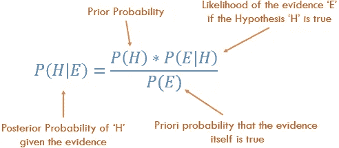

其中`*H*`和`*E*` 是事件，`*P(H|E)*` 是事件`*H*`发生的条件概率，假设事件`*E*` 已经发生。方程中的概率`*P(H)*`基本是频率分析；给定我们的 ***先验*** *数据*事件发生的概率是多少。等式中的`*P(E|H)*`被称为 ***可能性*** ，本质上是证据是正确的概率，给出了来自频率分析的信息。`*P(E)*` 是实际**证据**为真的概率。

让`*H*` 代表我们卖冰淇淋的事件，而`*E*`代表天气的事件。然后我们可能会问*在给定的天气类型下，某一天卖出冰淇淋的可能性有多大？*数学上，这被写成`P(H=ice cream sale | E= type of weather)`，相当于等式的左侧。`*P(H)*`右手边是被称为**先验**的表达式，因为我们可能已经知道冰淇淋销售的边际概率**。**在我们的例子中，这是`*P(H = ice cream sale)*`，也就是说，不管外面的天气如何，都有可能卖出冰淇淋。例如，我可以查看这样的数据:潜在的 100 人中有 30 人实际上在某个地方的某个商店购买了冰淇淋。所以我的`*P(H = ice cream sale) = 30/100 = 0.3,*` *先于我对天气*的任何了解。这就是贝叶斯定理允许我们整合先验信息的方式[2]。

贝叶斯定理的一个经典应用是在临床试验的解释中。假设在一次常规体检中，你的医生告诉你，你的一种罕见疾病检测呈阳性。你也知道这些测试的结果有一些不确定性。假设我们对于 95%的患病患者有一个**灵敏度**(也称为**真阳性率)**结果，对于 95%的健康患者有一个**特异性**(也称为**真阴性率**)结果。

如果我们让“+”和“-”分别表示阳性和阴性测试结果，那么测试精度就是条件概率:`*P*(+|disease) *= 0.95, P*(-|healthy) *= 0.95,*`

在贝叶斯术语中，我们希望计算给定阳性测试的疾病概率，`*P*(disease|+)`。

```
*P*(disease|+) *=  P(*+|disease)** P*(disease)*/P*(+)
```

**如何评价** `*P(+)*` **，所有阳性病例？我们必须考虑两种可能性，`*P*(+|disease)` 和`*P*(+|healthy)`。假阳性的概率`*P*(+|healthy)`是`*P*(-|healthy).` 的补码，因此是 `*P*(+|healthy) = 0.05`。**

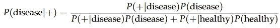

重要的是，贝叶斯定理揭示，为了计算假设检测结果为阳性时你患病的条件概率，你需要知道你患病的“先验”概率`*P*(disease)`，假设没有任何信息。也就是说，你需要知道该疾病在你所属人群中的总体发病率。假设这些测试应用于实际发现患病人数为 0.5%的人群，`*P*(disease)*= 0.005*`即`*P*(healthy) *= 0.995*` *。*

所以，`*P(disease|+) = 0.95 * 0.005 /(0.95 * 0.005 + 0.05 * 0.995) = 0.088*`

换句话说，尽管测试看起来很可靠，但你实际患病的概率仍低于 9%。得到阳性结果会增加你患病的可能性。但是把 95 %的检测准确率解释为你有患病的概率是不正确的。

# 描述统计学

描述性统计是指总结和组织数据集中信息的方法。我们将使用下表来描述一些统计概念[4]。

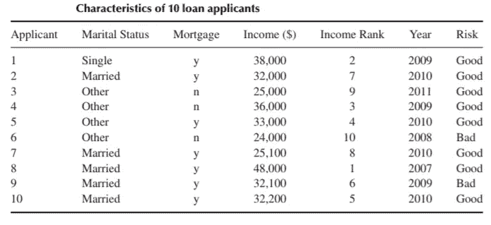

**元素**:为其收集信息的实体称为元素。在上表中，元素是 10 个申请者。元素也称为案例或主题。

**变量**:一个元素的特性称为变量。它可以为不同的元素取不同的值，例如婚姻状况、抵押贷款、收入、级别、年份和风险。变量也称为属性。

变量可以是**定性**或**定量**。

**定性:**一个定性变量能够使元素根据某种特征被分类或归类。定性变量为`marital status`、`mortgage`、`rank`和`risk`。定性变量也称为**分类**变量。

**定量:**定量变量接受数值，并允许对其进行有意义的运算。定量变量是`income`和`year`。定量变量也叫**数值**变量。

**离散变量**:一个可以取有限个或可计数个值的数值变量是一个离散变量，每个值可以用图形表示为一个单独的点，每个点之间有空格。`‘year’`是离散变量的一个例子..

**连续变量**:可以取无穷多个值的数值变量是连续变量，其可能的值在数轴上形成一个区间，点与点之间没有空格。`‘income’`是连续变量的一个例子。

群体:群体是对特定问题感兴趣的所有元素的集合。参数是总体的特征。

**样本**:样本由总体的一个子集组成。样本的特征称为统计量。

**随机抽样**:当我们抽取一个每个元素都有同等机会被选中的样本。

## 中心测量:平均值、中间值、众数、中间范围

> 指出数据的中心部分在数字线上的位置。

## 平均

平均值是数据集的算术平均值。要计算平均值，请将这些值相加，然后除以值的个数。样本平均值是样本的算术平均值，用 x̄表示(“x-bar”)。总体平均值是总体的算术平均值，用𝜇表示(“myu”，m 的希腊语字母)。

## 中位数

中值是中间的数据值，当有奇数个数据值并且数据已经按升序排序时。如果是偶数，则中位数是两个中间数据值的平均值。当收入数据按升序排序时，两个中间值分别为$32，100 和$32，200，其平均值为收入中位数$32，150。

## 方式

众数是出现频率最高的数据值。数量和类别变量都可以有模式，但只有数量变量可以有均值或中位数。每个收入值只出现一次，所以没有模式。年的模式是 2010 年，频率为 4。

## 中档

中间值是数据集中最大值和最小值的平均值。中档收入是:

```
mid-range(income) = (max(income) + min(income))/2 = (48000 + 24000)/2 = $36000
```

## 可变性的度量:范围、方差、标准差

> 量化数据中存在的变异、扩散或分散的数量。

## 范围

变量的范围等于最大值和最小值之差。收入范围是:

```
range(income) = max (income) − min (income) = 48,000 − 24,000 =$24000
```

范围只反映了最大和最小观察值之间的差异，但它未能反映数据是如何集中的。

## 差异

总体方差被定义为平均值的方差的平均值，表示为`𝜎*²*`(“sigma-squared”):

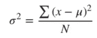

方差越大，意味着数据越分散。

样本方差`s*²*`大约是方差平方的平均值，用`n-1`代替`N`。出现这种差异是因为样本均值被用作真实总体均值的近似值。

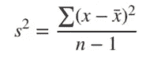

## 标准偏差

一组数字的*标准差*或`sd` 告诉你单个数字与平均值的差异有多大。

样本标准差是样本方差的平方根:`sd = √ s*²*`。例如，收入偏离均值 7201 美元。

总体标准差是总体方差的平方根: `sd= √ 𝜎*²*`。

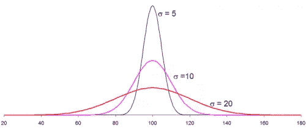

Three different data distributions with same mean (100) and different standard deviation (5,10,20)

标准差越小，峰越窄，数据点越接近平均值。数据点离平均值越远，标准差越大。

## 位置测量:百分位数、Z 分数、四分位数

> 指示特定数据值在数据分布中的相对位置。

## 百分位

数据集的第 p 个百分位数是这样的数据值，即数据集中 p 个百分比的值等于或低于该值。第 50 百分位是中间值。例如，收入中值为 32，150 美元，50%的数据值等于或低于该值。

## 百分等级

数据值的百分位等级等于数据集中等于或低于该值的值的百分比。例如，百分位数排名。申请人 1 的 38，000 美元的收入的 90%，因为这是等于或小于 38，000 美元的收入的百分比。

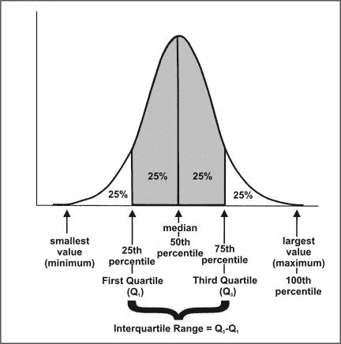

## 四分位数间距(IQR)

第一个四分位数(Q1)是数据集的第 25 个百分位数；第二个四分位数(Q2)是第 50 个百分位数(中位数)；第三个四分位数(Q3)是第 75 个百分位数。

**IQR** 使用公式测量第 75 次和第 25 次观测之间的差异:IQR = Q3 Q1。

数据值 x 是异常值，如果`x ≤ Q1 − 1.5(IQR), or x ≥ Q3 + 1.5(IQR).`

## z 分数

特定数据值的Z 值代表该数据值高于或低于平均值的标准偏差。

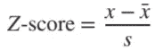

所以，如果 z 是正的，就意味着这个值高于平均值。对于申请人 6，Z 得分为(24，000-32，540)/7201 ≈- 1.2，这意味着申请人 6 的收入低于平均值 1.2 个标准差。

## 单变量描述统计

描述单变量数据模式的不同方式包括集中趋势:均值、众数和中位数，分散:范围、方差、最大值、最小值、四分位数和标准差。

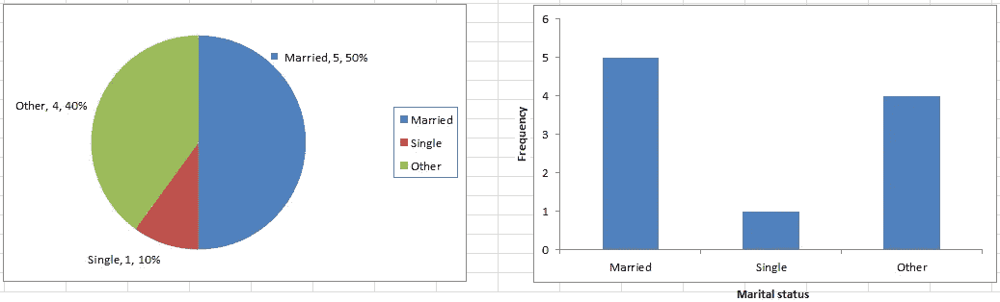

Pie chart [left] & Bar chart [right] of Marital status from loan applicants table.

用于显示单变量数据的各种图表通常是条形图、直方图、饼图。等等。

## 双变量描述统计

双变量分析涉及两个变量的分析，目的是确定它们之间的经验关系。用于显示双变量数据的各种图通常为散点图、箱线图*。*

## 散点图

可视化两个定量变量 x 和 y 之间关系的最简单方法。对于两个连续变量来说，*散点图*是常见的图形。每个(x，y)点被绘制在笛卡尔平面上，x 轴在水平方向，y 轴在垂直方向。散点图有时被称为相关图，因为它们显示两个变量是如何相关的。

## 相互关系

相关性是一种旨在量化两个变量之间关系强度的统计数据。**相关系数** `r`量化两个量化变量之间线性关系的强度和方向。相关系数定义为:

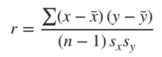

其中`sx`和`sy`分别代表 x 变量和 y 变量的标准偏差。`−1 ≤ r ≤ 1`。

> 如果 r 为正且显著，我们说 x 和 y**正相关**。x 的增加与 y 的增加相关联。
> 
> 如果 r 为负且显著，我们说 x 和 y**负相关**。x 的增加与 y 的减少有关。

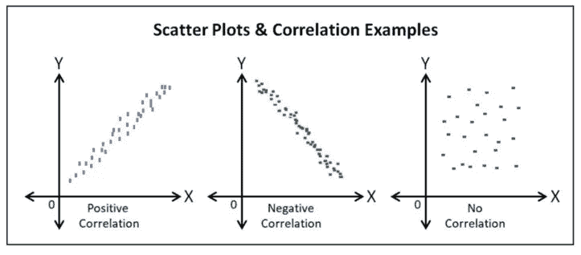

Positive correlation (r > 0), Negative correlation (r < 0), No correlation (r = 0)

## 箱线图

盒状图也称为盒须图，用于描绘值的分布。当一个变量是分类变量而另一个是连续变量时，通常使用箱线图*。*使用盒状图时，将数据值分成四个部分，称为四分位数。你从寻找中间值开始。中位数将数据值分成两半。找到每一半的中间值会将数据值分成四个部分，即四分位数。

图上的每个框都显示了从框底部下半部分的中值到框顶部上半部分的中值的范围。方框中间的一条线出现在所有数据值的中值**处。然后**触须**指向数据中的最大值和最小值。**

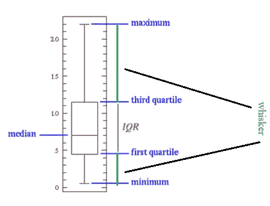

数据集的五位数摘要由`minimum`、`Q1`、`median`、`Q3`和`maximum`组成。

> 箱线图对于指示分布是否偏斜以及数据集中是否存在潜在的异常观察值(异常值)特别有用。

左边的须状物向下延伸到最小值，该最小值不是异常值。右边的须状物延伸到不是异常值的最大值。当左须比右须长时，则分布是左偏的，反之亦然。当晶须长度大致相等时，分布是对称的。

## 结论

概率和统计的基本概念是任何对机器学习感兴趣的人必须具备的。我简要介绍了机器学习中最常用的一些基本概念。我希望你喜欢这篇文章，并学到一些新的有用的东西。

感谢您的阅读。

## 参考

[1][http://greenteapress.com/thinkstats/thinkstats.pdf](http://greenteapress.com/thinkstats/thinkstats.pdf)

[2][https://seeing-theory . brown . edu/basic-probability/index . html](https://seeing-theory.brown.edu/basic-probability/index.html)

[3][https://towards data science . com/probability-concepts-explained-Bayesian-inference-for-parameter-estimation-90e 8930 e 5348](/probability-concepts-explained-bayesian-inference-for-parameter-estimation-90e8930e5348)

[4][https://online library . Wiley . com/doi/pdf/10.1002/9781118874059 . app 1](https://onlinelibrary.wiley.com/doi/pdf/10.1002/9781118874059.app1)

[5][https://medium . com/analytics-vid hya/descriptive-statistics-for-data-science-2f 304 a 36 AC 34](https://medium.com/analytics-vidhya/descriptive-statistics-for-data-science-2f304a36ac34)