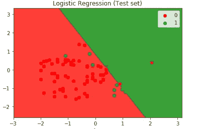
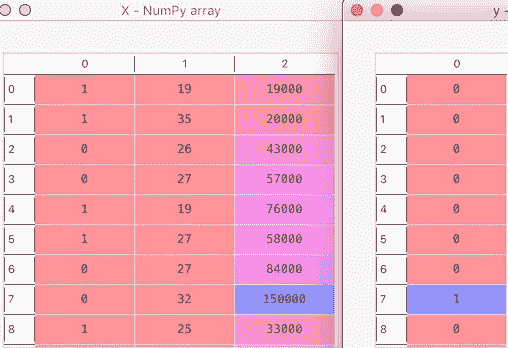
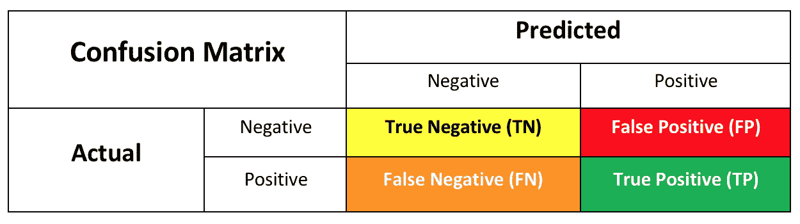

# 机器学习项目 10 —预测哪些客户购买了 iPhone

> 原文：<https://towardsdatascience.com/machine-learning-project-10-predict-which-customers-bought-an-iphone-ea7b153db676?source=collection_archive---------12----------------------->


iPhone Sales prediction — source pixabay.com

到目前为止，我们已经完成了 9 个项目，涵盖了不同类型的回归。

**# 100 daysofml code # 100 projects inml**

回归包括预测连续的输出变量或数量。

回归预测建模的示例包括:

*   根据员工的工作经验预测其工资。
*   根据城市和卧室数量预测房价。
*   给定营销预算，预测企业的销售额。

现在，有一组不同的问题需要我们将输出变量分成两个或更多的标签或类别。我们需要预测给定观察的标签或类别。

这些被称为分类预测建模。例子包括:

*   将电子邮件标记为垃圾邮件。
*   预测顾客是否会购买。
*   预测一个人是否会得糖尿病。

以上是二元分类问题的例子。

我们也可能有多标签或多类分类问题。在多类问题中，类是互斥的。输出变量可以被分类成任何一类。例如，一部电影可以被归类为 PG 13 或成人，但不能两者都是。

在多标签问题中，输出变量可以在多个标签下分类。回到我们的电影例子，一部电影可以分为“推理片”和“言情片”。我们将在未来的项目中更详细地讨论这些主题。

让我们从第一个分类问题开始，我们将使用逻辑回归。它被称为逻辑回归，因为它通过画一条直线将输出分成两类，如下所示



# 项目目标

让我们看看数据集。有趣的是，我们假设这些是购买或未购买 iPhone 的客户的记录。示例行如下所示。完整的数据集可以在[这里](https://github.com/omairaasim/machine_learning/tree/master/project_10_logistic_regression)访问。

我们在这个项目中的目标是，在给定客户的性别、年龄和工资的情况下，预测他们是否会购买 iPhone。

# 步骤 1:加载数据集

x 将包含所有 3 个独立变量“性别”、“年龄”和“工资”

y 将包含因变量“购买的 iPhone”

# 步骤 2:将性别转换为数字

对于大多数机器学习算法，我们必须将分类变量转换为数字。这里我们有一个必须转换的“性别”字段。

我们将使用 LabelEncoder 类将性别转换为数字

让我们看看我们的 X 和 y:



# 步骤 3:将数据分成训练集和测试集

# 步骤 4:特征缩放

对于逻辑回归算法，我们必须进行特征缩放。为此，我们将使用标准定标器

# 步骤 5:拟合逻辑回归

我们将使用 sklearn linear_model 库中的 LogisticRegression 类。当我们创建这个类的对象时，它需要很多参数。其中之一是“求解器”，它指定在优化问题中使用哪种算法。

文件指出:

> 对于小型数据集，“liblinear”是一个不错的选择，而“sag”和“saga”对于大型数据集更快。
> 
> 对于多类问题，只有‘Newton-CG’，‘sag’，‘saga’和‘lbfgs’处理多项式损失；“liblinear”仅限于一对多方案。
> 
> 牛顿-cg、lbfgs 和 sag 只处理 L2 惩罚，而 liblinear 和 saga 处理 L1 惩罚。

由于这是一个小数据集，我选择了“liblinear”

# 第六步:做预测

# 步骤 7:检查预测的准确性

在分类问题中，我们可以使用混淆矩阵来比较预测结果和实际结果。

**混淆矩阵:**它会告诉我们正确和错误条目的数量。



让我们花一分钟来分析这个矩阵。这告诉我们什么？

*   如果一个人没有购买 iPhone，预测值也说他们没有购买——这是真负值(TN ),即实际值是 0，预测值也是 0。
*   如果一个人没有购买 iPhone，但预测值显示他们购买了——这是误报(FP ),即实际值为 0，预测值为 1。
*   如果一个人已经购买了一部 iPhone，但预测值显示他们没有购买——这是假阴性(FN ),即实际值为 1，预测值为 0。
*   如果一个人买了一部 iPhone，预测值也说他们买了——这是真正的(TP ),即实际值是 1，预测值也是 1。

**准确性得分**:这是用于检查模型准确性的最常见的度量。它是正确预测总数占预测总数的百分比。

> 准确率得分= (TP + TN) / (TP + TN + FP + FN)

**回忆分数**:是我们正确预测的正面事件的百分比。

> 召回分数= TP / (TP + FN)

**Precision Score:** 是预测的阳性事件实际为阳性的百分比。

> 精度= TP / (TP + FP)

```
[[65 3]
 [ 6 26]]
Accuracy score: 0.91
Precision score: 0.896551724137931
Recall score: 0.8125
```

我们获得了 91%的准确率，这已经很不错了。

让我们根据上面的公式手动计算分数。

混淆矩阵

*   TN = 65
*   FP = 3
*   FN = 6
*   TP = 26

我们可以从上面的矩阵中看到，我们只得到 9 个错误的预测。

```
Accuracy Score = (TP + TN) / (TP + TN + FP + FN)Accuracy Score =(26 + 65)/ (26 + 65 + 3 + 6)Accuracy Score =91/100 = 0.91 = 91%
```

```
Recall Score = TP / (TP + FN)Recall Score =26/ (26 + 6)Recall Score =26/32 = 0.8125 = 81.25%
```

```
Precision = TP / (TP + FP)Precision = 26/ (26 + 3)Precision = 26/29 = 0.8965 = 89.65%
```

# 第八步:做出新的预测

你能做出以下预测吗——他们是否会购买 iPhone？

*   21 岁男性，年薪 4 万美元
*   21 岁男性，年薪 8 万美元
*   女性，21 岁，收入 4 万美元
*   女性，21 岁，年薪 8 万美元
*   41 岁男性，年薪 4 万美元
*   41 岁男性，年薪 8 万美元
*   41 岁女性，年薪 4 万美元
*   41 岁女性，年薪 8 万美元

让我知道你得到了什么预测。完整源代码是[这里](https://github.com/omairaasim/machine_learning/tree/master/project_10_logistic_regression)。

希望你喜欢这个项目——祝你好运