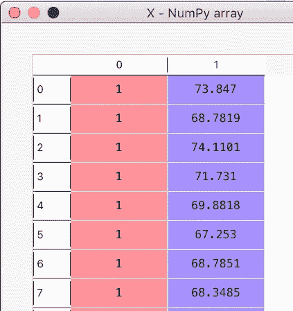
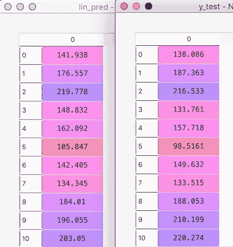

# 机器学习项目 9——根据身高和性别预测体重

> 原文：<https://towardsdatascience.com/machine-learning-project-9-predict-weight-based-on-height-and-gender-9ed47285bcbb?source=collection_archive---------11----------------------->


source: pexels.com

今天我将处理这个 [Kaggle 数据集](https://www.kaggle.com/mustafaali96/weight-height)。这个数据集有 10，000 行，提供了人的体重、身高和性别。我们必须在这个数据集上建立和训练一个模型，这样它就可以根据一个人的性别和身高来预测他的体重。这是我们从事的第一个拥有大型数据集的项目。所以这将会很有趣。

**# 100 daysofml code # 100 projectsinml**

让我们开始吧。

# 步骤 1:加载数据集

首先，我们将加载数据集。下面是样本数据集——完整的数据文件可以在[这里](https://github.com/omairaasim/machine_learning/tree/master/project_9_predict_weight_sex)找到。

# 第二步:分析数据

数据集包含 3 列，即“性别”、“身高”和“体重”。

高度以英寸为单位，重量以磅为单位。

我们来分析一下数据。

*   **dataset.info():**

这个方法返回下面的输出。它基本上显示了条目的数量、列名和列类型。下面是该命令的输出。

```
<class ‘pandas.core.frame.DataFrame’>
RangeIndex: 10000 entries, 0 to 9999
Data columns (total 3 columns):
Gender 10000 non-null object
Height 10000 non-null float64
Weight 10000 non-null float64
dtypes: float64(2), object(1)
memory usage: 234.5+ KB
```

*   **dataset.describe():**

描述方法显示数据集数值的基本统计信息，如平均值、标准差、百分位数、最小值和最大值。

例如:对于高度，我们可以看到平均值为 66.36 英寸，最小高度为 54.26 英寸，最大高度为 78.99 英寸。

同样，平均体重为 161.44 磅，最小体重为 64.7 磅，最大体重为 269.98 磅。

下面是该命令的输出。

```
 Height       Weight
count    10000.000000 10000.000000
mean        66.367560   161.440357
std          3.847528    32.108439
min         54.263133    64.700127
25%         63.505620   135.818051
50%         66.318070   161.212928
75%         69.174262   187.169525
max         78.998742   269.989699
```

*   **dataset.isnull()。sum()**

这个方法主要用于检查数据集中是否有空值。这将在每一列中列出空值的数量

下面是该命令的输出。我们可以看到，这 3 列中没有空值。

```
Gender 0
Height 0
Weight 0
dtype: int64
```

# 步骤 3:将性别转换为数字

在运行任何机器学习模型之前，我们必须将所有分类值(文本值)转换为数值。在我们的数据集中，我们可以看到我们有一个字段——“性别”，这是分类。所以我们必须把这个场转换成数值。

将分类值转换为数字的典型方法是使用 LabelEncoder 类将文本转换为数字，然后使用 OneHotEncoder 添加虚拟变量。我们在我们的[项目 2](https://medium.com/@omairaasim/machine-learning-project-2-predict-profit-using-multiple-linear-regression-10e736d8bba5) 中做到了这一点。

但这仅在分类字段包含 2 个以上的值时有用，例如，假设我们有一个名为“城市”的字段，它包含 2 个以上的值，如“休斯顿”、“纽约”和“旧金山”。

在这种情况下，我们将首先使用 LabelEncoder 将城市转换为数字，如:" Houston" => 0 和" New York" => 1 和" San Francisco" => 2。

然后，我们将使用 OneHotEncoder 添加 3 个虚拟变量，每个城市一个。最后，我们将删除一个哑变量以避免哑变量陷阱。

> 经验法则是——如果一个分类字段有 *k* 个值，那么你将需要 *k-1* 个虚拟变量。

现在在我们的例子中，我们的“性别”字段只包含 2 个值——“男性”和“女性”。当我们使用 LabelEncoder 时，它会转换 say "Male" =>0 和" Female" => 1。因为它只包含 2 个值，所以我们没有必要使用 OneHotEncoder 和添加虚拟变量。如果我们使用 OneHotEncoder，它将最终添加 2 个伪变量，但我们将最终删除 1 个以避免伪陷阱。所以做了也没什么意义。

因此，如果一个分类字段有两个值，我们有两种方法。

*   **使用标签编码器**

*   **直接在数据框中替换**

不使用 LabelEncoder，我们可以直接在数据帧中用 0 替换男性，用 1 替换女性，如下所示:

在这两种情况下，性别将被转换为男性 0 和女性 1，如下面 x 的屏幕截图所示。



# 步骤 4:将数据集分成训练集和测试集

我们将使用 80%的数据进行训练，20%的数据进行测试。

# 步骤 5:拟合回归模型

我们将使用线性回归来训练我们的模型。

# 步骤 6:预测测试集值

让我们比较一下预测值(lin_pred)和实际值(y_test)。我们可以看到我们的模型做得相当好。



# 第七步:模型准确性

我们可以检查几个指标，看看我们的模型表现如何。其中之一是 R 的平方。

我们可以看到，我们的 R 平方显示出几乎 90%的精度，这很好。我们将在未来的项目中探索均方误差和平均绝对误差。

```
R square = 0.9052889824534557
Mean squared Error = 97.87152220196164
Mean absolute Error = 7.955916525326746 R square = 0.9052889824534557
Mean squared Error = 97.87152220196164
Mean absolute Error = 7.955916525326746
```

# 第八步:预测我的体重

让我们看看这个模型在预测我的体重方面做得有多好。我身高 6 英尺 2 英寸，也就是 74 英寸。

```
My predicted weight = [197.2481918]
```

我只能说这不准确:)—也许我只是一个离群值—离群值是我们改天再讨论的另一个话题。

我很享受这个项目的建设。寻找我接下来要解决的下一个具有挑战性的项目。

源代码可以在[这里](https://github.com/omairaasim/machine_learning/tree/master/project_9_predict_weight_sex)找到。