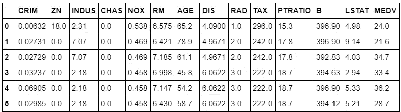
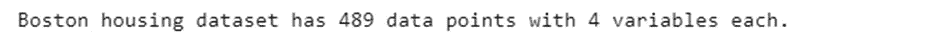

# 机器学习项目:用回归预测波士顿房价

> 原文：<https://towardsdatascience.com/machine-learning-project-predicting-boston-house-prices-with-regression-b4e47493633d?source=collection_archive---------0----------------------->


Picture from [Unsplash](https://unsplash.com/photos/_TPTXZd9mOo)

# **简介**

在这个项目中，我们将开发和评估一个模型的性能和预测能力，该模型根据从波士顿郊区的房屋收集的数据进行训练和测试。

一旦我们得到一个很好的拟合，我们将使用这个模型来预测位于波士顿地区的房子的货币价值。

像这样的模型对于真正的国家代理人来说是非常有价值的，他们可以利用日常提供的信息。

你可以在[我的 GitHub 页面](https://github.com/rromanss23/Machine_Leaning_Engineer_Udacity_NanoDegree/tree/master/projects/boston_housing)上找到完整的项目、文档和数据集:

[https://github . com/rromans 23/Machine _ learning _ Engineer _ uda city _ nano degree/tree/master/projects/Boston _ housing](https://github.com/rromanss23/Machine_Leaning_Engineer_Udacity_NanoDegree/tree/master/projects/boston_housing)

# **获取数据和前期预处理**

本项目中使用的数据集来自 UCI 机器学习知识库。这些数据是在 1978 年收集的，506 个条目中的每一个都代表了波士顿各郊区房屋的 14 个特征的综合信息。

这些特征可以概括如下:

*   CRIM:这是每个城镇的人均犯罪率
*   ZN:这是面积大于 25，000 平方英尺的住宅用地的比例
*   印度河:这是每个城镇非零售商业英亩数的比例。
*   CHAS:这是查尔斯河虚拟变量(如果区域边界为河流，则等于 1；否则为 0)
*   氮氧化物:这是氮氧化物的浓度(百万分之一)
*   RM:这是每个住宅的平均房间数
*   年龄:这是 1940 年以前建造的自有住房的比例
*   DIS:这是到五个波士顿就业中心的加权距离
*   拉德:这是放射状公路的可达性指数
*   税收:这是每 1 万美元的全价值财产税税率
*   PTRATIO:这是各城镇的师生比率
*   b:这是按 1000(Bk — 0.63)计算的，其中 Bk 是各城镇非裔美国人的比例
*   LSTAT:这是人口中地位较低的百分比
*   MEDV:这是以千美元为单位的自有住房的中值

这是原始数据集及其原始特征的概述:



出于项目的目的，数据集已经过如下预处理:

*   该项目的基本特征是:“RM”、“LSTAT”、“PTRATIO”和“MEDV”。其余特征已被排除。
*   “MEDV”值为 50.0 的 16 个数据点已被删除。因为它们可能包含被审查或丢失的值。
*   1 个“RM”值为 8.78 的数据点，它被视为异常值，为了模型的最佳性能，已将其删除。
*   由于该数据已经过时,“MEDV”值已被放大，以解释 35 年的市场通胀。

我们现在将打开一个 python 3 Jupyter 笔记本，并执行以下代码片段来加载数据集并删除不重要的特性。如果正确执行了操作，将收到一条成功消息。

因为我们的目标是开发一个能够预测房屋价值的模型，所以我们将数据集分为要素和目标变量。并将它们分别存储在功能和价格变量中

*   特征“RM”、“LSTAT”和“PTRATIO”为我们提供了每个数据点的定量信息。我们将它们存储在*特性*中。
*   目标变量“MEDV”将是我们试图预测的变量。我们将把它储存在*价格*中。

```
***# Import libraries necessary for this project***
import numpy as np
import pandas as pd
from sklearn.model_selection import ShuffleSplit

***# Import supplementary visualizations code visuals.py***
import visuals as vs

***# Pretty display for notebooks***
%matplotlib inline

***# Load the Boston housing dataset***
data = pd.read_csv('housing.csv')
prices = data['MEDV']
features = data.drop('MEDV', axis = 1)

***# Success***
print("Boston housing dataset has **{}** data points with **{}** variables each.".format(*data.shape))
```



# **数据探索**

在项目的第一部分，我们将对数据集进行探索性分析，并提供一些观察结果。

**计算统计数据**

```
***# Minimum price of the data***
minimum_price = np.amin(prices)
 ***# Maximum price of the data***
maximum_price = np.amax(prices)

***# Mean price of the data***
mean_price = np.mean(prices)

***# Median price of the data***
median_price = np.median(prices)

***# Standard deviation of prices of the data***
std_price = np.std(prices)

***# Show the calculated statistics***
print("Statistics for Boston housing dataset:**\n**")
print("Minimum price: $**{}**".format(minimum_price)) 
print("Maximum price: $**{}**".format(maximum_price))
print("Mean price: $**{}**".format(mean_price))
print("Median price $**{}**".format(median_price))
print("Standard deviation of prices: $**{}**".format(std_price))
```


# 特征观察

数据科学是对数据做出一些假设和假说，并通过执行一些任务来检验它们的过程。最初，我们可以对每个特性做出以下直观假设:

*   房间越多(RM 值越高)的房子价值越高。通常房间多的房子更大，能容纳更多的人，所以花更多的钱是合理的。它们是成正比的变量。
*   低阶层工人较多的街区(LSTAT 值较高)价值较低。如果较低的工人阶级的比例较高，很可能他们有较低的购买力，因此，他们的房子会更便宜。它们是成反比的变量。
*   学生与教师比率较高(PTRATIO 值较高)的街区价值较低。如果学生与教师的比例更高，很可能附近的学校更少，这可能是因为税收收入更少，这可能是因为附近的人挣钱更少。如果人们挣的钱少了，他们的房子很可能会贬值。它们是成反比的变量。

我们将通过这个项目来验证这些假设是否正确。

# **探索性数据分析**

**散点图和直方图**

我们将从创建散点图矩阵开始，这将允许我们可视化不同特征之间的成对关系和相关性。

快速浏览一下数据是如何分布的以及它是否包含异常值也是非常有用的。

```
import matplotlib.pyplot as plt
import seaborn as sns%matplotlib inline***# Calculate and show pairplot***
sns.pairplot(data, size=2.5)
plt.tight_layout()
```


我们可以发现“RM”和房价“MEDV”之间的线性关系。此外，我们可以从直方图中推断出“MEDV”变量似乎呈正态分布，但包含几个异常值。

**相关矩阵**

我们现在将创建一个关联矩阵，以量化和总结变量之间的关系。

此相关矩阵与协方差矩阵密切相关，事实上，它是协方差矩阵的重新缩放版本，通过标准化要素计算得出。

它是一个包含人的 r 相关系数的方阵(列数和行数相同)。

```
***# Calculate and show correlation matrix***
cm = np.corrcoef(data.values.T)
sns.set(font_scale=1.5)
hm = sns.heatmap(cm,
                cbar=True,
                annot=True,
                square=True,
                fmt='.2f',
                annot_kws={'size': 15},
                yticklabels=cols,
                xticklabels=cols)
```


为了拟合回归模型，感兴趣的特征是与目标变量“MEDV”高度相关的特征。从前面的相关矩阵中，我们可以看到，对于我们选择的变量，这个条件是实现的。

# **开发模型**

在项目的第二部分，我们将开发模型进行预测所需的工具和技术。通过使用这些工具和技术，能够对每个模型的性能做出准确的评估，有助于大大增强预测的可信度。

**定义性能指标**

如果不量化一个给定模型在训练和测试中的表现，就很难衡量它的质量。这通常是使用某种类型的性能度量来完成的，无论是通过计算某种类型的误差、拟合优度，还是其他一些有用的度量。

对于本项目，我们将计算*决定系数*，R，以量化模型的性能。模型的决定系数在回归分析中是一个有用的统计数据，因为它通常描述了该模型在进行预测方面有多“好”。

R 的值范围从 0 到 1，它捕获目标变量的预测值和实际值之间的平方相关的百分比。

*   R 为 0 的模型并不比总是预测目标变量的*均值*的模型更好。
*   而 R 为 1 的模型完美地预测了目标变量。
*   0 到 1 之间的任何值表示使用该模型，目标变量的百分比可以由特征来解释。

*也可以给模型一个负 R2，这表明该模型比总是预测目标变量均值的模型更差。*

```
***# Import 'r2_score'***

from sklearn.metrics import r2_score

def performance_metric(y_true, y_predict):
    ***"""*** *Calculates and returns the performance score between* 
 *true (y_true) and predicted (y_predict) values based on the metric chosen.* ***"""***

    score = r2_score(y_true, y_predict)

    ***# Return the score***
    return score
```

**混洗和分割数据**

在本节中，我们将采用波士顿住房数据集，并将数据分成训练和测试子集。通常，在创建训练和测试子集时，还会将数据打乱成随机顺序，以消除数据集排序中的任何偏差。

```
***# Import 'train_test_split'***
from sklearn.model_selection import train_test_split

***# Shuffle and split the data into training and testing subsets***
X_train, X_test, y_train, y_test = train_test_split(features, prices, test_size=0.2, random_state = 42)

***# Success***
print("Training and testing split was successful.")
```


**培训和测试**

你现在可能会问:

对于学习算法来说，将数据集分割成一定比例的训练和测试子集有什么好处？

一旦我们的模型经过训练，对它进行评估是很有用的。我们想知道它是否从数据的训练分割中正确地学习了。可能有 3 种不同的情况:

1)模型没有很好地学习数据，甚至不能预测训练集的结果，这被称为欠拟合，这是由于高偏差引起的。

2)模型对训练数据学习得太好，以至于它已经记住了它，而不能对新数据进行推广，这称为过拟合，这是由于高方差造成的。

3)该模型刚好在偏差和方差之间具有正确的平衡，它学习得很好，并且能够正确预测新数据的结果。

# **分析模型性能**

在这个项目的第三部分，我们将看看几个模型在各种训练数据子集上的学习和测试性能。

此外，我们将在完整的训练集上研究一个具有递增的`'max_depth'`参数的特定算法，以观察模型复杂性如何影响性能。

根据不同的标准绘制模型的性能在分析过程中可能是有益的，例如可视化仅从结果中可能不明显的行为。

**学习曲线**

下面的代码单元为具有不同最大深度的决策树模型生成了四个图形。随着训练集大小的增加，每个图都可视化了训练和测试模型的学习曲线。

请注意，学习曲线的阴影区域表示该曲线的不确定性(以标准差衡量)。使用 R2(决定系数)对训练集和测试集的模型进行评分。

```
***# Produce learning curves for varying training set sizes and maximum depths***
vs.ModelLearning(features, prices)
```


**学习数据**

如果我们仔细观察最大深度为 3:

*   随着训练点数的增加，训练分数降低。相反，考试分数会增加。
*   由于两个分数(训练和测试)趋于收敛，从 300 点阈值开始，具有更多的训练点将不会有益于模型。
*   一般来说，每个观察值的列越多，我们将获得更多的信息，模型将能够更好地从数据集中学习，从而做出更好的预测。

**复杂性曲线**

下面的代码单元格为决策树模型生成一个图表，该模型已使用不同的最大深度对定型数据进行了定型和验证。该图产生了两条复杂性曲线——一条用于训练，一条用于验证。

与**学习曲线**类似，两条复杂性曲线的阴影区域表示这些曲线中的不确定性，并且使用`performance_metric`函数在训练集和验证集上对模型进行评分。

```
*# Produce complexity curve for varying training set sizes and maximum depths*
vs.ModelComplexity(X_train, y_train)
```


**偏差-方差权衡**

如果我们分析偏差方差如何随最大深度变化，我们可以推断:

*   在最大深度为 1 的情况下，图形显示模型在训练和测试数据中都没有返回好的分数，这是拟合不足的症状，因此偏差较大。为了提高性能，我们应该增加模型的复杂性，在这种情况下，增加 max_depth 超参数以获得更好的结果。
*   在最大深度为 10 的情况下，该图显示模型从训练数据(得分接近 1)中学习得非常好，并且在测试数据上返回的结果也很差，这是过度拟合的指示，不能对新数据进行很好的概括。这是一个方差很大的问题。为了提高性能，我们应该降低模型的复杂性，在这种情况下，降低 max_depth 超参数以获得更好的结果。

**最佳猜测最优模型**

从复杂度曲线中，我们可以推断出模型的最佳最大深度是 4，因为它是产生最佳验证分数的深度。

此外，对于更深的深度，虽然训练分数增加，但验证分数倾向于降低，这是过度拟合的迹象。

# 评估模型的性能

在项目的最后一部分，我们将构建一个模型，并使用`fit_model`中的优化模型对客户的功能集进行预测。

**网格搜索**

网格搜索技术从由 param_grid 参数指定的参数值网格中详尽地生成候选项，param _ grid 参数是具有要评估的超参数值的字典。一个例子可以是:

```
param_grid = [ {‘C’: [1, 10, 100, 1000], ‘kernel’: [‘linear’]}, {‘C’: [1, 10, 100, 1000], ‘gamma’: [0.001, 0.0001], ‘kernel’: [‘rbf’]}, ]
```

在本例中，应研究两个网格:一个网格具有线性核，C 值为[1，10，100，1000]，第二个网格具有 RBF 核，C 值的叉积范围为[1，10，100，1000]，gamma 值为[0.001，0.0001]。

在数据集上拟合时，会评估参数值的所有可能组合，并保留最佳组合。

# 交叉验证

K-fold 交叉验证是一种技术，用于确保我们的模型得到良好的训练，而不使用测试集。它包括将数据分成 k 个大小相等分区。对于每个分区 I，我们在剩余的 k-1 个参数上训练模型，并在分区 I 上对其进行评估。最终得分是所获得的 K 个得分的平均值。

在评估估计量的不同超参数时，仍然存在过度拟合测试集的风险，因为可以调整参数，直到估计量达到最优。这样，关于测试集的知识可以“泄漏”到模型中，并且评估度量不再报告泛化性能。

为了解决这个问题，数据集的另一部分可以被称为“验证集”:在训练集上进行训练，然后在验证集上进行评估，当实验似乎成功时，可以在测试集上进行最终评估。

然而，通过将可用数据划分为三个集合(训练、验证和测试集合)，我们大大减少了可用于学习模型的样本数量，并且得到的模型可能没有得到足够好的训练(欠拟合)。

通过使用 k-fold 验证，我们确保模型使用所有可用于调整模型的训练数据，这可能在计算上是昂贵的，但是允许训练模型，即使只有很少的数据可用。

k-fold 验证的主要目的是获得对新数据的模型泛化的无偏估计。

**拟合模型**

最终的实现要求我们将所有的东西放在一起，并使用**决策树算法训练一个模型。**

为了确保我们正在生成一个优化的模型，我们将使用网格搜索技术来训练该模型，以优化决策树的`'max_depth'`参数。`'max_depth'`参数可以被认为是决策树算法在进行预测之前可以对数据提出多少个问题。

此外，我们会发现您的实现使用了`ShuffleSplit()`作为交叉验证的替代形式(参见`'cv_sets'`变量)。下面的`ShuffleSplit()`实现将创建 10 个(`'n_splits'`)混洗集，对于每个混洗，20% ( `'test_size'`)的数据将被用作*验证集*。

```
***# Import 'make_scorer', 'DecisionTreeRegressor', and 'GridSearchCV'***
from sklearn.tree import DecisionTreeRegressor
from sklearn.metrics import make_scorer
from sklearn.model_selection import GridSearchCV

def fit_model(X, y):
   ** *""" Performs grid search over the 'max_depth' parameter for a* 
 *decision tree regressor trained on the input data [X, y]. """***

    ***# Create cross-validation sets from the training data***
    cv_sets = ShuffleSplit(n_splits = 10, test_size = 0.20, random_state = 0)

    ***# Create a decision tree regressor object***
    regressor = DecisionTreeRegressor()

    ***# Create a dictionary for the parameter 'max_depth' with a range from 1 to 10***
    params = {'max_depth':[1,2,3,4,5,6,7,8,9,10]}

    ***# Transform 'performance_metric' into a scoring function using 'make_scorer'*** 
    scoring_fnc = make_scorer(performance_metric)

    ***# Create the grid search cv object --> GridSearchCV()***
    grid = GridSearchCV(estimator=regressor, param_grid=params, scoring=scoring_fnc, cv=cv_sets)

    ***# Fit the grid search object to the data to compute the optimal model***
    grid = grid.fit(X, y)

    ***# Return the optimal model after fitting the data***
    return grid.best_estimator_
```

**做出预测**

一旦一个模型已经在一组给定的数据上被训练，它现在可以被用来在新的输入数据组上进行预测。

在*决策树回归器*的情况下，模型已经学习了*关于输入数据的最佳问题是什么*，并且可以用目标变量的预测来响应。

我们可以使用这些预测来获取有关目标变量值未知的数据的信息，例如模型未被训练的数据。

**最优模型**

以下代码片段查找返回最佳模型的最大深度。

```
***# Fit the training data to the model using grid search***
reg = fit_model(X_train, y_train)

***# Produce the value for 'max_depth'***
print("Parameter 'max_depth' is **{}** for the optimal model.".format(reg.get_params()['max_depth']))
```


**预测销售价格**

想象一下，我们是波士顿地区的一家房地产代理商，希望使用这种模型来帮助我们的客户对他们想要出售的房屋进行定价。我们从三个客户那里收集了以下信息:


*   我们会建议每个客户以什么价格出售他/她的房子？
*   考虑到各个功能的价值，这些价格是否合理？

为了找到这些问题的答案，我们将执行下面的代码片段并讨论其输出。

```
***# Produce a matrix for client data***
client_data = [[5, 17, 15], *# Client 1*
               [4, 32, 22], *# Client 2*
               [8, 3, 12]]  *# Client 3*

***# Show predictions***
for i, price in enumerate(reg.predict(client_data)):
    print("Predicted selling price for Client {}'s home: ${:,.2f}".format(i+1, price))
```


从项目开始时进行的统计计算中，我们发现了以下信息:

*   最低价格:105000 美元
*   最高价格:1024800 美元
*   平均价格:454342.944 美元
*   中间价 438900 美元
*   价格标准差:165340.277 美元

根据这些值，我们可以得出结论:

*   客户端 3 的销售价格接近百万美元，接近数据集的最大值。这是一个合理的价格，因为它的特点(8 个房间，非常低的贫困水平和低师生比)，房子可能在一个富裕的街区。
*   客户端 2 的销售价格是三个中最低的，鉴于其特性是合理的，因为它接近数据集的最小值。
*   对于客户端 1，我们可以看到它的功能介于后两者之间，因此，它的价格非常接近平均值和中间值。

我们最初对这些特征的假设得到了证实:

*   RM '与因变量'价格'成正比关系。
*   相比之下，“LSTAT”和“PTRATIO”与因变量“PRICES”成反比关系。

**模型的灵敏度**

最优模型不一定是稳健模型。有时，模型要么太复杂，要么太简单，不足以概括新数据。

有时，模型可能使用不适合给定数据结构的学习算法。

其他时候，数据本身可能噪声太大或包含的样本太少，以至于模型无法充分捕捉目标变量，即模型欠拟合。

下面的代码单元格使用不同的训练集和测试集运行`fit_model`函数十次，以查看特定客户端的预测相对于其训练的数据如何变化。

```
vs.PredictTrials(features, prices, fit_model, client_data)
```


我们得到的价格范围接近 70，000 美元，这是一个相当大的偏差，因为它代表了房价中值的大约 17%。

**模型的适用性**

现在，我们使用这些结果来讨论构建的模型是否应该或不应该在现实世界中使用。一些值得回答的问题是:

*   *从 1978 年开始收集的数据与今天的相关性如何？通货膨胀有多重要？*

1978 年收集的数据在当今世界没有多大价值。社会和经济变化很大，通货膨胀对价格有很大影响。

*   数据中的特征是否足以描述一个家庭？你认为像家中设备的质量、建筑面积的平方英尺、是否有游泳池等因素应该考虑进去吗？

考虑的数据集非常有限，有许多特征，如房屋的平方英尺大小，是否有游泳池，以及其他与考虑房价非常相关的特征。

*   模型是否足够稳健，能够做出一致的预测？

考虑到 prince 范围的高方差，我们可以保证它不是一个稳健的模型，因此不适合进行预测。

*   在波士顿这样的城市收集的数据适用于农村吗？

从像波士顿这样的大城市收集的数据不适用于农村城市，因为同等价值的房产价格在城市地区要高得多。

*   *根据整个社区的特点来判断个人住房的价格公平吗？*

总的来说，根据整个社区的特点来估计或预测一个人的房价是不公平的。在同一个街区，价格可能会有巨大的差异。

# **结论**

在整篇文章中，我们做了一个端到端的机器学习回归项目，我们学习并获得了关于回归模型及其开发方式的一些见解。

这是将在这个系列中开发的第一个机器学习项目。如果你喜欢，请继续关注下一篇文章！这将是关于分类算法的理论和概念的介绍。

*如果你喜欢这篇文章，那么你可以看看我关于数据科学和机器学习的其他文章* [*这里*](https://medium.com/@rromanss23) *。*

*如果你想了解更多关于机器学习、数据科学和人工智能的知识* ***请关注我的 Medium*** *，敬请关注我的下一篇帖子！*