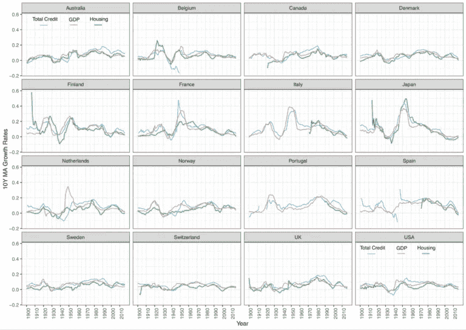
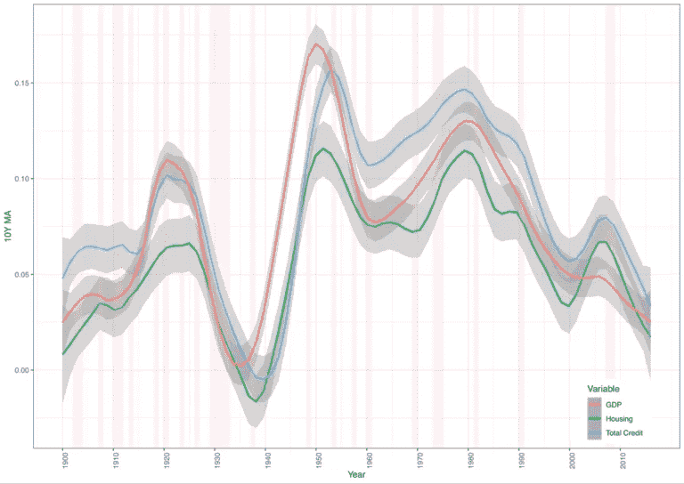

# 机器学习房地产估价:不仅仅是数据事件

> 原文：<https://towardsdatascience.com/machine-learning-real-estate-valuation-not-only-a-data-affair-99d36c92d263?source=collection_archive---------10----------------------->

机器学习(ML)为房地产估价带来了巨大的希望。但相关、高质量和及时的房地产数据仍然是一项昂贵的投入。在没有其他资产可用的海量数据的情况下，模型和数据的平衡组合仍是未来几年房地产估值最有可能的途径。这篇文章只是触及了这个问题的表面。

房地产价格是在房产转手时观察到的。典型交易的高成本和巨大的平均交易量(例如与股票市场相比)，导致对同一资产的观察很少。在交易期间，房地产专业人士和投资者需要依赖估价——如果房产被拍卖，市场上最有可能获得的价格。这是一个假设的价值，而不是实际的注册价格。

估价相对简单，但仍涉及在接近估价日时市场上交易的享乐变量[i](也称为可比资产)方面的类似资产。在缺乏可靠的可比交易的情况下，需要使用估价方法来评估一块房地产(无论是住宅还是商业)的可能价值。从信封背面的上限利率模型、透明的贴现现金流电子表格到复杂的计量经济学模型，任何可靠的估值都会受益于对现金流和贴现率预期水平的准确预测。购买或出售决策进一步受到房地产周期当前状态的影响，但也受到周期预期方向的影响。

预测租金需要很好地理解空间市场中的供求力量、建筑及其融资方式、自然空置率的演变以及公司和工人可能的移民流动等更重要的决定因素。贴现因子的预测涉及对货币政策(作为短期利率的决定因素)和风险溢价期限结构的透彻理解。如果在投资组合环境中进行估价，可能还需要上述变量的未来相关性，以便评估出售或收购某个房地产行业风险敞口的多样化收益。

鉴于估值对贴现率变化的敏感性，有必要花几段时间来确定短期利率和贴现率的无风险部分。

深入货币政策的兔子洞，短期利率水平通常由央行使用泰勒规则的变体来控制。这适用于全球大多数以通胀为目标的央行。该规则是一个将短期利率与产出缺口(衡量观察到的产出离可持续的非通胀水平有多远)和通胀缺口(衡量观察到的通胀离假设目标有多远，通常设定为 2%)联系起来的公式。正缺口导致利率上升，负缺口导致利率下降。

取决于无数其他因素，短期曲线的变化将沿着整个收益率曲线传播，但并不总是以均匀的方式传播。因此，将上述内容扩展到利率期限结构模型，我们可以得出在未来交易日预期观察到的无风险利率。风险溢价在顶部，也是相当可变和周期性的，我们最终会得到未来不同时间点的贴现率。

这一短暂的曲折表明，房地产估值不仅需要大量数据，而且需要大量建模。一项资产所需的持有期越长，就越需要对上述变量进行预测。我们看得越远，估计就越模糊，因此估值就越不可靠。

房地产价格因其长期的周期性行为而臭名昭著，无论是在发达市场还是发展中市场。信贷也是如此。GDP、信贷和房地产之间的相互作用是房地产周期未来走向的宝贵信息来源。仅作为一个简短的激励因素，回想一下美国房地产繁荣和萧条的最近一幕，宽松的贷款标准和高贷款价值(LTV)比率是一些重要的繁荣触发器，而突然和全经济的信贷停止是萧条的催化剂。

周期持续时间和幅度随时间变化，在不同国家有不同的特点。房地产市场(来自当地建筑和分区立法)和信贷市场(放松管制和监管风险限额的变化)的结构性特征的变化，共同改变了房地产周期的统计特性。

这些变化是如何以及何时出现在房地产价格数据中的？这些变化会影响预测吗？房地产估价工作应该如何反映这些变化？这些问题可以在灵活的建模策略中得到解决，在这种策略中，超前-滞后结构的相关性和变量的选择最好留给机器学习算法的辛勤工作。

在这种背景下，并借助于“scar Jordà”、Moritz Schularick 和 Alan M. Taylor 在他们的“宏观金融历史和新商业周期事实”中发布的数据(可在[http://www.macrohistory.net/data/](http://www.macrohistory.net/data/)获得)我分析了几个发达经济体超过 100 年的 GDP、房地产价格和信贷的时变趋势和周期行为。目标是确定和估计本地与全球周期的相关性，以及其他经济体的金融和实际周期的溢出效应。

如果全球低频成分在所分析的市场中起作用，该统计信息有助于改进估价中采用的预测。尽管房地产市场仍然主要是地方事务，但全球化的贸易和资金流动可以导致从一个房地产市场到另一个房地产市场的溢出效应。将变量分解为趋势和周期成分也有助于评估央行从现在起 3 到 5 年内可能采取的行动，从而提供对未来短期利率的估计。这是因为在典型的泰勒规则中，估计的周期性成分是作为输入所需的缺口。

我们先来看看数据。我计算了住宅房地产价格、人均 GDP 和非金融企业信贷增长率的 10 年移动平均值。数据中存在一些间断，通常在二战期间观察到，但在其他方面数据表现良好。使用 10 年平均值的信贷和房价的同步性非常突出(图 1)。这加强了先前的研究，表明信贷在解释房价动态的重要性。

**Figure 1:** The GDP-Credit-Property Prices Trio across Time and Countries

人们自然会怀疑 10 年平均值是否是分析这三个变量的相关数据跨度。这里可以使用 ML 来搜索最小化预测误差的最佳窗口大小，因为在预测模型中使用了估计的间隙。这可能会随着时间(在某些时期，10 年的平均数可能是最好的选择，在另一些时期，它可能是 7 年的平均数)、变量和国家而变化。

10 年的平均值可以被认为是对潜在趋势的一个天真的估计。这是数据的低频成分。然后通过从所有时间点的观察值中减去趋势值来获得循环分量。最近一段时间显示，趋势的同步性增加，为观察到的大多数国际市场房地产价格的高相关性提供了一些额外的解释。

此外，通过估算 10 年平均水平的黄土曲线，可以了解各国的联合动态(图 2)。这是一个简单的应用程序，旨在揭示房地产、GDP 和信贷增长中的全球因素。粉色带显示了美国的衰退期。

> 一个有趣的经验观察是信贷增长和产出之间的时变关系，以及它如何随时间发生质的变化。

在考虑的大部分时间里，高信贷增长率导致更高的产出和房价增长率——回想一下我们谈论的增长率趋势。这三个变量在 20 世纪 20 年代、50 年代和 80 年代同时达到峰值。然而，2007 年的峰值并非如此，当时信贷的高增长导致了房地产价格的高增长，但对趋势 GDP 的反应却很温和。这一观察结果表明，长期停滞可能无法完全解释危机后的疲软增长。

**Figure 2:** Averages in trends across countries

更具结构性的解释是可能的，例如在立陶宛银行的 Anh D.M. Nguyen 最近的一篇论文中。在本文中，我们建立了一个多变量未观测成分模型来解释一个多世纪以来美国经济产出缺口的演变。该文件的工作版本可在 https://www . lb . lt/en/publications/no-51-mih nea-Constantine scu-Anh-d-m-Nguyen-a-century-of-gap 查阅。

在罗马尼亚银行([http://www . bnr . ro/Bucharest-Economic-Analysis-and-Research-Seminar-(BEARS)-16413 . aspx](http://www.bnr.ro/Bucharest-Economic-Analysis-and-Research-Seminar-(BEARS)-16413.aspx))和乌克兰银行([https://bank.gov.ua/control/en/publish/article?)最近举行的几个研究研讨会上介绍并讨论了初步结果 art _ id = 87169943&cat _ id = 76291](https://bank.gov.ua/control/en/publish/article?art_id=87169943&cat_id=76291))以及几场学术会议。

在跨国环境中，ML 为选择用于计算全球平均值的最佳权重提供了一个自然的选择。经济理论表明，贸易或国内生产总值可用于构建平均计算中所需的相关权重(例如，在使用国内生产总值进行加权时，较大的经济体在计算中的权重较高)。尽管在经济上更容易解释，但从预测的角度来看，这种方法可能不是最佳的。选择系数的时变矩阵改善了预测练习的结果。自然，对于每个市场，可以使用特定国家的个人交易数据来进一步细化估计。

> 快速数据/建模/洞察迂回强调，数据虽然是一个重要的输入，但需要一个解释镜头。这是由模型和先前的概念框架提供的，它们分别适合于所选的问题，在我们的例子中是房地产估价。

我们很可能从一个精心选择的将 NVR 与均衡租金联系起来的模型中获得与我们从一大串松散联系的协变量的主成分分析中获得的相同的计量经济学洞见。更好的策略显然是从所有可用的协变量中提取任何有用的信息。毫无疑问，因果可解释性优于黑盒方法。数据洞察需要成为可操作的业务决策，这些决策可以轻松交流和理解，而不是用晦涩的统计术语包装。虽然有时模糊，经济学 101 仍然是一个重要的来源，因果解释和变量选择的模型建立和估计。

人工智能浪潮带来了独特的商业和伦理挑战，房地产也无法幸免。更重要的是，这表明高纯度及时数据发挥了越来越大的作用。区块链存储的交易数据成为一种有价值的生产要素，在人工智能驱动的经济中具有越来越重要的价值。因此，未来的商业模式应该设计新产品和服务，而不是模糊这种投入的价值，以避免对用户的数据贡献进行补偿，而是正式承认其价值，并组织进行交易所需的适当市场。