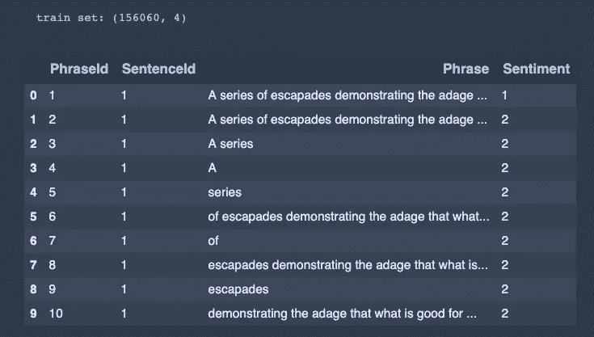

# LSTM 递归神经网络实例

> 原文：<https://towardsdatascience.com/machine-learning-recurrent-neural-networks-and-long-short-term-memory-lstm-python-keras-example-86001ceaaebc?source=collection_archive---------1----------------------->


递归神经网络具有广泛的应用。这些包括时间序列分析、文档分类、语音和声音识别。与前馈人工神经网络相反，递归神经网络做出的预测依赖于先前的预测。

具体来说，想象我们决定遵循一个锻炼程序，每天在举重、游泳和瑜伽之间交替进行。然后，我们可以建立一个递归神经网络来预测今天的锻炼，因为我们昨天做了什么。例如，如果我们昨天举重，那么我们今天就去游泳。

通常情况下，你将在现实世界中处理的问题是当前状态和其他输入的函数。例如，假设我们每周注册一次曲棍球。如果我们在应该举重的同一天打曲棍球，那么我们可能会决定不去健身房。因此，我们的模型现在必须区分昨天上瑜伽课但我们没有打曲棍球的情况，以及昨天上瑜伽课但我们今天打曲棍球的情况，在这种情况下我们会直接跳到游泳。

# 长短期记忆(LSTM)

在实践中，我们很少看到使用常规的递归神经网络。递归神经网络有一些缺点，使它们不实用。例如，假设我们增加了一个休息日。休息日只应在运动两天后休。如果我们使用递归神经网络来尝试和预测我们明天将做什么活动，它可能会陷入循环。

假设我们有以下场景。

*   第一天:举重
*   第二天:游泳
*   第三天:在这一点上，我们的模型必须决定我们是否应该休息一天或瑜伽。不幸的是，它只能访问前一天。换句话说，它知道我们昨天游泳了，但不知道我们前一天是否休息过。所以，最后可以预测瑜伽。

发明 LSTMs 是为了解决这个问题。顾名思义，LSTMs 是有记忆的。就像人类可以在短期记忆中存储大约 7 位信息一样，LSTMs 理论上可以记住几个状态的信息。然而，这提出了一个问题，即他们应该记得多久以前的事情。什么时候信息变得无关紧要了？例如，在我们的练习例子中，我们不应该需要回溯两天以上来决定我们是否应该休息一下。

LSTMs 没有深入研究太多细节，而是通过使用专用神经网络来遗忘和选择信息来解决这个问题。单个 LTSM 层由以特殊方式交互的四个神经网络层组成。


如果你有兴趣了解更多关于 LSTM 网络的内部情况，我强烈建议你去看看下面的链接。

 [## 了解 LSTM 网络——colah 的博客

### 这些循环使得循环神经网络看起来有点神秘。然而，如果你想得更多一点，事实证明…

colah.github.io](https://colah.github.io/posts/2015-08-Understanding-LSTMs/) 

关于自然语言处理的一个棘手的事情是，单词的含义会根据上下文而变化。在情感分析的情况下，我们不能仅仅关闭一些单词的出现，比如*，因为如果前面是 ***而不是*** 就像 ***不好一样，它的意思完全改变了。计算机也很难识别讽刺之类的东西，因为它们需要从字里行间去解读。事实证明，LSTM 网络特别适合解决这类问题，因为它们能记住与问题相关的所有单词。****

# *密码*

*在接下来的部分中，我们回顾了我对 Kaggle 竞赛的解决方案，该竞赛的目标是对电影评论集进行情感分析。我们被要求在 0 到 4 的范围内给每个短语贴上标签。对应于每个标签的情感是:*

*   *0:负*
*   *1:有些消极*
*   *2:中性*
*   *3:有点积极*
*   *4:积极*

*如果您想继续学习，可以从下面的链接获得数据集。*

*[](https://www.kaggle.com/c/movie-review-sentiment-analysis-kernels-only) [## 电影评论情感分析(仅限内核)

### 从烂番茄数据集中对句子的情感进行分类

www.kaggle.com](https://www.kaggle.com/c/movie-review-sentiment-analysis-kernels-only) 

我们将使用以下库。

```
import numpy as np
import pandas as pd
from matplotlib import pyplot as plt
plt.style.use('dark_background')
from keras.preprocessing.text import Tokenizer
from keras.preprocessing.sequence import pad_sequences
from sklearn.model_selection import train_test_split
from keras.utils import to_categorical
from keras.models import Sequential
from keras.layers import Dense, Dropout, Embedding, LSTM, GlobalMaxPooling1D, SpatialDropout1D
```

语料库包含超过 150，000 个训练样本。如你所见，有些短语不完整，有些重复。

```
df_train = pd.read_csv('train.tsv', sep='\t')print('train set: {0}'.format(df_train.shape))
df_train.head(10)
```



测试集包括超过 60，000 个样本。每一行都有一个`PhraseId`和一个`SentenceId`，Kaggle 将使用这两个值来评估提交文件中模型所做的预测。

```
df_test = pd.read_csv('test.tsv', sep='\t')print('test set: {0}'.format(df_test.shape))
df_test.head(10)
```


ASCII 字符最终被计算机解释为十六进制。因此，对计算机来说，“A”和“A”是不同的。因此，我们想把所有的字符都变成小写。因为我们要根据空格把句子分割成单个的单词，所以后面有句号的单词不等同于后面没有句号的单词( ***happy)。*！= ***开心*** )。此外，收缩将被解释为不同于原来的，这将对模型产生影响(我！=我就是)。因此，我们使用 proceeding 函数替换所有事件。**

```
replace_list = {r"i'm": 'i am',
                r"'re": ' are',
                r"let’s": 'let us',
                r"'s":  ' is',
                r"'ve": ' have',
                r"can't": 'can not',
                r"cannot": 'can not',
                r"shan’t": 'shall not',
                r"n't": ' not',
                r"'d": ' would',
                r"'ll": ' will',
                r"'scuse": 'excuse',
                ',': ' ,',
                '.': ' .',
                '!': ' !',
                '?': ' ?',
                '\s+': ' '}def clean_text(text):
    text = text.lower()
    for s in replace_list:
        text = text.replace(s, replace_list[s])
    text = ' '.join(text.split())
    return text
```

我们可以使用`apply`将函数应用到序列中的每一行。

```
X_train = df_train['Phrase'].apply(lambda p: clean_text(p))
```

让我们看看语料库中每个短语的单独长度。

```
phrase_len = X_train.apply(lambda p: len(p.split(' ')))
max_phrase_len = phrase_len.max()
print('max phrase len: {0}'.format(max_phrase_len))plt.figure(figsize = (10, 8))
plt.hist(phrase_len, alpha = 0.2, density = True)
plt.xlabel('phrase len')
plt.ylabel('probability')
plt.grid(alpha = 0.25)
```


神经网络的所有输入必须长度相同。因此，我们将最长的长度存储为一个变量，稍后我们将使用它来定义模型的输入。

接下来，我们为目标标签创建一个单独的数据帧。

```
y_train = df_train['Sentiment']
```

计算机不理解单词，更不用说句子了，因此，我们使用分词器来解析短语。在指定`num_words`时，只保留最常用的`num_words-1`字。我们使用过滤器来去除特殊字符。默认情况下，所有标点符号都被删除，将文本转换为空格分隔的单词序列。然后，这些记号被矢量化。我们所说的矢量化是指它们被映射到整数。`0`是一个保留索引，不会分配给任何单词。

`pad_sequence`用于确保所有短语长度相同。比`maxlen`短的序列在末尾用`value`(默认为`0`)填充。

每当我们处理分类数据时，我们都不想让它成为整数，因为模型会将数字越大的样本解释为更有意义。`to_categorical`是对数据进行编码的快速而肮脏的方式。

```
max_words = 8192tokenizer = Tokenizer(
    num_words = max_words,
    filters = '"#$%&()*+-/:;<=>@[\]^_`{|}~'
)tokenizer.fit_on_texts(X_train)X_train = tokenizer.texts_to_sequences(X_train)
X_train = pad_sequences(X_train, maxlen = max_phrase_len)
y_train = to_categorical(y_train)
```

我们为超参数定义变量。

```
batch_size = 512
epochs = 8
```

然后，我们建立我们的模型使用 LSTM 层。

```
model_lstm = Sequential()model_lstm.add(Embedding(input_dim = max_words, output_dim = 256, input_length = max_phrase_len))
model_lstm.add(SpatialDropout1D(0.3))
model_lstm.add(LSTM(256, dropout = 0.3, recurrent_dropout = 0.3))
model_lstm.add(Dense(256, activation = 'relu'))
model_lstm.add(Dropout(0.3))
model_lstm.add(Dense(5, activation = 'softmax'))model_lstm.compile(
    loss='categorical_crossentropy',
    optimizer='Adam',
    metrics=['accuracy']
)
```

如果你不明白**嵌入层**在做什么，我建议你去看看我写的一篇关于这个主题的文章。

[](/machine-learning-sentiment-analysis-and-word-embeddings-python-keras-example-4dfb93c5a6cf) [## 机器学习情感分析和单词嵌入 Python Keras 示例

### 机器学习的主要应用之一是情感分析。情绪分析就是判断语气…

towardsdatascience.com](/machine-learning-sentiment-analysis-and-word-embeddings-python-keras-example-4dfb93c5a6cf) 

我们使用辍学来防止过度拟合。

我们留出 10%的数据进行验证。在我们向解决方案迈出一步之前，每个时代都有 512 条评论通过网络。

```
history = model_lstm.fit(
    X_train,
    y_train,
    validation_split = 0.1,
    epochs = 8,
    batch_size = 512
)
```


我们可以通过使用由 *fit* 函数返回的历史变量来绘制每个时期的训练和验证准确度和损失。

```
plt.clf()
loss = history.history['loss']
val_loss = history.history['val_loss']
epochs = range(1, len(loss) + 1)
plt.plot(epochs, loss, 'g', label='Training loss')
plt.plot(epochs, val_loss, 'y', label='Validation loss')
plt.title('Training and validation loss')
plt.xlabel('Epochs')
plt.ylabel('Loss')
plt.legend()
plt.show()
```


```
plt.clf()
acc = history.history['acc']
val_acc = history.history['val_acc']
plt.plot(epochs, acc, 'g', label='Training acc')
plt.plot(epochs, val_acc, 'y', label='Validation acc')
plt.title('Training and validation accuracy')
plt.xlabel('Epochs')
plt.ylabel('Accuracy')
plt.legend()
plt.show()
```


由于数据集是作为 Kaggle 竞赛的一部分获得的，我们没有得到与测试集中的短语相对应的情感。

# 最后的想法

递归神经网络可用于建模任何依赖于其先前状态的现象。我们在本文中提到的例子是语义的例子。换句话说，一个句子的意思随着它的发展而变化。我们可以使用更复杂的方法来捕捉单词之间的相互作用(例如，电影不是好的)，而不是试图基于某个单词(例如，好的)的出现来分类文档。*