# 正则化和过拟合

> 原文：<https://towardsdatascience.com/machine-learning-regularization-and-over-fitting-simply-explained-d4dfdc256c9d?source=collection_archive---------14----------------------->

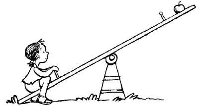

[http://www.discovery.com/tv-shows/mythbusters/about-this-show/physics-of-seesaws/](http://www.discovery.com/tv-shows/mythbusters/about-this-show/physics-of-seesaws/)

**注**:帖子是我以后参考用的。请随意指出任何异常之处。

首先，我将讨论一些基本的想法，所以如果你认为你已经是有这些想法的家庭，请随意继续。

## **一个线性模型**

线性模型是在预测模型中遵循直线的模型。它可以有单个属性来预测值，也可以有多个属性来预测值，方程看起来像这样。

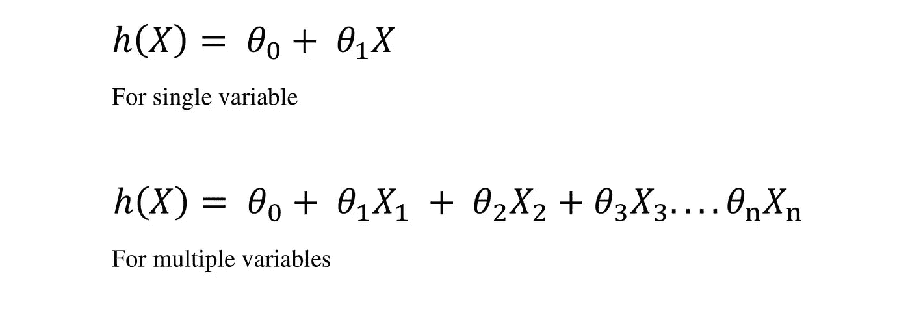

(a)

这里θ-0 是截距，θ-1 到θ-n 是对应于它们的属性 X-1 到 X-n 的斜率。

**成本函数**

 [## 机器学习:成本函数与梯度下降

### 讲故事有两种方式，一种是艰难的方式，在这种方式中，你被期望达到说话者的标准，或者…

towardsdatascience.com](/machine-leaning-cost-function-and-gradient-descend-75821535b2ef) 

成本函数决定了你预测的假设 h(x)和实际点之间有多少差异。因为我们首先考虑一个线性模型，让我们看看它在图上的样子。

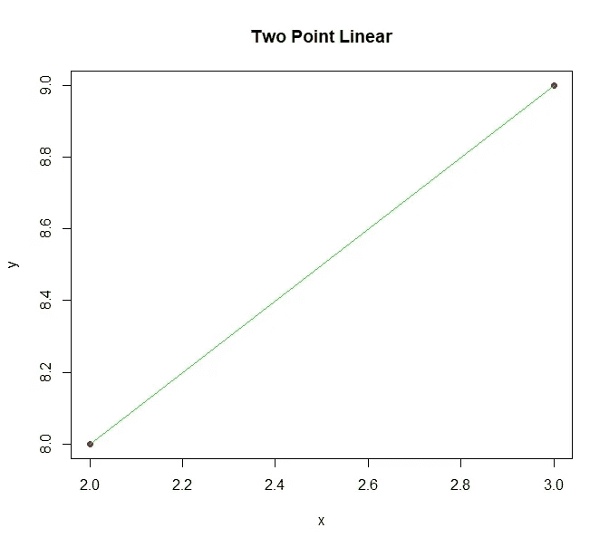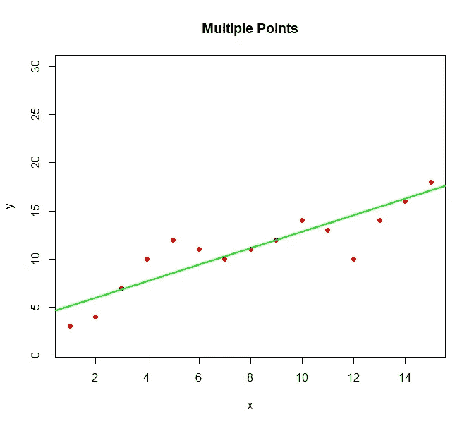

一个只有两点，一个有很多点。但是，您认为线性模型或星光线可以表示如下所示的数据吗:

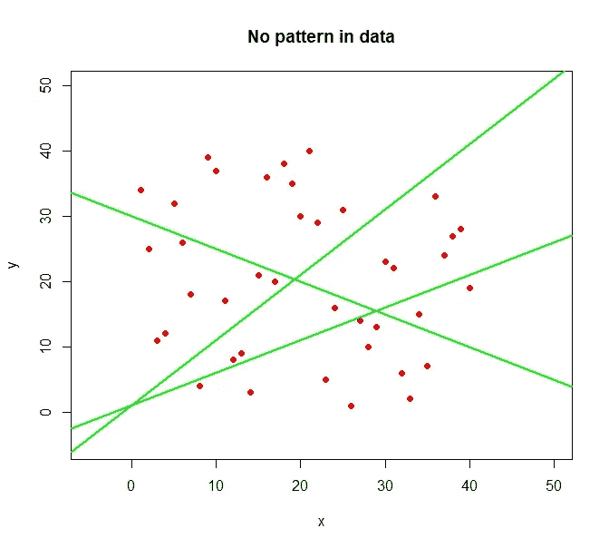

在这种数据集中，拟合直线的可能性非常多。因此，我们开始使用如下所示形式的多项式方程:

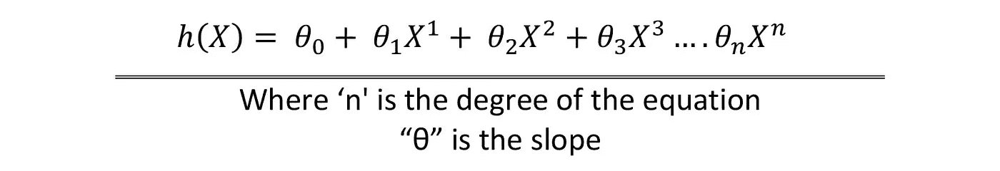

它开始形成一条曲线，与直线相比，可以更好地表示数据点。当我们只有一个θ时，这意味着我们只有一个方向的斜率，因此我们得到一条直线，但是，如果我们有许多θ，这意味着许多斜率，因此我们的直线可以以许多不同的方式改变方向。见下图。

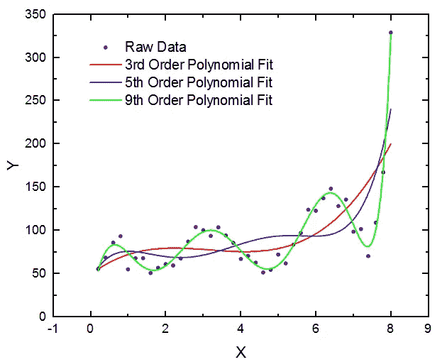

[https://www.originlab.com/index.aspx?go=Products/Origin/DataAnalysis/CurveFitting](https://www.originlab.com/index.aspx?go=Products/Origin/DataAnalysis/CurveFitting)

*   我们希望我们的成本函数在直线的情况下最小，我们也希望它在多项式线的情况下最小。
*   我们使用梯度下降，通过不断更新方程中的所有θ来拟合可能的最佳直线。

# 我们为什么需要正规化？

*回答* —防止模型过拟合。

[https://medium.com/greyatom/what-is-underfitting-and-overfitting-in-machine-learning-and-how-to-deal-with-it-6803a989c76](https://medium.com/greyatom/what-is-underfitting-and-overfitting-in-machine-learning-and-how-to-deal-with-it-6803a989c76)

*欠拟合*:我们看到，我们绘制的假设线并不真正遵循与点相同的趋势。这样，我们的模型就不能给出我们数据的精确描述。
*解法:*做一个多项式方程，它创建一条曲线而不是直线。

*良好拟合*:通过使用一个多项式方程，你增加了可以采取不同形状的线的复杂性，然而，如果你有一个变量，比如说“X”和预测“Y”，那么你只是创建了一条单线。

*过度拟合*:如果你知道通过使你的方程多项式化，你可以调整它以匹配你的数据点，但是，如果你调整假设的直线到试图通过每一个可能的数据点的程度，那么你说你的模型过度拟合。
为什么会产生问题？因为当你要预测未来的事情时，你的模型不能确定这条线将在哪里转弯，因为它没有概括整个模型，而是概括单个数据点。
*解决:*正规化

# 正规化

因为我们知道通过改变斜率我们可以改变直线的方向，我们知道我们的模型有太多的精度，所以你会建议从方程的末尾去掉高次项吗？号码

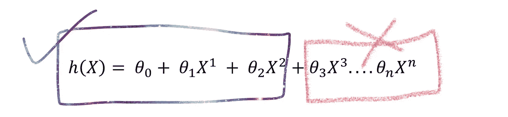

Wrong approach

如果你保留所有的高次项，而是操纵与每个项相关的斜率，会怎么样呢？请记住，每个术语都代表数据集中的一个属性，例如，x1-销售额，x2-利润，x3-支出，等等。

我们如何做到这一点？

在称为正则化的方法的帮助下，您将与每个斜率(θ)相关的项的值增加到更高的值，而与每个项相关的斜率将减少到更低的值。请注意，我们并没有消除较高程度的条款，我们正在增加它的价值，以惩罚其斜率。

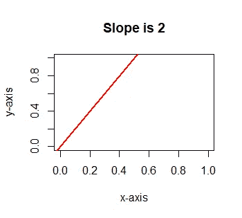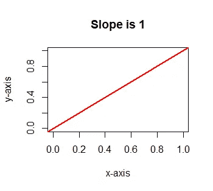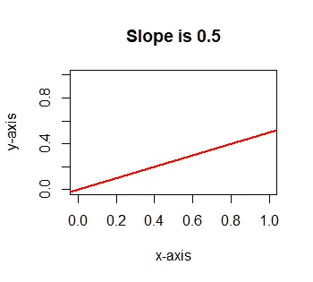

Visualize the difference

1-如果斜率为 1，那么 x 的每一个单位变化，y 也会有一个单位变化。等式为“y=mx+c ”,其中 m=1，因此 y=x。

2-如果斜率为 2，等式将为 y=2x+c。这意味着对于半个单位的变化，在 x 中，y 将变化一个单位。因此，x 值越小，斜率越大。

3-如果斜率为 0.5，则等式为 y=0.5x+c。这意味着 x 变化 2 个单位，y 将变化 1 个单位。因此，x 值越高，斜率越低。

这意味着斜率和与之相关的变量值成反比。因此，增加属性“x”的值是有意义的，以便塑造它们的斜率，使它们不会过度适应数据。

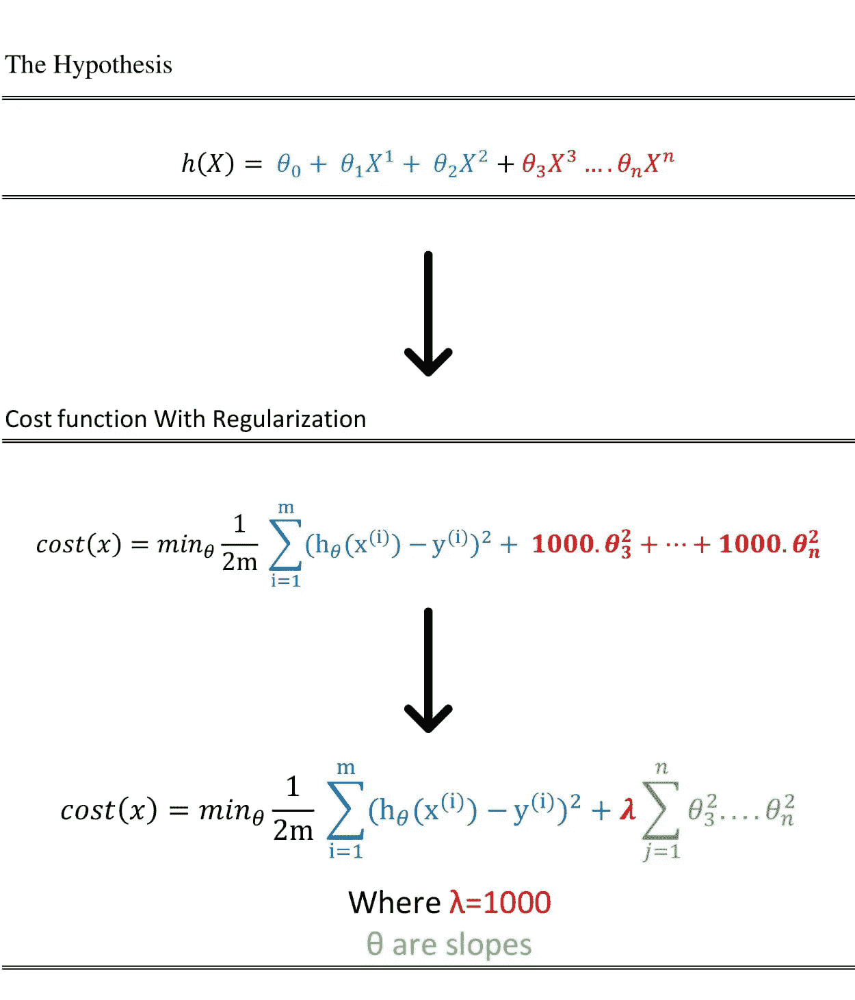

# 摘要

简而言之，当在等式中引入 Lambda 时，模型变得一般化，并给出了更广泛的训练集。如果没有 lambda，模型将试图拟合训练集中的每一个点，因此在测试阶段失败，因为一旦新数据出现，它不知道下一步要去哪里。