# 单词嵌入 Python 示例—情感分析

> 原文：<https://towardsdatascience.com/machine-learning-sentiment-analysis-and-word-embeddings-python-keras-example-4dfb93c5a6cf?source=collection_archive---------12----------------------->


[https://www.pexels.com/photo/person-using-appliance-132700/](https://www.pexels.com/photo/person-using-appliance-132700/)

机器学习的主要应用之一是情感分析。情感分析就是判断一个文档的基调。情感分析的输出通常是 0 到 1 之间的分数，其中 1 表示语气非常积极，0 表示非常消极。情绪分析经常用于交易。例如，情绪分析被应用于交易者的推文，以估计整体市场情绪。

正如人们所料，情感分析是一个自然语言处理(NLP)问题。NLP 是人工智能的一个领域，涉及理解和处理语言。本文的目标是构建一个模型，从语料库的文档中获取单词的语义。在高层次上，可以想象我们将带有单词 ***好的*** 的文档分类为肯定的，而将单词 ***坏的*** 分类为否定的。不幸的是，问题并没有那么简单，因为单词前面可以有 ***而不是*** 如 ***不好。***

# 密码

说得够多了，让我们深入一些 Python 代码。

```
import numpy as np
from matplotlib import pyplot as plt
plt.style.use('dark_background')
from keras.datasets import imdb
from keras.models import Sequential
from keras.preprocessing.sequence import pad_sequences
from keras.layers import Embedding, GlobalAveragePooling1D, Dense
```

参数`num_words=10000`确保我们只保留训练集中出现频率最高的前 10，000 个单词。为了保持数据的大小易于管理，我们会丢弃一些不常用的单词。

```
num_words = 10000
```

我们将使用包含来自互联网电影数据库的 50，000 条电影评论的 IMDB 数据集。后者被分成 25，000 条用于训练的评论和 25，000 条用于测试的评论。训练集和测试集是*平衡的*，这意味着它们包含相同数量的正面和负面评论。

```
old = np.load
np.load = lambda *a,**k: old(*a,**k, allow_pickle = True)
(X_train, y_train), (X_test, y_test) = imdb.load_data(num_words=num_words)
np.load = old
del(old)print("Training entries: {}, labels: {}".format(len(X_train), len(y_train)))
```

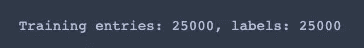

当我们使用`keras.datasets.imdb`将数据集导入我们的程序时，它已经经过了预处理。换句话说，每个例子都是一个整数列表，其中每个整数代表字典中的一个特定单词，每个标签都是 0 或 1 的整数值，其中 0 是负面评论，1 是正面评论。我们先在第一次复习的时候来个巅峰。

```
print(X_train[0])
```

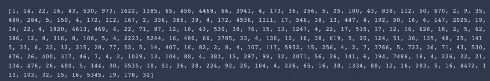

为了更好地理解我们正在处理的内容，我们将创建一个助手函数，将每个训练示例中的整数映射到索引中的单词。

```
word_index = imdb.get_word_index()# The first indices are reserved
word_index = {k:(v+3) for k,v in word_index.items()} 
word_index["<PAD>"] = 0
word_index["<START>"] = 1
word_index["<UNK>"] = 2  # unknown
word_index["<UNUSED>"] = 3reverse_word_index = dict([(value, key) for (key, value) in word_index.items()])def decode_review(text):
    return ' '.join([reverse_word_index.get(i, '?') for i in text])
```

现在，我们可以使用`decode_review`功能来显示第一篇评论的文本。

```
decode_review(X_train[0])
```

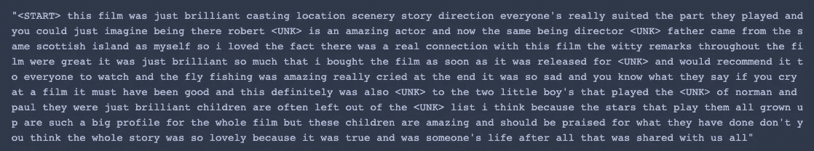

鉴于文档中的每个单词都将被解释为一个特征，我们必须确保电影评论的长度相同，然后才能尝试将它们输入神经网络。

```
len(X_train[0]), len(X_train[1])
```

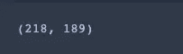

我们将使用`pad_sequence`功能来标准化长度。

```
X_train = pad_sequences(
    X_train,
    value=word_index["<PAD>"],
    padding='post',
    maxlen=256
)X_test = pad_sequences(
    X_test,
    value=word_index["<PAD>"],
    padding='post',
    maxlen=256
)
```

让我们看看前几个样本的长度。

```
len(X_train[0]), len(X_train[1])
```


正如敏锐的读者可能已经猜到的，单词是分类特征。因此，我们不能直接将它们输入神经网络。尽管它们已经被编码为整数，但是如果我们让它们保持原样，模型会将具有较高值的整数解释为比具有较低值的整数具有更高的优先级。通常，您可以通过将数组转换为指示单词出现的向量*0*和*1*来解决这个问题，这类似于一种热编码，但是对于单词来说，这是内存密集型的。给定 10，000 个单词的词汇表，我们需要在 RAM 中存储`num_words * num_reviews`大小的矩阵。

# 嵌入

这就是嵌入发挥作用的地方。嵌入通过将我们的高维数据映射到低维空间(类似于 PCA)来解决稀疏输入数据(非常大的向量，具有相对较少的非零值)的核心问题。

例如，假设我们有一个由以下两个句子组成的语料库。

*   *希望很快见到你*
*   很高兴再次见到你

就像 IMDB 数据集一样，我们可以为每个单词分配一个唯一的整数。

```
[0, 1, 2, 3, 4]

[5, 1, 2, 3, 6]
```

接下来，我们可以定义一个嵌入层。

```
Embedding(input_dim=7, output_dim=2, input_length=5)
```

*   **input_dim** :训练集中词汇的大小(即不同单词的数量)
*   **output_dim** :嵌入向量的大小
*   **input_length** :样本中特征的个数(即每个文档的字数)。例如，如果我们所有的文档都由 1000 个单词组成，那么输入长度将是 1000。

嵌入的工作方式类似于查找表。每个记号(即单词)充当存储向量的索引。当一个令牌被提供给嵌入层时，它返回与该令牌相关联的向量，并通过神经网络传递该向量。随着网络的训练，嵌入也被优化。

```
+------------+------------+
|   index    |  Embedding |
+------------+------------+
|     0      | [1.2, 3.1] |
|     1      | [0.1, 4.2] |
|     2      | [1.0, 3.1] |
|     3      | [0.3, 2.1] |
|     4      | [2.2, 1.4] |
|     5      | [0.7, 1.7] |
|     6      | [4.1, 2.0] |
+------------+------------+
```

比方说，我们有下面的单词**教师**的二维嵌入向量。

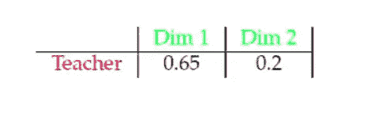

我们可以想象一个二维空间，其中相似的单词(即学校、导师)聚集在一起。

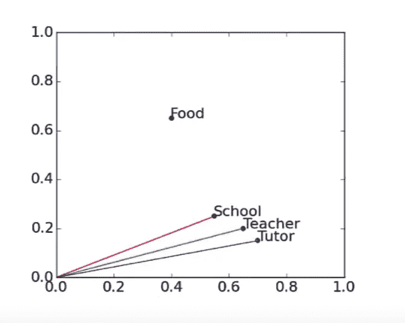

在我们的例子中，我们使用 16 维的嵌入向量。因此，我们可能会发现**享受、喜欢和棒极了**这几个词彼此非常接近。然后，我们的模型可以学习将其单词映射到 16 维空间中彼此接近的嵌入向量的评论分类为正面的。

```
model = Sequential()
model.add(Embedding(input_dim==num_words, output_dim=16, input_length=256))
model.add(GlobalAveragePooling1D())
model.add(Dense(16, activation='relu'))
model.add(Dense(1, activation='sigmoid'))model.summary()
```

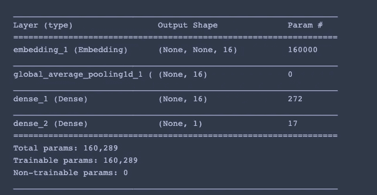

我们使用**亚当**作为我们的优化器，使用**二元** **交叉熵**作为我们的损失函数，因为我们试图在两个类之间进行选择。

```
model.compile(
    optimizer='adam',
    loss='binary_crossentropy',
    metrics=['accuracy']
)
```

我们留出 10%的数据进行验证。每个时期，在更新权重之前，512 个评论通过神经网络。

```
history = model.fit(
    X_train,
    y_train,
    epochs=20,
    batch_size=512,
    validation_split=0.1,
    shuffle=True
)
```

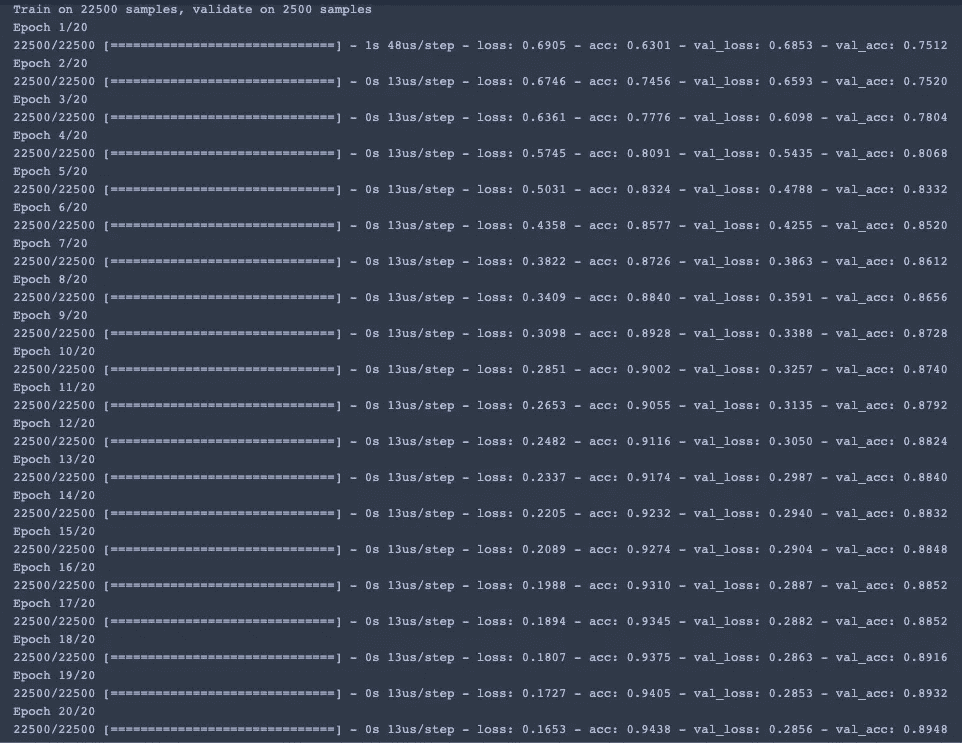

我们可以通过使用由 *fit* 函数返回的历史变量来绘制每个时期的训练和验证准确度和损失。

```
loss = history.history['loss']
val_loss = history.history['val_loss']
epochs = range(1, len(loss) + 1)
plt.plot(epochs, loss, 'y', label='Training loss')
plt.plot(epochs, val_loss, 'r', label='Validation loss')
plt.title('Training and validation loss')
plt.xlabel('Epochs')
plt.ylabel('Loss')
plt.legend()
plt.show()
```

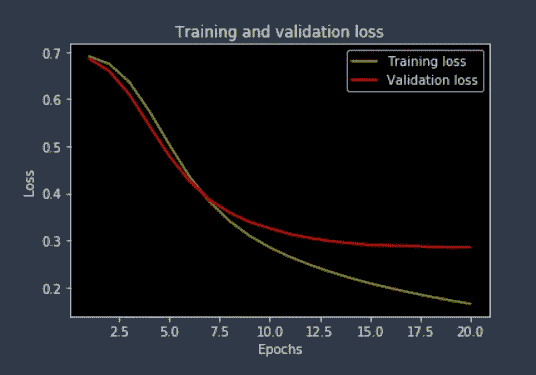

```
acc = history.history['acc']
val_acc = history.history['val_acc']
plt.plot(epochs, acc, 'y', label='Training acc')
plt.plot(epochs, val_acc, 'r', label='Validation acc')
plt.title('Training and validation accuracy')
plt.xlabel('Epochs')
plt.ylabel('Accuracy')
plt.legend()
plt.show()
```

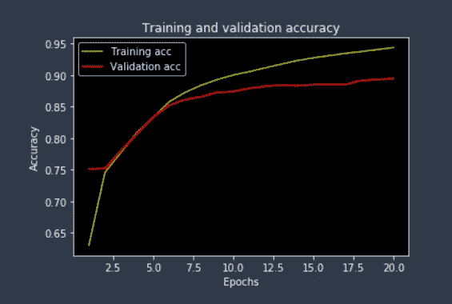

最后，让我们看看我们的模型在测试集上的表现如何。

```
test_loss, test_acc = model.evaluate(X_test, y_test)
print(test_acc)
```

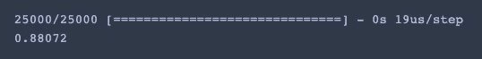

# 最后的想法

当我们处理具有许多类别(即单词)的分类特征时，我们希望避免使用一种热编码，因为它需要我们在内存中存储一个大矩阵并训练许多参数。相反，我们可以将每个类别映射到一个 ***n*** 维嵌入向量，并使用嵌入向量作为输入来训练我们的机器学习模型。