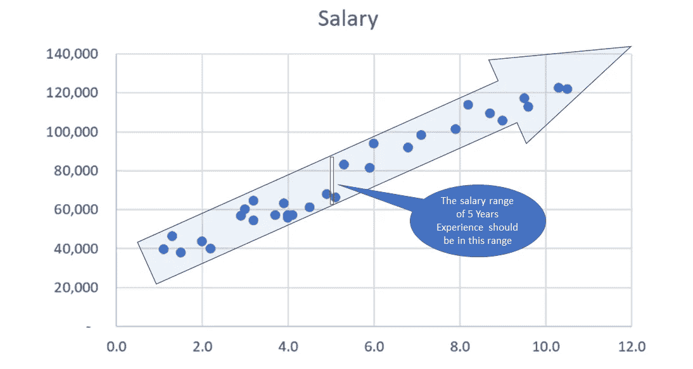

# 机器学习:用 Python 实现简单线性回归

> 原文：<https://towardsdatascience.com/machine-learning-simple-linear-regression-with-python-f04ecfdadc13?source=collection_archive---------6----------------------->

## 在这篇文章中，我们将指导你使用简单的线性回归来进行机器学习的第一步。

# 什么是线性？

首先，假设你正在沃尔玛购物。不管你买不买东西，你都要付 2 美元的停车票。每个苹果的价格是 1.5 美元，你必须购买一个( *x)* 的苹果。然后，我们可以填充如下价格列表:

Crosstab (Quantity & Price) for apple at Walmart

对于本例，使用公式 ***y=2+1.5x*** 很容易预测(或计算)基于价值的价格，反之亦然，或者:

Linear Functions

使用:

*   a = 2
*   b = 1.5

一个**线性函数**有一个自变量和一个因变量。自变量为 ***x*** 因变量为 ***y*** 。

*   *是常数项或 y 截距。是 ***x*** = 0 时因变量的值。*
*   ****b*** 是自变量的系数。它也被称为斜率，给出了因变量的变化率。*

*为什么我们称之为线性？好了，让我们把上面得到的数据集可视化吧！*

**

*Shopping cost (y = 1.5x + 2)*

*在标绘购物成本的所有值(蓝线)后，你可以看到，它们都在**一条线**上，这就是为什么我们称之为*。用线性方程(y=a+bx)，a 是自变量。即使 a=0(停车票不用你出)，购物成本线也会下移，他们还是在一条线上(橙色线)。**

****

**Shopping cost (y = 1.5x)**

# **但是在现实生活中，事情并没有那么简单！**

**我们再举一个例子，在 AB 公司，有一个基于工作年限的工资分配表，如下所示:**

****

**Salary based on Years of Experience ([salary_data.csv](https://s3.us-west-2.amazonaws.com/public.gamelab.fun/dataset/salary_data.csv))**

**假设你是一名人力资源主管，你得到了一名有 5 年工作经验的候选人。那你应该给他开出的最好工资是多少？”**

**在深入探讨这个问题之前，让我们先将数据集绘制到图中:**

****

**Salary Data on Scatter Plot**

**请仔细看这张图表。现在我们有一个坏消息:所有的观察结果都不在一条线上。这意味着我们找不到计算(y)值的方程。**

**那现在怎么办？别担心，我们有好消息要告诉你！**

**向下滚动之前，再次查看散点图。你看到了吗？**

**所有的点不在一条直线上，但是它们在一条直线上！**是线性的！****

****

**Salary Data on Scatter Plot with linear shape**

**根据我们的观察，我们可以猜测 5 年经验的薪资范围应该在红色范围内。当然，我们可以向候选人提供红色范围内的任何数字。但是如何挑选最适合他的号码呢？是时候使用机器学习来预测我们候选人的最佳薪酬了。**

**在本节中，我们将在 Spyder IDE 上使用 Python 来为我们的候选人找到最佳工资。好吧，我们开始吧！**

# **用 Python 实现线性回归**

**在继续之前，我们总结了机器学习的两个基本步骤如下:**

1.  **培养**
2.  **预测**

**好的，我们将使用 4 个库，如`numpy`和`pandas`来处理数据集，`sklearn`来实现机器学习功能，`matplotlib`来可视化我们的绘图以供查看:**

**代码解释:**

*   **`dataset`:该表包含了我们 csv 文件中的所有值**
*   **`X`:包含年经验数组的第一列**
*   **`y`:包含薪资数组的最后一列**

**接下来，我们必须将数据集(总共 30 个观察值)分成 2 组:用于训练的训练集和用于测试的测试集:**

**代码解释:**

*   **`test_size=1/3`:我们将我们的数据集(30 个观察值)分成两部分(训练集、测试集)，并且**测试集**与数据集的比率是 1/3 (10 个观察值将被放入**测试集**)。你可以放 1/2 得到 50%或者 0.5，它们是一样的。我们不应该让测试集太大；如果它太大，我们将缺乏数据来训练。通常情况下，我们应该选择 5%到 30%左右。**
*   **`train_size`:如果我们已经使用了 test_size，其余的数据将自动分配给 train_size。**
*   **`random_state`:这是随机数生成器的种子。我们也可以放一个`RandomState`类的实例。如果我们将其留空或为 0，将使用由`np.random`使用的`RandomState`实例。**

**我们已经有了训练集和测试集，现在我们必须构建回归模型:**

**代码解释:**

*   **`regressor = LinearRegression()`:我们的训练模型，将实现线性回归。**
*   **`regressor.fit`:在这一行中，我们通过包含**年经历**值的`X_train`和包含**具体薪资**值的`y_train`来组成模型。这是训练过程。**

**让我们设想一下我们的培训模型和测试模型:**

**运行上述代码后，您将在控制台窗口中看到两个图:**

****

**Training Set**

****

**Test Set**

**比较两幅图，我们可以看到两条蓝线是同一个方向。我们的模型现在很好用。**

**好吧！我们已经有了模型，现在我们可以用它来计算(预测)*X 的任何值取决于 y* 或*y 的任何值取决于 X* 。我们是这样做的:**

****

**`Predict y_pred` using single value of X=5**

**答对了。 **X = 5** (5 年经验)的`y_pred`值为 73545.90**

**你可以向你的候选人提供 73，545.90 美元的薪水，这对他来说是最好的薪水了！**

**我们也可以传递一个 X 的**数组，而不是 X** 的**单值:****

****

**`Predict y_pred` using array of X_test**

**我们也可以用 y 来预测 X。你自己试试吧！**

****总之，对于简单的线性回归，我们必须按照以下 5 个步骤进行:****

1.  **导入数据集。**
2.  **将数据集分成训练集和测试集(每个集有 X 和 y 两个维度)。通常，测试集应该是数据集的 5%到 30%。**
3.  **将训练集和测试集可视化以进行双重检查(如果需要，可以绕过这一步)。**
4.  **初始化回归模型并使用训练集(X 和 y)对其进行拟合。**
5.  **我们来预测一下！！**

****资源:****

*   **[salary_data.csv](https://s3.us-west-2.amazonaws.com/public.gamelab.fun/dataset/salary_data.csv)**
*   **[简单 _ 线性 _ 回归. py](https://gist.github.com/panicpotatoe/14d9c7a5a25566a58143e7069813629f)**

**天天快乐学习！**