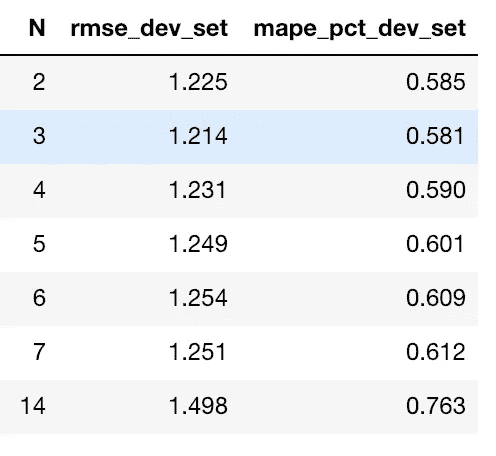

# 机器学习技术在股票价格预测中的应用

> 原文：<https://towardsdatascience.com/machine-learning-techniques-applied-to-stock-price-prediction-6c1994da8001?source=collection_archive---------0----------------------->


Image generated using Neural Style Transfer.

机器学习有很多应用，其中之一就是预测时间序列。可以说，预测最有趣(或者最有利可图)的时间序列之一是股票价格。

最近我读了一篇将机器学习技术应用于股票价格预测的博文。这里可以看[。这是一篇写得很好的文章，探讨了各种技术。然而，我觉得这个问题可以用更严谨的学术方法来处理。例如，在文章中，方法“移动平均”、“自动 ARIMA”和“先知”的预测范围为 **1 年**，而“线性回归”、“k-最近邻”和“长短期记忆(LSTM)”的预测范围为 **1 天**。文章的结尾写道:“LSTM 轻而易举地超越了我们迄今为止看到的任何算法。”但是很明显，我们不是在这里比较苹果和苹果。](https://www.analyticsvidhya.com/blog/2018/10/predicting-stock-price-machine-learningnd-deep-learning-techniques-python/)

所以，这是我对这个问题的看法。

# 问题陈述

我们的目标是预测 Vanguard Total Stock Market ETF(VTI)的每日调整收盘价，使用前 N 天的数据(即预测范围=1)。我们将使用 VTI 从 2015 年 11 月 25 日到 2018 年 11 月 23 日的三年历史价格，可以从[雅虎财经](https://finance.yahoo.com/quote/VTI/)轻松下载。下载后，数据集如下所示:


Downloaded dataset for VTI.

我们将把这个数据集分成 60%训练、20%验证和 20%测试。将使用训练集来训练模型，将使用验证集来调整模型超参数，并且最终将使用测试集来报告模型的性能。下图显示了调整后的收盘价，分为相应的训练集、验证集和测试集。


Split the dataset into 60% train, 20% validation, and 20% test.

为了评估我们方法的有效性，我们将使用均方根误差(RMSE)和平均绝对百分比误差(MAPE)指标。对于这两个指标，值越低，预测越好。

# 最后一个值

在最后一个值方法中，我们将简单地将预测值设置为最后一个观察值。在我们的上下文中，这意味着我们将当前调整后的收盘价设置为前一天的调整后收盘价。这是最具成本效益的预测模型，通常用作比较更复杂模型的基准。这里没有要优化的超参数。

下图显示了使用最后一个值方法的预测。如果仔细观察，您会发现每天的预测值(红叉)只是前一天的值(绿叉)。


Predictions using the last value method.

# 移动平均数

在移动平均法中，预测值将是前 N 个值的平均值。在我们的上下文中，这意味着我们将当前调整后的收盘价设置为前 N 天调整后的收盘价的平均值。超参数 N 需要调整。

下图显示了不同 N 值的验证集上实际值和预测值之间的 RMSE。我们将使用 N=2，因为它给出了最低的 RMSE。


RMSE between actual and predicted values on the validation set, for various N.

下图显示了使用移动平均法的预测。


Predictions using the moving average method.

你可以查看 Jupyter 笔记本的移动平均法[这里](https://github.com/NGYB/Stocks/blob/master/StockPricePrediction/StockPricePrediction_v3_mov_avg.ipynb)。

# 线性回归

线性回归是一种对因变量和一个或多个自变量之间的关系进行建模的线性方法。我们在这里使用线性回归的方法是，我们将对前 N 个值拟合一个线性回归模型，并使用该模型来预测当天的值。下图是一个 N=5 的例子。实际调整后的收盘价显示为深蓝色十字，我们希望预测第 6 天的价值(黄色方块)。我们将通过前 5 个实际值拟合一条线性回归线(浅蓝色线)，并用它来做第 6 天的预测(浅蓝色圆圈)。


Predicting the next value using linear regression with N=5.

下面是我们用来训练模型和进行预测的代码。

```
import numpy as np

from sklearn.linear_model import LinearRegressiondef get_preds_lin_reg(df, target_col, N, pred_min, offset):
    """
    Given a dataframe, get prediction at each timestep
    Inputs
        df         : dataframe with the values you want to predict     
        target_col : name of the column you want to predict
        N          : use previous N values to do prediction
        pred_min   : all predictions should be >= pred_min
        offset     : for df we only do predictions for df[offset:]
    Outputs
        pred_list  : the predictions for target_col
    """
    # Create linear regression object
    regr = LinearRegression(fit_intercept=True) pred_list = [] for i in range(offset, len(df['adj_close'])):
        X_train = np.array(range(len(df['adj_close'][i-N:i]))) 
        y_train = np.array(df['adj_close'][i-N:i]) 
        X_train = X_train.reshape(-1, 1)     
        y_train = y_train.reshape(-1, 1)
        regr.fit(X_train, y_train)            # Train the model
        pred = regr.predict(N)

        pred_list.append(pred[0][0])  

    # If the values are < pred_min, set it to be pred_min
    pred_list = np.array(pred_list)
    pred_list[pred_list < pred_min] = pred_min

    return pred_list
```

下图显示了不同 N 值的验证集上实际值和预测值之间的 RMSE。我们将使用 N=5，因为它给出了最低的 RMSE。


RMSE between actual and predicted values on the validation set, for various N.

下图显示了使用线性回归方法的预测。可以观察到这种方法不能捕捉方向的变化(即下降趋势到上升趋势，反之亦然)非常好。


Predictions using the linear regression method.

你可以查看 Jupyter 笔记本上的线性回归[这里](https://github.com/NGYB/Stocks/blob/master/StockPricePrediction/StockPricePrediction_v2_lin_reg.ipynb)。

# 极端梯度增强(XGBoost)

梯度推进是以迭代的方式将弱学习者转换为强学习者的过程。XGBoost 这个名字指的是推动提升树算法的计算资源极限的工程目标。自 2014 年推出以来，XGBoost 已被证明是一种非常强大的机器学习技术，通常是许多机器学习竞赛中的首选算法。

我们将在训练集上训练 XGBoost 模型，使用验证集调整它的超参数，最后在测试集上应用 XGBoost 模型并报告结果。可以使用的明显特征是最近 N 天的调整收盘价，以及最近 N 天的成交量。除了这些功能，我们还可以做一些功能工程。我们将构建的附加功能有:

*   最近 N 天每天的最高价和最低价之差
*   最近 N 天每天的开盘和收盘之间的差异

在构建这个模型的过程中，我学到了一个有趣的经验，即特征缩放对于模型的正常工作非常重要。我的第一个模型根本没有实现任何缩放，验证集上的预测显示在下面的图中。这里发生的情况是，模型对 89 到 125 之间的调整后收盘价值进行训练，因此模型只能输出该范围内的预测。当模型试图预测验证集时，如果看到超出此范围的值，它就不能很好地进行归纳。


Predictions are highly inaccurate if feature and target scaling are not done properly.

我接下来尝试的是调整训练集，使其均值为 0，方差为 1，并对验证集应用相同的转换。但是很明显这并不奏效，因为这里我们使用了从训练集计算的平均值和方差来转换验证集。由于来自验证集的值比来自训练集的值大得多，因此缩放后，这些值仍然会更大。结果是预测看起来仍然如上，只是 y 轴上的值现在被缩放了。

最后，我所做的是调整训练集，使其均值为 0，方差为 1，并以此来训练模型。随后，当我对验证集进行预测时，对于每个样本的每个特征组，我将调整它们，使均值为 0，方差为 1。例如，如果我们在 T 日进行预测，我将采用最近 N 天(T-N 日至 T-1 日)调整后的收盘价，并将其调整为均值为 0，方差为 1。对于量的特性也是如此，我将取最近 N 天的量，并将它们缩放到均值为 0，方差为 1。对我们上面构建的附加特性重复同样的操作。然后，我们使用这些缩放后的特征进行预测。预测值也将被缩放，我们使用它们相应的平均值和方差对它们进行逆变换。我发现这种扩展方式提供了最好的性能，正如我们将在下面看到的。

下面是我们用来训练模型和进行预测的代码。

```
import math
import numpy as npfrom sklearn.metrics import mean_squared_error
from xgboost import XGBRegressordef get_mape(y_true, y_pred): 
    """
    Compute mean absolute percentage error (MAPE)
    """
    y_true, y_pred = np.array(y_true), np.array(y_pred)
    return np.mean(np.abs((y_true - y_pred) / y_true)) * 100def train_pred_eval_model(X_train_scaled, \
                          y_train_scaled, \
                          X_test_scaled, \
                          y_test, \
                          col_mean, \
                          col_std, \
                          seed=100, \
                          n_estimators=100, \
                          max_depth=3, \
                          learning_rate=0.1, \
                          min_child_weight=1, \
                          subsample=1, \
                          colsample_bytree=1, \
                          colsample_bylevel=1, \
                          gamma=0):
    '''
    Train model, do prediction, scale back to original range and do 
    evaluation
    Use XGBoost here.
    Inputs
        X_train_scaled     : features for training. Scaled to have 
                             mean 0 and variance 1
        y_train_scaled     : target for training. Scaled to have 
                             mean 0 and variance 1
        X_test_scaled      : features for test. Each sample is 
                             scaled to mean 0 and variance 1
        y_test             : target for test. Actual values, not 
                             scaled
        col_mean           : means used to scale each sample of 
                             X_test_scaled. Same length as 
                             X_test_scaled and y_test
        col_std            : standard deviations used to scale each 
                             sample of X_test_scaled. Same length as 
                             X_test_scaled and y_test
        seed               : model seed
        n_estimators       : number of boosted trees to fit
        max_depth          : maximum tree depth for base learners
        learning_rate      : boosting learning rate (xgb’s “eta”)
        min_child_weight   : minimum sum of instance weight(hessian) 
                             needed in a child
        subsample          : subsample ratio of the training 
                             instance
        colsample_bytree   : subsample ratio of columns when 
                             constructing each tree
        colsample_bylevel  : subsample ratio of columns for each 
                             split, in each level
        gamma              : minimum loss reduction required to make 
                             a further partition on a leaf node of 
                             the tree
    Outputs
        rmse               : root mean square error of y_test and 
                             est
        mape               : mean absolute percentage error of 
                             y_test and est
        est                : predicted values. Same length as y_test
    ''' model = XGBRegressor(seed=model_seed,
                         n_estimators=n_estimators,
                         max_depth=max_depth,
                         learning_rate=learning_rate,
                         min_child_weight=min_child_weight,
                         subsample=subsample,
                         colsample_bytree=colsample_bytree,
                         colsample_bylevel=colsample_bylevel,
                         gamma=gamma)

    # Train the model
    model.fit(X_train_scaled, y_train_scaled)

    # Get predicted labels and scale back to original range
    est_scaled = model.predict(X_test_scaled)
    est = est_scaled * col_std + col_mean # Calculate RMSE
    rmse = math.sqrt(mean_squared_error(y_test, est))
    mape = get_mape(y_test, est)

    return rmse, mape, est
```

下图显示了不同 N 值的验证集上实际值和预测值之间的 RMSE。我们将使用 N=3，因为它给出了最低的 RMSE。



Tuning N using RMSE and MAPE.

优化前后的超参数和性能如下所示。


Tuning XGBoost hyperparameters using RMSE and MAPE.

下图显示了使用 XGBoost 方法的预测。


Predictions using the XGBoost method.

你可以在这里查看 XGBoost [的 Jupyter 笔记本。](https://github.com/NGYB/Stocks/blob/master/StockPricePrediction/StockPricePrediction_v1c_xgboost.ipynb)

# 长短期记忆(LSTM)

LSTM 是一种深度学习技术，被开发用来解决长序列中遇到的消失梯度问题。LSTM 有三个门:更新门、遗忘门和输出门。更新和忽略门确定存储单元的每个元件是否被更新。输出门决定了作为激活输出到下一层的信息量。

下面是我们将要使用的 LSTM 建筑。我们将使用两层 LSTM 模块，中间有一个脱扣层以避免过度拟合。


LSTM network architecture.

下面是我们用来训练模型和进行预测的代码。

```
import math
import numpy as npfrom keras.models import Sequential
from keras.layers import Dense, Dropout, LSTMdef train_pred_eval_model(x_train_scaled, \
                          y_train_scaled, \
                          x_test_scaled, \
                          y_test, \
                          mu_test_list, \
                          std_test_list, \
                          lstm_units=50, \
                          dropout_prob=0.5, \
                          optimizer='adam', \
                          epochs=1, \
                          batch_size=1):
    '''
    Train model, do prediction, scale back to original range and do 
    evaluation
    Use LSTM here.
    Returns rmse, mape and predicted values
    Inputs
        x_train_scaled  : e.g. x_train_scaled.shape=(451, 9, 1). 
                          Here we are using the past 9 values to  
                          predict the next value
        y_train_scaled  : e.g. y_train_scaled.shape=(451, 1)
        x_test_scaled   : use this to do predictions 
        y_test          : actual value of the predictions
        mu_test_list    : list of the means. Same length as 
                          x_test_scaled and y_test
        std_test_list   : list of the std devs. Same length as 
                          x_test_scaled and y_test
        lstm_units      : dimensionality of the output space
        dropout_prob    : fraction of the units to drop for the 
                          linear transformation of the inputs
        optimizer       : optimizer for model.compile()
        epochs          : epochs for model.fit()
        batch_size      : batch size for model.fit()
    Outputs
        rmse            : root mean square error
        mape            : mean absolute percentage error
        est             : predictions
    '''
    # Create the LSTM network
    model = Sequential()
    model.add(LSTM(units=lstm_units, 
                   return_sequences=True, 
                   input_shape=(x_train_scaled.shape[1],1))) # Add dropput with a probability of 0.5
    model.add(Dropout(dropout_prob))    model.add(LSTM(units=lstm_units)) # Add dropput with a probability of 0.5
    model.add(Dropout(dropout_prob))    model.add(Dense(1)) # Compile and fit the LSTM network
    model.compile(loss='mean_squared_error', optimizer=optimizer)
    model.fit(x_train_scaled, y_train_scaled, epochs=epochs,   
              batch_size=batch_size, verbose=0)

    # Do prediction
    est_scaled = model.predict(x_test_scaled)
    est = (est_scaled * np.array(std_test_list).reshape(-1,1)) + 
          np.array(mu_test_list).reshape(-1,1)

    # Calculate RMSE and MAPE
    rmse = math.sqrt(mean_squared_error(y_test, est))
    mape = get_mape(y_test, est)

    return rmse, mape, est
```

我们将使用与 XGBoost 中相同的方法来缩放数据集。LSTM 网络在调整验证集之前和之后的超参数和性能如下所示。


Tuning LSTM hyperparameters using RMSE and MAPE.

下图显示了使用 LSTM 的预测。


Predictions using the LSTM method.

你可以在这里查看 LSTM 的 Jupyter 笔记本。

# 调查结果和未来工作

下面，我们在同一个图中绘制了我们之前探索的所有方法的预测。很明显，使用线性回归的预测提供了最差的性能。除此之外，从视觉上很难判断哪种方法提供了最好的预测。


下面是我们探讨的各种方法在 RMSE 和 MAPE 的对比。我们看到最后一个值方法给出了最低的 RMSE 和 MAPE，其次是 XGBoost，然后是 LSTM。有趣的是，简单的最后值方法优于所有其他更复杂的方法，但这很可能是因为我们的预测范围只有 1。对于更长的预测范围，我相信其他方法可以比最后值方法更好地捕捉趋势和季节性。


Comparison of various methods using RMSE and MAPE.

作为未来的工作，探索更长的预测范围将是有趣的，例如 1 个月或 1 年。探索其他预测技术也将是有趣的，如自回归综合移动平均(ARIMA)和三重指数平滑(即。Holt-Winters 方法)，并看看它们与上面的机器学习方法相比如何。

如果你有兴趣进一步探索，看看这篇[文章](https://bit.ly/3rPQfJg)。

 [## 中等

### 编辑描述

ngyibin.medium.com](https://ngyibin.medium.com/subscribe)