# 机器学习——文本分类，使用 fast.ai 的语言建模

> 原文：<https://towardsdatascience.com/machine-learning-text-classification-language-modelling-using-fast-ai-b1b334f2872d?source=collection_archive---------3----------------------->

## 将最新的深度学习技术应用于文本处理

T *转移学习*是一种技术，在这种技术中，我们不是从头开始训练模型，而是重用预先训练好的模型，然后针对另一项相关任务对其进行微调。它在计算机视觉应用中非常成功。在自然语言处理(NLP)中，迁移学习大多局限于使用预先训练的单词嵌入。在预训练期间使用*语言建模*领域的研究已经导致许多自然语言处理任务的最先进结果的巨大飞跃，例如通过各种方法进行的文本分类、自然语言推理和问题回答，如 [ULMFiT](http://nlp.fast.ai/classification/2018/05/15/introducting-ulmfit.html) 、 [OpenAI Transformer、](https://blog.openai.com/language-unsupervised/) [ELMo](https://allennlp.org/elmo) 和谷歌人工智能的 [BERT](https://arxiv.org/pdf/1810.04805.pdf) 。


在这篇文章中，我们将讨论单词嵌入方法在自然语言处理问题的迁移学习中的局限性，以及使用语言模型通过 fast.ai 库构建文本分类器。

## 用语言数据迁移学习

单词嵌入算法 word2vec 和 [GloVe](https://nlp.stanford.edu/pubs/glove.pdf) 提供了单词到高维连续向量空间的映射，其中具有相似含义的不同单词具有相似的向量表示。这些单词嵌入，在大量未标记数据上预先训练，用于初始化称为嵌入层的神经网络的第一层，然后在特定任务的数据上训练模型的其余部分。NLP 问题中的这种转移学习是 ***浅*** 由于学习只转移到模型的第一层，网络的其余部分仍然需要从头开始训练。用单词嵌入初始化的模型需要从头开始学习，不仅要消除单词的歧义，还要从单词序列中推导出含义。为了做到这一点，用这些浅层表示初始化的 NLP 模型需要一个巨大的数据集来实现良好的性能，这也可能导致非常大的计算成本[1]。

## 语言建模

语言建模的核心目标是语言理解，它需要对复杂的语言现象进行建模，以处理具有挑战性的语言理解问题，如翻译、问答和情感分析。语言模型试图通过分层表示来学习自然语言的结构，因此既包含低级特征(单词表示)，也包含高级特征(语义)。语言建模的一个关键特征是它是*生成性的*，这意味着它的目标是在给定前一个单词序列的情况下预测下一个单词。它能够做到这一点，因为语言模型通常是以无监督的方式在非常大的数据集上训练的，因此该模型可以以比单词嵌入更深入的方式“学习”语言的句法特征[2]。

为了预测一个句子的下一个单词，模型实际上需要了解相当多的语言和相当多的世界知识。这里有一个例子:

*   “我想吃个辣 __”:很明显是“狗”，对吧？
*   “那天很热 __”:大概是“天”

如你所见，这里没有足够的信息来决定下一个单词可能是什么。但是有了神经网络，你绝对可以，只要你训练一个神经网络来预测一个句子的下一个单词，那么你实际上就有了很多信息。

## 快速人工智能

*fastai* 库专注于使用预先训练的语言模型并对其进行微调，分以下三步完成:

1.  **数据预处理**用最少的代码量。
2.  **创建一个带有预训练权重的语言模型**，您可以根据数据集对其进行微调。
3.  **在语言模型之上创建其他模型**，例如**分类器**。

## 环境

在我们继续之前，我们需要为 fast.ai 设置环境。

## 安装和更新

要安装 fastai:

`conda install -c pytorch -c fastai fastai pytorch`

如果您想尝试一些准备运行的[选项](https://course.fast.ai/):

*   [Colab](https://course.fast.ai/start_colab.html) :免费，需要安装 fast.ai
*   免费，不需要设置，但不被官方支持
*   [Floydhub](https://course.fast.ai/start_floydhub.html)；无需安装，CPU 免费 2 小时，GPU 免费 2 小时

我使用 Colab 进行初步学习，但面临许多“脱节”的问题。Kaggle 也是一个不错的选择。Floydhub 运行顺利，但在免费积分之后，你需要付费使用。设置好您的环境后，让我们继续进行一些操作。

## 构建文本分类器

让我们构建一个文本分类器来使用到目前为止讨论的技术对 [IMDB](http://ai.stanford.edu/~amaas/data/sentiment/) 电影数据集的情感进行分类。IMDb 数据集包含 25，000 条用于训练的电影评论，以及 25，000 条用于测试的电影评论。我们已经从之前的[帖子](/machine-learning-text-processing-1d5a2d638958)中下载了 IMDb 的数据，并保存为 csv 格式。让我们把数据装入数据帧，

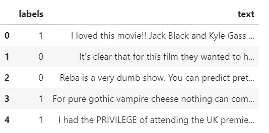

‘1’ positive and ‘0’ negative sentiment

使用下面这段代码。

```
**df_imdb = pd.read_csv(path/'movies_data.csv')
df_imdb.head()**#Loading only few training and validation samples, for quick training time
**trn_texts = df_imdb.loc[10000:14999, 'review'].values
trn_labels = df_imdb.loc[10000:14999, 'sentiment'].values
val_texts = df_imdb.loc[36000:38999, 'review'].values
val_labels = df_imdb.loc[36000:38999, 'sentiment'].values****np.random.seed(42)
trn_idx = np.random.permutation(len(trn_texts))
val_idx = np.random.permutation(len(val_texts))****trn_texts = trn_texts[trn_idx]
val_texts = val_texts[val_idx]****trn_labels = trn_labels[trn_idx]
val_labels = val_labels[val_idx]****col_names = ['labels','text']
df_trn = pd.DataFrame({'text':trn_texts, 'labels':trn_labels}, columns=col_names)
df_val = pd.DataFrame({'text':val_texts, 'labels':val_labels}, columns=col_names)**
```

我们使用来自培训的 5000 [每个标签 2500]和来自验证示例的 3000[每个标签 1500]。我使用较小的数据集来更快地完成训练，请使用完整的数据集来提高性能。

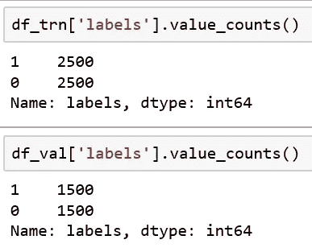

## 步骤 1:数据预处理

从原始文本创建数据集非常简单。该库提供了非常易于使用的 API[4]，根据我们的数据是如何构造的，创建一个数据类 TextDataBunch 用于文本处理，`from_csv`、`from_folder`、`from_df`更多细节请参考[文档](https://docs.fast.ai/text.data.html#TextDataBunch)。这里我们将使用`[TextLMDataBunch](https://docs.fast.ai/text.data.html#TextLMDataBunch)`的方法`from_df`来创建一个特定于语言模型的数据串:

```
# Language model data
**data_lm = TextLMDataBunch.from_df('./', train_df=df_trn, valid_df=df_val)**
```

这在幕后做了所有必要的预处理。让我们看看 fast.ai 是如何对数据进行编码的

```
**data_lm.show_batch()**
```

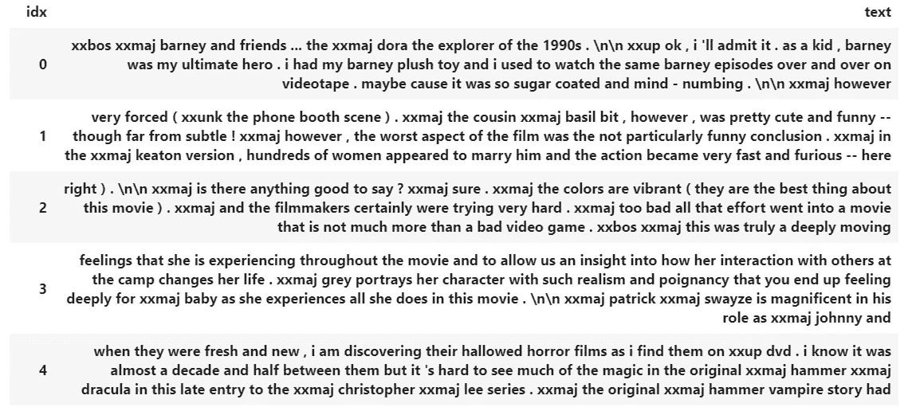

我们可以看到许多标签被应用于单词，如上所示。这是为了保留所有可用于收集对新任务词汇理解的信息。所有标点符号、标签和特殊字符也会被保留。该文本使用各种标记编码，如下所示:

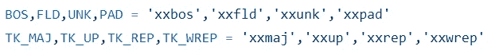

*   `**xxbos**`:句子的开始
*   `**xxfld**`:表示文档的独立部分，如标题、摘要等。，每个都将获得一个单独的字段，因此它们将被编号(例如`xxfld 1`、`xxfld 2`)。
*   `**xxup**`:如果所有的大写字母中都有东西，它会变成小写字母，一个名为`xxup`的标记会被添加进去。全大写的单词，如“我在喊”，标记为“`xxup i xxup am xxup shouting`”
*   `**xxunk**`:代币代替生僻字。
*   `**xxmaj**` **:** token 表示单词有大写。“The”将被标记为“`xxmaj the`”。
*   `**xxrep**` : token 表示重复的单词，如果你连续有 29 个`!`(即`xxrep 29 !`)。

**词汇表**:唯一可能的标记列表称为词汇表。下面按频率顺序列出了前 20 个唯一令牌:

```
**data_lm.vocab.itos[:20]
['xxunk', 'xxpad', 'xxbos', 'xxfld', 'xxmaj', 'xxup', 'xxrep', xxwrep', 'the', '.', ',', 'a', 'and', 'of', 'to', 'is', 'it', 'in', i', 'this']**
```

**数字化:**最后，机器更容易处理数字，因此用 vocab 中的记号位置替换记号:

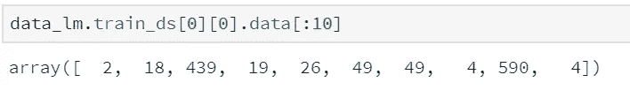

默认的 vocab 大小设置为 60，000 个单词，添加到 vocab 中的单词的最小计数为 2，以避免权重矩阵变大。

**保存和加载:**我们可以在预处理完成后保存数据串。我们也可以在需要的时候加载。

```
**# save and load
data_lm.save(**'tmp_lm'**)** **data_lm = TextClasDataBunch.load('./',** 'tmp_lm'**)**
```

## 步骤 2:创建语言模型

Fast.ai 有一个预训练的 Wikitext 模型，由从维基百科提取的 1.03 亿个令牌的预处理子集组成。这是一个理解很多语言和语言所描述的东西的模型。下一步是微调这个模型，并进行迁移学习，以创建一个新的语言模型，它特别擅长预测电影评论的下一个词。

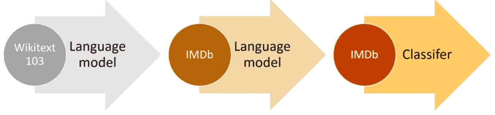

## 语言模型微调

这是训练的第一阶段，我们使用预训练的语言模型权重，并用 IMDb 电影评论的训练数据对其进行微调。当我们创建一个学习者时，我们必须传递两件事:

*   数据:我们的语言模型数据`(data_lm)`
*   预训练模型:这里，预训练模型是 Wikitext 103 模型，将从 fastai 为您下载。

```
# Language model
**learner = language_model_learner(data_lm, pretrained_model=URLs.WT103_1, drop_mult=0.5)**
```

`drop_mult`，超参数，用于正则化，设置漏失量。如果模型过度拟合，则增加它，如果拟合不足，则可以减少该数字。

**如何在我们的影评数据上对预训练好的模型进行微调？**学习率超参数是训练模型最重要的参数之一。Fast.ai 提供了一个方便的实用程序(`learn.lr_find`)来搜索一系列学习率，以找到最适合我们数据集的学习率。学习率查找器将在每次小批量后增加学习率。最终，学习率太高，损失会变得更严重。现在看看学习率与损失的关系图，确定最低点(下图中大约在`1e-1`附近)，然后返回一个数量级，选择它作为学习率(大约在`1e-2`附近)。

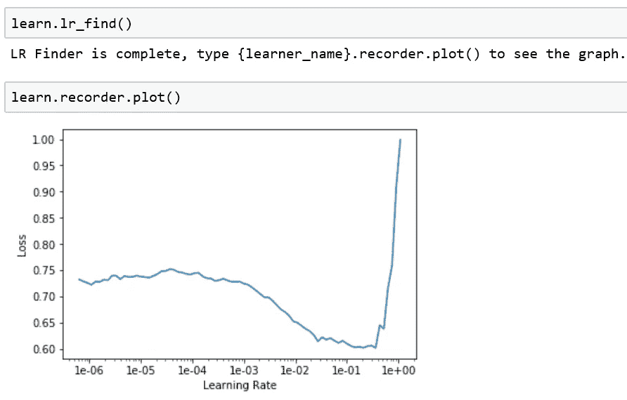

**训练模型:**

我们使用`fit_one_cycle.`以学习速率`1e-2`开始训练模型

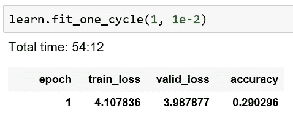

fast.ai 库使用深度学习研究的最新技术， ***单周期学习*** 来自最近的一篇[论文](https://arxiv.org/pdf/1803.09820.pdf)，结果证明比以前的任何方法都更准确、更快。第一个参数“1”是纪元运行次数。仅运行一个时期后，我们就获得了 29%的准确度。

它训练了最后几层，基本上保持了模型的大部分原样。但是我们真正想要的是训练整个模型。通常在我们微调了最后几层之后，我们要做的下一件事就是`unfreeze`(解冻整个模型进行训练)并训练整个模型。

```
**learn.unfreeze()
learn.fit_one_cycle(1, 1e-3)****epoch  train_loss  valid_loss  accuracy

1      3.897383    3.977569    0.302463**
```

准确度= 0.3 意味着该模型在大约三分之一的时间内正确猜测电影评论的下一个单词。这听起来是一个相当高的数字。所以这是一个好迹象，表明我的语言模型做得相当好。

## 用语言模型预测

为了评估我们的语言模型，我们现在可以运行`learn.predict`并传入一个句子的开头，指定我们希望它猜测的单词数。

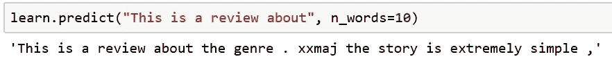

这是相当不错的回答，看起来像是正确的语法。在微调之后，我们得到了一个善于理解电影评论的模型，我们可以通过迁移学习对其进行微调，以将电影评论分为正面或负面。让我们保存模型的编码，以便稍后用于分类。

```
**learn.save_encoder('fine_enc')**
```

模型中能够理解句子的部分称为编码器。所以我们保存它，以便以后在分类阶段使用。

## 创建分类器

现在我们准备创建我们的分类器。第一步，创建一个数据串，从语言模型中传递词汇，确保这个数据串有完全相同的词汇。要使用的批量大小`bs`取决于您可用的 GPU 内存，对于 bs=64 左右的 16GB GPU 将工作良好。你可以找到任何适合你的卡批量，并相应地使用它。

```
# Classifier model data
**data_clas = TextClasDataBunch.from_df('./', train_df=df_trn, valid_df=df_val, vocab=data_lm.train_ds.vocab, bs=32)**
```

最后，我们将创建一个文本分类器学习器。载入我们的预训练模型，我们之前保存的编码部分`‘fine_enc’`。

```
# Classifier
**classifier = text_classifier_learner(data_clas, drop_mult=0.5)
classifier.load_encoder('fine_enc')**
```

同样，我们遵循相同的过程来找到学习率并训练模型。

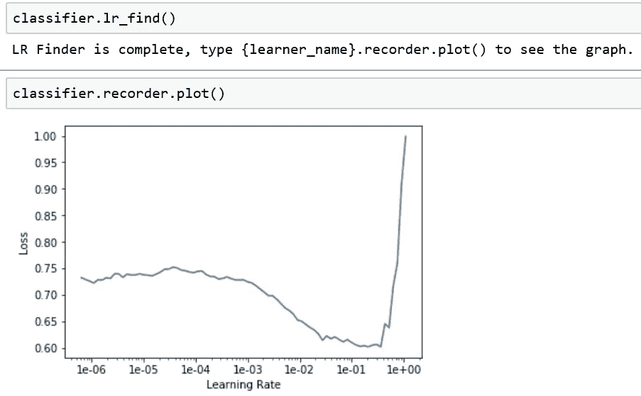

`2e-2` 附近的学习率似乎是正确的，因此让我们训练分类器:

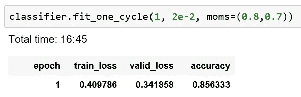

哇 85%的准确率在 16 分钟的训练和只使用 5K 训练和 3K 验证样本。这就是迁移学习的力量。

**损失图:**让我们在训练模型时绘制损失图:

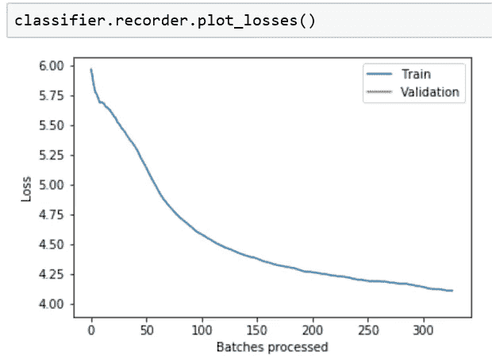

损失曲线似乎平稳下降，尚未达到饱和点。fastai 计算损失的指数加权移动平均线，从而使这些图表更容易阅读(通过使曲线更平滑),同时它可能比它们应该在的地方落后一两批。

## 深度学习超参数调整技术

让我们来理解 fast.ai 在如此令人印象深刻的结果下使用的技术。

**区别学习率:**从一层到另一层，对不同的层应用不同的学习率。在拟合模型时，您可以传递一个学习率列表，该列表将对每个*层组应用不同的学习率。*使用已调用`split`的`[Learner](https://docs.fast.ai/basic_train.html#Learner)`时，您可以通过四种方式设置超参数:

1.  `param = [val1, val2 ..., valn]` (n =层组数)
2.  `param = val`
3.  `param = slice(start,end)`
4.  `param = slice(end)`

如果我们选择在方式 1 中设置它，我们必须指定一些值，这些值正好等于图层组的数量。如果我们选择在方式 2 中设置它，选择的值将对所有层组重复。如果你通过了`slice(start,end)`那么第一组的学习率是`start`，最后一组是`end`，剩下的是平均分配。

如果你仅仅通过了`slice(end)`，那么最后一组的学习率就是`end`，其他所有组都是`end/10`。例如(对于我们有 3 个层组的学员):

```
**learn.lr_range(slice(1e-5,1e-3)), learn.lr_range(slice(1e-3))****(array([1.e-05, 1.e-04, 1.e-03]), array([0.0001, 0.0001, 0.001 ]))**
```

切片的底部和切片的顶部是模型的最低层学习速度与模型的最高层学习速度之间的差异。随着你从一层到另一层，我们降低了学习速度。最低级别被给予较小的学习速率，以便不太干扰权重。

## 适合一个周期

什么是 fit_one_cycle()？就是一个周期的学习率，开始低，上去，再下来。让我们使用`plot_lr`绘制每批的学习率

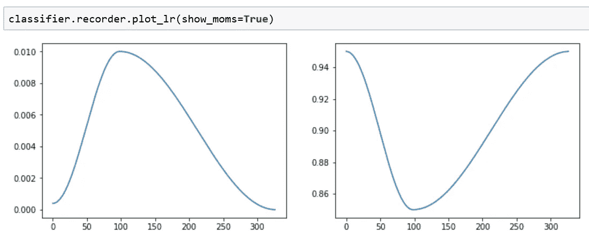

left: learning rate one cycle, right:momentum for one cycle

当我们调用 fit_one_cycle 时，我们实际上是在传递一个最大的学习速率。左侧图显示了学习率变化与批次的关系。学习开始很慢，大约一半的时间增加，然后大约一半的时间减少。当你接近最终答案的时候，你需要调整你的学习速度来磨练它。这背后的动机是，在学习过程中，当学习率较高时，学习率作为正则化方法工作，并防止网络过拟合。这有助于网络避开陡峭的损耗区域，更好地获得平坦的最小值。请参考 Leslie smith 的[这篇](https://arxiv.org/pdf/1803.09820.pdf)论文，其中详细讨论了神经网络超参数调整，您可以在 fastai 中找到这些想法的大部分。

## 动力

还有一个说法(`moms=(0.8,0.7)` )﹣momentums 等于 0.8，0.7。基本上对于训练递归神经网络(RNNs)来说，它确实有助于稍微降低动量。上面右边是动量图。每次我们的学习率小，我们的冲劲就大。这是为什么呢？因为随着你学习的速度越来越小，但你一直朝着同一个方向前进，你还不如走得更快(更高的动力)。但是由于你学习的学习率很高，但是你一直朝着同一个方向前进，你可能会超过目标，所以势头应该放缓。这一招可以帮你训练快 10 倍。

## 进一步微调:

为了进一步提高准确性，fast.ai 提供了一些更多的技巧；`freeze_to`。不要解冻整个东西，而是一次解冻一层。下面的方法效果很好，给出了令人难以置信的结果。

*   解冻最后两层`freeze_to(-2)`，多训练一点
*   解冻下一层`freeze_to(-3)`，多训练一点
*   解冻整个东西`unfreeze()`，多训练它一点点

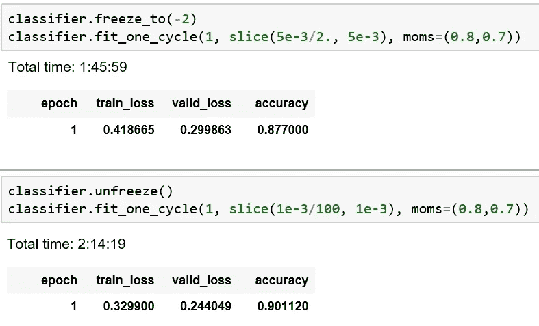

我们达到了 90%的准确率。 ***训练损失仍然高于验证损失，因此我们还没有过度拟合*** ，仍然有通过运行更多纪元来提高准确性的空间。

## 混淆矩阵

在分类问题中，使用一种叫做混淆矩阵的东西是非常有用的，它可以显示每个标签被正确预测了多少次。混淆矩阵是总结分类算法性能的好方法。

我们使用`*ClassificationInterpretation*`类来为我们做这项工作。

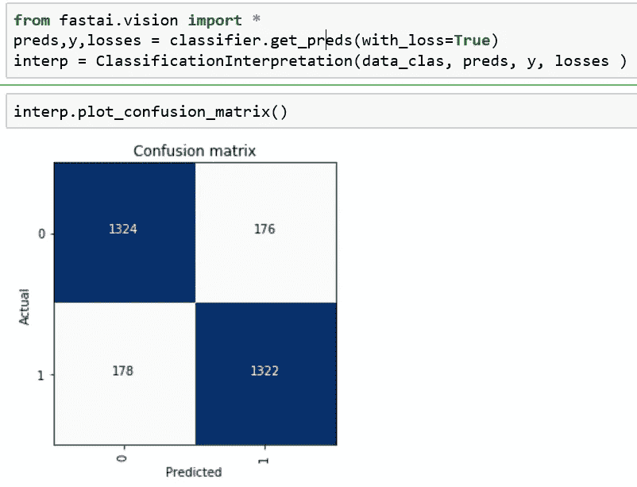

让我们使用我们的分类器来预测一些电影评论:

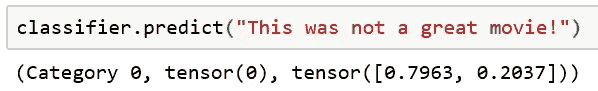

这被预测为' 0 '，负面评论。太棒了。！！

我们之前使用经典的机器学习方法[和](/machine-learning-text-processing-1d5a2d638958)对 IMDb 电影评论进行了情感分类，然后使用单词嵌入方法[和](/machine-learning-word-embedding-sentiment-classification-using-keras-b83c28087456)。使用 fast.ai 的语言建模方法是我见过的最简单也是最强大的工具。该库提供了非常易于使用的方法，只需几行代码，您就可以获得最先进的结果。请参考 jupyter 笔记本[这里](https://github.com/javaidnabi31/text_classification_fast_ai)。

## 结论

我们简要讨论了迁移学习在 NLP 问题中的应用。我们详细探讨了 fast.ai 库和不同的超参数调优技术。我们创建了一个语言模型，然后将其应用于文本分类问题。我希望你喜欢这篇文章，并学到一些新的有用的东西。

感谢您的阅读。

## 参考资料:

[1][http://ruder.io/nlp-imagenet/](http://ruder.io/nlp-imagenet/)

[2][https://towards data science . com/transfer-learning-in-NLP-for-tweet-stance-class ification-8ab 014 da 8d de](/transfer-learning-in-nlp-for-tweet-stance-classification-8ab014da8dde)

[https://course.fast.ai/](https://course.fast.ai/)

[https://docs.fast.ai/text.html](https://docs.fast.ai/text.html)

## 相关职位

[1][https://towards data science . com/transfer-learning-946518 f 95666](/transfer-learning-946518f95666)

[2][https://medium . com/@ nachiket . tanksale/finding-good-learning-rate-and-the-one-cycle-policy-7159 Fe 1 db 5d 6](https://medium.com/@nachiket.tanksale/finding-good-learning-rate-and-the-one-cycle-policy-7159fe1db5d6)

[3][https://blog.floydhub.com/ten-techniques-from-fast-ai/](https://blog.floydhub.com/ten-techniques-from-fast-ai/)