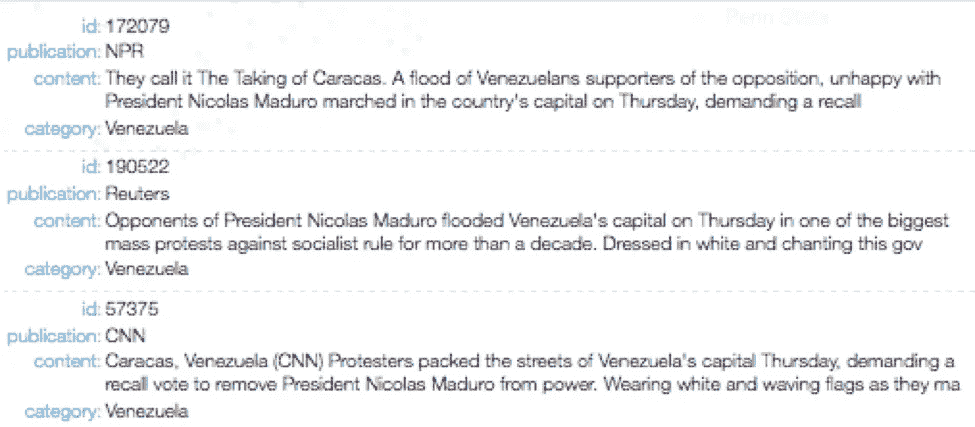
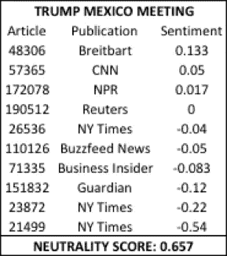

# 机器学习与新闻

> 原文：<https://towardsdatascience.com/machine-learning-versus-the-news-3b5b479d8e6a?source=collection_archive---------11----------------------->

发生了一些事情。只有一件事。但是如果你在网上关注新闻，你会发现对这一事件的描述如此不同，你想知道实际上发生了什么是情有可原的。有了机器学习，我们可以为此开发一个应用程序。

*【本文中的工作随后被应用于金融市场。这个项目在这里讨论过:* [*阅读市场——机器学习与金融新闻*](/reading-the-markets-machine-learning-versus-the-financial-news-bcd3704f37b8) *。】*

最近，我花了几个月的时间将自然语言处理(NLP)技术应用于一个大型新闻故事语料库。我的目标是找到一种方法来识别报道同一事件的新闻文章，然后评估这些文章，以了解媒体报道的一致性或均衡性。

最终，我提出了对个别文章和总体报道的评分。这些分数可用于多种目的:

*   在一个比我们的世界更乌托邦的世界里，它们将被集成到一个新闻阅读应用程序中，比如脸书。阅读新闻文章的用户将被呈现一个分数，该分数显示这篇文章在覆盖该故事的文章系列中的位置。然后可以引导他们阅读其他文章，以便对事件有更全面的了解。
*   在政治上，能够在所有媒体上跟踪一篇文章，并衡量情绪和共识，可能是跟踪民意和微调信息的有用工具。
*   在金融市场，衡量共识/分歧，而不仅仅是不同新闻来源的情绪，可能会成为交易决策的有用信号。

该解决方案是用 Python 构建的，需要结合 NLP 的许多工具。在最高级别上，问题可以分为主题挖掘(在 TF-IDF 矢量化的基础上使用一种聚类形式)和情感分析(使用谷歌云平台，VADER 斯坦福 CoreNLP)。让 NLP 按预期表现是一门微妙的艺术。在这种情况下，它需要大量的预处理步骤(词汇化、词性过滤、n 元语法等。)和附加库，如 NLTK 和 spaCy。

本报告由两个主要部分组成。第一部分涉及问题的背景——即对媒体和偏见不可避免性的简要回顾。第二部分给出了问题的解决方案，描述了它的各个组成部分。

所以，如果你对问题的背景感兴趣，从第一部分开始。如果你渴望得到答案，向下滚动到第二部分。(如果你非常好奇，可以得到一份更详细的技术报告。完整的代码可以在项目的 [GITHUB 库](https://github.com/jameslucasbaker/Capstone)中找到。)

## 第一部分:问题

媒体通常对一个故事的基本事实达成一致。但是他们可能仍然不同意人们应该如何看待他们。这是因为尽管事实是清楚的，但它们的含义是模糊的——因此两篇文章对同一个故事持完全相反的观点是完全合理的。

这是真的，只要看一看 2016 年 6 月 29 日两家主要出版物关于班加西专家组报告发布的单一新闻报道就可以确定:

Headlines from June 29, 2016

根据我们看到的头条新闻，我们会认为该小组的报告对克林顿来说是好消息，或者是坏消息。

出于几个原因，关于班加西事件的报道非常吸引人。首先:这两个标题并不明显矛盾，但它们显然以非常不同的方式强调了重点。第二:两篇文章的内容没有什么特别的不同——只是标题不同。第三:这两份出版物中的标题后来都被修改了(在付印后),以使其听起来更加平衡。文章的当前版本可以在[这里](https://www.washingtonpost.com/world/national-security/house-republicans-issue-report-on-benghazi-attacks-but-find-no-new-evidence-of-wrongdoing-by-clinton/2016/06/28/ca6abd60-3d37-11e6-80bc-d06711fd2125_story.html)和[这里](https://www.nytimes.com/2016/06/29/us/politics/hillary-clinton-benghazi.html)找到。

很容易认为事情没那么糟，因为报纸最终接受了更加中立的报道。但这可能会忽略一个更广泛的问题:很多观点是在 Twitter 的即时舞台上形成的，在那里，这些文章可能会使用它们最初的标题进行推广。他们修改后的化身对公众舆论的影响会更小。

此外，研究表明，读者从阅读文章中获得的情感更多地是由标题而不是内容驱动的。(例如，见心理学家和认知神经科学家乌烈芝·埃克在*实验心理学杂志上的工作:应用* [这里](https://psycnet.apa.org/record/2014-44652-001))

同样值得注意的是，这两份报纸都可以被视为中间偏左。皮尤研究中心的一项研究将《纽约时报》放在比《华盛顿邮报》更靠左的位置。那项研究衡量的是读者，而不是新闻，但在竞争激烈的市场中，有理由相信大多数读者都在看他们认同的新闻。此外，我们看到，即使是这种观点上的微小差异，也会产生完全不同的标题——人们只能想象，如果我们拓宽视野，把所有媒体都包括进来，我们会发现怎样的多样性。

总结这种情况的一个简单方法是，即使主流媒体也以不同的情绪报道同样的事件。因此，确定这些事件对我们读者的意义并不简单。毫无疑问，会有读者满足于自己的偏见和成见被强化。但是也有一些读者希望对世界有一个更平衡的理解——这个项目就是为他们而设的。

## 第二部分:解决方案

那么，该怎么办呢？从数学上来说，我们可能倾向于认为，要想知道真实的本质，我们必须阅读报道事件的每一篇文章。不知何故，我们会将所有的噪音平均掉，留下一个关于潜在事件及其影响的消息灵通和无偏见的观点。但是有两个问题:

1.  不成比例的一部分媒体可能会用一个声音说话，因此噪音不会平均化，以揭示一些真相。
2.  无论如何，阅读每一篇发表的文章都需要极大的自律。

这种纪律虽然值得称赞，但并不是实用主义者对现代世界生活的首选方式——在现代世界，不知情的人可能会淹没在信息的海洋中。这位实用主义者知道我们缺乏这一学科，于是开始寻找算法解决方案。

从广义上讲，该算法必须首先从覆盖我们感兴趣的故事的媒体中识别出一组文章。鉴于发表的文章数量庞大，这不是一个微不足道的问题，但完全可以解决。接下来，分析该组文章以确定:

*   它们包含不同观点的程度。
*   其中，在各种观点中，任何特定的文章排名。

有了这些信息，我们可以:

*   了解我们正在阅读的文章是否是从极端视角写的。
*   提出另一篇文章来阅读，这将对故事有更细致入微的理解。
*   对总覆盖率的中立性进行评分。

使聚集

第一步大致对应于聚类。与自然语言处理的许多方面一样，提取有用的含义是一门手艺。在这种情况下，我们只需要为每篇文章准备一组单词，并希望将这些文章归入涵盖相同故事的那些文章中。最终，语料库中的每篇文章都被替换为 TF-IDF 向量，该向量实际上是其相对信息内容的抽象数字表示。(稍后将详细介绍这一点。)如果我们小心我们的预处理和参数校准，那么向量空间中的近邻可以被可靠地判断为属于同一故事的文章。

该游戏变成了执行 NLP 库中的一组预处理步骤之一。其中包括:

*   **去除腐败文章** —最起码可以发现语料库中有很多文章是没有帮助的。它们可能是腐败的，它们可能是包含许多故事中的每一个的句子的摘要文章，等等。当然，这些文章不是我们为了更好地理解一个故事而推荐阅读的文章。
*   **关注文章的第一部分**——一篇新闻文章的结构通常是这样的，前几个句子(lead 或 lede)说明了故事的人、事、原因、时间、地点和方式。包含在文章的这一部分中的术语更可能在报道相同故事的文章之间共享。
*   **同义词替换** —一些实体可以用多种方式引用。如果两个相关的文章以不同的方式引用实体，它们就不太可能被正确配对。为了降低这种风险，常见的同义词被联合起来。比如联邦调查局，FBI，F.B.I .都翻译成 FBI。
*   **词性限制** —不同的词性在文章的实际主题上传达了不同的信息量。例如，专有名词可能是最重要的，动词将包含一些信息，形容词通常很少。因此，剔除信息较少的词类有助于提高文章分组的鲁棒性。当然，这需要用算法分析文章，给每个单词分配一个角色。
*   **词汇化** —矢量化本质上并不理解单词之间的关系。例如，同一个词根可以用不同的时态表达，等等。如此选举，被选举，选举，选举，选举等。可能指的是同一件事。词汇化是用词根替换单词的过程。这具有增加两个相关文章在向量空间中更接近的机会的优点。
*   **N-grams** —连续词被分组，并在矢量化中用作组合词。这样做的目的是利用这样一个事实，即如果两个术语在两篇文章中相邻出现，那么这些文章比它们出现在文章的不同部分更有可能相关。例如，一篇提到希拉里·克林顿会见比尔·盖茨的文章可能会与一篇关于比尔·克林顿的文章配对，除非我们包含了二元模型——希拉里的文章不会包含“比尔·克林顿”，因此不太可能配对。
*   **停用词抑制** —这一步简单地删除定义列表中包含的任何过于常见而无法传达有用信息的词。这降低了向量的维数，但是可能不会显著改变聚类，因为这种常见术语的 IDF 分数将非常低。

目的是生成尽可能集中于传达与故事相关的信息的术语的向量，这些术语是最有可能与覆盖相同故事的其他文章共享的术语，而不太可能出现在不同故事的文章中。

这些步骤可以在许多常见的 NLP 库中执行，并取得不同程度的成功，比如 NLTK 和 spAcy。完成后，使用 sklearn 将每篇文章转换成一个 TF-IDF 向量。

TF-IDF 矢量化是一种流行的主题挖掘方法。它用一个向量表示语料库中的每个文档。该向量包含组合字典中每个术语的值。当文档的主题与术语相关时，值本身是高的，否则是低的。因此，出现在许多文档中的单词被认为传达了很少的信息来区分主题。并且在文档中出现多次的单词被认为对于区分主题更有意义。然后，TF-IDF 值实际上是一个术语在文章中出现的次数，以及该术语在所有提供的文档的语料库中具有的主题区分能力的乘积。

如果我们观察 2016 年某一天一组媒体上的新闻文章，我们会发现一系列非常高维的向量。虽然这些高维向量用于我们执行的处理，但为了可视化正在发生的事情，有必要应用一些标准的数学技术，并将它们的值映射到二维的近似值。这给了我们这样一个图表:

Story clusters inferred from news articles of 2016–09–01

图中的每个点对应一篇文章。用颜色编码的聚类中的文章是算法已经确定的关于相同主题的文章。(为了增加可靠性，这种确定需要用一种新的亲和力度量来代替通常的欧几里得距离。详细情况在完整的项目报告中提供。)

请注意中心区域的大量蓝点。这些文章都是报道他们特殊故事的唯一文章。因为它们是故事中唯一的文章，它们的向量包含低 TF-IDF 值，因此它们聚集在图形中心的原点周围。

这种转变的力量令人印象深刻。乍一看，似乎是“Penn State”的一个粉红色点，实际上是来自几乎相同的向量的一系列三个点，只有放大几次才能看到。

快速浏览一下这些文章的开头可以发现，虽然它们属于同一个故事，但它们肯定不是相同的词汇列表。

Related news articles on the Joe Paterno anniversary

委内瑞拉抗议的故事同样包含三篇极其接近的文章:

Related news articles on the Venezuela protests

在这两种情况下，显而易见的是，该算法成功地将主题从数千篇文章中分离出来，聚类在确定哪些文章足够接近以至于可以被指定为报道同一故事方面做得很好。虽然这些文章之间的联系对人的眼睛来说是显而易见的，但是一旦我们后退一步，想想成千上万的新闻文章，每一篇都有一系列的许多单词，每个单词都传达不同程度的信息，那么我们就可以开始看到，为了得出结论，大脑本身一定在做一些非常聪明的处理。

那么，现在我们已经找到了这组文章，我们可以用它做什么呢？

文章排名

为了给文章排序，我们需要找到一个轴来衡量它们。假设文章反映了相同的事件集合，应该可以利用情感分析的工作来进行评估和排名。

这个过程有几个步骤:

*   恢复文章的原始版本(从词条化之前，等等)。
*   将每篇文章转换成一个句子列表(使用 NLTK)。
*   将分析限制在每篇文章的前 n 个句子。(一项全面的网格搜索发现，辨别情绪的最佳值是每篇文章 10 句左右。)
*   计算每篇文章的情感。这是通过用户在斯坦福 CoreNLP、谷歌云平台的 NLP 库和 Vader 的 NTLK 实现之间的选择来完成的。
*   根据每个库的规模的含义，将结果转换为 in -1/+1。
*   进一步调整结果以考虑 NLP 库实际上可以返回全范围值的可能性。对谷歌来说，对数千篇新闻文章的分析表明，合适的比例是除以 0.86。(与其他图书馆相比，这是一个较小的调整，可能反映了每个图书馆都是针对不同类型的数据进行训练/校准的——谷歌是针对最广泛的数据进行训练的。)
*   最后，组成一个故事的文章的经缩放的标准化情感值被作为输入来计算该故事的总覆盖的中立性得分。

中立分数是使用专门为此项目设计的新公式计算的:

这里 *count(x，y)* 统计从 *x* 到 *y* 范围内有情绪的文章数量。

这个概念非常松散地受到维基百科编辑指南的启发，特别是它对“中立观点”的定义，这意味着包括所有可证实的观点，而不过度重视其中任何一个。该公式在项目的[完整技术报告中有相当详细的讨论。](https://github.com/jameslucasbaker/Capstone/raw/master/capstoneReportUPDATED.pdf)

## 第 3 部分:一些结果

处理主观数据的挑战是找到一种客观的方法来验证结果。对于这个项目，基本的方法是获取一个故事的文章，计算每篇文章的分数，然后计算报道的中立性。然后，这些值被排序，并与前述皮尤量表上文章出版商的相对位置相关联(见本报告)。

显然，这不是一个完美的比较——例如，《纽约时报》的专栏文章可能会也可能不会与该报的总体社论倾向保持一致。但如果我们拿一个故事来说，关于特朗普与墨西哥总统会晤的报道，我们会得到以下内容:

结果似乎表明，媒体机构越左倾，对会议的负面报道就越多。布莱巴特的报告最为热情。CNN 在数字上基本保持中立。路透社完全中立。《卫报》与《纽约时报》争夺最负面的报道。

更多案例见[技术报告](https://github.com/jameslucasbaker/Capstone/raw/master/capstoneReportUPDATED.pdf)。

## 第四部分:几点结论

该项目应用了许多不同的概念，试图回答最初的问题“如何找到并提出一篇以不同方式报道同一故事的文章”？可以得出以下结论:

*   将文章聚集成故事看起来效果很好，但是需要扩展测试来验证这种观点。然而，时间和资源总是这类工作的主要制约因素。
*   中立分数做了一些看起来有意义的事情，但需要进一步增强才能变得真正强大。为了真正了解结果的有效性，可能有必要考虑完全不同的测试方法。对问题进行富有想象力的分解可能会产生一个可以交给机器人的任务。
*   追踪一个故事随时间的演变会很有趣。只要对算法稍加修改，这应该是可行的。

我的主要结论是，新闻文章本质上是复杂的——衡量它们的情绪并不简单。相对于潜在故事/事实的情绪来考虑文章的情绪可能是值得的。这可以更清楚地表明报告中的任何偏见。此外，所报告的语音的情感可能需要与文章其余部分的情感区别对待。我们应该考虑一下，未来新闻机构是否有可能以一种游戏比分的方式来撰写文章——也许是通过掩盖领先优势。这也可以通过标记主角的情绪与文章其余部分的情绪明显偏离的情况来规避。

*【本文中的观点随后被扩展并应用于金融市场。这里介绍了这个项目:* [*阅读市场——机器学习与金融新闻*](/reading-the-markets-machine-learning-versus-the-financial-news-bcd3704f37b8) *。]*

## 第 5 部分:所有细节

这篇文章很长，但不足以深入细节。对于这一点，以及更多的例子，这里是到技术报告和源代码库的链接的最后一个提示:

*   该项目的技术报告可在[此处](https://github.com/jameslucasbaker/Capstone/raw/master/capstoneReportUPDATED.pdf)获得。
*   底层 Python 代码，包括几个 Jupyter 笔记本可以在 [GitHub](https://github.com/jameslucasbaker/Capstone) 上找到。