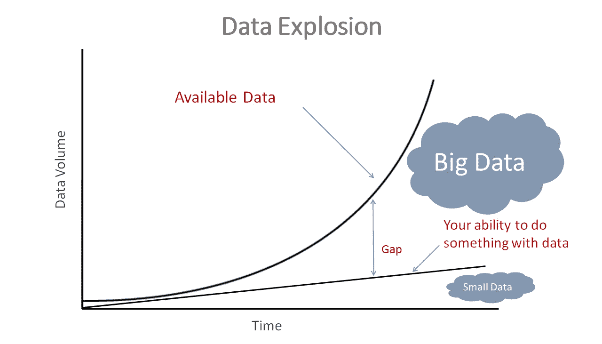
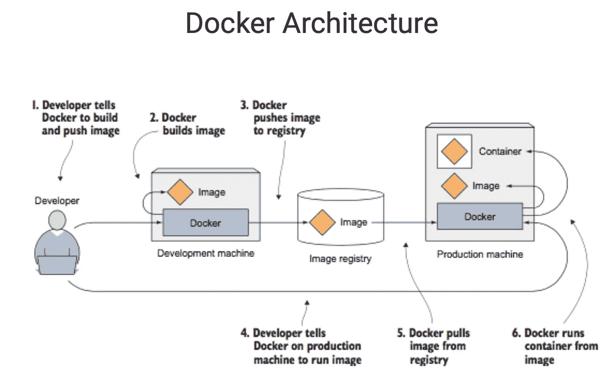
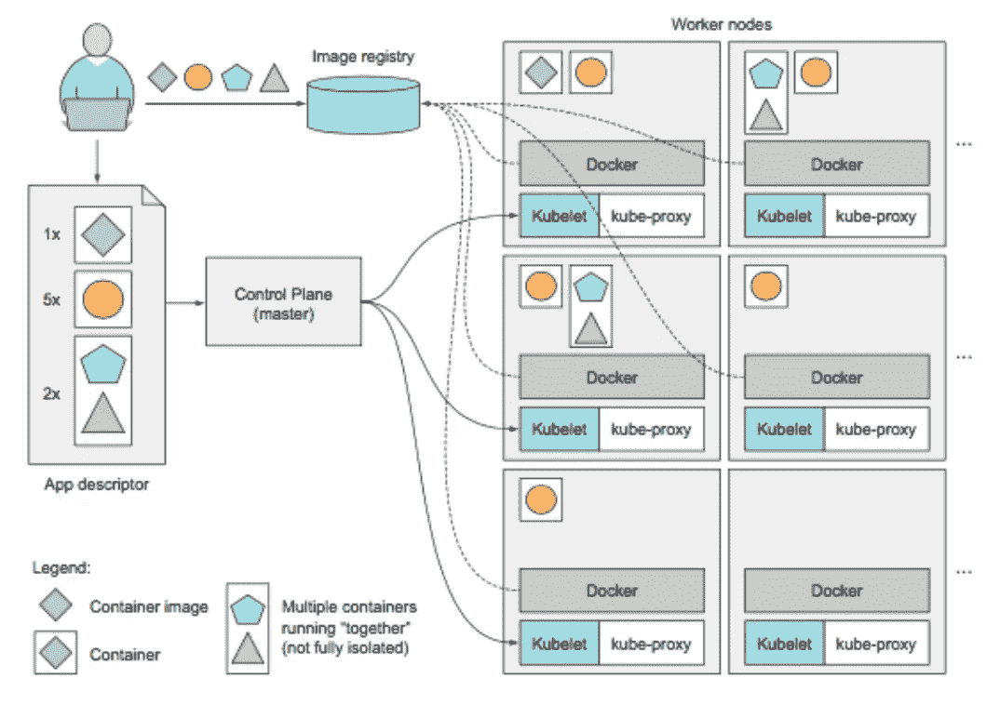

# 为机器学习处理大数据集

> 原文：<https://towardsdatascience.com/machine-learning-with-big-data-86bcb39f2f0b?source=collection_archive---------7----------------------->

每天都会产生超过 25 万亿字节的数据。世界上 90%的数据都是在过去两年产生的。数据的盛行只会越来越大，所以我们需要学习如何处理这样的大数据。

> “大数据就像青少年性行为:每个人都在谈论它，没有人真正知道如何去做，每个人都认为其他人都在做，所以每个人都声称自己在做。”—丹·艾瑞里



想象一下，下载一个包含所有已写推文的数据集，或者脸书所有 23 亿人的数据，甚至是互联网上所有网页的数据。如何分析这样的数据集？

这不是一个孤立的问题，只影响最大的科技公司。在当今时代，数据集已经变得超出了大多数计算机的处理能力。我经常处理卫星数据，这些数据很容易就达到 TB 级——太大了，甚至不适合我的计算机硬盘，更不用说在合理的时间内处理这些数据了。以下是一些令人大开眼界的大数据统计数据:

*   每分钟发送超过 1600 万条短信
*   每分钟都有超过 1 亿封垃圾邮件发出
*   每分钟都有超过一百万次的打火
*   每天，超过 10 亿张照片被上传到 Google 相册

存储这些数据是一回事，但如何处理这些数据并开发机器学习算法来处理这些数据呢？在本文中，我们将讨论如何在云上轻松创建可扩展的并行化机器学习平台，以处理大规模数据。

这可以用于研究、商业或非商业目的，并且与开发自己的超级计算机相比，可以以最小的成本完成。

为了在云上开发一个非常健壮和高性能的并行集群(这也可以在本地机器上使用以提高性能),我们将深入研究以下主题:

*   **环境设置**
*   **与 Dask 和 Kubernetes 并行**
*   **Dask 云部署**
*   **AWS 上的云部署示例**

这篇文章将基于以下 GitHub 库的内容，可以在这里找到。在云上建立机器学习平台所需的所有命令都可以在 markdown 文件[这里](https://github.com/mrdragonbear/dasktut/blob/master/AWS-Kubernetes.md)中找到。这是基于哈佛大学[应用计算科学研究院](https://iacs.seas.harvard.edu/)的一份指导。

**环境设置—码头和集装箱**

如果你只看了这个帖子的一部分，就让它是这个部分吧。

当人们建立他们的机器学习环境时，通常他们会将所有的东西直接安装在他们的操作系统上。通常情况下，这没什么，然后你试图下载 PyTorch、TensorFlow 或 Keras 之类的东西，所有东西都爆炸了，你花了几个小时在栈溢出上，试图让东西工作。为了你自己，我恳求你不要这样工作。

这个问题通常是由于某些包对其他包的特定版本的依赖性或相互依赖性而产生的。通常，您的工作并不需要这些包中的一半。更合理的做法是从头开始，只安装手头任务所需的版本和依赖项。这将最终节省你的时间和压力。

如果您正在使用 Anaconda，那么将它们分离到隔离的“容器”中是非常容易和有效的，这样它们都可以运行而不会引起问题。这些容器被称为康达环境。Conda 是 Python 的一个包管理器

您可以将这些环境想象成互不知道对方存在的不同计算机。当我创建一个新环境时，我从一张白纸开始，需要再次安装软件包。最重要的是，你不需要两次下载软件包。当你这样做的时候，会创建一个指针，指向你想要安装的软件包的特定版本，这个版本已经下载到你的计算机上了。

这可能看起来毫无意义，除非你以前在你的电脑上有过依赖问题，但是我可以向你保证这是值得了解的。另一个有用的特性是，你可以在一行中安装所有你喜欢的包，只需使用 YAML(。yml)文件。这是一个文件，它告诉环境您想要安装什么包以及需要下载什么依赖项。您不需要编写这个文件，它可以用一行代码从您已经拥有所有必需的包的环境中导出——非常简洁，对吗？所有需要的命令都显示在下面的要点中。

Example of Linux commands to easily create new environments and dependency files.

下面是运行`conda env export > environment.yml`命令时 YAML 文件的样子。

将事物分成这样的环境还有另一个很好的理由。如果我想得到我正在做的数据分析的可再现的结果，它可能广泛地依赖于不同包的版本以及你正在工作的操作系统。通过创建包含所有依赖项的 environment.yml 文件，别人可以更容易地重现您的结果。

那么我们在创建康达环境的时候做了什么呢？我们基本上把它和我们系统的其他部分隔离开了。然而，如果我们想要在不仅仅是 Python 包的环境中使用额外的东西呢？在这种情况下，我们使用 **Docker** 来创建**容器。**

如果您的应用:

*   **使用服务器**(例如预载数据的数据库服务器)，以及
*   你想把这个服务器和它的数据以及你的应用程序和它的 Python 环境分发给其他人(比如一个开发伙伴或者一个客户)，

使用 **Docker** 可以****将整个事情“集装箱化”。****

****在这种情况下，所有这些组件都将**封装在 Docker 容器**中:****

*   ******应用程序本身**，****
*   ****可以运行你的应用程序的 **Conda 环境**(因此一个兼容的 Python 版本和包)，****
*   ****运行应用程序所需的**本地服务器或服务**(例如:数据库服务器和 web 服务器)****

********

****我承认 Docker 和 containers 背后的概念有点混乱。建立 docker 形象不是一件小事。然而，幸运的是，Jupyter 的人为此创造了 **repo2docker** 。repo2docker 取一个 GitHub 库，自动制作一个 docker 映像，并上传到 docker 映像库给你。这可以用一行代码来完成。****

****运行上面的代码后，您应该在终端中弹出一些代码，如下所示:****

```
**Copy/paste this URL into your browser when you connect for the first time,
    to login with a token:
        http://0.0.0.0:36511/?token=f94f8fabb92e22f5bfab116c382b4707fc2cade56ad1ace0**
```

****只需将 URL 复制并粘贴到您的浏览器中，然后您就可以访问您的 docker 图像并开始工作了！你可以在这里阅读更多关于使用 repo2docker [的内容。](https://github.com/jupyter/repo2docker)****

****另一个真正有用的东西是**活页夹。Binder 建立在 repo2docker 的基础上，提供了一种服务，你可以在其中提供一个 GitHub 库，它给你一个工作的 JupyterHub，你可以在其中“发布”你的项目、演示等。通过点击 ReadMe 部分的链接，可以在 binder 上运行与本教程相关的 GitHub 库。******

****你可以在这里阅读更多关于使用活页夹的信息。****

******与 Dask 和 Kubernetes 并行******

****我们花了很长时间才到达本教程的并行化部分，但是前面的步骤是到达这里所必需的。现在让我们开始使用 Dask 和 Kubernetes。****

*   ******Dask**——Python 中的并行计算库****
*   ****Kubernetes - 一个用于自动化应用程序部署、扩展和管理的开源容器编排系统。****

****Dask 有两个相关部分:****

****[1]针对气流等计算进行了优化的动态任务调度。****

****[2]“大数据”集合，如并行(Numpy)数组、(Pandas)数据帧和列表。****

****Dask 出现只有几年时间，但由于 Python 在机器学习应用中的流行，它的势头正在逐渐增长。Dask 允许对 Python 应用程序进行扩展(1000 核集群),因此它们的处理速度比普通笔记本电脑快得多。****

****我建议任何对 Dask 感兴趣的人参考 Tom Augspurger(Dask 的主要创建者之一)的 GitHub 知识库，可以在这里找到。****

****我们已经讨论了 Dask，Kubernetes 在这里起什么作用呢？如果我们在笔记本电脑上运行 Dask，它允许我们一次将代码分发到多个内核，但它不能帮助我们同时在多个系统上运行代码。我们已经在本地运行了。理想情况下，我们希望在云配置的集群上运行，并且我们希望这个集群能够自我修复——也就是说，我们希望我们的代码能够对故障做出响应，并在需要时扩展到更多的机器上。我们需要一个集群管理器。****

****Kubernetes 是一个集群管理器。我们可以把它想象成集群的操作系统。它提供服务发现、扩展、负载平衡和自我修复。Kubernetes 认为应用程序是无状态的，可以从一台机器移动到另一台机器，以便更好地利用资源。有一个运行集群操作系统的控制主节点和执行大部分工作的工作节点。如果一个节点(与集群相关的计算机)失去连接或中断，主节点会将工作分配给新的人，就像你停止工作时你的老板会做的那样。****

****主节点和工作节点由允许其执行任务的几个软件组成。它变得相当复杂，所以我将快速给出一个高层次的概述。****

******主节点**:****

*   ****API 服务器，主节点和用户之间的通信(使用 kubectl)****
*   ****调度程序，为每个应用程序分配一个工作节点****
*   ****控制器管理器执行集群级功能，如复制组件、跟踪工作节点、处理节点故障****
*   ****etcd 是一个可靠的分布式数据存储，它持久地存储集群配置(在给定时间哪个工作节点在做什么)。****

******工人节点**:****

*   ****码头工人，运行你的集装箱****
*   ****将应用程序的组件打包成一个或多个 docker 映像，并将它们推送到注册表中****
*   ****Kubelet，它与 API 服务器对话并管理其节点上的容器****
*   ****kube-proxy，它在应用程序组件之间负载平衡网络流量****

********

****The configuration of a Kubernetes cluster.****

****做所有这些都很棒，但是除非我们有 100 台计算机可以利用 Kubernetes 和 Dask 提供给我们的能力，否则这并没有特别大的帮助。****

****进入云端。****

******Dask 云部署******

****如果你想用 Python 运行 Dask 来加速你的机器学习代码，Kubernetes 是推荐的集群管理器。这可以在您的本地机器上使用 Minikube 完成，也可以在 3 个主要的云提供商(Microsoft Azure、Google Compute Cloud 或 Amazon Web Services)上完成。****

****你可能对云计算很熟悉，因为现在它几乎无处不在。现在，公司将所有计算基础设施都放在云上是非常常见的，因为这可以减少他们在计算设备上的资本支出，并将其转移到运营支出，需要更少的维护，还可以显著降低运营成本。除非您处理的是机密信息或者有非常严格的法规要求，否则您可以在云上运行。****

****使用云允许您利用几台机器的集体性能来执行相同的任务。例如，如果您正在神经网络上执行超参数优化，并且需要重新运行模型 10，000 次以获得最佳参数选择(这是一个相当常见的问题)，那么如果需要 2 周时间，在一台计算机上运行它将是没有意义的。如果你能在 100 台计算机上运行同样的模型，你可能会在几个小时内完成任务。****

****我希望我已经很好地解释了为什么您应该使用云，但是请注意，如果您使用非常强大的机器(特别是如果您在使用它们之后没有关闭它们，那么它会变得非常昂贵！)****

****要在云上设置环境，您必须执行以下操作:****

1.  ****建立一个 **Kubernetes** 集群****
2.  ****设置**Helm**(Kubernetes 的包管理器，它就像是 Kubernetes 集群的自制程序)****
3.  ****安装 **Dask** 。****

****首先运行以下命令****

```
**helm repo update**
```

****然后****

```
**helm install stable/dask**
```

****详见[https://docs.dask.org/en/latest/setup/kubernetes-helm.html](https://docs.dask.org/en/latest/setup/kubernetes-helm.html)。****

******云上深度学习******

****有几个有用的工具可用于用 Kubernetes 和 Dask 构建深度学习算法。例如，TensorFlow 可以使用 **kubeflow** 的`tf.distributed`放到云上。由于不同的模型可以在每个工作节点上运行，因此并行性可以在网格优化过程中得到广泛应用。例子可以在 GitHub 库[这里](https://github.com/mrdragonbear/dasktut)找到。****

******你用什么？******

****对于我自己的研究(我是一名环境科学家)和我的咨询工作(机器学习顾问)，我经常使用 JupyterHub，一个在哈佛的超级计算机 Odyssey 上带有 Dask 的 Kubernetes 集群，或者我将在 AWS 上运行相同的基础设施(对 Azure 或谷歌云没有真正的偏见，我只是先学会如何使用 AWS)。****

******AWS 上的云部署示例******

****在这一节中，我将介绍在 AWS 上运行 Dask 的 Kubernetes 集群的设置。您需要做的第一件事是在 AWS 上设置一个帐户，除非您已经有了一个帐户，否则您将无法运行以下代码行。****

****首先，我们下载 AWS 命令行界面，并用 AWS 提供的私钥对其进行配置。然后，我们使用 brew 命令为 Kubernetes 安装亚马逊的弹性容器服务(EKS)。****

```
**pip install awscli
aws configure
brew tap weaveworks/tap
brew install weaveworks/tap/eksctl** 
```

****创建一个 Kubernetes 集群现在简单得可笑，我们只需要运行一个命令，但是您应该指定集群名称、节点数量和您所在的地区(在这个例子中，我在波士顿，所以我选择了`us-east-1`)然后运行这个命令。****

```
**eksctl create cluster --name=cluster-1 --nodes=4 --region=us-east-1**
```

****现在，我们必须使用以下命令配置集群:****

```
**kubectl get nodes
kubectl --namespace kube-system create sa tiller
kubectl create clusterrolebinding tiller --clusterrole cluster-admin --serviceaccount=kube-system:tiller**
```

****现在我们在集群上设置 Helm 和 Dask****

```
**helm init --service-account tiller**
```

****等待两分钟完成，然后我们可以安装 Dask。****

```
**helm version
helm repo update
helm install stable/dask
helm status agile-newt
helm list
helm upgrade agile-newt stable/dask -f config.yaml
helm status agile-newt**
```

****更多的 Kubernetes 命令。****

```
**kubectl get pods
kubectl get services**
```

****要了解更多细节和 shell，您需要一个类似这样的命令。你们确切的豆荚名称会有所不同。****

```
**kubectl get pod agile-newt-dask-jupyter-54f86bfdd7-jdb5p
kubectl exec -it agile-newt-dask-jupyter-54f86bfdd7-jdb5p -- /bin/bash**
```

****一旦您进入集群，您就可以克隆 GitHub 存储库并观看 Dask 运行了！****

******卡格尔·罗斯曼竞赛******

****我建议一旦你已经启动并运行了 Dask cloud 部署，你就试着运行一下`rossman_kaggle.ipynb`。这是来自 Kaggle Rossman 竞赛的示例代码，它允许用户使用他们想要的任何数据来尝试和预测欧洲的药店销售。比赛于 2015 年举行。****

****本笔记本中的步骤向您介绍了如何为多层感知器设置编码环境，以便将其应用于并行集群，然后执行超参数优化。这段代码中的所有步骤都被分解成函数，然后在 sklearn 管道中运行(这是运行大型机器学习程序的推荐方式)。****

****存储库中还有其他几个例子，您可以在并行集群上运行并使用它们。此外，可以随意克隆存储库并随意修改。****

****从哪里可以了解更多信息？****

****要了解有关 Dask 的更多信息，请查看以下链接:****

****[](https://github.com/dask/dask-tutorial) [## dask/dask-教程

### Dask 教程。在 GitHub 上创建一个帐户，为 dask/dask-tutorial 开发做贡献。

github.com](https://github.com/dask/dask-tutorial)  [## Dask - Dask 1.1.4 文档

### 在内部，Dask 以一种简单的格式对算法进行编码，包括 Python 字典、元组和函数。此图表格式…

docs.dask.org](https://docs.dask.org/en/latest/) 

要通过 Kubernetes 了解有关 Dask 的更多信息:

[](https://github.com/dask/dask-kubernetes) [## 达斯克/达斯克-库伯内特斯

### dask 的本地 Kubernetes 集成。创建一个帐户，为 dask/dask-kubernetes 的发展做出贡献

github.com](https://github.com/dask/dask-kubernetes)  [## Dask Kubernetes-Dask Kubernetes 0 . 7 . 0 文档

### 目前，它被设计为从 Kubernetes 集群上的一个 pod 上运行，该集群拥有启动其他 pod 的权限…

kubernetes.dask.org](http://kubernetes.dask.org/en/latest/) 

要了解更多关于 Helm 的信息:

 [## Kubernetes 和 Helm - Dask 1.1.4 文档

### 如果不是这样，那么您可以考虑在一个常见的云提供商上建立一个 Kubernetes 集群…

docs.dask.org](http://docs.dask.org/en/latest/setup/kubernetes-helm.html) 

如果您正在努力完成上述任何步骤，有多个其他演练可以更详细地介绍具体细节:

 [## 将 Dask 和 Jupyter 添加到 Kubernetes 集群

### 在本文中，我们将在运行于 AWS 上的 Kubernetes 集群上设置 Dask 和 Jupyter。如果你没有…

ramhiser.com](https://ramhiser.com/post/2018-05-28-adding-dask-and-jupyter-to-kubernetes-cluster/)  [## 在 Jetstream 上的 JupyterHub 旁边的 Kubernetes 中设置私有 dask 集群| Andrea Zonca 的博客

### 在本帖中，我们将利用 Pangeo 社区提供的软件让 Jupyterhub 的每个用户…

zonca.github.io](https://zonca.github.io/2018/06/private-dask-kubernetes-jetstream.html) 

要在 Google Cloud 上设置集群(遗憾的是找不到微软 Azure 的集群),请查看以下链接:

[](https://github.com/ogrisel/docker-distributed) [## ogrisel/docker-分布式

### 实验性 docker-compose 设置，用于引导分布在 docker-swarm 集群上的程序。-ogrisel/docker-分布式

github.com](https://github.com/ogrisel/docker-distributed) [](https://github.com/hammerlab/dask-distributed-on-kubernetes/) [## 哈默实验室/dask-分布在库伯内特河畔

### 使用 kubernetes-hammer lab/dask-distributed-on-kubernetes 在 google 容器引擎上部署 dask-distributed

github.com](https://github.com/hammerlab/dask-distributed-on-kubernetes/) 

现在，您应该有一个工作的并行集群，可以在其上对大数据或大计算任务执行机器学习！

感谢阅读！🙏****