# 使用 SQL 的机器学习

> 原文：<https://towardsdatascience.com/machine-learning-with-sql-ae46b1fe78a9?source=collection_archive---------12----------------------->

## 这篇文章是关于 SQL 的机器学习。构建/运行数据保留在数据库中的机器学习模型是有意义的。如何开始的分步信息。

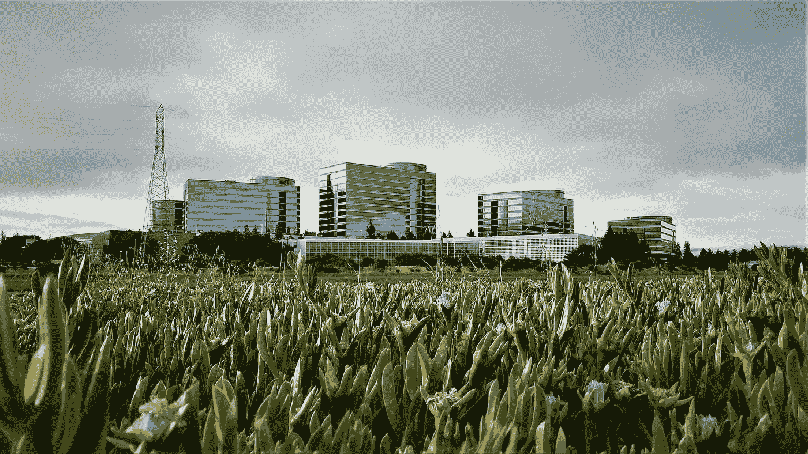

Oracle HQ. Source: Pixabay

Python(以及即将推出的带有 TensorFlow.js 的 JavaScript)是机器学习的主导语言。SQL 呢？有一种在 SQL 中建立/运行机器学习模型的方法。在数据库附近运行模型训练可能会有好处，因为数据会保存在数据库中。借助 SQL，我们可以利用现成的强大数据分析功能，运行算法，而无需向外部获取数据(从性能角度来看，这可能是一项昂贵的操作，尤其是对于大型数据集)。这篇文章将描述如何使用 SQL 在数据库中进行机器学习。

我将使用运行在 [Oracle 云自由层](https://www.oracle.com/cloud/free/)的 Oracle 自治数据库。Oracle DB 提供了对机器学习的现成支持。最近，Oracle 推出了 Oracle 云免费层，其中包括数据库。这意味着我们可以免费运行它，也可以用于生产。

**设置**

进入 Oracle 云控制台后，转到自治数据仓库，在那里您可以创建包含 ML 功能的始终免费的数据库实例:

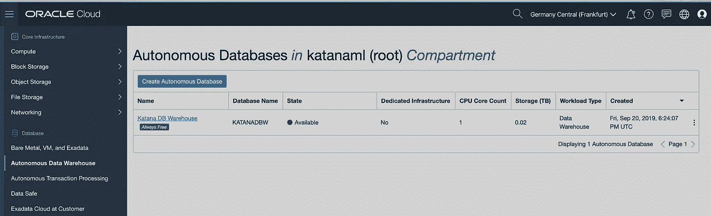

为了能够访问 ML 环境，请确保设置 ML 用户。为此，转到云控制台中的数据库实例并选择*服务控制台*选项:

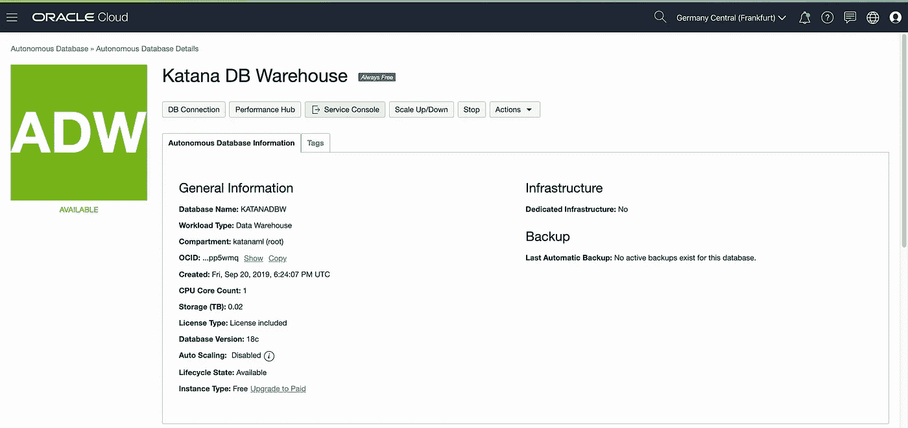

然后转到管理部分，选择*管理 Oracle ML 用户*选项:

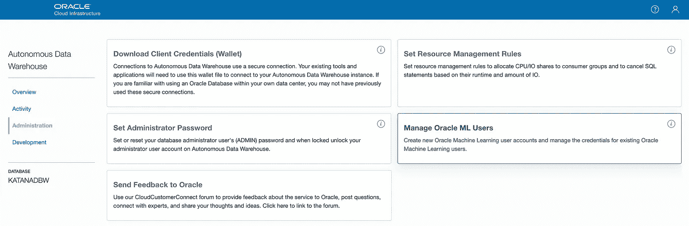

在这里，您可以创建一个新用户(我们将使用该用户登录 Oracle ML notebook)。这是数据库用户，这意味着将创建具有相同名称的数据库模式，我们可以使用相同的凭据直接登录数据库:

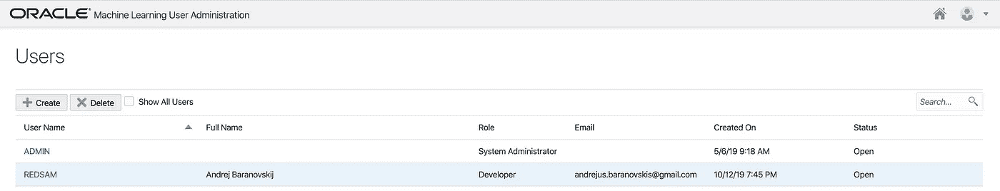

为了能够通过 SQL Developer 或另一个客户端直接登录(有用，当需要进行数据预处理时)，选择*数据库连接*选项并下载客户端凭证:

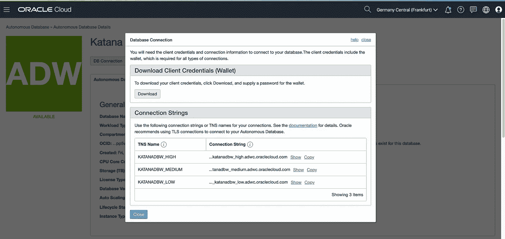

用 SQL Developer 连接到 DB，创建表 PIMA_INDIANS_DIABETES(在此阅读更多关于 Pima Indians 糖尿病数据集[)。通过运行我的](https://raw.githubusercontent.com/jbrownlee/Datasets/master/pima-indians-diabetes.names) [GitHub](https://github.com/abaranovskis-redsamurai/automation-repo/tree/master/oracleml) repo 中的 SQL 脚本为这篇文章填充数据:

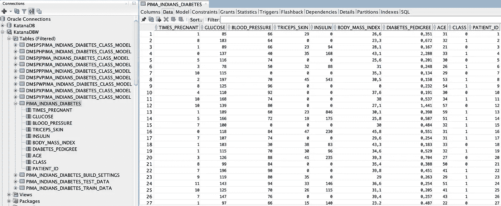

让我们打开 Oracle ML 笔记本。返回 Oracle Cloud console for Autonomous Data Warehouse 并选择开发部分。在此部分，单击 Oracle ML SQL 笔记本:

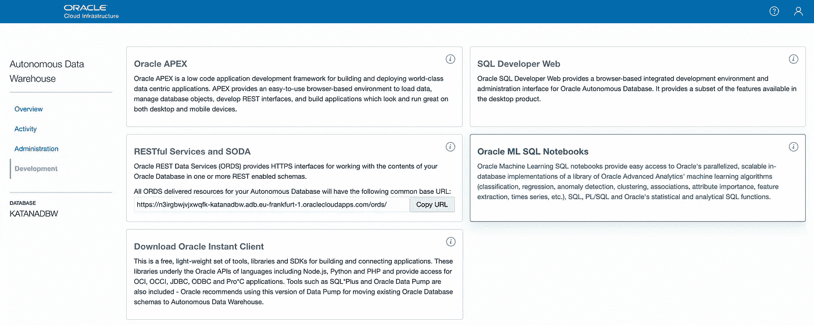

下一步，它将要求输入用户名/密码。在这里，您应该提供与之前几个步骤中创建的相同的 ML 用户信息(我使用的是用户 REDSAM):

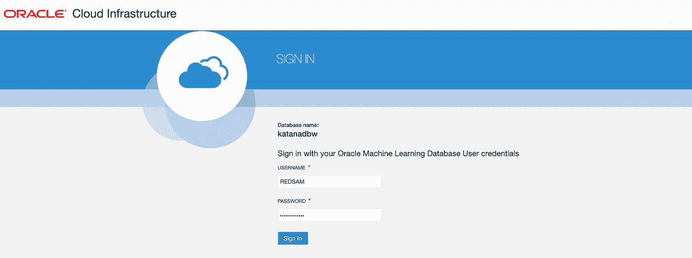

**机器学习**

甲骨文机器学习主页。点击*笔记本*，这将导航到创建新笔记本的表格:

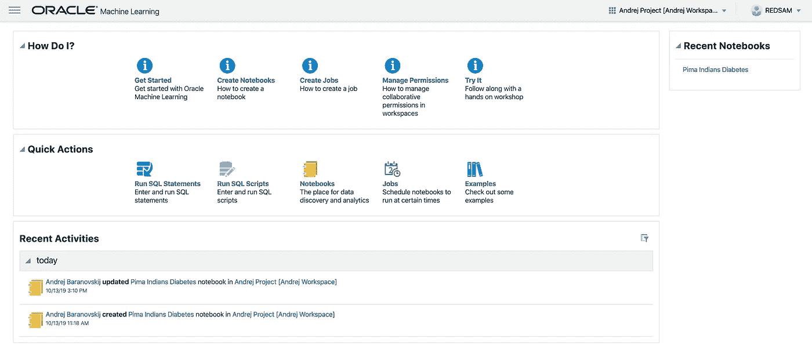

创建新笔记本—皮马印第安人糖尿病:

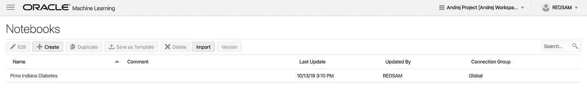

转到笔记本。在 notebook 中，您可以访问相同的数据库模式，就像您从数据库客户端连接并上传数据的模式一样。从技术上讲，您可以直接从 SQL 客户端构建 ML 模型。Oracle ML notebook 提供了更好的用户体验。

在第一步中，让我们从表中获取数据，以确保我们可以访问 DB 模式并查看数据:

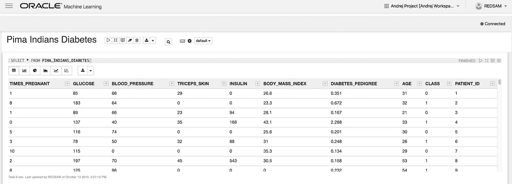

接下来，为测试和训练数据集创建 DB 表，您可以从主表直接将数据提取到这些表中:

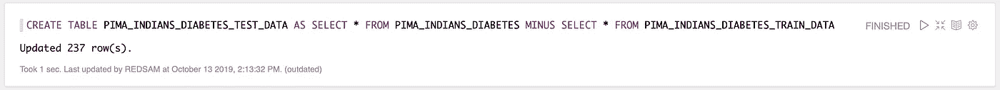

在运行训练和构建模型之前，建议清理以前训练的模型(如果有):

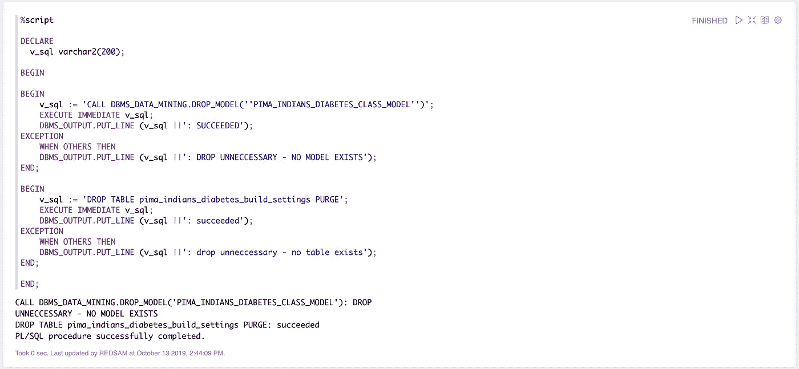

在这里，我们使用决策树算法来训练模型。指向包含训练数据的表，运行 PL/SQL 函数— *CREATE_MODEL* ，模型将在后台为您构建:

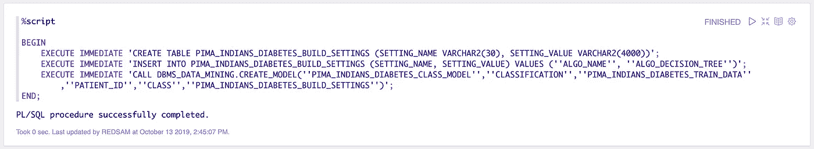

模型元数据存储在生成的数据库表中:

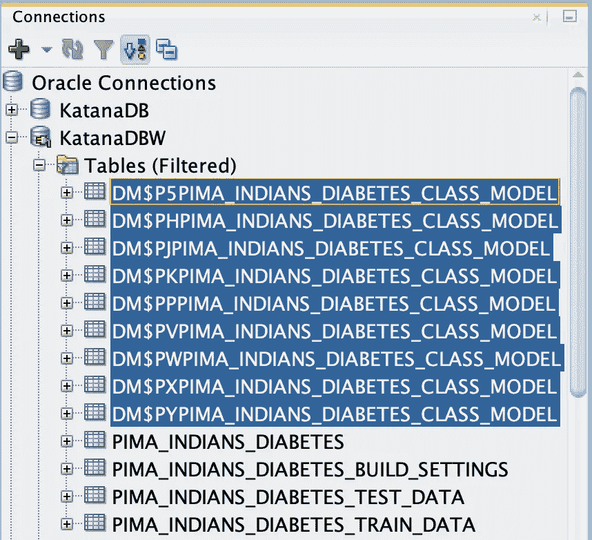

将预测列添加到测试表中，这是存储预测结果的位置:

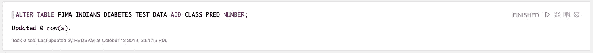

使用训练好的模型运行预测函数，结果将存储在预测列中:

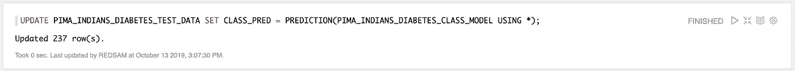

我们可以通过将预测值与测试数据集中的实际值进行比较来计算预测精度:

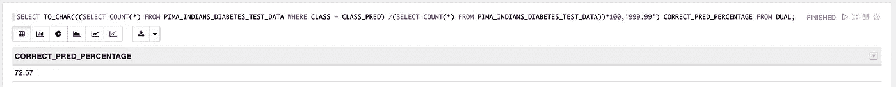

混淆矩阵—这有助于快速了解模型质量:

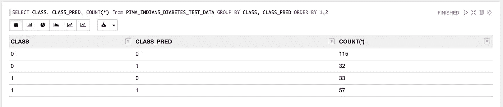

Oracle 机器学习 SQL 笔记本和数据在我的 GitHub [repo](https://github.com/abaranovskis-redsamurai/automation-repo/tree/master/oracleml) 上有。