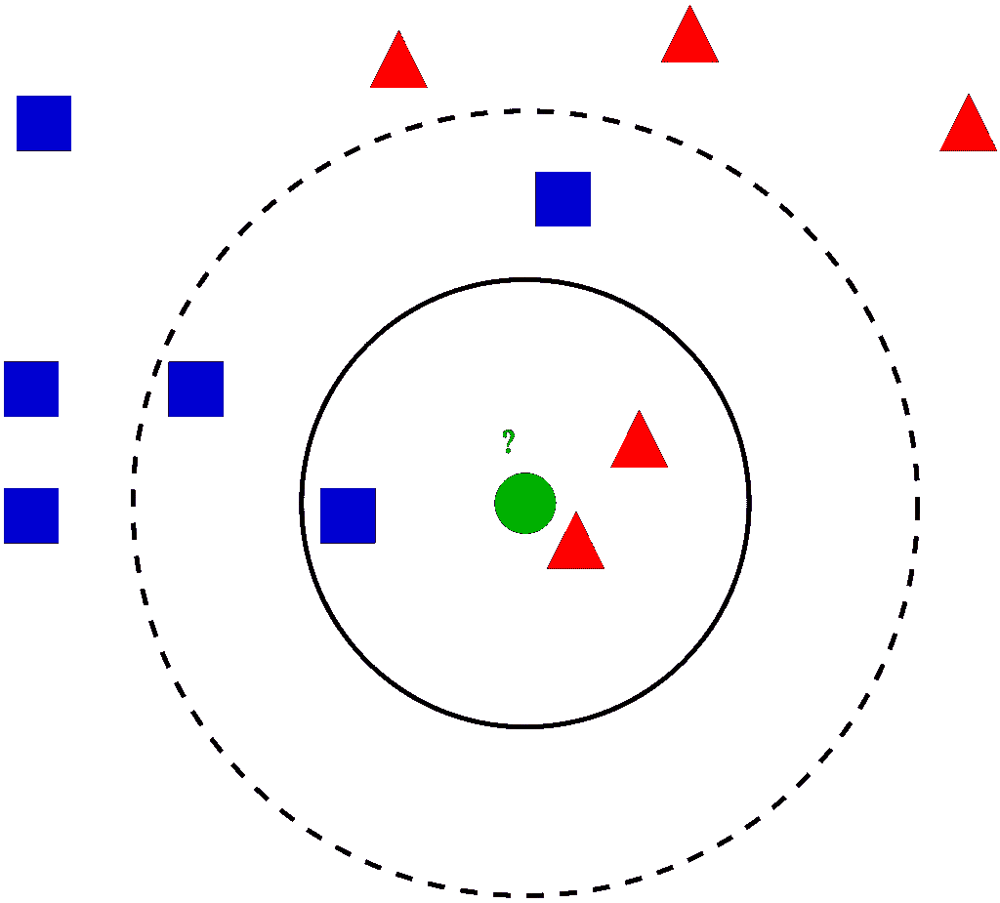
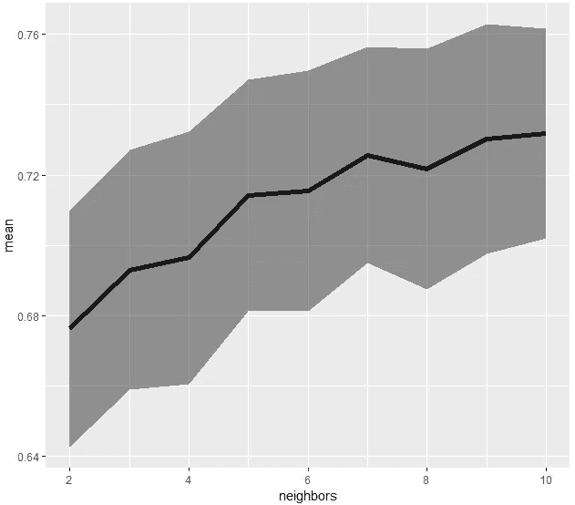
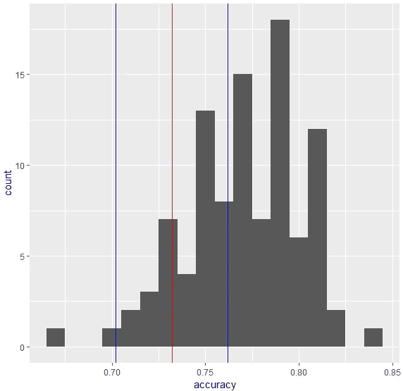
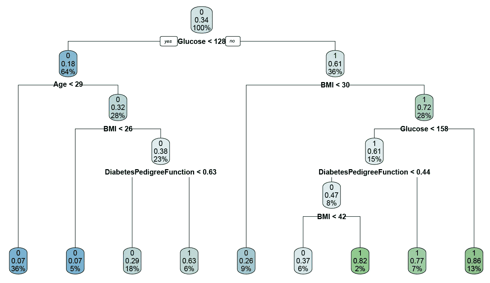
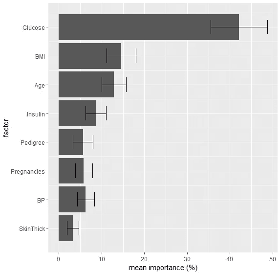
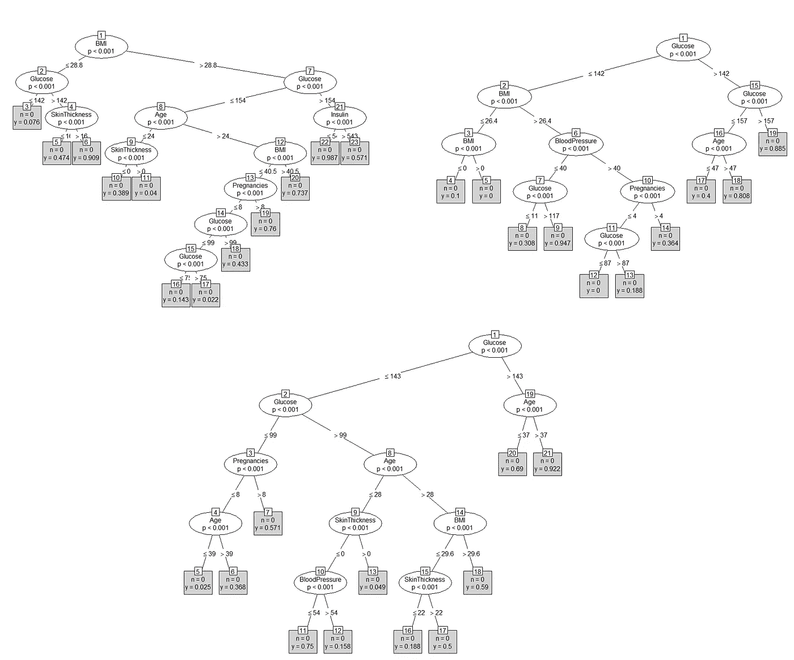
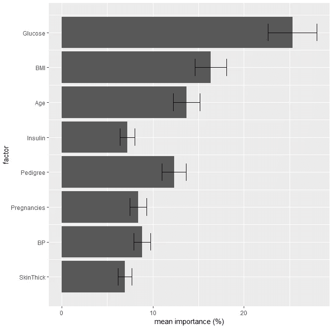
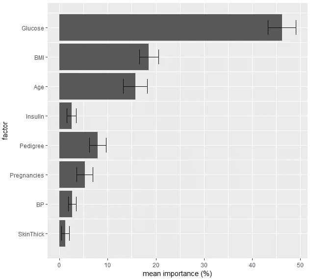

# R 中“糖尿病”数据集的机器学习

> 原文：<https://towardsdatascience.com/machine-learning-with-the-diabetes-data-set-in-r-11fa7ae944d0?source=collection_archive---------12----------------------->

## 用 KNN、逻辑回归和决策树进行分类


受 [Susan Li 关于在 Python 中应用基本机器学习技术的文章](/machine-learning-for-diabetes-562dd7df4d42)的启发，我决定在 r 中实现相同的技术。此外，我希望对为什么每种方法都有用以及它们如何相互比较进行一些解释。

以下所有分析均使用 Pima Indians 糖尿病数据集，可通过以下方式在 R 中访问该数据集:

```
install.packages("mlbench")
library(mlbench)
data(PimaIndiansDiabetes)
# Some of the exact variable names may vary from my subsequent code
```

总体而言，该数据集由 9 个变量的 768 个观察值组成:8 个变量将用作模型预测值(怀孕次数、血糖浓度、舒张压(mm Hg)、三头肌皮褶厚度(mm)、2 小时血清胰岛素测量值、体重指数、糖尿病谱系函数和年龄)和 1 个结果变量(患者是否患有糖尿病)。

# **k 近邻**

我们将首先应用 k-最近邻法，根据患者与其他患者的相似性对患者进行分类。对于这种方法(以及所有后续方法)，我们将从将数据集分为“训练”和“测试”集开始。我们将基于训练集上预测器和结果之间的关系来构建我们的模型，然后使用模型的规范来预测测试集上的结果。然后，我们可以将我们的预测结果与测试集的实际糖尿病状态进行比较，从而为我们提供模型准确性的度量。在我的练习中，我将使用`caTools`包中的`sample.split`函数。



An illustration of how the number of neighbors affects the class of a test case. Using the 3 nearest neighbors (solid line) results in a different class than using the 5 nearest neighbors (dashed line). By Antti Ajanki AnAj — [https://commons.wikimedia.org/w/index.php?curid=2170282](http://By Antti Ajanki AnAj - Own work, CC BY-SA 3.0, https://commons.wikimedia.org/w/index.php?curid=2170282)

对于 k-最近邻，我们通过将每个测试案例与训练集中的“最近邻”进行比较来计算该案例的结果。分配的结果取决于您决定查看这些邻居中的多少个；三个最近邻的多数类可能不同于五个最近邻的多数类(见左图)。

为了确保我们使用一个给出更好模型性能的数字来表示 k，我进行了两部分交叉验证。首先，我将 k 的可能值从 2 变为 10；第二，我重复了 100 次将数据分割成训练集和测试集，以确保对每个 *k* 的模型性能的稳健估计。我使用了`class`包中的`knn`函数，并在测试集上计算了每个折叠的模型精度。

```
all_test_accuracies_knn <- matrix(nrow=100,ncol=9)
for (split_number in c(1:100)){
  train_ind <- sample.split(diabetes$Pregnancies,SplitRatio = 0.8)
  test_ind <- !train_ind

  neighbors <- c(2:10)
  accuracies <- matrix(nrow=1, ncol=9)

  for (n_neighbors in neighbors){
    knn_fit <- knn(diabetes[train_ind,],diabetes[test_ind,],diabetes$Outcome[train_ind],k=n_neighbors)
    cm <- table(Actual = diabetes$Outcome[test_ind],Predicted = knn_fit)
    accuracy <- sum(diag(cm))/sum(test_ind)
    accuracies[n_neighbors-1] <- accuracy
  }
  all_test_accuracies_knn[split_number,] <- accuracies
}
```



KNN model performance accuracy for varying values of k. Black line indicates mean of all 100 folds for each value of k; grey ribbon indicates standard deviation.

从这个分析中，我们可以看到 k-最近邻对于稍微更大的 *k，*值表现得更好，性能达到大约 73%的最大分类准确度。尽管根据确切的数据分割仍然存在一些差异，但是使用 9 或 10 个邻居似乎可以在测试集上产生相当稳定的模型估计。

# **逻辑回归**

接下来，我们将应用机器学习工具集的另一个基本工具:回归。对于这个数据集，我们预测二元结果(糖尿病诊断)，我们使用逻辑回归而不是线性回归(预测连续变量)。同样，我将通过反复将数据分成不同的训练集和测试集来交叉验证逻辑回归模型。

```
all_test_accuracies_logistic <- matrix(nrow=100,ncol=1)for (split_number in c(1:100)){
  train_ind <- sample.split(diabetes$Pregnancies,SplitRatio = 0.8)
  test_ind <- !train_ind

  logit_fit <- glm(Outcome ~ ., data=diabetes[train_ind,], family="binomial")
  p <- predict(logit_fit,diabetes[test_ind,],family="binomial")
  probs <- exp(p)/(1+exp(p))
  test_outcomes <- probs>0.5
  cm <- table(Actual = diabetes$Outcome[test_ind],Predicted = test_outcomes)
  accuracy <- sum(diag(cm))/sum(test_ind)
  all_test_accuracies_logistic[split_number] <- accuracy
}
```



Histogram of model accuracy for each of the 100 folds of logistic regression. Mean (red) +- standard deviations (blue) for the KNN approach with k=9 is also shown.

在所有折叠中，我们实现了 77%的平均模型准确性，性能范围从 67–84%不等，具体取决于准确的训练-测试划分。在这个数据集上，逻辑回归似乎比 k-最近邻更准确，即使选择了最优的 *k* (将填充分布与显示 KNN 近似最优分布的垂直线进行比较)。

# 决策图表

遵循与选择逻辑回归而不是线性回归相同的逻辑，我们将构建一个分类树而不是回归树。决策树构建了数据分离的“节点”,最终以“叶子”结束，这些叶子给出了模型的指定类别。在这里，我再次实现了 100 倍的训练测试分裂，然后将每个预测值分配给一个输出矩阵，以比较各倍之间的变量重要性。

```
all_dtree_importance <- matrix(nrow=8,ncol=100)
bucketsize <- 10
for (split_number in c(1:100)){
    train_ind <- sample.split(diabetes$Pregnancies,SplitRatio = 0.8)
    test_ind <- !train_ind tree <- rpart(as.factor(Outcome) ~ ., data = diabetes[train_ind,],minbucket=bucketsize, model=TRUE)importance <- t(tree$variable.importance)
    importance <- importance/sum(importance)
    all_dtree_importance[1,split_number] <- importance[,"Glucose"]
    all_dtree_importance[2,split_number] <- importance[,"BMI"]
    all_dtree_importance[3,split_number] <- importance[,"Age"]
    all_dtree_importance[4,split_number] <- importance[,"Insulin"]
    all_dtree_importance[5,split_number] <- importance[,"DiabetesPedigreeFunction"]
    all_dtree_importance[6,split_number] <- importance[,"Pregnancies"]
    all_dtree_importance[7,split_number] <- importance[,"BloodPressure"]
    all_dtree_importance[8,split_number] <- importance[,"SkinThickness"]
}
```

该数据集的示例树如下所示:



One of the classification trees for the diabetes data set. At each leaf, the top number and leaf color indicates the assigned class (blue: 0, green: 1). The overall importance of blood glucose levels, BMI, and age are all readily apparent, one of the advantages of classification trees over other methods.



Mean importance of each predictor (% of model) +- standard deviation, across 100 splits of the data.

在决策树中，血糖始终是树中最重要的变量(>模型的 40%)，其次是身体质量指数和年龄，占 10-15%，其余变量的贡献小于 10%。总的来说，决策树模型的准确率在 74–75%左右。

# 随机森林

与上面使用的简单决策树相反，随机森林聚集了多个去相关的决策树，以便产生预测。当构建每组决策树时，在每次分裂时，仅选择预测器的样本作为分裂候选，而不是允许树从所有可能的预测器中进行选择。因此，每个单独的树不太可能选择与其他树相同的分割。在我在这里使用的`randomForest`函数的情况下，每次分割时可以选择的预测值的默认数量是`floor(ncol(x)/3)`，或者 2。

```
for (split_number in c(1:100)){
  train_ind <- sample.split(diabetes$Pregnancies,SplitRatio = 0.8)
  test_ind <- !train_ind rf <- randomForest(as.factor(Outcome) ~ ., data = diabetes[train_ind,],ntree=100)
  train_accuracy <- sum(diag(rf$confusion))/sum(train_ind)
  cm <- table(predict(rf,diabetes[test_ind,]),diabetes$Outcome[test_ind])
  test_accuracy <- sum(diag(cm))/sum(test_ind)

  all_train_accuracies_rf[split_number] <- train_accuracy
  all_test_accuracies_rf[split_number] <- test_accuracy

  importance <- rf$importance/sum(rf$importance)
  all_importances_rf[split_number,1] <- importance["Glucose",]
  all_importances_rf[split_number,2] <- importance["BMI",]
  all_importances_rf[split_number,3] <- importance["Age",]
  all_importances_rf[split_number,4] <- importance["Insulin",]
  all_importances_rf[split_number,5] <- importance["DiabetesPedigreeFunction",]
  all_importances_rf[split_number,6] <- importance["Pregnancies",]
  all_importances_rf[split_number,7] <- importance["BloodPressure",]
  all_importances_rf[split_number,8] <- importance["SkinThickness",]
}
```



Three examples of trees created using the random forest algorithm.



与上面的简单树分类方法相比，在随机森林模型中，每个变量的重要性分布更加均匀。虽然葡萄糖仍然是模型中最重要的因素，但在随机森林中，它仅占模型的 25%。这是直观的，因为随机森林改进决策树的方式之一是通过使每个树不太可能使用相同的(最强的)预测变量(在这种情况下，葡萄糖水平)作为树中的第一次分裂来使袋装树彼此去相关。

总的来说，这种方法相对于交叉验证的决策树也只提供了一点点(但可能仍然有意义)的改进。简单决策树的平均准确率为 74%，范围为 65–82%，而随机森林模型的平均准确率为 76%，范围为 68–82%。因此，正如预期的那样，随机森林方法产生了更健壮、不变的结果。

# 梯度推进

最后，我们将对数据采用另一种集成学习方法:梯度推进。通常，梯度推进指的是迭代地将模型拟合到先前模型的残差，从而提高整体模型拟合。梯度增强通过连续地将更复杂的树逐渐拟合到数据，并使用前一棵树的残差作为后续树的指导，来“增强”分类的决策树模型。这里的梯度是指通过梯度下降来解决最小化的问题，也就是找到你当前值处的梯度，沿着梯度递减的方向。

```
install.packages("gbm")
library(gbm)all_gb_accuracies <- matrix(nrow=100)
all_gb_relative_inf <- matrix(nrow=100,ncol=8)
for (split_number in c(1:100)){
  train_ind <- sample.split(diabetes$Pregnancies,SplitRatio = 0.8)
  test_ind <- !train_ind gb <- gbm(Outcome ~ ., data = diabetes[train_ind,], distribution = "bernoulli")
  vals <- predict.gbm(gb, diabetes[test_ind,],n.trees=100)
  probs <- exp(vals)/(1+exp(vals))
  class1 <- probs>0.5
  cm <- table(class1,diabetes$Outcome[test_ind])
  gb_accuracy <- sum(diag(cm))/sum(test_ind)
  all_gb_accuracies[split_number] <- gb_accuracy

  s <- summary.gbm(gb,plotit = FALSE)
  all_gb_relative_inf[split_number,1] <- s$rel.inf[s$var=="Glucose"]
  all_gb_relative_inf[split_number,2] <- s$rel.inf[s$var=="BMI"]
  all_gb_relative_inf[split_number,3] <- s$rel.inf[s$var=="Age"]
  all_gb_relative_inf[split_number,4] <- s$rel.inf[s$var=="Insulin"]
  all_gb_relative_inf[split_number,5] <- s$rel.inf[s$var=="DiabetesPedigreeFunction"]
  all_gb_relative_inf[split_number,6] <- s$rel.inf[s$var=="Pregnancies"]
  all_gb_relative_inf[split_number,7] <- s$rel.inf[s$var=="BloodPressure"]
  all_gb_relative_inf[split_number,8] <- s$rel.inf[s$var=="SkinThickness"]
}
```



我们再次看到，葡萄糖水平是决定糖尿病诊断的压倒性主要因素。在这种情况下，最不重要的变量(胰岛素、血压和皮肤厚度)被最小化，甚至比以前的模型更大。总体而言，梯度增强模型的表现略好于随机森林，平均分类准确率为 76%,范围为 68–83 %,相对于随机森林总体提高了约 0.6%。