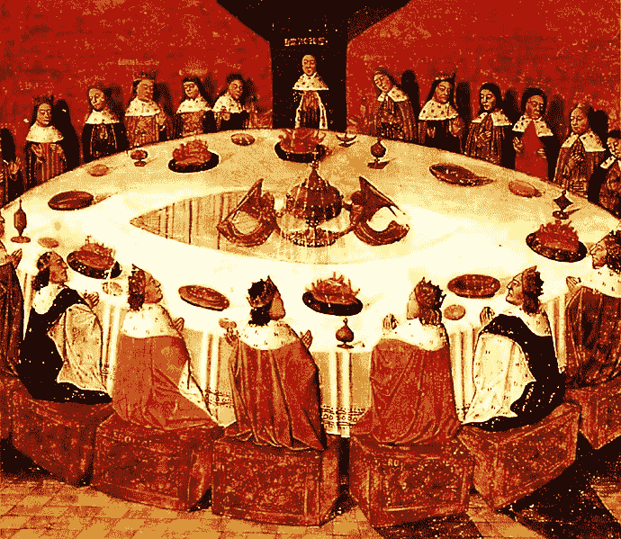
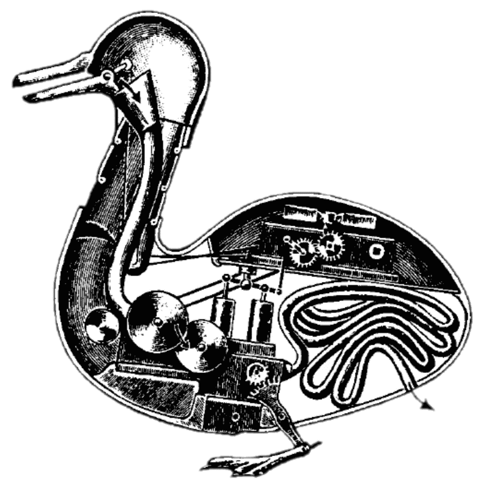

# 机器思维、运输和设计的未来

> 原文：<https://towardsdatascience.com/machine-thinking-conveyance-and-the-future-of-design-be2af8c7533c?source=collection_archive---------11----------------------->

# 秋千

在我们这个快速发展的以数字为中心的世界里，我经常陷入一个陷阱，把设计当成最新的光鲜亮丽的应用程序或闪亮的消费电子产品。人们很容易忽略这样一个事实:设计和人类一样古老；我们作为一个物种的古老而固有的一部分。

简单地说，设计是对思想、材料或技术的成功安排，以朝着一个目标前进。我们都这样做，设计我们的时间表，家庭和假期。我们有意识和无意识地设计，经历迭代和自我批评，朝着我们的目标不断优化。

在帮助企业的过程中，我经常被问到“*什么是好的设计？”可以理解的是，有必要对其进行量化、衡量并确立价值。随着时间的推移，我开始认为好的设计展示了四种不同程度的可量化的品质。我喜欢用不起眼的挥杆作为这些品质多功能性的例子。*

Source: [https://en.wikipedia.org/wiki/File:MoSchaukel.jpg](https://en.wikipedia.org/wiki/File:MoSchaukel.jpg)

1.  好的设计是永恒的**。**我想任何时代的人看到一个秋千，都会知道它到底是干什么的。设计本身不需要改变就能继续有效。这是基础技术和它们所采用的形式的完美结合。
2.  好的设计是**功能性的。没有人怀疑秋千的功能。它显然实现了让人类一次又一次挑战重力的惊人目标。太神奇了。**
3.  好的设计就是**美。**可能是最不可量化的。漂亮的设计往往是每个人都认同的东西，而没有说服力。我发现大多数秋千都很漂亮。如果你仔细想想，我想你会同意的。
4.  好的设计是**个人的。这里的挥杆很出色。这个座位几乎适合任何人。您可以改变链条的长度来调整高度。感觉它就在你身边。我们围绕好的设计创造记忆和情感。**

# 圆桌会议

下一个适时的话题是设计过程。*我们如何设计？我们如何一起设计？*

随着*设计思维*成为商业培训的主流部分，设计过程显然变得流行起来。*敏捷*和*精益*是*设计思维*的近亲——导致这种感觉，即理解我们的客户或用户，然后合作解决问题和潜在的解决方案是超现代的商业实践。需要训练的东西。

Source: [https://en.wikipedia.org/wiki/File:King_Arthur_and_the_Knights_of_the_Round_Table.jpg](https://en.wikipedia.org/wiki/File:King_Arthur_and_the_Knights_of_the_Round_Table.jpg)

然而，设计过程并不新鲜。这是我们的根本。从本质上来说，我们寻求解决问题，数千年的进化让人类擅长于互相讲述故事，并一起努力实现共同的目标。亚瑟王和圆桌骑士的传说是这样的例子，将不同技能的团队聚集在一起，并对准一个共同的北极星是一个强大的获胜策略。

从本质上来说，设计过程始终是关于在谈判桌上拥有正确的技能组合，创造允许这些技能组合拥有共同语言的仪式，并利用工具最大限度地发挥在给定媒介中解决问题的潜力。今天我们用的是*设计思维*、*敏捷*、*精益*，以及曾经流行又好玩的*设计冲刺*。

# 基本原则

任何一个做过设计师的人都知道，提出一个解决方案往往需要一些解释。设计从根本上来说是一种变革的媒介。改变往往需要努力。

我们自然会抵制变化，因为它会引发一种未知感。记住这种抵抗只是一种基本的人类生存机制是有好处的。通过冷静的推理和公开的演示，大多数人会很容易地看到一个设计良好的解决方案的好处和价值。

Source: [https://en.wikipedia.org/wiki/File:Darwin%27s_finches_by_Gould.jpg](https://en.wikipedia.org/wiki/File:Darwin%27s_finches_by_Gould.jpg)

我不确定我是什么时候意识到这一点的，但是产品设计其实只有两件事。

1.  新产品或新功能的创造。
2.  对现有产品或功能的重新设计或改进。

无论哪种情况，都是关于改变。

# 容量

当我们缩小历史，看看我们不断设计的总体效果，我们看到所有这些变化对一个可测量的价值有重大影响。这个价值就是我们维持人口的承载能力。

## 早期人类历史

在人类历史的前 95%中，大约 20 万年，我们的人口增长相对缓慢。我们大部分的时间和精力都花在了从一个地方搬到另一个地方，寻找食物和生存上。到早期人类历史末期，全球人口约为 200 万。

## 农业革命

大约一万年前，我们开始学习如何耕作。这使得有更多的时间来解决其他问题，如建造房屋结构。这使我们有能力维持比以前快得多的人口增长。到 1750 年，全球人口达到 [7 亿](https://www.thoughtco.com/current-world-population-1435270)。

## 工业革命

通过技术和制造业的快速发展，我们看到世界人口以前所未有的速度增长。从工业革命开始到现在，在不到 200 年的时间里，我们的人口增长了 10 倍以上，达到 77 亿。

当我们解决新类型的问题时，我们增加了维持人口的能力。显然，单纯用人口来衡量我们设计的解决方案的价值是有局限性的。希望这种测量方法能让我们看到，当与我们的生物编程相结合时，我们设计解决方案的内在驱动力会产生深远的影响，从而延续我们的物种。

# 改变

在上面概述的更广泛的革命中，有一些更小的转变构成了一个特定的时期。例如，农业革命跨越了石器时代、青铜时代和铁器时代。事后来看，这些时间段很容易看到和分类。

纵观我们当前的工业革命，我们显然已经进入了一个由计算机、软件和数字技术的出现所主导的时代。我们可以称之为计算时代或信息时代。但是，要预测什么时候会发生足够多的变化，让我们处于一场新革命的风口浪尖，要困难得多，也许是不可能的。

我之前写的关于承载能力的原因是为了表明技术允许我们维持和增加人口。从农业到城市化再到资本主义，这些冒险帮助我们刺激人口增长。

那么计算时代是如何影响人口增长的呢？客观地说，在过去的 50 年里，全球人口增加的数量超过了人类历史上 20 万年的总和。我们能够使用数字技术来自动化曾经需要大量手工工作的流程，这极大地提高了我们的承载能力。

随着我们对计算时代的深入挖掘，看起来我们在这方面只会越来越快。在过去的 20 年里，企业已经将战略从“数字优先”转向“移动优先”。现在，随着机器学习、自然语言处理和语音界面的成熟，我们正在进入向人工智能优先的转变。

# 人工智能第一

回想一下设计、过程和基础——使用一组给定的技术和工具，围绕着解决特定类型问题的设计过程，有一些词语和通用词汇是很有帮助的。亚瑟用的是*圆桌*，现代商业用的是*设计思维*。

*设计思维*通过以客户为中心的视角解决问题是有意义的。但是，这些过程和工具会帮助我们提高机器理解人类并为我们构建解决方案的能力吗？

最近我一直在探索下面的想法。

> 计算设计的前 40 年产生了一个叫做设计思维的过程。下一个 40 年将需要机器思维，以实现设计运输。

# 机器思维

*机器思维*是人类用来教机器如何朝着设计目标前进的一套方法和文化。

传统上，在现代产品开发中，你可能会发现一个由产品经理、产品设计师和应用或产品工程师组成的核心团队。在 A.I. First 模型中，我们需要添加一名机器学习工程师和一名机器学习研究员。

与传统的产品开发流程不同，该团队的工作将不再以人类(或用户)的需求为中心，而是专注于为机器创建算法和路径，以进行学习并基于学习进行输出。

在机器思维中，我们正在为机器设计一套交互模型，以学习、输出并与人类(或其他机器)交互，具有潜在的无限变化和结果。

作为设计师，我们自然会关注工作中最细微的细节。但是在人工智能第一模型中，我们不知道许多细节。机器思维不太强调设计输出的完美性，而更强调设计系统的健壮性。

我鼓励团队在他们的周期中花更多的时间来创建强大的系统图，不可知的接口，概述交互模型。在机器思维中，这变得更有价值。

一个简单的机器思维练习:*能够解决最大数量的已知事务的最少数量的组件(交互或接口)是什么？*

# 运输工具

*设计传达*是将抽象的人类直觉解构为可以有机自我延续的可教结构的能力。

目前，世界各地都有人工智能团队在教机器如何设计时装、创作音乐、写诗歌和散文。虽然产出远非完美，但它正以令人难以置信的速度前进。在这一点上，机器越来越擅长[写假文章](https://www.forbes.com/sites/nicolemartin1/2019/02/19/new-ai-development-so-advanced-its-too-dangerous-to-release-says-scientists/#78a30454a801)，以至于它们的文章很容易被误认为是人类写的新闻。人工智能[生成的人的图像](https://thispersondoesnotexist.com/)看起来像真实的人的照片，我们会假设他们真的存在。

这些例子的潜力既令人兴奋又令人恐惧。然而，它们仍然需要大量的人工设置和开发，并且只能产生非常特定的输出。换句话说，人类仍然需要为机器定义具体的问题，机器可以被教会设计解决方案。

但是，如果机器可以被教会在没有我们的情况下识别问题，并独立地创建那些解决方案，那会怎么样？他们能比人类更快更好地发现和解决问题吗？如果机器正在解决一切，那么我们作为未来人类的角色会是什么？

# 认知产品

> 认知产品:为与人类行为紧密相关的指数学习而设计的产品——贾斯汀·雷利[@贾斯汀·雷利](http://twitter.com/justinmreilly)

我以前的同事和朋友贾斯汀·雷利(Justin Reilly)对我转向人工智能优先的想法产生了重大影响。他对认知产品的定义很重要，因为它概述了两个关键因素:1)指数学习和 2)与人类行为的深层联系。

我相信，随着我们在*机器思维*方法论上的成熟，以及我们在*设计传达*上的能力的提高，那个*认知产品*将会像一个网站一样成为桌面上的赌注。我们通过任何接触点交互的所有信息都将具有一定的智能水平，这使它比当今最流行的软件和硬件具有明显的优势。

我们已经看到了那些首先转向人工智能的公司的性能优势。网飞是一个明显的受欢迎的软件例子，它擅长以一种与我们的行为密切相关的方式学习和呈现信息。我已经尽了自己最大的努力反对自己的最佳判断。

《华尔街日报》最近关于堡垒之夜的这篇文章引起了我的兴趣和警惕。我第一次听说这个游戏是通过我 6 岁的儿子兴奋地模仿他那些沉迷于这个游戏的大朋友们做“轻拍”和“牙线”的动作。我和大多数父母一样，认为这是孩子们喜欢的最新无害的电子游戏。但《华尔街日报》的文章概述了堡垒之夜的一些不同之处。凭借其庞大的在线用户群和机器学习，堡垒之夜正在不断提高玩家的参与度。它在一个完全不同的层面上争夺孩子们的注意力。

> 像许多视频游戏一样，玩堡垒之夜的人越多，关于什么最吸引玩家以及什么促使玩家退出的数据就越多。源源不断的信息流增强了游戏设计师使用机器学习来增强玩家参与度的能力。
> 
> 随着游戏变得越来越智能，家长们感到被超越了。“这是一场不公平的斗争，”儿童和青少年心理学家、《网络儿童:在数字时代重塑童年》一书的作者理查德·弗里德博士说。
> 
> 对一些人来说，堡垒之夜就像一个不速之客，一个拒绝离开的人。
> 
> ——[*贝齐·莫里斯，*华尔街日报](https://www.wsj.com/articles/how-fortnite-triggered-an-unwinnable-war-between-parents-and-their-boys-11545397200)

# 然后

在引擎盖下，人工智能第一产品将展示 4 个设计特征。

1.  强化学习
2.  永远在线
3.  接口不可知
4.  物理和数字之间模糊的界限

Source: [https://en.wikipedia.org/wiki/File:Duck_of_Vaucanson.jpg](https://en.wikipedia.org/wiki/File:Duck_of_Vaucanson.jpg)

网飞和堡垒之夜的例子证实了我的信念，即人工智能已经在我们面前，先行者正在取得胜利。这也让我相信，最初走向人工智能优先的趋势不会看起来和感觉上有明显的不同，但认知产品的表现将优于前几代计算设计。

当我们展望未来的设计时，先进技术带来的难以置信的可能性给了我灵感。我也深深意识到伴随着这些现代工具的力量而来的责任。比以往任何时候都更重要的是，作为一个物种，我们要学会并优先考虑对我们真正有价值的东西。

这就是为什么我强烈主张在认知产品的创作中要有多样化的团队和思想的很大一部分原因。只有通过合作和包容性的工作，我们才能找到适用于人工智能第一世界中几乎无限规模的解决方案。随着算法产生莎士比亚和贝多芬的新作品，我们不仅要教会机器，还要教会我们自己，这对人类意味着什么，这将变得越来越重要。