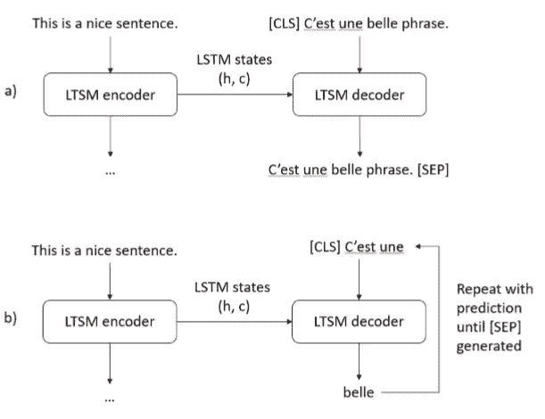

# 机器翻译:概述

> 原文：<https://towardsdatascience.com/machine-translation-a-short-overview-91343ff39c9f?source=collection_archive---------8----------------------->

这个故事是机器翻译领域的概述。这个故事介绍了几个被高度引用的文献和著名的应用，但是我想鼓励你在评论中分享你的观点。这个故事的目的是为这个领域的新手提供一个良好的开端。它涵盖了机器翻译的三种主要方法以及该领域的几个挑战。希望故事中提到的文献能够介绍这个问题的历史以及最先进的解决方案。

机器翻译是将文本从源语言翻译成目标语言的任务。机器翻译有许多具有挑战性的方面:1)大量不同的语言、字母和语法；2)对计算机来说，将一个序列(例如一个句子)翻译成一个序列比只处理数字更难；3)没有*一个*正确答案(如:从没有性别依赖代词的语言翻译过来，*他*和*她*可以相同)。

机器翻译是一项相对古老的任务。从 20 世纪 70 年代开始，就有了实现自动翻译的项目。多年来，出现了三种主要方法:

*   基于规则的机器翻译(RBMT):20 世纪 70-90 年代
*   统计机器翻译:20 世纪 90 年代至 2010 年代
*   神经机器翻译(NMT): 2014-

Photo by [Gerd Altmann](https://pixabay.com/hu/users/geralt-9301/?utm_source=link-attribution&amp;utm_medium=referral&amp;utm_campaign=image&amp;utm_content=110775) on [Pixabay](https://pixabay.com/hu/?utm_source=link-attribution&amp;utm_medium=referral&amp;utm_campaign=image&amp;utm_content=110775)

# 基于规则的机器翻译

基于规则的系统需要专家对源语言和目标语言的知识来开发句法、语义和词法规则以实现翻译。

RBMT 的维基百科文章包括一个从英语到德语的基于规则的翻译的基本例子。翻译需要一本英德词典、一套英语语法规则和一套德语语法规则

RBMT 系统包含一系列自然语言处理(NLP)任务，包括标记化、词性标注等等。这些工作中的大部分都必须用源语言和目标语言来完成。

## RBMT 的例子

SYSTRAN 是历史最悠久的机器翻译公司之一。它可以翻译大约 20 种语言。SYSTRAN 用于阿波罗-联盟号项目(1973 年)和欧洲委员会(1975 年)[1]。它一直被谷歌的语言工具使用到 2007 年。更多信息见其[维基百科文章](https://en.wikipedia.org/wiki/SYSTRAN)或该公司的[网站](https://www.systransoft.com)。随着 STM 的出现，SYSTRAN 开始使用统计模型，最近的出版物显示他们也在试验神经方法[2]。OpenNMT 工具包也是该公司研究人员的一项工作[3]。

Apertium 是根据 GNU 通用公共许可证条款发布的开源 RBMT 软件。它有 35 种语言版本，目前仍在开发中。它最初是为与西班牙语密切相关的语言设计的[4]。下图是 Apertium 管道的示意图。

Apertium pipeline — Photo by Darkgaia1 on [Wikipedia](https://en.wikipedia.org/wiki/Apertium#/media/File:Pipeline_of_Apertium_System.svg)

GramTrans 是一家位于丹麦的公司和一家位于挪威的公司的合作，它为斯堪的纳维亚语言提供机器翻译[5]。

## 优势

*   不需要双语文本
*   独立于域的
*   全面控制(适用于各种情况的新规则)
*   可重用性(当与新语言配对时，现有的语言规则可以转移)

## 不足之处

*   需要好的字典
*   手动设置规则(需要专业知识)
*   规则越多，系统越难处理

# 统计机器翻译

这种方法使用基于双语文本语料库分析的统计模型。它在 1955 年首次被介绍[6]，但是直到 1988 年 IBM Watson 研究中心开始使用它才引起了人们的兴趣[7，8]。

统计机器翻译背后的思想如下:

> 给定目标语言中的一个句子 T，我们寻找翻译者产生 T 的句子 S。我们知道，通过选择给定 T 最有可能的句子 S，我们的错误机会被最小化。因此，我们希望选择 S 以最大化 Pr(S|T)。
> — [机器翻译的统计方法](https://dl.acm.org/citation.cfm?id=92860)，1990 年。[8]

使用贝叶斯定理，我们可以将这个最大化问题转化为 Pr(S)和 Pr(T|S)的乘积，其中 Pr(S)是 S 的语言模型概率(S 是在该位置的正确句子), Pr(T|S)是给定 S 的 T 的翻译概率。换句话说，我们正在寻找给定候选翻译的正确程度及其在上下文中的适合程度的最可能的翻译。

因此，SMT 需要三个步骤:1)语言模型(给定上下文，什么是正确的单词？);2)翻译模型(给定单词的最佳翻译是什么？);3)寻找单词正确顺序的方法。

在前面的段落中，我们同时使用了*句*和*词*作为翻译单位。最常用的模型介于这两者之间。这叫做基于*短语*的翻译。例如，英语短语“正在购买”在法语中被翻译成“achète”。

Non-factored and factored translation — Figures from Moses: Open Source Toolkit … [9]

## SMT 示例

*   [谷歌翻译](https://translate.google.com/)(2006 年至 2016 年间，当[他们宣布改为 NMT](https://ai.googleblog.com/2016/09/a-neural-network-for-machine.html) )
*   [微软翻译器](https://www.microsoft.com/hu-hu/translator/)(2016 年[改为 NMT](https://www.microsoft.com/en-us/translator/blog/2016/11/15/microsoft-translator-launching-neural-network-based-translations-for-all-its-speech-languages/) )
*   [Moses](http://www.statmt.org/moses/) :统计机器翻译开源工具包。[9]

## 优势

*   语言学专家更少的手工工作
*   一个 SMT 适用于更多语言对
*   更少的字典外翻译:使用正确的语言模型，翻译更流畅

## 不足之处

*   需要双语语料库
*   特定的错误很难修复
*   不太适合语序差异大的语言对

# 神经机器翻译

神经方法使用神经网络来实现机器翻译。与以前的模型相比，NMTs 可以用一个网络而不是独立任务的流水线来构建。

2014 年，序列到序列模型的引入为 NLP 中的神经网络开辟了新的可能性。在 seq2seq 模型之前，神经网络需要一种方法将序列输入转换为计算机可用的数字(一次性编码，嵌入)。有了 seq2seq，用输入和输出序列训练网络成为可能[10，11]。

LSTM based seq2seq model: a) training phase, b) prediction phase

NMT 很快出现了。经过几年的研究，这些模型优于 SMT[12]。随着结果的改善，许多翻译提供商公司将其网络改为基于神经的模型，包括谷歌[13]和微软。

如果训练数据不平衡，神经网络就会出现问题，模型无法从稀有样本和频繁样本中学习。就语言而言，这是一个常见的问题，例如，有许多罕见的单词在整个维基百科中只使用了几次。训练一个不偏向于频繁单词(例如:在每个维基百科页面上多次出现)的模型可能是具有挑战性的。最近的一篇论文提出了一个解决方案，使用一个后处理步骤，用字典翻译这些生僻字[14]。

最近，脸书大学的研究人员引入了一个无监督的机器翻译模型，该模型与 SMT 和 NMT 一起工作，只需要大型单语语料库，而不需要双语语料库[15]。前面例子的主要瓶颈是缺乏大型翻译数据库。这一模式显示了解决这一问题的前景。

## NMT 的例子

*   谷歌翻译(从 2016 年开始)[链接到谷歌人工智能的语言团队](https://ai.google/research/teams/language/)
*   微软翻译(自 2016 年)[链接到微软的机器翻译研究](https://www.microsoft.com/en-us/research/group/machine-translation-group/)
*   脸书的翻译:[链接到脸书 AI 的 NLP](https://ai.facebook.com/research/NLP)
*   [OpenNMT:](http://opennmt.net/) 一个开源的神经机器翻译系统。[16]

## 优势

*   端到端模型(没有特定任务的管道)

## 不足之处

*   需要双语语料库
*   生僻字问题

Translation quality of statistical and neural MT models by Google — Figure by [Google](https://ai.googleblog.com/2016/09/a-neural-network-for-machine.html)

# 摘要

在这个故事中，我们讨论了解决机器翻译问题的三种方法。许多重要的出版物与重要的应用程序一起收集。这个故事揭示了该领域的历史，并收集了最先进的模型的文献。我希望这对一个刚涉足这个领域的人来说是个好的开始。

如果你觉得缺少了什么，欢迎和我分享！

# 参考

[1]托马，P. (1977 年 5 月)。 [Systran 作为多语言机器翻译系统。](http://www.mt-archive.info/CEC-1977-Toma.pdf)第三届欧洲信息系统和网络大会论文集*，克服语言障碍*(第 569–581 页)。

[2] Crego，j .，Kim，j .，Klein，g .，，a .，Yang，k .，Senellart，j .，… & Enoue，S. (2016)。 [Systran 的纯神经机器翻译系统。](https://arxiv.org/abs/1610.05540)arXiv 预印本 arXiv:1610.05540 。

[3]克莱因、金、邓、塞内拉尔特和拉什(2017 年)。OpenNMT:用于神经机器翻译的开源工具包。 *arXiv 预印本 arXiv:1701.02810* 。

[4] Corbí Bellot、A. M .、Forcada、M. L .、Ortiz Rojas、s .、Pérez-Ortiz、J. A .、Ramírez Sánchez、g .、Sánchez-Martínez、f .、……和 Sarasola Gabiola，K. (2005 年)。[一个开源的西班牙罗曼语浅传机器翻译引擎。](https://rua.ua.es/dspace/bitstream/10045/27525/1/corbi05.pdf)

[5] Bick，Eckhard (2007)， [Dan2eng:广覆盖丹麦语-英语机器翻译](http://beta.visl.sdu.dk/pdf/MTsummit07_final.pdf)，载于:Bente Maegaard(编。)，*机器翻译峰会论文集，XI，10–14。2007 年 9 月，丹麦哥本哈根*。第 37-43 页

[6]韦弗，W. (1955 年)。[翻译](http://htl.linguist.univ-paris-diderot.fr/biennale/et09/supportscours/leon/Leon.pdf)。*语言的机器翻译*， *14* ，15–23。

[7]布朗，p .，科克，j .，彼得拉，S. D .，彼得拉，V. D .，耶利内克，f .，默瑟，r .，&罗辛，P. (1988 年 8 月)。语言翻译的统计方法。见*第 12 届计算语言学会议论文集-第 1 卷*(第 71–76 页)。计算语言学协会。

[8]布朗、P. F .、科克、j .、德拉·皮特拉、S. A .、德拉·皮特拉、V. J .、耶利内克、f .、拉弗蒂、J. D .、……和鲁辛，P. S. (1990 年)。机器翻译的统计方法。 *计算语言学*， *16* (2)，79–85。

[9]科恩，p .，黄，h .，伯奇，a .，卡利森-伯奇，c .，费德里科，m .，贝托尔迪，n .，…，戴尔，C. (2007 年 6 月)。Moses:统计机器翻译的开源工具包。在*计算语言学协会第 45 届年会的会议录配套卷演示和海报会议的会议录*(第 177-180 页)。

[10] Sutskever，I .，Vinyals，o .，& Le，Q. V. (2014 年)。[用神经网络进行序列对序列学习](http://papers.nips.cc/paper/5346-sequence-to-sequence-learning-with-neural-networks)。在*神经信息处理系统的进展*(第 3104–3112 页)。

[11] Cho，k .，Van merrinboer，b .，Gulcehre，c .，Bahdanau，d .，Bougares，f .，Schwenk，h .，和 Bengio，Y. (2014 年)。使用用于统计机器翻译的 RNN 编码器-解码器学习短语表示。 *arXiv 预印本 arXiv:1406.1078* 。

[12] Bahdanau，d .，Cho，k .，& Bengio，Y. (2014 年)。[神经机器翻译通过联合学习来对齐和翻译。](https://arxiv.org/abs/1409.0473)arXiv 预印本 arXiv:1409.0473 。

[13] Wu，y .，Schuster，m .，Chen，z .，Le，Q. V .，m .，Macherey，w .，… & Klingner，J. (2016)。[谷歌的神经机器翻译系统:弥合人类和机器翻译之间的鸿沟。](https://arxiv.org/abs/1609.08144) *arXiv 预印本 arXiv:1609.08144* 。

[14] Luong，M. T .，Sutskever，I .，Le，Q. V .，Vinyals，o .，& Zaremba，W. (2014 年)。[解决神经机器翻译中的生僻字问题。](https://arxiv.org/abs/1410.8206)arXiv 预印本 arXiv:1410.8206 。

[15] Lample，g .，Ott，m .，Conneau，a .，Denoyer，l .，& Ranzato，M. A. (2018 年)。[基于短语的&神经无监督机器翻译。](https://arxiv.org/abs/1804.07755) *arXiv 预印本 arXiv:1804.07755* 。

[16] Klein，g .，Kim，y .，Deng，y .，Senellart，j .，& Rush，A. M. (2017 年)。Opennmt:用于神经机器翻译的开源工具包。 *arXiv 预印本 arXiv:1701.02810* 。

# 用伯特的故事学习 NMT

1.  [BLEU-BERT-y:比较句子得分](https://medium.com/@neged.ng/bleu-bert-y-comparing-sentence-scores-307e0975994d)
2.  [嵌入关系的可视化(word2vec，BERT)](https://medium.com/@neged.ng/visualisation-of-embedding-relations-word2vec-bert-64d695b7f36)
3.  机器翻译:一个简短的概述
4.  [使用 BERT 识别单词的正确含义](/identifying-the-right-meaning-of-the-words-using-bert-817eef2ac1f0)
5.  机器翻译:与 SOTA 相比
6.  [使用 TensorFlow 2.0 的简单 BERT](/simple-bert-using-tensorflow-2-0-132cb19e9b22)