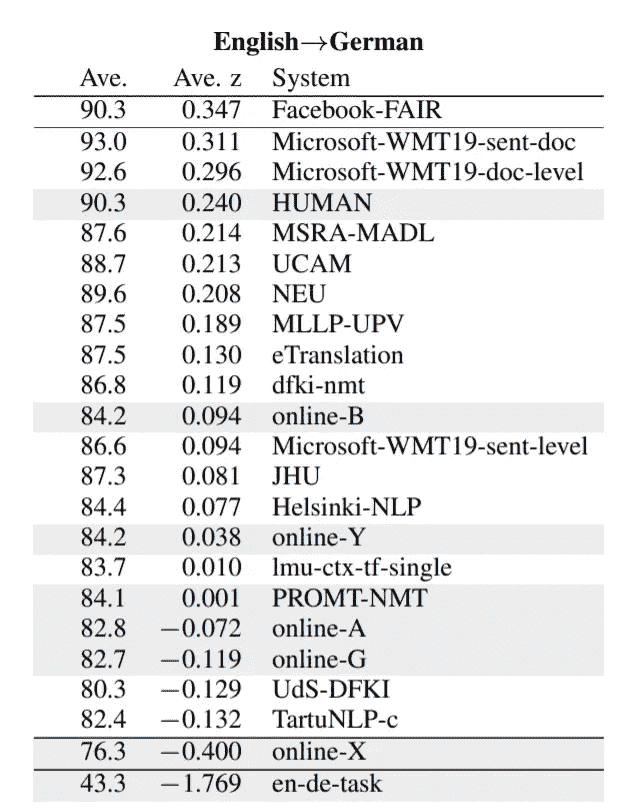
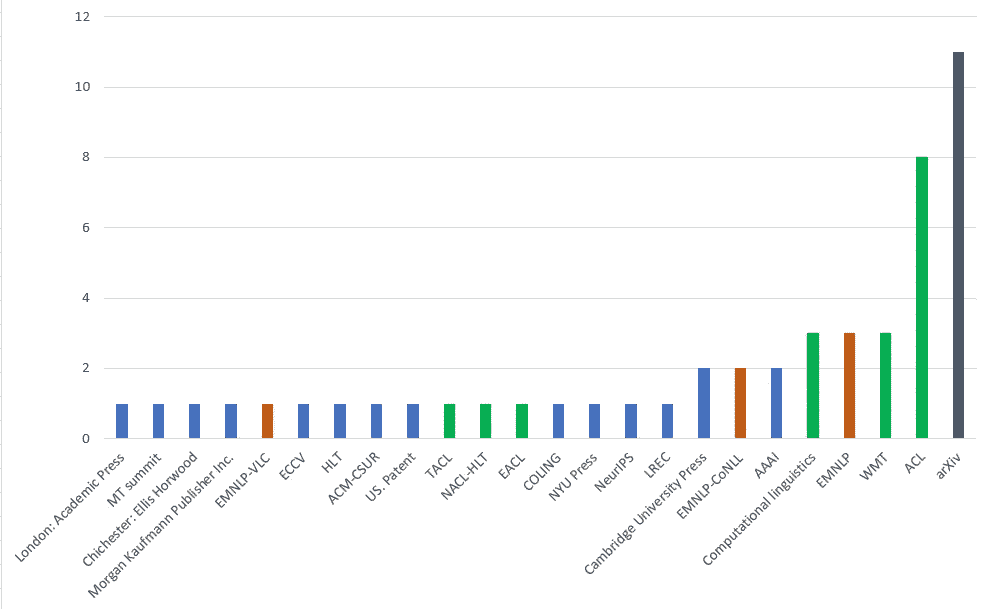

# 机器翻译:与 SOTA 相比

> 原文：<https://towardsdatascience.com/machine-translation-compare-to-sota-6f71cb2cd784?source=collection_archive---------27----------------------->

我之前的故事将 BLEU 描述为机器翻译(MT)最常用的度量标准。这个旨在介绍会议、数据集和竞赛，在那里你可以将你的模型与最先进的进行比较，你可以从那里收集知识，在那里你可以见到来自该领域的研究人员。

Conference — Image by [정훈 김](https://pixabay.com/hu/users/crystal710-3108616/?utm_source=link-attribution&amp;utm_medium=referral&amp;utm_campaign=image&amp;utm_content=1597531) from [Pixabay](https://pixabay.com/hu/?utm_source=link-attribution&amp;utm_medium=referral&amp;utm_campaign=image&amp;utm_content=1597531)

# MT 特定研讨会

## WMT 会议

WMT 会议是 ACL 会议(计算语言学协会年会)的一部分，因此缩写为:机器翻译研讨会。第一次研讨会于 2006 年举行，是 NAACL 的一部分(T2 NAACL-2006 统计机器翻译研讨会)。大约在[从统计机器翻译转变为神经机器翻译](/machine-translation-a-short-overview-91343ff39c9f)的时候，会议的名称变成了机器翻译会议。今年的发布会在 2019 年 8 月 1-2 日，意大利佛罗伦萨( [WMT19](http://www.statmt.org/wmt19/index.html) )。

WMT 每年都会发布翻译任务，最顶尖的模特会在这些任务上展开竞争。2016 年宣布的 GNMT(谷歌的神经机器翻译)使用了 WMT 的 14 个英德和英法数据集来评估其性能[1]。脸书、谷歌、微软和许多其他公司都参与了今年的竞争。

English-German results of the WMT19 News Translation Task

## 分解车间

[DiscoMT 2019](https://www.idiap.ch/workshop/DiscoMT) ，第四届机器翻译中的话语研讨会，聚焦话语级机器翻译。它将于 2019 年 11 月 3 日在中国香港举行。它使用与 WMT19 相同的任务，但数据集包括话语级注释。DiscoMT 是 EMNLP(自然语言处理经验方法会议)的一部分。

## MT 峰会

[第 17 届机器翻译峰会](https://www.mtsummit2019.com/)，于 2019 年 8 月 19 日至 23 日在爱尔兰都柏林的都柏林城市大学 Helix 剧院举行。该会议由欧洲机器翻译协会(EAMT)组织。

# 数据集

一个更长的平行文本数据语料库列表[在这里](https://lionbridge.ai/datasets/25-best-parallel-text-datasets-for-machine-translation-training/)。

*   [**欧洲议会议事录平行语料库**](http://www.statmt.org/europarl/)1996–2011[3]:欧洲议会议事录 21 种语言。根据不同的语言有 1100 万到 5000 万个单词。
*   [**对齐*加拿大第 36 届***国会**的议事录**](https://www.isi.edu/natural-language/download/hansard/)**【4】:130 万对对齐的法语和英语文本块**
*   **[**UN translations**](http://opus.nlpl.eu/UN.php)**【5】:6 种语言(ar、en、es、fr、ru、zh)文本共 44 万个句子片段。****
*   ****[**维基百科**](http://opus.nlpl.eu/Wikipedia.php)【6】:从维基百科中提取的 20 种语言的句子，共 2590 万句。****

# ****出版物****

****这一部分试图回答“我应该在哪里发表我的机器翻译论文？”。这些统计数据来自谷歌学术搜索“机器翻译”的前 50 个结果。****

****下图显示了不同颜色(分别为绿色和橙色)的 ACL 和 EMNLP 相关会议。如我们所见，如果我们看看谷歌学术的结果，ACL 是机器翻译领域最重要的会议。基于 ACL 的会议、出版物:****

*   ****ACL:计算语言学协会[年会](https://www.aclweb.org/portal/)****
*   ****EACL: [美国律师协会欧洲分会(EACL)](http://eacl.org/)****
*   ****NAACL-HLT:美国语言学会北美分会年度会议[:人类语言技术](https://naacl2019.org/)****
*   ****TACL:[《TACL 计算语言学协会汇刊》](https://www.transacl.org/ojs/index.php/tacl)是由 [ACL](http://www.aclweb.org/) 主办的期刊[由麻省理工学院出版社](https://www.mitpressjournals.org/loi/tacl)出版****
*   ****WMT:机器翻译会议****
*   ****计算语言学: [*计算语言学*](https://www.mitpressjournals.org/loi/coli) 由麻省理工学院出版社代表[计算语言学协会](http://www.aclweb.org/)出版。****

********

****Conferences, Journals from the top 50 results of Google Scholar search ‘machine translation’****

# ****WMT 提交格式****

****NIST 在 2012 年组织了一次[开放机器翻译评测](https://www.nist.gov/multimodal-information-group/openmt12-evaluation)。他们为机器翻译提交定义了 SGML 格式。此后，这种格式被用作标准提交格式。 [WMT19](http://www.statmt.org/wmt19/translation-task.html) 使用相同的描述进行提交。下面是一个格式示例:****

****`<refset trglang=”cz” setid=”test2010" srclang=”any”>
<doc sysid=”ref” docid=”idnes.cz/2009/12/10/74900" genre=”news” origlang=”cz”>
<hl>
<seg id=”1"> ... </seg>
</hl>

<seg id=”2"> ... </seg>
<seg id=”3"> ... </seg>

...
</refset>`****

# ****摘要****

****在这个故事中，我们总结了机器翻译方面的主要会议、研讨会以及要发表的重要期刊。我们看到了最大的公司竞争的比赛，以及这些比赛提交的标准格式的例子。我们还收集了一些广泛使用的语料库。****

# ****参考****

****[1]吴，y，舒斯特，m，陈，z，乐，Q. V，，m，马切里，w，…和克林纳，J. (2016)。[谷歌的神经机器翻译系统:弥合人类和机器翻译之间的鸿沟。](https://arxiv.org/abs/1609.08144) *arXiv 预印本 arXiv:1609.08144* 。****

****[2] Barrault，l .，Bojar，o .，Costa-jussà，M. R .，Federmann，c .，Fishel，m .，Graham，y .，… & Monz，C. (2019，8 月)。[2019 机器翻译大会(wmt19)的发现。](http://www.statmt.org/wmt19/pdf/53/WMT01.pdf)第四届机器翻译会议论文集(第 2 卷，第 1-61 页)。****

****[3]科恩，P. (2005 年 9 月)。 [Europarl:一个用于统计机器翻译的并行语料库。](http://citeseerx.ist.psu.edu/viewdoc/download?doi=10.1.1.459.5497&rep=rep1&type=pdf)在 *MT 峰会*(第 5 卷，第 79–86 页)。****

****[4]德国大学(2001 年)。加拿大第 36 届议会的联合议事录。****

****[5]a . Rafalovitch 和 r . Dale(2009 年 8 月)。联合国大会决议:六种语言平行语料库。在*MT 峰会议事录*(第 12 卷，第 292–299 页)。****

****[6]沃兹尼亚克和马拉塞克(2014 年)。[建立主题对齐的可比语料库并挖掘它以获得真正平行的句子对。](https://www.sciencedirect.com/science/article/pii/S2212017314005453) *Procedia 技术*， *18* ，126–132。****

# ****用伯特的故事学习 NMT****

1.  ****[BLEU-BERT-y:比较句子得分](https://medium.com/@neged.ng/bleu-bert-y-comparing-sentence-scores-307e0975994d)****
2.  ****[嵌入关系的可视化(word2vec，BERT)](https://medium.com/@neged.ng/visualisation-of-embedding-relations-word2vec-bert-64d695b7f36)****
3.  ****[机器翻译:简要概述](/machine-translation-a-short-overview-91343ff39c9f)****
4.  ****[使用 BERT 识别单词的正确含义](/identifying-the-right-meaning-of-the-words-using-bert-817eef2ac1f0)****
5.  ****[机器翻译:对比 SOTA](/machine-translation-compare-to-sota-6f71cb2cd784)****
6.  ****[使用 TensorFlow 2.0 的简单 BERT](/simple-bert-using-tensorflow-2-0-132cb19e9b22)****