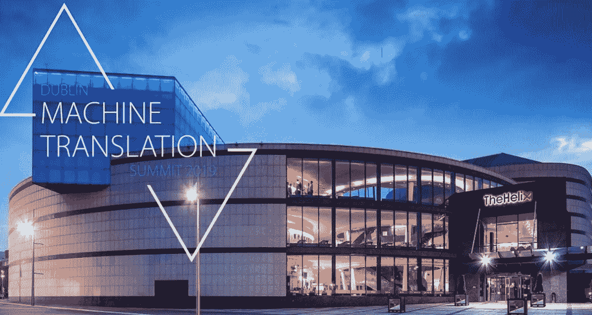
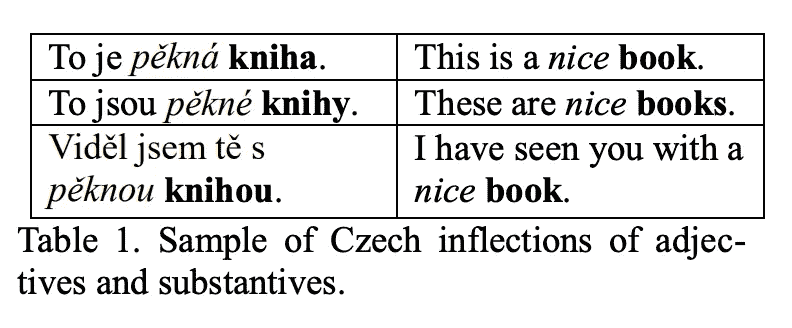

# 机器翻译峰会 2019 印象、总结和笔记—第一部分

> 原文：<https://towardsdatascience.com/machine-translation-summit-2019-impressions-summary-and-notes-d8258abbff5c?source=collection_archive---------30----------------------->

几周前，最大的年度 NLP 会议之一在爱尔兰都柏林举行— [机器翻译峰会 2019](https://www.mtsummit2019.com/) ，该会议专注于机器翻译(MT)的研究和应用，这是 NLP 中一个具有挑战性的问题。这一周充满了 MT 研究人员和从业者的数十场讲座、研讨会和指导，总体而言，我认为会议非常精彩。

Home sweet home for a week.

这篇文章总结了我对这次会议的印象，也是我对特定演讲、教程和论文的笔记的一个数据转储:)我将它们公之于众，以防其他人发现它们是一个有用的总结。

注意:我在大会上的经历明显受到我碰巧参加的会议(主要是“研究轨道”会议)的影响，但是为了更全面地了解大会，[点击这里查看会议日程。](https://www.mtsummit2019.com/programme)

这篇文章是**第一部分**，涵盖了会议的第 1 天到第 3 天，而**第二部分**涵盖了第 4 天和第 5 天。前几天是辅导课和研讨会，而最后三天是讲座和海报。

# **总结和总体印象**

*   随着人工翻译的传统角色继续向编辑机器翻译输出(后期编辑；PE)，而不是从零开始翻译，有很大的兴趣去理解任何与 PE 相关的东西:PE 对整体翻译质量和风格的影响；后期编辑的生产力、工作模式以及与机器翻译的互动；以及这种向 PE 的转变如何影响实际业务中的生产。
*   我们很高兴看到对递归神经网络(RNNs)和基于统计机器翻译(SMT)的机器翻译模型的研究继续进行——尽管 Transformer 模型现在是 MT 架构 *à la mode* ，但其他方法在特定情况下仍优于 Transformer(例如，SMT 用于小段翻译)，或者可能更容易直观理解。
*   我喜欢探索使用信息而不是文本的工作。使用图像和文本作为翻译模型输入的多模态翻译海报；端到端语音到文本的翻译对话；描述跟踪后期编辑的键盘和鼠标交互的海报；以及在用户与 MT 互动时追踪眼球运动的项目。
*   有相当多的上下文感知机器翻译和话语级现象被提及——我们的标准模型纯粹在句子级别上工作，这忽略了大多数文本存在于段落、章节和文档中的其他文本周围的事实。显式烘焙上下文信息的方法显示出非常有希望的结果。
*   我最喜欢的演讲可能是 Arianna Bisazza 的*“理解多语言神经网络模型中的句法和语义转移”*——这非常酷，甚至有可能同时用多种语言训练我们的标准 NLP 模型*。*神经网络的可解释性总是令人感兴趣，但在多语言模型中尤其令人感兴趣，这些模型可以捕捉跨语言表示。
*   我最喜欢的海报是...嗯，这是一个平局。首先是*的马尔基西奥及其同事的“控制机器翻译输出的阅读水平”。我惊喜地发现，通过在源语句中插入一个简单的标志，可以如此有效地控制 MT 输出的复杂性。其次，还有 Góis & Martins 的*“translator 2 vec:理解和表现人类后期编辑”*。诚然，我是所有 x 的 x2vec 的粉丝，但看到人类翻译的工作模式来自他们在后期编辑期间与键盘、鼠标和文本的交互序列，这特别酷。*

# *会议第一天—关于“**神经模型在语言解码中的不合理效果”的教程***

**作者 KantanMT**

*这是一个半天的教程，由 KantanMT(机器翻译平台的提供商)提供。这是一次更实际的会议，是在去年 KantanMT 和易贝之间的一些神经机器翻译(NMT)实现实验之后进行的。一些亮点:*

*   *客户首先需要具体的证据证明神经翻译模型优于统计翻译模型。对照实验表明，NMT 模型实际上有较低的 BLEU 分数，但母语为英语的评估者更喜欢 NMT 模型。BLEU 度量尤其可以与 NMT 相比较，因为 NMT 可以生成不太字面上流畅的输出，这仍然是很好的，但不一定在 n-gram 级别上紧密匹配参考翻译。*
*   *下一组实验是比较用于建模翻译的 3 种主要神经架构之间的性能——RNNs(递归神经网络), CNNs(卷积神经网络);更常见于计算机视觉)和 TNNs(变压器神经网络；或者只是变形金刚)。比较的范围很广，包括自动指标(BLEU、TER、METEOR)、人工评估分数以及技术方面，如训练时间、集成和适应/再训练的容易程度。正如你所料，结果是变形金刚更胜一筹。*
*   *除了确保您有足够的单词/句子对来开始构建 NMT 模型，还应该检查唯一的单词计数，理想情况下应该尽可能高(例如> 100k)。*
*   *将深度学习框架从 Theano 切换到 OpenNMT 来训练 NMT 模型，导致它们的速度大幅提高。*
*   *如果可用于域适配的域内数据量很低，他们发现在适配期间简单地添加这些数据的更多副本是有益的。*

# ***会议第二天**——***“后期剪辑深度学习曲线”****

**通过本地化**

*本教程实际上是由我们，Welocalize 的 MT/NLP 工程团队的几个人提出的，所以，我没有太多的笔记:)简而言之，本教程的目的是提供一个关于后期编辑的行业视角——在我介绍了应用 MT 研究的当前状态后，同事们讨论了 NMT 实施的挑战，不同 MT 提供商的利弊，当然还有一切最终如何影响后期编辑过程。*

# ***会议第 3 天——会谈***

## *“PEMT 质量监测的众包和相关工具”*

**作者莫尼斯**

*会议的开场白也是关于后期编辑的(PEMT= ***后期编辑机器翻译*** ),演讲者是 Unbabel 的海伦娜·莫尼斯，一家非常时髦的 MT 初创公司。这次演讲更多地关注人的方面，而不是技术方面，并讨论了 un label 如何管理他们的人工翻译——没有单一的“我是一名翻译”标签，而是根据技能、经验和领域将每个翻译分为不同的类别。这意味着当有新任务时，他们可以迅速找到最合适的翻译。*

*目前有新一代的翻译正在毕业，他们非常清楚并习惯于与机器学习模型一起工作。这意味着气氛更加合作，越来越不像是一场充满敌意的“人工智能与翻译”之战。*

*演讲中一个非常酷的部分是一个语音信息应用程序的演示，它允许用户用一种语言记录和发送信息，然后自动翻译和语音合成为接收者的首选语言。我可以肯定地看到，一旦这项技术进一步发展，它会变得越来越流行。目前，这一过程有一个手动部分——如果自动翻译看起来质量很低，人工会纠正翻译错误。合成语音目前是通用的，还不能反映说话者独特的语音特征，尽管这一技术目前正在开发中。*

## *“CLIR 在低资源环境下的强大文档表示”*

**作者:Yarmohammadi 等人* [【论文在此】](https://www.aclweb.org/anthology/W19-6602)*

****信息检索*** (IR)是关于获取给定查询的正确信息位，而 ***跨语言信息检索*** (CLIR)在多语言设置中做这件事。因此，用户的查询是用不同于数据库中的文档的语言编写的，任务是优雅地进行机器翻译，并获取相关文档，尽管存在语言障碍。作为一个用例，想象一个新闻记者查询外语新闻源来展开她的故事。*

*这种 CLIR 系统的主要要求是:*

*   ***对机器翻译错误的鲁棒性。即使存在机器翻译错误，也必须为每个查询返回相关文档。***
*   ***对 ASR 误差的鲁棒性。**如果文档数据库包含语音的音频文件，这些文件必须首先通过自动语音识别(ASR)转换成文本，并且该系统还必须对该步骤中出现的任何错误具有鲁棒性。*
*   ***面对低资源语言的鲁棒性。**作者在三种低资源(=少量训练数据)语言的背景下考察了 CLIR:索马里语、斯瓦希里语和他加禄语。这三种语言的文档将使用英文查询进行检索。*

*本文的重点是针对 CLIR 的文档翻译方法(即索马里语、斯瓦希里语和他加禄语文档首先被翻译成英语)，但是其他论文以相反的方式完成了这项任务，即将查询翻译成目标语言。这样做的问题是查询可能很短，所以您很难可靠地找到相关的文档。这种方法被用作基线。*

*任务输入是英文查询，输出是检索与查询相关的文档。“基本事实”是针对一组查询的人类标记的文档相关性排名。困难的部分是 ASR 和 MT:一旦有了翻译的文档，查询到文档的相关性分数计算和排序就由 Elastic Search 和 Okapi 处理。*

*大部分工作侧重于评估表示文档的不同方式，以及这如何影响 CLIR 的整体性能。文档的 3 种不同“视图”是:*

*   ***N-最佳解码。**对于文本文档，MT 生成每个句子的 N 个最佳翻译(对于不同的 N 值)。对于语音文档，ASR 为每个片段生成一个 N 最佳列表，MT 解码器为每个片段生成 M 最佳翻译，从而生成一个 NxM 矩阵。无论是使用整个矩阵还是从中采样，都不会对性能产生太大影响。*
*   *短语包(BOP)翻译。给定源文本，基于短语的 SMT 系统生成所有可能的翻译短语(没有语言模型；所以，不是完全解码搜索)——所有这些翻译选项连接在一起，形成一个短语包。这种方法为文档表示提供了更多的词汇多样性，例如，您可以获得一个特定单词的 10 种可能的翻译。对于语音文档，ASR 也是开始处理文本的第一步。*
*   ***以及两者的结合。**您也可以只使用两种表示，N-best translations 和 BOP translation: index，并让搜索功能根据用户查询与任一表示的匹配程度对文档进行评分。*

*事实证明，用词组袋表示法的词汇多样性来扩充 N-best 列表的更标准的方法执行得最好，并且在所有三种被检查的低资源语言的 CLIR 任务中做得很好。尽管更丰富的文档表示可能更容易出错，但是每个文档拥有尽可能多的信息，并捕捉尽可能多的语言变化，似乎可以得到最好的结果。*

## *“增强端到端语音到文本翻译的转换器”*

**作者迪甘吉等人* [【论文在此】](https://www.aclweb.org/anthology/W19-6603)*

*早期的实时语音翻译系统基于菊花链形式的独立系统，一个语音识别模型生成文本，一个独立的机器翻译模型翻译转录的文本。在这项工作中提出了一种更时尚的方法，该方法采用 Transformer 架构，以允许 ***端到端语音到文本的翻译*** 。*

*作者在本文中研究了 3 种现象:*

*   ***使用变压器完成该任务。**以前基于 RNN 的端到端语音到文本翻译模型训练速度慢且计算量大。在这里，他们想使用 Transformer，不是因为它新奇，而是因为它更具并行性，而且肯定比基于 LSTM 的方法训练得更快。*
*   ***利用 2D 注意力处理语音数据。**他们想在 ***声谱图*** 处理阶段使用 2D 注意力(声谱图是一个音频文件的表示，就像一个语音样本，它包含了一段时间内的频率足迹)。使用 2D 注意力将有助于随着时间的推移保持声谱图属性*，允许模型利用 2D 依赖性，而不是将所有依赖于时间的信息浓缩在一起。**
*   ****增加局部偏向的自我关注。**当输入语音样本很长时，他们观察到，转换者的自我注意机制会试图关注整个序列长度。这不是很有用，因为结果是模型很难捕捉到短程依赖关系。他们引入了*局部偏向的自我注意力，以激励注意力机制将注意力集中在它当前工作的区域附近——他们通过增加一个惩罚来做到这一点，如果注意力偏离矩阵对角线太远。***

***他们基于变压器的模型确实比 LSTM 的训练速度快得多，但性能却差不多。有趣的结果是，添加局部注意力惩罚确实有助于该语音到文本翻译任务的模型，并且还导致训练期间更快的收敛。增加对 2D 的关注也会导致 BLEU 的增加。最后，作者发现，增加模型的大小可以显著提高性能，这表明他们使用的模型仍然太小(这一特定结果似乎在目前的 ML 工作中很常见)。***

# ***第 3 天—主要会议海报***

***那天剩下的时间都集中在海报上。我特别喜欢的一些海报是:***

## ***“原始机器翻译对 Word 的日本用户有什么影响:使用眼球追踪的可用性研究的初步结果”***

****由阿里纳斯等人著* [【论文在此】](https://www.aclweb.org/anthology/W19-6607/)***

**这项工作调查了用户对他们使用的软件中的机器翻译内容的感受，具体来说，日本参与者要么看到已发布的人类翻译的 Microsoft Word 日语版本，要么看到机器翻译的日语版本。用户被要求在一个 Word 版本中完成一些任务。除了比较任务完成情况、效率和用户满意度之外，他们的眼球运动也被跟踪，以此作为认知努力的衡量标准。**

**结果表明，日语使用者的任务完成和效率得分在人工翻译的发布词版本中略高，但不显著。然而，他们自我报告的满意度得分*明显更高，这表明与处理人工翻译文本相比，处理原始机器翻译可能是一种不太愉快的体验。***

## **“Translator2Vec:理解和表现人类海报编辑”**

***由高乃依&马丁斯。* [【此处论文】](https://arxiv.org/abs/1907.10362)**

**不同的译者处理后期编辑任务的方式不同。为什么不捕捉不同翻译工作时的动作，并检查数据中的模式和聚类呢？这将有助于识别不同的后期编辑风格，并可能判断哪种更有效。从后期编辑收集动作序列数据，包括按键编辑操作、鼠标动作、等待时间和对实际 MT 文本的更改。收集的数据集相当大——来自 300 多人进行的 66k 次编辑后会话的动作序列。**

**作者表明，动作序列的信息相当丰富，可以用来准确地识别特定的后期编辑，比只使用 PE 前和 PE 后的文本信息要好。您还可以使用 tSNE 对动作序列数据进行降维，并绘制二维的低维向量表示——这使您可以看到 PE 会话的集群，并观察到每个后期编辑都有自己独特的风格。这些编辑器表示也是后期编辑时间的非常有效的预测器。可悲的是，集群之间在工作风格上没有太多直观可理解的差异，但这仍然是一个非常好的结果。**

**就应用程序而言，您也可以通过这种方式来衡量后期编辑之间的相似性，或者将此作为后期编辑培训工具的一部分——例如，发现给定的工作方式是否与低生产率有关，或者检测您的会话是否不靠近任何群集，这可能意味着您的工作流程与其他翻译人员有很大不同。这是他们论文中的一个很好的图表，展示了英语-德语和英语-法语体育课的 tSNE 图:**

****

**这显示了编辑后会话日志对编辑后身份的预测性。**

## **“为资源不足的 NMT 模型利用基于规则的机器翻译知识”**

***作者托雷格罗萨等人* [【论文在此】](https://www.aclweb.org/anthology/W19-6725)**

**神经机器翻译可能会给出令人惊讶的好结果，但它在很大程度上依赖于足够数量的可用训练数据。根据定义，低资源语言对没有太多的并行数据，在这种情况下，使用老式的、手写的、基于规则的机器翻译(RBMT)的元素会非常有帮助。**

**这项工作试验了利用 RMBT 系统中包含的语言信息的不同方法，以便在低资源环境中改进 NMT 模型。关键的结果是，使用来自基于规则的机器翻译的形态学信息(以词性(POS)标签、依存标签和句法树信息的形式)的特征丰富，在添加到 NMT 系统时，在提高性能方面是有效的。有趣的是，观察到的提升性能类似于使用子词标记化带来的提升。**

## **“斯拉夫语言的形态学神经前处理和后处理”**

***作者贝尔纳迪内洛* [【论文在此】](https://www.aclweb.org/anthology/W19-6731)**

**斯拉夫语(俄语、捷克语、波兰语、保加利亚语等。)形态丰富——词序相当灵活，词的功能由几十种不同的语言形式表示。以下是他们论文中的一些捷克变调例子:**

****

**And this is just the start of it.**

**因此，斯拉夫语的 NMT 系统面临着拉丁语或日耳曼语所没有的挑战。本文通过增加一个额外的预处理步骤来处理斯拉夫语源文本，在该步骤中，屈折词被分解成它们的语言成分。另一方面，当目标语言是斯拉夫语时，类似的处理步骤发生在翻译之后(后处理)。这一过程通过调整标记化过程来更好地处理屈折变化——首先，作者利用在线资源为每种斯拉夫语言建立了形态模型，这是基于数百万个例子的形态类别图。这些然后被用于指导令牌化过程。**

**—**

## ****点击此处查看** [**我的会议笔记第二部分**](https://medium.com/@natasha.latysheva/machine-translation-summit-2019-impressions-summary-and-notes-part-ii-2d7acce804ec) **，涵盖了会议第 4 天和第 5 天。****