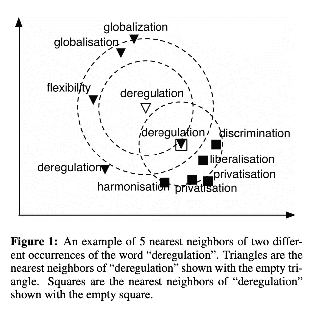

# 2019 年机器翻译峰会印象、总结和笔记-第二部分

> 原文：<https://towardsdatascience.com/machine-translation-summit-2019-impressions-summary-and-notes-part-ii-2d7acce804ec?source=collection_archive---------32----------------------->

这是最近在都柏林举行的机器翻译会议之后，我撰写的文章的第二部分。

Machine translation enthusiasts overran Dublin’s DCU campus for a week.

点击这里查看我的**第一部分**帖子中的介绍、会议摘要以及第 1-3 天[会议的笔记。](https://medium.com/@natasha.latysheva/machine-translation-summit-2019-impressions-summary-and-notes-d8258abbff5c)

让我们直接进入会议内容的其余部分。

# 会议第 4 天——研究讲座

## “NMT 建筑的内在近邻分析”

*by gha der&Monz*T8【论文在此】

目前还不清楚 NMT 编码器在隐藏状态表示中实际捕捉到了什么样的语言信息。早期的工作通过观察这些向量中的信息是否可以用于各种句法分类任务(例如，预测语态、时态和词性)来研究 NMT 模型的隐藏状态。在这里，作者也检查编码器隐藏状态，但是通过检查隐藏状态和单词嵌入之间的相似性来直接进行，而不是通过使用它们作为分类器的输入来间接进行。

一个特别有趣的话题是——一个单词的编码器隐藏状态与其原始输入嵌入有何不同？据推测，与输入嵌入相比，编码器隐藏状态捕获了更多的上下文信息。但是这个额外的上下文信息到底是什么，对于 rnn 和 tnn/Transformers 有什么不同吗？除了输入嵌入已经获取的信息之外，还获得了哪些额外的信息？为了回答这些问题，本文使用最近邻方法来比较隐藏状态词表示和输入词嵌入。

该技术的核心是获取单词的隐藏状态表示，并计算 n 个最近邻单词的列表。然后，检查最近邻列表与以下内容的重叠程度:

1.  基于相应单词嵌入的单词最近邻列表
2.  由 WordNet 词汇数据库记录的同义词和相关词的列表

从他们的论文中找到邻居列表的例子:

作者表明，单词的隐藏状态表示与它们的输入表示非常不同——大多数隐藏状态邻居列表没有被基于嵌入的列表覆盖。然而，隐藏状态确实捕捉了更多的 WordNet 关系。

最后，作者进行了实验来比较在 RNN 和 TNN 编码器的隐藏状态中发现的信息。发现的主要见解是:

*   转换器隐藏状态更好地捕捉词汇语义(词义)
*   而 RNN 隐藏状态更擅长捕捉句法相似性(语法)
*   具体来说，RNN 模型中的反向递归层学习更多的词汇和语义信息..
*   ..而 RNN 模型中的前向递归层学习更多长距离的上下文信息。

## “通过蒸馏使用高噪声并行数据改进 NMT”

蒙兹。 [【论文在此】](https://www.aclweb.org/anthology/W19-6612)

众所周知，NMT 渴望数据，比老牌的 SMT 更甚。但是平行语料库很难找到，并且通常在大小、语言和领域方面受到限制。另一方面，从多语言新闻门户等资源中获取自动对齐的语料库相对容易。流行的 Paracrawl 和 ISI 语料库就是这种情况。但是当然，这样的数据集会有很多噪音，噪音的主要来源通常是错位的句子——有时是完全错位的句子，有时是错位的或未翻译的句子片段。其他常见错误包括不正确的语言用法、未翻译的句子以及非语言字符的用法。

NMT 能从这些低质量的短信中获益吗？在 WMT 已经表明，虽然将嘈杂的语料库添加到干净的语料库实际上可以帮助 SMT 系统，但是在 NMT 系统中，这可能导致质量骤降。因此，与“仅干净数据”相比，即使在“干净和有噪声的组合数据”上训练也会降低性能。NMT 不仅数据饥渴，而且数据敏感。

作者提出了一种 ***蒸馏*** 策略，当与高质量并行语料库( ***干净数据*** )结合使用时，利用额外的低质量双文本( ***可比数据*** )而不进行任何过滤。在这种方法中，他们首先培养一个 NMT ***教师模型*** 上的高质量、干净的数据而已。教师模型然后指导在干净和有噪声/可比数据的组合上训练的最终 ***学生模型*** 的训练。

这个想法是基于 Hinton 提出的 ***知识升华*** 框架，其中更小的、压缩的 ***学生网络*** 使用来自大型 ***教师网络*** 的监督来训练。学生的目标是在数据集上模拟教师网络的输出分布，通常是通过最小化两个分布之间的交叉熵或 KL-divergence 损失。使用对数似然损失来训练教师模型，并且在 ***KL 发散损失*** 上训练学生模型——使用超参数来平衡两个损失。总结一下——在知识升华中，学生学会了用更少的参数模仿老师的表现。

结果表明，对于两种语言对(阿拉伯语-英语和汉语-英语)，所提出的知识提取策略优于语料库过滤和回译替换。

## “利用课程学习改进 NMT 的指代消解”

*作者斯托扬诺夫斯基&弗雷泽* [【论文在此】](https://www.aclweb.org/anthology/W19-6614)

指代消解，或者代词消解，就是弄清楚代词指的是什么的问题——例如，在句子*“猫去冰箱是因为它饿了”*中，“它”指的是什么？是猫饿了，还是冰箱？这些类型的问题对人类来说很容易，但对计算机来说很难。出色地完成这一解析任务对于代词的正确翻译至关重要。尽管上下文感知模型显示代词翻译(以及其他语篇层面的现象)有所改进，但仍有进步空间。

为了提高上下文感知 NMT 中的回指/代词解析，作者建议使用*课程学习，这是一种模仿人类学习的渐进性质的学习类型:你从“更容易”的问题开始，随着表现的改善逐渐增加复杂性。这种方法可以导致更快的收敛，并且已经发现在有限的训练数据条件下是有帮助的。在回指解析的情况下，训练从“训练轮”开始——提供了模型可能需要的所有信息来整理代词指代，关系变得明确。这些金标准标注的代词被称为 ***甲骨文*** 。随着时间的推移，隐藏越来越多的 oracle 信息会增加任务的难度。*

*作者发现，尽管基线模型在测试时可以获得完全相同的信息，但使用课程学习来训练上下文感知的 NMT 模型可以提高代词的分辨率。使用针对不同话语现象的神谕可以使这种课程方法得到更广泛的应用。*

## *“用合成数据改善美国手语识别”*

**作者金&奥尼尔-布朗* [【论文在此】](https://www.aclweb.org/anthology/W19-6615/)*

*该项目通过开发手语和口语之间的机器翻译系统，解决了(聋人)手语者和非手语者之间的实时通信需求，而无需使用人工翻译。这是一项多模态任务，因为手语是视觉的，而不是基于文本的。*

*该项目的核心是构建一个 ***自动化手语识别器模型*** (ASLR)，它可以识别不同手势背后的语义意图。手语非常复杂——从手的位置、眉毛的动作、肩膀的抬起、一般的姿势和其他细微的动作都与手语的含义有关。这意味着身体上的几乎所有东西都需要被处理和识别。此外，识别系统必须对签名者中存在的自然变化具有鲁棒性，无论是在给定的个人中还是在不同的人之间。*

*作者使用的设置是用于 3D 视频捕捉的 Kinect 和用于特征提取的 Kinect SDK。他们使用预训练的 OpenPose 模型进行身体姿势检测，生成骨骼化的 25 点身体姿势和 20 点手部位置，并使用预训练的 DeepHand 模型进行手部位置识别。*

*建立这样一个系统的一个关键挑战是它的资源非常少——获取训练数据既困难又昂贵。作者最初试图使用 GANs 生成合成数据，但他们会得到非常奇怪的三只手人的图像，这不是很有用。他们发现，基于每一帧 2D 操作的不同经典图像增强/数据合成技术——如移位、倾斜、旋转、模糊和对比度变化——是有帮助的。有趣的是，系统性能并没有随着更多的合成数据而单调增加，而是更加呈 U 形。*

## *“话语感知神经机器翻译”*

**作者龙跃*[论文此处](http://doras.dcu.ie/22903/)；这是最佳论文奖获得者]*

*NMT 做得相当不错，但仍有很长的路要走——它确实不如人工翻译。但是为什么呢？部分原因可能是 NMT 通常在单个句子层面进行翻译，而不是在语篇层面。正常文本中的句子通常具有连通性的属性(例如回指、共指)，并且通过向 NMT 馈送独立的句子来忽略这些依赖性会忽略这些有用的属性，并且会降低 NMT 质量。*

*论文探讨的问题之一是如何将 ***文档级上下文*** 包含在 NMT 中。一种方法是使用分级编码器——它有两级循环网络，在句子级和文档级，以获得概括跨句子上下文的向量，然后可以输入 NMT 系统。探索了整合这种全球背景信息的三种方法:*

*   ***使用跨句子上下文作为初始化状态。也许以上下文感知的初始状态开始模型会改进 NMT。***
*   ***使用它作为附加功能来增强 NMT 解码器。这种方法类似于人类翻译人员在翻译句子的困难部分时有时会回头看单词。***
*   ***使用带有门控机制的上下文向量。很可能上下文中的信息并不总是有用的。也许门控机制会有用，因为它可以过滤掉一些噪音，并动态地决定何时使用以及使用多少上下文信息。***

*简而言之——上下文信息通常有助于 NMT。*

*本文还探讨了零回指翻译，这种现象存在于汉语和日语等亲降语言中，在这种语言中，代词可以完全省略，以使句子更加紧凑，但仍然可以理解，因为代词的身份可以从上下文中推断出来。人们发现，使用零代名词将这些省略的信息重新整合到句子中，可以提高几个百分点的性能。*

*演讲最后列出了几个开放性问题:首先，仅仅通过增加数据可以解决多少话语问题？更多的数据缓解了大多数问题，所以也许这就是我们真正需要的。第二，话语知识在 NMT 建筑中是如何传递的？这是另一个棘手的神经网络内部状态问题。*

# *会议第 4 天—海报*

*这一天剩下的时间专门用于海报会议。*

## *“控制 MT 输出的读数水平”*

**作者马尔基西奥等人* [【论文在此】](https://www.aclweb.org/anthology/W19-6619/)*

*在某些情况下，您可能希望手动控制 MT 输出的某些风格方面。受控制机器翻译输出的正式或礼貌水平的工作的启发，本文提出了一种控制机器翻译输出的复杂性或阅读水平的技术。如果机器翻译输出是为儿童或语言学习者设计的，那么低复杂度输出(简单词汇、简单句子结构)将是有用的，而较高复杂度输出(具有高级词汇和句法结构的简明语言)将更适合于正式的商业环境。*

*作者提出了两种控制*可读性的方法:**

1.  ****标记。**这种标记方法类似于礼貌论文。首先，作者观察到译文的可读性倾向于模仿训练集中目标句子的可读性。鉴于这种观察，他们将训练数据分为“简单”和“复杂”子集(可读性是使用预先存在的度量标准计算的，如 Flesch-Kincaid 分数)。也保留了“中等”复杂性的例子来改进训练。接下来，训练语料库中的源端句子根据其目标端句子的阅读水平进行标记——即，在源端大小的训练句子的末尾添加一个短文本标记，该标记与目标端句子的复杂性类别相匹配。这个想法是变形金刚的注意力机制应该学会在解码时注意这个标签。最后，在测试时，给测试源句子附加一个“简单”或“复杂”标记就足以指定输出的阅读水平！**
2.  ****调整变压器架构。**第二种方法通过使用一个联合编码器和两个单独的解码器改变了标准编码器-解码器架构，低复杂度和高复杂度模型各一个。在训练期间，编码器总是随着样本的输入而被训练，但是有一个开关来控制哪个解码器被训练，这取决于是需要简单的还是复杂的输出。**

**这两种方法通常都工作得很好，但与数据标记方法相比，双解码器方法往往会产生更独特的对比结果，这意味着简单的翻译变得更简单，复杂的翻译变得更复杂。**

## **“金融服务业中的机器翻译:案例研究”**

***由努恩齐亚蒂尼* [【论文在此】](https://www.aclweb.org/anthology/W19-6709)**

**这张关于金融领域机器翻译实施的海报是由 Welocalize 的同事 Mara Nunziatini 展示的，该作品涵盖了在受监管的服务行业中使用机器翻译所面临的技术和实践挑战。本文描述了从试验阶段到生产的过程，以及这种转变如何影响后期编辑、供应商和公司本身。**

## **“用于机器翻译的记忆增强神经网络”**

***由科利尔&蜜蜂* [【博文在此】](https://www.scss.tcd.ie/joeran.beel/blog/2019/06/24/memory-augmented-neural-networks-for-machine-translation-pre-print/)**

*****记忆增强神经网络*** (MANNs)类似于我们的标准 RNNs，不同之处在于它们将计算与记忆分开——内部模型记忆(像它的隐藏状态一样)存储在实际模型的外部，在一组文件中。有趣的是，以前的研究表明，MANNs 有时比 RNNs 学习得更快，概括得更好，但在实践中，它们很少用于像 MT 这样的现实世界任务。在这里，作者通过受 MANNs 启发的附加功能扩展了经典的注意力编码器-解码器。作者有一篇写得很好的博客文章，详细介绍了他们的工作([链接](https://www.scss.tcd.ie/joeran.beel/blog/2019/06/24/memory-augmented-neural-networks-for-machine-translation-pre-print/))。**

## **“呼吁谨慎选择子字合并操作”**

***作者丁等* [【此处论文】](https://arxiv.org/abs/1905.10453)**

**NMT 模型从根本上受限于它们的词汇规模——它们只能理解输入单词并生成有用的输出单词，如果它们在它的词汇中的话。这使得传统的基于单词的 NMT 容易受到*【OOV】问题的影响，在这种情况下，它不知道如何处理未知的输入单词，当然也不能产生新的单词。处理 OOV 问题的一种常见方法是在子单词级别表示单词，这是有意义的，因为许多单词是更常见的子单词的组合。这浓缩了词汇表，允许潜在的新词生成，并且在形态学上有意义。***

***给定一个语料库，决定一组子词的最常见算法是*(BPE)字节对编码，它连续合并语料库中最常见的字节对，直到达到一定数量的合并。问题是 BPE 合并数参数在许多 NMT 项目中没有得到太多关注，大多数论文默认使用 16k 或 32k BPE 合并操作。本文论证了使用此参数的次优值可能会导致模型成本高达 4 个 BLEU 点，并强调了在构建 NMT 模型时需要处理这一重要的额外超参数，以进行显式优化。****

# ***会议第 5 天——研究讲座***

## ***“在神经和统计机器翻译中流利地识别不适当的输出”***

****作者马丁代尔等人* [【论文在此】](https://www.aclweb.org/anthology/W19-6623/)***

**在评价翻译质量时，两个核心概念是翻译 ***流畅*** 和翻译 ***充分。流利指的是母语人士对译文的接受程度或流利程度，包括良好的语法和正确的拼写。恰当性指的是译文在源句中捕捉到预期意思的程度。关于 NMT，你首先要了解的一件事是，与它基于统计的前身(SMT)相比，它更经常地产生非常流畅和听起来自然的翻译，而不一定是足够的或相关的。SMT 的情况正好相反。识别“流利不充分”的句子是本文的重点。虽然它们不经常出现，因此不会严重影响表现得分，但在某些领域，流利性不足的输出是非常危险的，流利性可能会使用户更容易相信翻译并被误导。*****

**第一步是找出问题的范围，并能够预测它何时发生。为了预测流利程度，一种常见的方法是使用语言模型，通过句子概率(稍微修改一下，以突出非常罕见的单词的影响)对文本的语法进行评分。为了预测充分性，显而易见的工具是 BLEU 分数。但是 BLEU 也包含了一个流畅性的因素，所以如果你看到一个低的 BLEU 分数，并不能立即清楚流畅性或充分性是问题所在。作者为 BLEU 增加了一个 ***向量包句子相似度得分*** ，它可以有效地捕捉机器翻译输出中信息丢失或出现幻觉的情况。这些为机器翻译输出提供了多组数字分数，但是由于您实际上需要两组二进制标签——流利与不流利以及适当与不适当——您需要根据参考翻译来设置阈值以生成标签。**

**作者发现，对于类似的质量，SMT 模型的流畅不充分预测比 NMT 少。总的来说，这是一个非常罕见的问题——在他们的实验中，最多只有 2%的翻译出现错误。但是，我们仍然应该关心这个具体问题，因为它似乎是 NMT 的一个固有特点，我们可能无法彻底根除它。此外，您可能并不总是有更多的数据可以扔给模型，在这种情况下，这些错误的比率会更高。罕见的错误也可能是危险的——如果您处理数百万个翻译请求，您仍然会遇到成千上万个这样的错误。最后，罕见的错误可能本质上更危险，因为当它们出现时，用户不会警觉或怀疑。**

**如何进一步降低这些错误的发生率？通过普遍提高模型质量，例如通过添加更多的训练数据或进行领域适应:随着 BLEU 分数的提高，NMT 系统中的流畅性错误率显著下降。提高训练数据和测试数据之间的相似性尤为重要。最后，改进我们识别这些错误的方法也是一个有希望的方向，因为如果我们能够准确地识别它们，就有可能在 NMT 模型的未来迭代中明确地训练它们。**

## **“用于翻译成形态丰富的语言的字符感知解码器”**

***作者 Renduchintala 等人* [【此处论文】](https://arxiv.org/abs/1809.02223)**

**第一个翻译系统开始使用 ***单词级表示***——模型的输入是整个单词，输出也是在单词级生成的。另一个极端是 ***字符级表示*** ，其中模型只处理字符。这是有帮助的，因为对于字符，您需要处理的词汇要少得多，而且您可以获得更快的 softmax 计算，但是大的缺点是您必须建模更长的序列(因为每个字符都被视为一个单独的标记)。当然，文字中有信息，因为人类将字符排列成文字，而只有字符的表示法会丢失所有这些信息。一种流行的中间解决方案是在子词级别表示文本，这种技术因字节对编码而流行。**

**在这里，作者探索了 ***字符感知表示*** ，一种结合字符级特征和单词级嵌入的中间解决方案。已经有工作将这个概念应用到源大小的单词嵌入层，但是令人惊讶的是，在目标端没有发现类似的增益。如果能成功地将字符意识扩展到目标方，那就太好了，因为翻译模型将能够根据需要生成他们以前从未见过的新单词。**

**天真地从单词嵌入切换到 charCNN 特性只会破坏性能(26 到 12 BLEU)，但补救措施是组合的组合嵌入方法——您有正常的单词嵌入，并通过门控机制将它们与 charCNN 嵌入组合，这给了您稍高的 BLEU。形态学丰富的语言的性能提高是可以理解的。**

## **“NMT 的后期编辑生产力:对银行和金融领域速度和质量的实证评估”**

***作者刘勃利等* [【论文在此】](https://arxiv.org/abs/1906.01685)**

**这是一项关于翻译生产率的实践研究，涉及一家中型银行 Migrosbank，该银行最近决定采用 NMT。作者进行了一项生产力和质量评估研究，以评估通过使用 NMT 和后期编辑(PE)与仅使用翻译记忆库(TMs)相比，译者的生产力是否更高。**

**为什么要进行另一项关于后期编辑生产力的研究？之前有很多关于体育及其如何影响质量和生产力的工作，但在这项工作中:**

*   **它们涵盖了一个新的领域，银行和金融(关于融资和投资的文本)**
*   **他们着眼于德-法和德-意的翻译，而之前的研究主要集中在英语的翻译上**
*   **他们在正常的工作环境中使用真正的专业翻译作为实验对象，而不是翻译学生**
*   **评估如果翻译人员也有翻译记忆库可供使用会发生什么，这在现实世界中是很常见的情况，并且会极大地影响生产率和质量**

**因此，这项工作试图更接近地模拟翻译人员在工业中面临的真实情况。**

**在比较 4 名专业内部翻译人员的纯翻译和编辑后条件时，结果显示:**

*   **后期编辑的方法更快，并且它产生大致相同或稍好的翻译质量。**
*   **与仅使用翻译模式的场景相比，使用翻译和后期编辑的德语-法语快 60%,德语-意大利语快 10%。**
*   **根据大学讲师对翻译质量的评分，翻译质量基本相同。他们看不出明显的区别。**
*   **使用机器翻译可以让翻译团队在内部承担更多的总翻译工作量——在引入 NMT 软件后达到 60%,而在引入软件前只有 40%。外包需求的减少意味着企业可以节省更多成本。**

**所以度量标准看起来不错，但是翻译人员对使用 MT 感觉如何呢？在这里，他们没有给出任何负面的反馈，也没有对 MT 产生明显的抵触情绪，但这种印象是否完全可靠就不好说了。**

**其他注意事项:**

*   **有一些研究表明，编辑高度模糊的匹配(之前翻译的数据中非常相似的字符串)比编辑后的机器翻译更有效。**
*   **WMT 会议最近的结果表明，随着机器翻译质量越来越好，像 BLEU，METEOR，ter 这样的自动评分变得越来越不可靠。因此，也许翻译时间是一个更好的衡量标准。它也更容易为非专家所理解。**

## **“后编辑腔:一种恶化的翻译腔”**

***由托拉尔* [【论文在此】](https://arxiv.org/abs/1907.00900)**

**在翻译中，人工翻译越来越多地对机器翻译输出进行后期编辑，而不是从头开始翻译。这是因为相关的生产率提高，以及同等或更好的质量(就误差而言)。然而，后期编辑(PE)的翻译与从零开始(HT)的人工翻译会有质的不同吗？这篇演讲探讨了这个有争议的话题。**

**前提是，我们可能期望这两种风格的翻译在理论上产生不同的结果。使用 PE，翻译者被机器翻译的输出所引导，所以 PE 应该包含某种机器翻译的足迹。因为足迹在那里，我们知道机器翻译的问题，那么我们可以得出结论，应该优先选择人工翻译。然而，在实践中，研究报告表明 PE 的质量与 HT 相当，甚至更好。但是质量到底是什么？它通常以错误的数量来衡量…但这就是质量的全部吗？**

*   **一项研究表明，后期编辑翻译中的术语更接近纯机器翻译，而不是人工翻译。**
*   **另一项研究表明，对等翻译中的词汇变化比人工翻译中的词汇变化小，这可能是因为机器翻译系统选择最常用的术语作为最佳翻译。**
*   **…但另一项研究发现，不可能区分对等翻译和对等翻译(无论是人类法官还是分类员)。**

**所以模式还不清楚。这项研究检查了 3 个以前出版的系统，SMT/RBMT，RNNs 和 TNNs，因为不同系统的输出之上的后期编辑可能会导致不同的翻译模式。**

**总的来说，趋势是 PE 使 MT 看起来更像人类生成的目标语言，但不太达到人类的水平，最常见的排名是 HT>PE>MT，所以，后期编辑不能完全恢复 MT 和 HT 的差异，PE 翻译*与 HT*不同(无论是轻度后期编辑还是重度摄像后期编辑)。也就是说，对等翻译是:**

*   **更简单，具有更低的词汇种类和词汇密度(其中 ***词汇密度*** =内容词超过总词数)；实词是非填充词，如名词、形容词、动词)**
*   **长度比例更加标准化。Length ratio 是源/目标长度，以单词为单位；人类翻译在长度方面产生更多的可变性。**
*   **似乎受到源语言句子的更多干扰。**

**在本研究中，人工翻译在质量上优于 PE。但是先前的工作已经表明 HT≥PE 中的错误数量，因此似乎我们在错误数量和翻译原则之间有一个折衷。在某些领域，PE 可能比 HT 更适合，比如技术内容，在这些领域，严格的准确性和误译可能比语言多样性更重要。有趣的是，语言多样性也是专家译者的一个标志(新手或非专家，例如 TED talks，倾向于更直译，而专家可能会引入更多的可变性)。**

**鉴于这些差异，考虑使用这些特征构建分类器来区分 PE/MT 和 ht 可能是有意义的。此外，也许如果你把这些信息给后期编辑，他们可能会随着时间的推移学会改进这些模式，并生成语言上更丰富的后期编辑。然而，如果 PE 的要点是生产率，这将受到负面影响。可能有办法应对语言多样性的 PE 冲击——例如，通过增加温度超参数，你可以从 NMT 模型中获得更多样化的翻译，从而导致 softmax 概率的更大传播。**

## **“理解多语言神经网络模型中的句法和语义转移”**

***by Bisazza* [【纸在此】](https://www.aclweb.org/anthology/W18-5453)**

**最近有很多关于语言和翻译的多语言神经模型的有趣工作。事实证明，在多种语言上训练单个模型是可能的，基本上不需要做任何特殊的事情(比如改变模型的架构)。例如，在多语言翻译中，模型工作所需的唯一变化是向源句子添加一个语言代码标记，告诉模型输入应该翻译成哪种语言。多语言对于低资源语言来说是一个非常有趣的途径，因为您可以使用一种语言对的并行数据来提升其他语言对的翻译性能。甚至有可能将这种技术用于 ***零镜头翻译*** ，在这种情况下，您可以为没有数据的语言对生成翻译。**

**值得注意的是，与针对特定语言(针对语言模型)或语言对(针对翻译)训练的模型相比，针对多语言数据的训练有时会提高性能，这似乎表明这些多语言模型学会了跨语言共享某种知识或表示。在多语言的人类思维中，语言信息被储存在一起，并在所有层面(语音、句法、语义)进行跨语言的交互。这个演讲调查了类似的现象是否会发生在我们建立的神经多语言模型中。**

**为什么我们期望多语言 NMT 模型共享独立于语言的语言知识？主要的证据是，多语言模型有时(但神秘的是，并不总是)对性能有帮助，所以它们一定在做正确的事情。我们还知道，句法知识是由神经语言模型隐式捕获的(它们对什么是语法和什么不是语法有很好的理解，尽管这不是由模型显式编码的)——因此，也许还存在跨语言语法。**

**此外，理论上，只要有可能，多语言模型共享表示是经济的，因为拥有一些共享的隐藏层参数意味着它可以将其他参数用于其他任务。也有先前的工作，通过绘制不同语言句子向量的投影，显示了一些中间语言的证据，并显示句子组织成语义意义簇，而不管语言如何——相同句子翻译成不同语言的译文聚集在一起。这表明出现了独立于语言的意义，一种跨语言的意义空间。**

**真正发生了多少有意义的语言迁移？选项似乎是:**

*   ****不转移或很少转移。**该模型已经找到了一种方法来压缩它对不同语言的理解，但这里没有太多有意义的交互。**
*   ****浅转移。很大程度上独立系统的压缩，加上一些语言间的信息泄漏。如果是这样，共享的是什么样的信息？****
*   ****深度转移。该模型已经学习了类似数据驱动的国际语言或通用语法的东西。****

**为回答这些问题而进行的实验有:**

1.  ****多语言依存解析实验。****

**用 mBERT(BERT 的多语言版本，一种流行的基于深度转换器的双向语言模型，常用于迁移学习)探索跨语言解析器迁移。多语言 NLP 模型通常在一些下游任务中进行评估；在这里，作者检查了 mBERT 是否有助于基于图的依赖解析任务。结果表明，简单地将语言模型暴露给具有共享隐藏层参数的非并行语言混合，确实会导致共享的语法空间，并且性能的提升对于真正低资源的语言尤其有利。关于特定的语言对，有一些有趣的结果——语言对的关联性似乎没有像你预期的那样影响迁移学习。例如，即使训练语言包括相关语言朝鲜语，日语的表现仍然很差。**

****2。多语言远程协议实验。****

**跨语言互动在双语者中被广泛研究，有证据表明句法信息储存在一个共享的系统中。例如，有证据表明 ***句法启动***——新接触一种语言中被动语态的双语受试者(L1)，倾向于在他们的另一种语言中使用被动语态(L2)。也许我们的多语言模型做一些类似的事情。**

**用于研究这一点的探测任务是 ***远程协议*** 。一致涵盖了主谓一致、数量一致、性别一致等语言现象。例如，给出句子“在森林里迷路的男孩被找到了”，模型必须选择正确的形式来完成句子(在这种情况下，男孩们**被**找到)。协议任务在两种类型的句子上运行:正常句子和没有语义线索的无意义句子(因此迁移学习将真正必须拾取语法信息，而不是使用语义作为拐杖)。**

**这里的问题是:接触辅助语言 L1 是否能提高相关目标语言 L2 的协议准确性？为了评估这一点，您首先在两种语言的混合上训练一个语言模型(助手 L1 +目标 L2)，并在 L2 协议基准上测试。模型设置是一个 2 层 LSTM 模型，它是在维基百科语料库上训练的。此测试的最佳条件可能是 L1 和 L2 关系密切(例如，法语/意大利语)，而 L2 资源不足。**

**有趣的是，结果显示在正常句子上有很小的收获，但在无意义的句子上没有收获，这表明纯粹的语法知识没有被显著地转移。因此，虽然 mBERT 改善了一些东西，但在控制实验中，当消除语义线索时，隐性语法知识的转移是有限的或没有。**

**这里需要进一步的实验，因为也许数据或模型很小，或者任务太复杂(“一致”涵盖了太多的现象)。也可以尝试不同的词汇或不同的训练方式(例如，先训练法语，然后意大利语；而不是同时)。**

****3。词性和依存分析树实验。****

**所以，看起来语法知识并没有在不同的语言之间转移……基本的句法范畴被共享了吗？**

**有人建议多语模型学习语际词性——如果你观察隐藏层激活的 tSNE 图，用不同词性(POS 名词、动词等。)，你会看到根据词类标签和单词的语义的聚类，与语言无关。所以在某种程度上，看起来我们得到了跨语言的语义聚类和共享，但是如何最好地量化这种共享呢？**

**为了回答词性是否可以被相同的神经激活识别的问题，诊断词性分类器在 L1 上被训练，并且在 L2 上被测试(对于一些不同的语言对)。对于更高级的句法类别——依存标签，完成了类似的分类任务。词性和依存性标记数据取自通用依存性树库。**

**有趣的是，这也证明效果很差——这里没有太多转移的证据，更高级别的依赖信息根本没有被转移。也没有任何语言相关模式——法语-意大利语迁移比法语-俄语迁移更糟糕。因此，语言相关性并不意味着更好的迁移。此外，令人惊讶的是，你训练的输入语言的数量也不意味着更好的迁移。唯一积极的结果是，当目标是翻译成第三种语言(例如法语/意大利语-英语)时，有一些 POS 转移的证据。**

**因此，多语言模型的工作不够一致，我们也没有真正理解它们。这意味着它们还不是低资源语言的灵丹妙药。**

**在多语言模型中，还需要在(积极)迁移和(消极)干扰之间找到适当的平衡——在正常系统中建模良好的语言可能会因为其他语言的存在而开始恶化，因为模型不再有足够的能力来处理这种语言。**

**总的结论是，仅仅凭借用多语言数据训练我们当前的模型，没有真正的激励让模型学习任何深层意义上的共享。也许我们不应该检查一个模型是否共享一个表示空间，而是应该简单地强迫它这样做，或者以某种方式激励这个结果。也许我们可以做些什么来鼓励模型学习更深层次的共享表征，比如对迫使他们从不同语言学习多种东西的任务进行训练。在架构方面也有工作要做，可能涉及参数的元学习，即明确学习哪些参数应该和不应该在训练多语言模型时共享。**