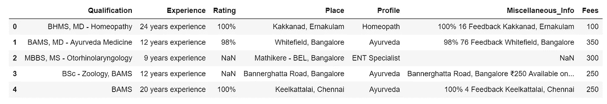
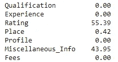
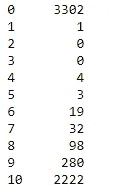
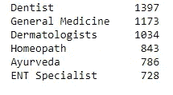
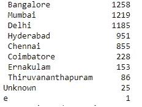
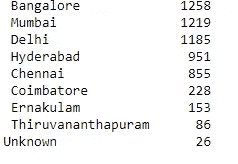
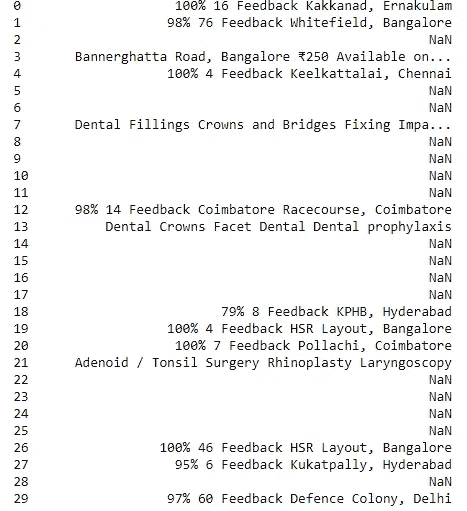
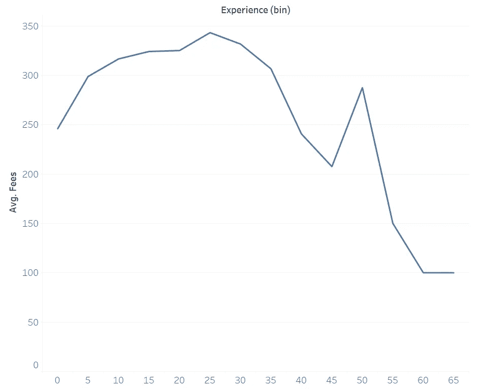
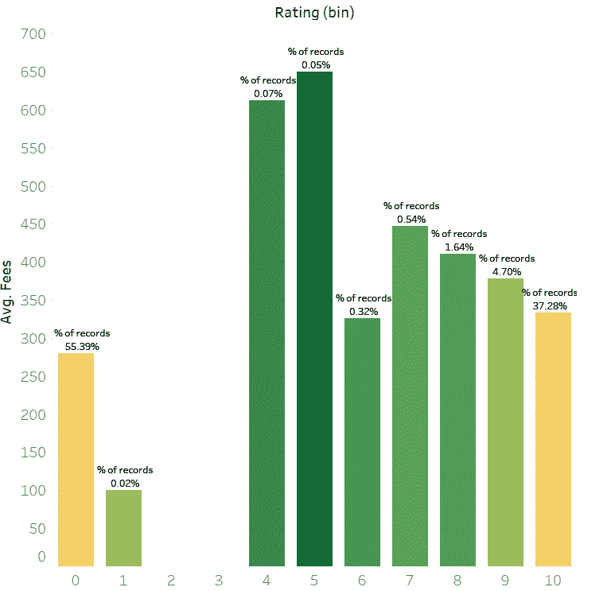
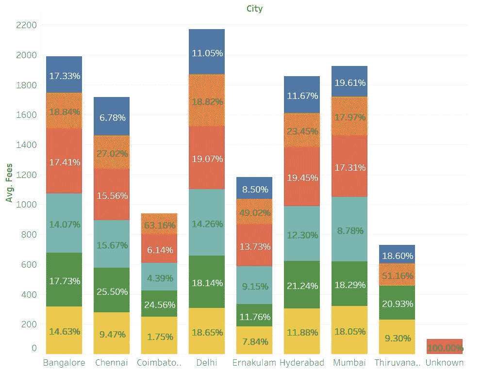

# MachineHack，预测医生的咨询费黑客马拉松

> 原文：<https://towardsdatascience.com/machinehack-predict-a-doctors-consultation-hackathon-20047849ee7b?source=collection_archive---------15----------------------->


MachineHack.com

最近我参加了一个在线机器学习黑客马拉松，它使用机器学习来预测印度医生的咨询价格。尽管我没有取得很好的预测/结果，但这是一次巩固过去几个月所学知识的学习机会。无论如何，对于那些不知道的人来说，我来自一个制药背景，正在通过自己的课程学习数据分析技能。如果你有兴趣涉足这一领域，请务必查看我的课程表[这里](/data-science-curriculum-from-scratch-2018-part-1-35061303c385)。

让我们直接进入黑客马拉松吧。这是一个相当小的数据集，有 5961 行和 7 个独特的特征。

1.  医生的资格
2.  医生多年的经验
3.  医生简介
4.  患者给出的评级
5.  包含医生其他信息的 Miscellaeous _ Info
6.  地点(医生所在地的地区和城市)
7.  医生收取的费用(因变量)

首先，导入所有依赖项和数据集

```
import numpy as np
import pandas as pd
from sklearn.model_selection import GridSearchCV
from sklearn.preprocessing import StandardScaler
from sklearn.preprocessing import OrdinalEncoder
from sklearn.model_selection import train_test_split
from sklearn.metrics import make_scorerdf = pd.read_csv("Final_Train.csv")
```

查看数据以了解给出的信息

```
df.head()
```



显然，在任何建模过程之前，需要进行一些数据清理。让我们先来看看这个定型数据集中缺失值的数量。

```
round(df.isnull().sum()/len(df)*100,2)
```



上图显示了每列缺失值的百分比。我将单独处理这些缺失的值，所以现在只需记住这些值。

我总是喜欢先从最简单的任务开始，然后再处理更复杂的问题。这里的“Experience”列看起来很简单，因为它只需要从字符串中提取整数值。

```
# Extract years of experience
df["Experience"] = df["Experience"].str.split()
df["Experience"] = df["Experience"].str[0].astype("int")
```

第一行代码将字符串分割成一个列表，而第二行代码提取列表的第一个元素并将其转换成整数。

接下来，通过将城市和地区分开，可以很容易地处理“地点”列。

```
# Extract cities
df["Place"].fillna("Unknown,Unknown",inplace=True)
df["Place"] = df["Place"].str.split(",")
df["City"] = df["Place"].str[-1]
df["Place"] = df["Place"].str[0]
```

在提取之前，我用字符串‘Unknown，Unknown’替换了该列中所有缺失的值来表示它们。旁注，有时给缺失值一个单独的类是一个好主意，而不是依赖于缺失值插补技术，如均值/中值/众数。例如，在该数据集中，印度的一些地区可能在数据收集期间没有列出它们的位置，但是它们可能来自同一个地区。接下来，在'，'处拆分字符串，并使用列表的最后一个元素创建一个新列' City '。

转到“评级”列，记住该列有超过 50%的缺失值。在任何其他处理之前，我们必须处理丢失的值。

```
# Seperate Ratings into bins
df["Rating"].fillna("-99%",inplace=True)
df["Rating"] = df["Rating"].str[:-1].astype("int")bins = [-99,0,10,20,30,40,50,60,70,80,90,100]
labels = [i for i in range(11)]
df["Rating"] = pd.cut(df["Rating"],bins=bins,labels=labels,include_lowest=True)
```

缺失值被替换为-99%,以区分它们。然后，假设 91%的评级与 99%的评级没有显著差异，我将它们分组到大小为 10 的箱中。缺失值将属于 0 类，而 0-9%将属于 1 类，10-19%将属于 2 类，依此类推。`df[“Rating”].value_counts().sort_index()`显示分布情况。



对于“资格”栏，它包括医生的各种资格，没有任何标准化的报告方法。我首先进行常规的拆分，并尝试了解不同术语在本专栏中出现的频率。

```
# Extract relevant qualification
df["Qualification"]=df["Qualification"].str.split(",")
Qualification ={}
for x in df["Qualification"].values:
    for each in x:
        each = each.strip()
        if each in Qualification:
            Qualification[each]+=1
        else:
            Qualification[each]=1
```

说实话，现阶段我挺迷茫的。如果您查看`Qualification`字典，大部分限定条件在整个数据集中只出现了一次，一些术语实际上指的是类似的限定条件，但被单独计算。例如，有条目“MBA-医疗保健”和“MBA ”,我认为它们指的是同一个资格。这是非标准化数据输入或数据收集的问题，我相信数据科学家/分析师每天都会看到这一点。我决定采用最简单的方法，简单地确定出现次数最多的前 10 项资格。

```
most_qua = sorted(Qualification.items(),key=lambda x:x[1],reverse=True)[:10]
final_qua =[]
for tup in most_qua:
    final_qua.append(tup[0])for title in final_qua:
    df[title]=0

for x,y in zip(df["Qualification"].values,np.array([idx for idx in range(len(df))])):
    for q in x:
        q = q.strip()
        if q in final_qua:
            df[q][y] = 1df.drop("Qualification",axis=1,inplace=True)
```

最终结果是数据集中 10 个最高频率鉴定的虚拟变量。

现在是“简介”专栏。如果您记得的话，我们在这一列中没有任何缺失值。一个快速的`value_counts()` 检查产生了这个。



这真的很棒。因为整列只有 6 个类，所以 oneHotEncoding 应该可以完成这个任务。在此之前，对我们创建的“City”列的快速检查显示，它也包含少量的类(10)。然而，奇怪的事情突然出现了。



不知从哪里冒出了一个“e”条目，我猜这应该是个错误(错误的条目)。我发现问题发生在第 3980 行，于是我将该行的“城市”和“地点”列改为“未知”。

```
df["City"][3980] = "Unknown"
df["Place"][3980] = "Unknown"
```

最后的检查。



好多了。然后，通过只使用一行代码，我们将能够同时为‘Profile’和‘City’列生成虚拟变量。

```
# Get dummies
df = pd.get_dummies(df,columns=["City","Profile"],prefix=["City","Profile"])
```

最后，这里是“杂项信息”栏的简短预览



考虑到丢失值的百分比很高(43.95%)，并且我找不到该列的任何相关性(我不是 NLP 专家)，我决定放弃该列，直接删除它。当然不是最好的方法，但我现在会这么做。

```
df.drop("Miscellaneous_Info",axis=1,inplace=True)
```

一旦我们完成了数据预处理，下一步自然应该是数据可视化。注*有些人宁愿在建模前不看你的数据，以防止分析师引入任何偏见，而是看每个人自己的数据。



大多数人会认为医生的经验和他们收取的费用之间有某种联系。确实有，但可能不是我们期望的那样。平均费用随着经验的增加而增加，但在大约 25 年的经验时达到峰值，然后，平均费用随着经验的进一步增加而减少。



评级是另一个值得关注的有趣变量。如果您还记得，我们将评级分为大小为 10 的容器，包括最小值。例如，bin 5 将是 40–49%的等级，bin 10 将是 90–100%，bin 0 将只是数据集中缺失的值。如您所见，高评级与高收费并不相关(事实上，低收费可能是高评级的原因！)，而收取的最高平均费用实际上为 30–60%。配色方案描述了每个箱子中的中间体验水平，深绿色代表较高的中间体验。bins 4 和 bin 5 中的平均经验分别为 27 年和 31 年，而 bin 10 中的平均经验只有 14 年，证明了医生在这些 bin 中收取更高费用的能力。



这里有很多东西需要解开。

1.  不同城市的医生收费不同
2.  对于大多数城市来说，每个城市内不同医生档案的分布是相似的
3.  所有城市未知的条目实际上都是皮肤科医生！

之前我提到丢失的数据可能不是随机的，可能是由于数据收集过程，这是一个很好的例子。不知何故，一些城市的皮肤科医生没有记录他们的位置！

注意，所有的可视化都是在 Tableau 中完成的，因为我正在学习这个工具。您可以使用 python 或任何其他可视化工具。

最后，我们可以对我们的数据建模，可以做一些很酷的机器学习。我决定使用支持向量机来完成这项任务，因为它可以用于线性和非线性问题。少量的数据也不能保证使用神经网络。

在实现算法之前，我们必须对分类变量进行编码，并对其特征进行缩放。

```
X = df.drop("Fees",axis=1)
y = df["Fees"]# Encoding
enc = OrdinalEncoder()
X = enc.fit_transform(X)X_train, X_test, y_train, y_test = train_test_split(X,y,test_size=0.2)# feature scaling
scaler = StandardScaler()
X_train = scaler.fit_transform(X_train)
```

正在实施 SVR …

```
# support vector machine 
from sklearn.svm import SVR
m = SVR(gamma="scale")
m.fit(scaler.transform(X_train),y_train)
```

基于 hackathon 站点，根据均方根对数误差(RMSLE)对提交的内容进行评估，更具体地说，`1-RMSLE.`

```
def score(y_pred,y):
    y_pred = np.log(y_pred)
    y = np.log(y)
    return 1 - ((np.sum((y_pred-y)**2))/len(y))**1/2# Prediction
y_pred = m.predict(scaler.transform(X_test))
score(y_pred,y_test)
```

我们对测试集的预测给了我们一个分数`0.7733490738717279`。如果你看一下排行榜，得分最高的是`0.76162342`。当然，我们的测试集不是用于排行榜的真实测试集，不具有可比性。但是它给了我们一个进一步优化的标准。

进行 GridSearchCV 是进行超参数调优的一个很好的方法，但是要注意计算能力，特别是对于像 SVM 这样不能很好伸缩的算法。

```
# Define own scorer
scorer = make_scorer(score,greater_is_better=True)# Hyperparameter tunning
parameters = {"C":[0.1,1,10],"kernel":["linear","rbf","poly"]}
reg = GridSearchCV(m,param_grid=parameters,scoring=scorer,n_jobs=-1,cv=5)reg.fit(X_train,y_train)
```

运行`reg.best_params_`给出了提供最佳得分的超参数组合。这种情况下最好的超参数是 C=10，kernel="rbf "。注*定义您自己的计分器以在 GridSearchCV 中使用，因此它使用计分矩阵进行优化。

最后。

```
y_pred_tuned = reg.predict(scaler.transform(X_test))
score(y_pred_tuned,y_test)
```

这里得到的分数是`0.8034644306855361`。略有改善，但仍然是改善。使用排行榜测试集，这意味着得分为`0.72993077`，排名 62/169(前 40 个百分点)

这就是了。机器学习竞赛的完整演练。为了取得更好的成绩，我还可以做更多的事情，做更多的功能工程，使用其他算法，但不幸的是，我没有在比赛结束前做到这一点。做这样的比赛有助于巩固你所学的知识，也是练习的好方法。除非你的目标是奖励，否则获胜往往并不重要，而这才是最有成就感的过程。

所有的代码都可以在我的 GitHub [这里](https://github.com/Benlau93/MachineLearning_Hackathon/blob/b8f985126dd6c5caf84a431d35afce76797f6857/Predict%20A%20Doctor's%20Consultation%20Fee%20Hackathon.ipynb)找到。