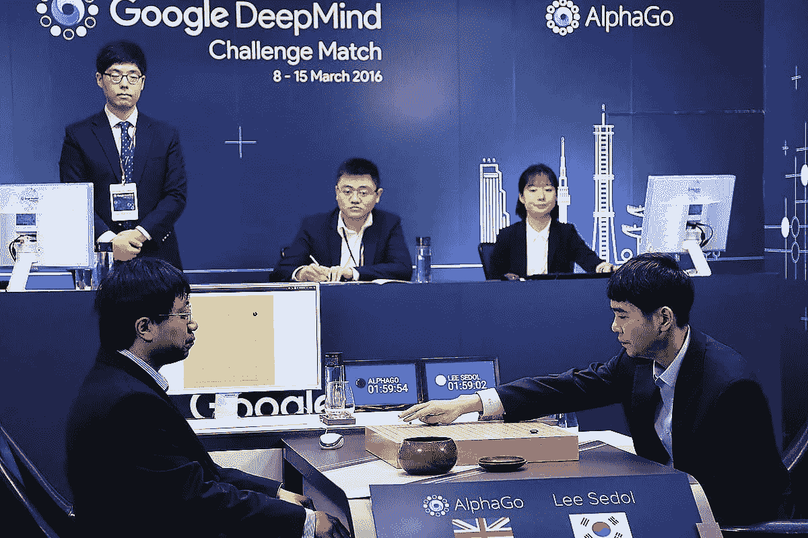
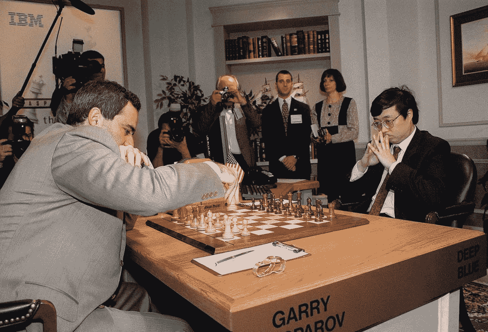

# 通过实践学习的机器

> 原文：<https://towardsdatascience.com/machines-that-learn-by-doing-92745ef18a81?source=collection_archive---------12----------------------->

## 强化学习与人工智能之路

Go Champion Lee Sedol (right) playing against AlphaGo in 2016 ([source](https://www.newscientist.com/article/2117067-deepminds-alphago-is-secretly-beating-human-players-online/))

在我 25 岁左右的时候，我第一次学会了打网球。关于网球的事情是，一旦你开始，就很难让球落在球场的对面(而不是球场后面的树上)。诀窍是在击球的瞬间，大致垂直地握住球拍，并给予球足够的上旋力。经过几个小时的训练和与朋友的练习，我慢慢学会了如何在击球时将球拍调整到合适的角度。

我的大脑能够学习一项新的任务，打网球，主要是通过频繁的练习。它是怎么做到的？机器能做同样的事情吗？机器可以边做边学吗？

## 人工智能:机器如何学习

人工智能大致有两种不同的方法，研究人员称之为*专业化*和*通用*方法。

例如，*图像分类*的最新进展就是高度专业化的人工智能形式。图像分类模型通常也非常复杂: *AlexNet* 例如，它在计算机视觉领域最有影响力的[论文之一](https://papers.nips.cc/paper/4824-imagenet-classification-with-deep-convolutional-neural-networks.pdf)中提出，包含 6000 万个自由参数，需要用大量人类标记的训练数据进行调整。尽管这种系统可以在现实世界中得到有用的应用，但对标记训练数据的需求，以及专业化的程度，使它们在范围上受到了根本的限制:例如，一个经过训练可以区分猫和狗的人工智能系统，无法在 x 光胸片中检测出肺炎。不用说，这样一个系统甚至不知道这些概念是什么意思。称这样一个系统是智能的几乎有点言过其实。

Chest X-ray (left), overlayed with predicted pneumonia probability density map (right) ([source](https://www.eenewseurope.com/news/algorithm-beats-radiologists-diagnosing-x-rays/page/0/1))

通用人工智能是一种完全不同的方法。这里的想法是开发更简单，同时更通用的算法和方法，让机器在没有人类参与的情况下学习它们的环境。在我看来，*强化学习领域*是当今最有希望实现通用人工智能的方法之一。那是什么？

## 强化学习:学习做什么

*强化学习意味着学习做什么:将情境映射到行动。如果这听起来很熟悉，那是因为这本质上是我们人类一直在做的事情。这种想法从根本上不同于监督和非监督机器学习。让我解释一下。*

在监督学习中，机器本质上学会给出“正确”的答案:狗还是猫？肺炎还是没有肺炎？在无监督学习中，机器根据现有数据点的相似性(但没有标签)来学习数据的结构:例如，在你的数据库中有五种不同类型的客户，下面是他们的偏好和行为如何不同。*强化学习不是做这两件事——它是学习在给定的情况下做什么。这是一种非常通用同时又非常强大的方法:它被设计成甚至可以在完全未知的领域工作。*

从技术上讲，RL 问题被框定为所谓的*马尔可夫决策过程*，这基本上意味着有两个‘当事人’，*代理*和*环境*。在任何给定的时间，环境都处于某种状态。代理执行改变其环境状态的动作，并获得回报，回报可以是积极的或消极的。代理人的目标是选择行动，以便在任何给定时间最大化他们未来总报酬的期望值。代理决定动作的逻辑被称为*策略*。强化学习问题中的主要挑战是代理人*学习最优策略*，这是将最大化未来回报期望的策略。

Illustration of a Markov decision process ([source](https://www.google.com/url?sa=i&source=images&cd=&ved=2ahUKEwiUnuyXkfniAhUFKawKHX95Bj4QjRx6BAgBEAU&url=https%3A%2F%2Fdeepai.org%2Fmachine-learning-glossary-and-terms%2Fmarkov-decision-process&psig=AOvVaw0G30XMOgV8qFYdhlz4ypXm&ust=1561156997995276))

这都是高度理论化的，所以希望一些例子能阐明这个想法。以下是可以被公式化为强化学习问题的所有例子:

*   收集空罐子的清洁机器人。
*   电厂中控制核反应堆的系统。
*   一个正在学习[走路的机器人](https://www.youtube.com/watch?v=imOt8ST4Ejc)。
*   一种交易股票的系统，旨在实现利润最大化。
*   学习下棋的机器，如国际象棋。

请注意，强化学习植根于*心理学*领域:政策与*刺激反应*的心理学概念有关，而奖励则对应于一种快乐或痛苦的形式。

Photo credit: Luca Baggio, [Unsplash](https://unsplash.com/photos/ET244M6ZMN4)

## 探索与利用的权衡

强化学习的一个典型特征是存在着*探索与利用的权衡*:在同样的情况下，一个智能体是应该坚持一个已知回报的行为(*利用*)，还是尝试一个新的行为以期获得更高的回报(*探索*)？

考虑所谓的*多臂强盗问题*:给定一个吃角子老虎机(环境)，比方说，有 10 个臂，每个臂产生不同的、未知的支付金额(奖励)分布，你(代理人)如何决定玩哪个臂？一个被称为*贪婪*策略的策略是，总是在你过去看到最高回报的地方拉手臂。贪婪的策略纯粹是剥削。为了给你的策略注入一些探索，你可以以小概率(我们称之为ε)随机选择一只手臂:这种策略被称为*ε-贪婪。*

如果其他分支给出更高的回报，那么贪婪将帮助你找到它们，同时充分利用你已经找到的高回报分支。贪婪是解决探索与剥削两难的一种方式。如果收益随时间变化，这种偶尔随机探索的策略尤其重要。我们称这样的问题为*非平稳的*，它们通常是强化学习的标准。贪婪的策略可能会错过收益转移的时刻；e*psilon-贪婪策略适应*。

在我继续之前，让我简单地指出，这里也有一个微妙的人生教训，简单地说就是这个:*不时地尝试一些随机的事情*。不要墨守成规，即使你的墨守成规有很好的回报。你永远不知道是否有别的东西可以给你更高的回报，你可能会通过一些随机的探索找到它。

Kasparov moving his first piece in the first game of the rematch against Deep Blue ([source](https://rarehistoricalphotos.com/kasparov-deep-blue-1997/))

## 最优策略与计算可行性

原则上，给定无限的时间和计算能力，代理可以学习任何情况下的真正最优策略:这样的代理永远不会出错！

然而实际上，时间和计算能力都是有限的。因此，代理通常只能用*逼近*最优策略。例如，在游戏中，代理可以通过忽略很少发生的情况来加快计算速度:如果它很少发生或从不发生，为什么要费心去想如果发生了该怎么办？

1997 年，加里·卡斯帕罗夫决定与 IBM 的“深蓝”再赛一场(一年前他赢了一场与这台机器的比赛)。正如内特·西尔弗在《信号与噪音》一书中解释的那样，卡斯帕罗夫的策略是“将程序带出数据库，让它再次盲目飞行”。换句话说，他试图迫使游戏进入一种他可以预期深蓝没有学到最优策略的情况。这就是他在第一轮比赛中的第三步所做的，他忽略了对他的骑士的威胁，而是移动了一个棋子，这是一个非常不寻常的举动。西尔弗指出，棋盘的最终状态也很不寻常，在大师级比赛中只出现过一次。

比赛是怎么结束的？卡斯帕罗夫赢得了这一轮比赛，这可能是也可能不是因为他不寻常的举动迫使深蓝盲目飞行。坏消息是:这是卡斯帕罗夫赢得的最后一轮比赛。深蓝赢了这场比赛，这使得 1997 年成为艾征服国际象棋的一年。

## 向机器学习:传奇之举 37

让我们离开象棋的世界，进入围棋的世界。在具有历史意义的 2016 年 Deepmind 的 AlphaGo 与世界顶级围棋选手 Lee Sedol 的围棋比赛中，第二局发生了奇怪的事情。AlphaGo 先走 37 步[看起来是个失误](https://www.wired.com/2016/03/googles-ai-viewed-move-no-human-understand/)。评论员和专家不理解这一举动。Sedol 花了超过 15 分钟来决定一个回应。此前输给 AlphaGo 的欧洲围棋冠军范辉后来评论说:“(T2)这不是人的举动。我从未见过人类玩这一招。

第 37 步不是一个错误。人类不理解这步棋，仅仅是因为 AlphaGo 预见了*那么多步棋*。事实上，AlphaGo 赢得了比赛，以及整场比赛。它发现了一步人类从未想到过的棋，改变了当今最好的棋手对围棋的看法。

当然，围棋只是一种游戏——但诸如药物发现、疾病检测或灾难预测等问题呢？这里的信息是，人工智能有可能为我们指出新的、未经探索的解决方案，以解决我们从未想到的问题。

Photo credit: Mauro Mora, [Unsplash](https://unsplash.com/photos/31-pOduwZGE)

## 学习就是做人

> 所有的经历都被我们的新视野丰富地交织在一起，然后新的联系开始出现。城市人行道上流淌的雨水将教会钢琴家如何流动。一片随风轻飘的树叶会教会控制者如何放手。一只家猫会教我如何移动。所有的时刻都变成了每个时刻。—乔希·怀兹金，《学习的艺术》

在《学习的艺术》一书中，乔希·怀兹金讲述了他年轻时成为国际象棋冠军，后来成为武术冠军的经历。他解释了掌握象棋如何帮助他学习武术，反之亦然。建立联系，将一个主题的知识转移到另一个主题的能力，可能是我们拥有的最强大的技能之一，当然也是人工智能极难模仿的技能。

事实是，机器不善于将一项任务中的专业知识转移到另一项任务中。此外，他们没有*直觉*的概念，直觉在我们以前没有解决的任务中指导我们人类。即使强化学习领域迄今为止已经显示出极其有前途的结果，我相信这可能是我们在走向通用 AI 的旅程中需要克服的两个主要限制。

## *资源*

*   理查德·萨顿和安德鲁·巴尔托，*强化学习*
*   内特·西尔弗，*信号和噪音*
*   乔希·威茨金*学习的艺术*