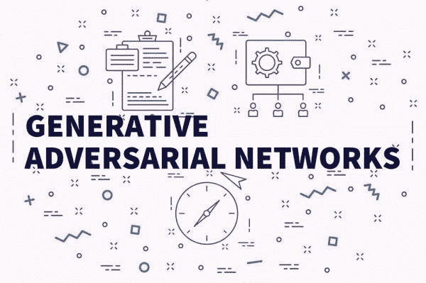
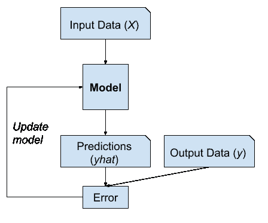
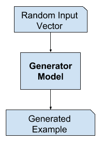
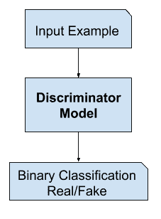
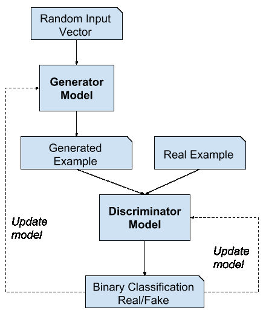
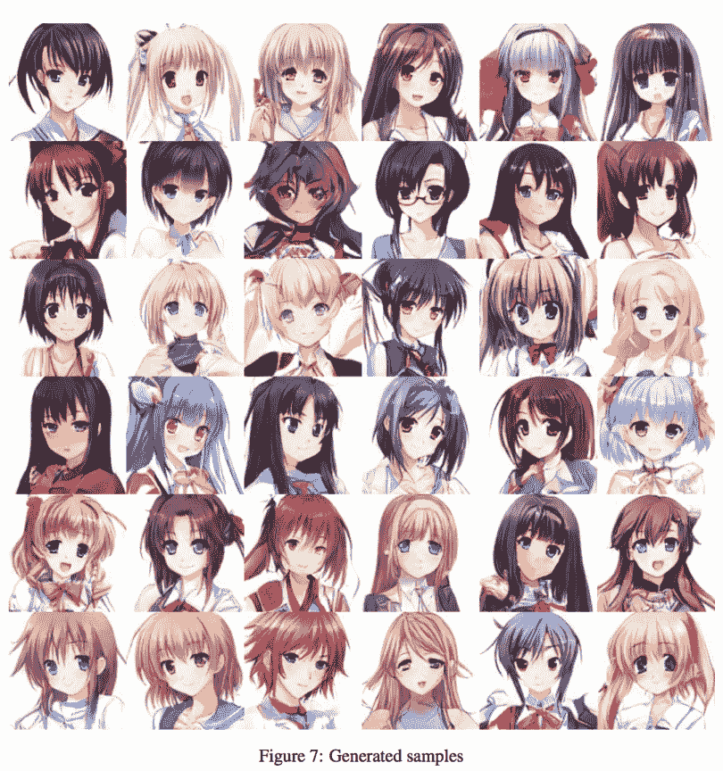
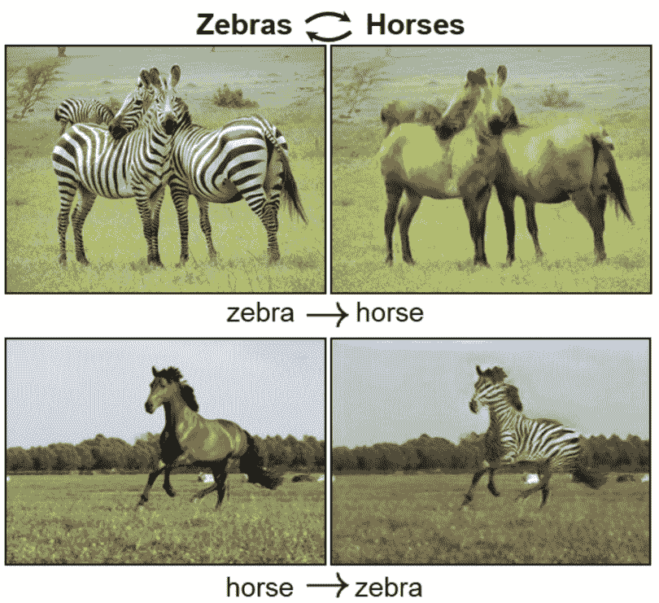
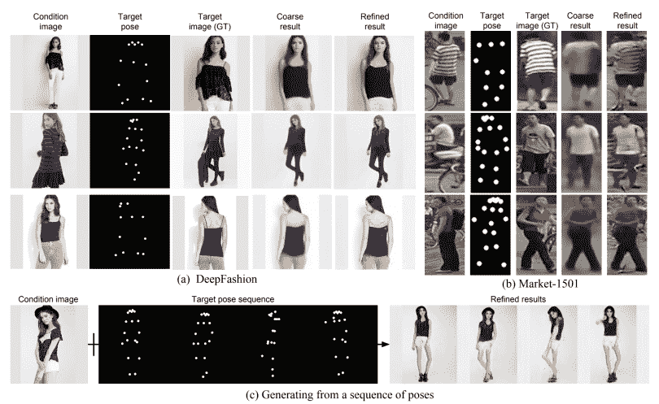

# MachineX:生成式对手网络(GAN)

> 原文：<https://towardsdatascience.com/machinex-generative-adversary-networks-gan-5a9c198b7e87?source=collection_archive---------21----------------------->

## 在这篇博客中，我们将讨论 GAN(生成式对手网络)的基础知识以及它们实际上是如何工作的。

甘是一个喜欢创作的人，喜欢画肖像画或创作交响乐。这和其他深度学习领域相比是很难的。通过电脑或人来识别莫奈的画要比画一幅容易得多。但是它让我们更接近理解智能。GAN 将我们引向近年来撰写的数千篇 GAN 研究论文。在开发游戏时，我们雇佣许多制作艺术家来制作动画。有些任务是例行公事。通过将自动化应用于 GAN，我们可能有一天会专注于创造性方面，而不是每天重复例行任务。

为了理解它们是如何工作的，想象一个盲人伪造者试图创作大师画作的复制品。首先，他不知道一幅画应该是什么样子。

但是他碰巧有一个朋友，他对曾经画过的每一幅杰作都记忆犹新。

GAN 背后的原理是在 2014 年首次提出的。它描述了一个系统，该系统使两个人工智能系统([神经网络](https://blog.knoldus.com/machinex-the-alphabets-of-artificial-neural-network/))相互对抗，以提高它们的结果质量。

# 介绍

生成对抗网络(GAN)是一种使用深度学习方法(如卷积神经网络)进行生成建模的方法。

生成建模是机器学习中的一项无监督学习任务。它包括自动发现和学习输入数据中的规律或模式。以便该模型可以用于生成或输出可能已经从原始数据集中提取的新示例。

GAN 是一种训练生成模型的聪明方法，它通过将问题框架化为具有两个子模型的监督学习问题:我们训练以生成新示例的生成器模型。鉴别器模型试图将示例分为真实的(来自域)或虚假的(生成的)。这两个模型在一个零和游戏中一起训练，对抗，直到鉴别器模型被愚弄了大约一半的时间，这意味着生成器模型正在生成似是而非的例子。

在讨论生成式对手网络之前，让我们先讨论一下生成式模型。所以，

# 什么是生成模型？

我们将回顾生成模型的思想，跨越有监督和无监督的学习范式，以及区别性和生成性建模。

一个典型的机器学习问题涉及到使用模型进行预测

这需要一个用于训练模型的训练数据集，该数据集由多个称为样本的示例组成，每个示例都具有输入变量( *X* )和输出类标签( *y* )。通过显示输入的示例，让模型预测输出，并修正模型以使输出更像预期的输出，来训练模型。

# 什么是生成性对抗网络？

GAN 模型架构包括两个子模型:用于生成新样本的*生成器模型*和用于分类的*鉴别器模型*。生成的例子是真实的，来自领域，还是伪造的，由生成器模型生成。

*   **发电机**。用于从问题域中生成新的合理示例的模型。
*   **鉴别器**。用于将示例分类为真实(*来自域*)或虚假(*生成*)的模型。

# 发电机模型

生成器模型将固定长度的随机向量作为输入，并在域中生成样本。

该向量是从高斯分布中随机抽取的，并且该向量用于生成过程的种子。在训练之后，这个多维向量空间中的点将对应于问题域中的点，形成数据分布的压缩表示。

这个向量空间被称为潜在空间，或者由[潜在变量](https://en.wikipedia.org/wiki/Latent_variable)组成的向量空间。潜在变量，或隐藏变量，是那些对一个领域很重要但不能直接观察到的变量。

在训练之后，生成器模型被保留并用于生成新的样本。

# 鉴别器模型

鉴别器模型将来自领域的示例作为输入(真实的或生成的)，并预测真实或虚假的二进制类别标签(生成的)。

真实的例子来自训练数据集。生成的示例由生成器模型输出。

鉴别器是一个正常的(也很容易理解的)分类模型。

在训练过程之后，鉴别器模型被丢弃，因为我们对生成器感兴趣。

有时，当生成器已经学会从问题领域的例子中有效地提取特征时，它可以被重新利用。一些或所有特征提取层可以用于使用相同或相似输入数据的迁移学习应用中。

# GANs 是一个双人游戏

生成器和鉴别器这两个模型一起训练。生成器生成一批样本，这些样本与来自该领域的真实样本一起被提供给鉴别器，并被分类为真或假。

然后更新鉴别器，以便在下一轮中更好地鉴别真假样品，重要的是。基于生成的样本欺骗鉴别器的程度来更新生成器。

在这种情况下，零和意味着当鉴别器成功识别真假样本时。它被奖励或者不需要改变模型参数，而生成器由于对模型参数的大量更新而受到惩罚。

或者，当生成器欺骗鉴别器时，它被奖励，或者不需要改变模型参数，但是鉴别器被惩罚并且它的模型参数被更新。

在极限情况下，生成器每次都从输入域生成完美的副本，并且鉴别器无法辨别差异，并且在每种情况下都预测“不确定”(例如，50%的真假)。这只是一个理想化情况的例子；我们不需要达到这一点来获得一个有用的发电机模型。

# 为什么是生成性对抗网络？

在计算机视觉等领域使用深度学习方法的许多重大进步之一是一项名为[数据增强](https://machinelearningmastery.com/image-augmentation-deep-learning-keras/)的技术。

数据扩充会产生性能更好的模型，既提高了建模技能，又提供了正则化效果，减少了泛化错误。它的工作原理是从模型被训练的输入问题域中创建新的、人工的但似乎合理的例子。

在图像数据的情况下，这些技术是原始的，包括对训练数据集中现有图像的裁剪、翻转、缩放和其他简单变换。

成功的生成式建模为数据扩充提供了另一种可能更特定于领域的方法。事实上，数据扩充是生成式建模的简化版本，尽管很少这样描述。

GANs 对高维数据建模、处理缺失数据的成功能力，以及 GANs 提供多模态输出或多个似是而非答案的能力。

也许 GANs 最引人注目的应用是在需要生成新例子的任务的条件 GANs 中。在这里，Good fellow 指出了三个主要例子:

*   **图像超分辨率**。生成输入图像的高分辨率版本的能力。
*   **创造艺术**。伟大的新的艺术形象，素描，绘画，等等的能力。
*   **图像到图像的翻译**。跨领域翻译照片的能力，例如从白天到夜晚、从夏天到冬天等等。

# GAN 应用

*   **创造动漫人物**

*   **CycleGAN**

*   **姿势引导的人物图像生成**

我们将在下一部分更深入地讨论这些应用程序，敬请关注。

快乐学习！！！！

最初发布于 knoldus 博客:[https://blog . knold us . com/machinex-generalized-attendant-networks-gan/](https://blog.knoldus.com/machinex-generative-adversary-networks-gan/)