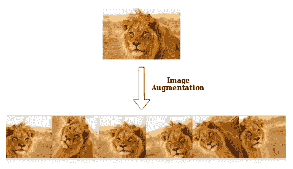
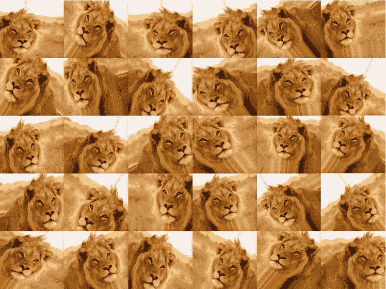

# MachineX:使用 Keras 增强图像数据

> 原文：<https://towardsdatascience.com/machinex-image-data-augmentation-using-keras-b459ef87cd22?source=collection_archive---------31----------------------->

在这篇博客中，我们将关注使用 Keras 的**图像数据增强**以及我们如何实现它。



# 问题

当我们处理图像分类项目时，用户给出的输入可能在许多方面有所不同，如点击图片时的角度、缩放和稳定性。所以我们应该训练我们的模型去接受和理解几乎所有类型的输入。

这可以通过为所有可能性训练模型来完成。但是当训练集大到 10000 张图片时，我们不能到处点击每个可能角度的相同训练图片！

这可以很容易地通过一种叫做图像数据扩充的技术来解决，这种技术拍摄一幅图像，将其转换并以我们指定的所有可能的形式保存。

# 图像增强介绍

图像增强是一种用于人工扩展数据集的技术。当我们得到一个只有很少数据样本的数据集时，这是很有帮助的。在深度学习的情况下，这种情况很糟糕，因为当我们在有限数量的数据样本上训练它时，模型往往会过度拟合。

通常用于增加数据样本计数的图像增强参数是缩放、剪切、旋转、预处理 _ 函数等。这些参数的使用导致在深度学习模型的训练期间生成具有这些属性的图像。使用图像增强生成的图像样本通常会导致现有数据样本集增加近 3 到 4 倍。

# 履行

让我们从导入所有必需的库开始:

```
pip install tensorflow
pip install scipy
pip install numpy
pip install h5py
pip install pyyaml
pip install keras
```

我们已经安装了`scipy`、`numpy`、`h5py`、`pyyaml`，因为它们是`keras`所需的依赖项，而且由于 keras 工作在`tensorflow`后端，所以也需要安装它们。你可以在这里阅读更多关于 [tensorflow 安装的信息](https://www.tensorflow.org/install/)。我们将使用`keras`进行图像增强。

让我们导入 keras 图像预处理。

```
from keras.preprocessing.image import ImageDataGenerator,img_to_array, load_img
```

这里，`ImageDataGenerator`用于指定我们将用来生成图像的参数，如旋转、缩放、宽度，稍后将会介绍更多的参数。`img_to_array`用于将给定的图像转换成一个 **numpy 数组**供`ImageDataGenerator`使用，`load_img`将用于加载要修改的图像到我们的程序中。

```
datagen = ImageDataGenerator(
        rotation_range=40,
        width_shift_range=0.2,
        height_shift_range=0.2,
        shear_range=0.2,
        zoom_range=0.2,
        horizontal_flip=True,
        fill_mode='nearest')
```

# 参数:

我们在此使用`ImageDataGenerator()`指定生成图像的参数，解释如下:

**旋转 _ 范围:**旋转量

**宽度 _ 移动 _ 范围，高度 _ 移动 _ 范围:**宽度、高度的移动量

**shear_range :** 逆时针方向的剪切角度，以弧度表示

**缩放范围:**随机缩放的范围

**horizontal_flip :** 布尔型(真或假)。水平随机翻转输入

f**ill _ mode:**{“常量”、“最近”、“反射”或“换行”}之一。根据给定的模式填充输入边界外的点

在指定参数并将它们存储在`datagen`变量中之后，我们开始导入我们的图像。

```
img = load_img('lion.jpg')
```

在这里，我使用的是狮子图像，你可以简单地使用你自己的样本图像。

```
x = img_to_array(img)  # creating a Numpy array with shape (3, 150, 150)
x = x.reshape((1,) + x.shape)  # converting to a Numpy array with shape (1, 3, 150, 150)
```

用于加载所需的图像，您可以使用任何您喜欢的图像，但我会推荐一张脸像猫、狗或人的图像！

接下来，我们使用`img_to_array`将图像转换成数字，在本例中，是一个 **numpy 数组**，它可以很容易地输入到我们的`flow()`函数中(不要担心，稍后会解释！).我们将转换后的 numpy 数组存储到一个变量`x`中。

然后，我们必须重塑 numpy 数组，添加另一个大小为 1 的参数。我们这样做是为了使它成为 4 阶而不是 3 阶的 numpy 数组，以容纳名为**通道轴**的参数。对于灰度数据，通道轴的值应为 1，对于 RGB 数据，通道轴的值应为 3。

这是我的输入图像(一只狮子):


## 输出:

现在我们已经有了表单输入，让我们开始产生一些输出。

```
i = 0
for batch in datagen.flow(x,save_to_dir='output', save_prefix='lion', save_format='jpeg'):
    i += 1
    if i > 20:
        break
```

我们在每次迭代中使用`datatgen.flow()`函数。我们给了`x`—输入图像的 numpy 数组、`save_to_dir`—保存输出的目录、`save_prefix`—图像名称的前缀和`save_format`—作为输入的图像格式。

这是我们输出图像的样子:



请注意，由于缩放、旋转、宽度或高度偏移等原因，每张图像都与其他图像略有不同。这将有助于您将要构建的模型识别大量图像，从而提高效率。

这是 keras 中图像增强的概述。

此外，请访问 Machinex 页面，了解更多相同的更新:

*   [领英](https://www.linkedin.com/company/machinex-intelligence/)
*   [推特](https://twitter.com/MachinexWizards)