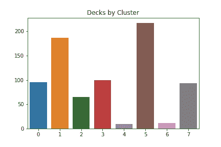
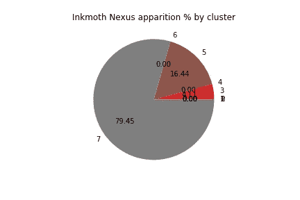
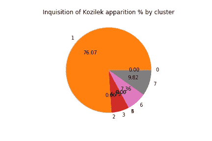
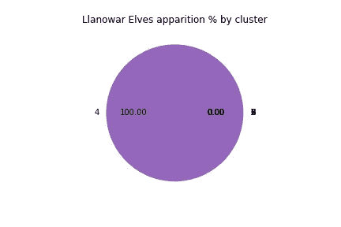
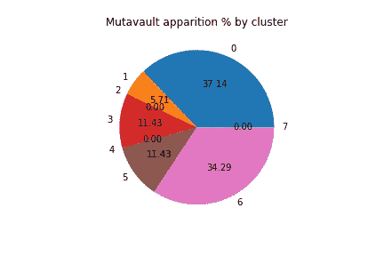

# 魔术:聚会遇上数据科学

> 原文：<https://towardsdatascience.com/magic-the-gathering-meets-data-science-2a0367c724fe?source=collection_archive---------20----------------------->


When Wizards bans your favourite Angel card. Source: [Pixabay](https://pixabay.com/photos/cemetery-peace-angel-sculpture-1655378/).

魔术:多年来，聚会一直是我的爱好之一。其庞大的卡库和悠久的历史使其非常适合数据分析和机器学习。

如果你错过了我的前一篇文章，我将 K-Means 聚类(一种无监督学习技术)应用于一个魔术:收集我从 [mtgtop8 收集的数据集。](https://mtgtop8.com/)那篇文章解释了技术方面的问题，但没有涉及结果，因为我认为我的读者不会感兴趣。

由于许多人已经站起来表达他们的不同意见，我现在将向你们展示算法学到的一些东西。

这不会是我第一次也不会是最后一次说，无监督学习可能会对它所学的一切感到毛骨悚然，即使你知道它是如何工作的。

# 数据

我在这个项目中使用的数据集只包含了去年现代格式的专业套牌。我没有在这个分析中包括侧板。在这个 [GitHub](https://github.com/StrikingLoo/MtGRecommender/) 项目中，我用于训练和可视化的所有工具和代码都是可用的。

如果你知道任何好的休闲套牌数据集，我很乐意在评论中知道。不然以后可能会刮一个。

在这个分析中，我看了 777 副不同的牌，总共包含 642 张不同的牌(算上地)。

# 结果呢

首先，我强烈建议您打开资源库，亲自尝试 Jupyter 笔记本，因为可能会有一些您感兴趣的见解，而我可能会遗漏。

也就是说，如果你想知道关于一张特定卡片的数据(假设它是竞争元的一部分，我们已经看到它足够小了)，如果你在这里没有看到它，请在评论中问我！

现在，我们要问自己的第一个问题是…

# 每个魔法:聚集集群看起来像什么？

请记住，我们聚集了一副牌，而不是一张牌，所以我们希望每一组能大致代表一个原型，特别是在现代元中看到的一个。

首先:这里是每个集群的计数。也就是说，每张牌有多少张。



Quantity of decks that fell on each cluster after applying K-Means Clustering.

我们可以马上看到有两个特别小的集群，每个集群不到 30 副牌。让我们仔细看看。

# 每个集群上的卡

对于第 4 组，我得到了每副牌中出现次数最多的一组 40 张牌，然后找出它们的交集，看看它们有什么共同点。我对第 6 组重复了这一过程。

```
Cluster number 4:
{'Devoted Druid', 'Horizon Canopy', 'Ezuri, Renegade Leader', 'Forest', 'Elvish Archdruid', 'Pendelhaven', "Dwynen\\'s Elite", 'Llanowar Elves', 'Collected Company', 'Windswept Heath', 'Temple Garden', 'Westvale Abbey', 'Razorverge Thicket', 'Heritage Druid', 'Elvish Mystic', 'Nettle Sentinel','Eternal Witness', 'Cavern of Souls', 'Chord of Calling', 'Vizier of Remedies', 'Selfless Spirit'}Cluster number 6:
{'Funeral Charm', 'Liliana of the Veil', "Raven\\'s Crime", 'Fatal Push', 'Thoughtseize', 'Wrench Mind', 'Bloodstained Mire', 'Smallpox', 'Inquisition of Kozilek', 'Mutavault', 'Urborg, Tomb of Yawgmoth','Infernal Tutor', 'Swamp', 'The Rack', "Bontu\\'s Last Reckoning", 'Shrieking Affliction'}
```

看起来他们中的一个在玩绿色牌组，使用精灵和绿色土地，而另一个结合了碾磨和丢弃，像 Liliana 和 Kozilek 的宗教裁判。

这是上一个算法对所有集群的结果，看看你能否分辨出每个集群属于哪个原型。这也告诉我们当我得到数据时元的分布情况。

Cards that appear in all decks in a certain cluster.

如果你参加竞技比赛，对一个更近的数据集进行同样的分析甚至可能是有用的。

# 特定卡片

在这些名单中，有三张牌让我印象深刻:“*变跳马*”、“*对科济莱克*的审讯”和“*拉诺瓦尔精灵*”。我想知道它们是否在其他集群中更常见？我真的不知道 *Mutavault* 在竞技比赛中如此常见，我认为*拉诺瓦尔精灵*出现在甲板上告诉了我们一些关于它的事情。



Well, that’s a one-trick pony. Clearly one of the things characterizing Cluster number 4 is the presence of Llanowar Elves.



和往常一样，你可以为任何一张卡片生成这些图表，或者问我你是否对某一张卡片感兴趣。

# 多功能卡片

最后，我将定义一种新的卡片类别:一张卡片的多功能性将意味着多少不同的组包含至少一副使用它的牌。

诚然，我同意这个定义还可以再完善一点。例如，通过计算幻影而不仅仅是卡片是否在一副牌中。

然而，这种方式的结果是足够连贯的，所以我不认为它需要任何更多的调整。在过滤掉基本的地之后，这里列出了十大最通用的牌。

1.  肢解
2.  鬼节
3.  废墟
4.  灵魂洞穴
5.  思维抓住
6.  Mutavault
7.  神圣铸造厂
8.  常去的地方
9.  工程炸药
10.  植物圣地

他们几乎就是你所期望的那种。然而，我很惊讶闪电没有入选。我不确定非基本地是否应该计算在内，但最后我还是把它们留了下来。

事实上，我不知道“工程炸药”是哪张牌，这证明我与超级玩家脱节了，也许我应该玩得更多，但这不是重点。

# 结论

正如我们所料,《魔法:聚会》是一个有趣的数据来源，我想我们都通过看到这一切学到了一些东西。

就我个人而言，我仍然很惊讶一点点被美化的线性代数可以了解所有关于竞争游戏的元。

如果它在休闲游戏中了解到原型，我会更惊讶，在休闲游戏中，套牌更加多样化，尽管我的直觉告诉我有足够多的集群，即使这样也应该被正确地表征。

你怎么想呢?你想看看其他的信息吗？你期望算法表现良好吗？最后，你认为还有哪些领域适合适当的数据分析，特别是使用其他无监督学习技术？

请让我在评论中知道任何或所有这些！

*关注我* [*中*](http://medium.com/@strikingloo) *或* [*推特*](http://www.twitter.com/strikingloo) *获取更多文章、教程和分析。请考虑* [*以一份贡献支持我的网站和我的写作习惯*](http://buymeacoff.ee/strikingloo) *。*

*原载于 2019 年 4 月 5 日*[*www . datastuff . tech*](http://www.datastuff.tech/data-analysis/magic-the-gathering-meets-data-science/)*。*