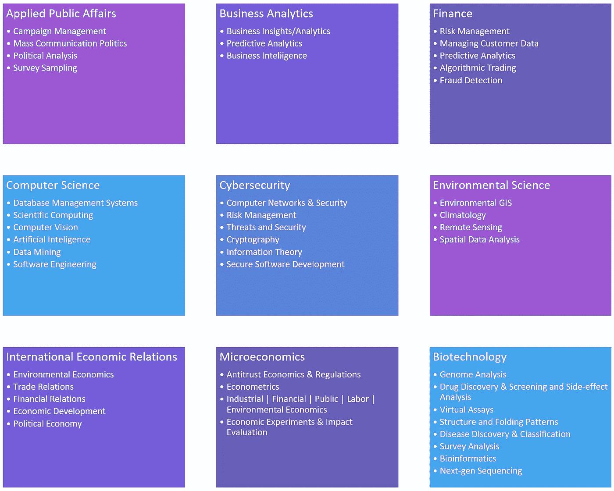

# 数据科学的主要课题和职业道路

> 原文：<https://towardsdatascience.com/major-topics-and-career-paths-in-data-science-467a429e364e?source=collection_archive---------20----------------------->

数据科学(DS)可以总结为统计分析和编程技能的结合，用于分析大量数据集并提供有意义的预测和结果。这需要实施许多技能，如统计学、数据挖掘、回归、分类、预测建模和数据可视化等。

收集数据只是这一实践的开始，因为大多数未经适当过滤、分类和清理的原始数据都是无用的。许多数据需要数据科学家的输入来合并、删除、连接和剪切该数据集的特定部分，以便为特定的分析/建模进一步准备数据集。

当领先公司意识到大数据的重要性及其在决策或业务关系中应用成功战略的用途时，DS 成为当前就业市场的热门话题。对大数据工程和应用科学日益增长的需求促使许多行业雇佣数据科学家作为现代魔术师来预测结果并提供有意义的解释。

当前的数据科学家来自许多不同的背景，如金融、经济、环境科学、计算机科学、统计等。这种多样性和非传统背景可以使他们有一个创新的视角，并应用不同的解决问题的技能。虽然本文并不试图涵盖 DS 中所有相关的职业，但它将试图让当前的教育求职者和求职者熟悉 DS 中的不同领域，如下所示。

**公共事务:**

在这条职业道路上，数据科学家应用统计学和计算机科学技能为没有得到满足的社会商品创造有效的公共政策结果。这是通过政治调查设计、基础设施/智能城市/交通管理、活动数据解释、政府欺诈检测(例如逃税者)、教育系统管理、公共卫生/住房/执法数据分析等实现的。

**商业分析:**

业务分析基本上使用与 DS 相同的大数据应用程序，并实施这些应用程序来确定业务决策、识别弱点并在组织内应用实际变化，以改善关键绩效指标或其他增长指标。尽管数据和业务分析有着相同的目标，但后者涉及更多的决策、变更实施和沟通。

**金融:**

分析已经成为金融服务的核心。价格预测、将统计模型应用于股票市场走势、识别变化、衡量消费者终身价值和欺诈检测是数据科学家可以为金融服务提供商提供的众多优势之一。这导致做出实时决策，创建预测市场机会的交易算法，并基于历史数据和人工智能个性化客户关系。

**计算机科学:**

统计学可以被认为是一个进化和发展中的科学技术分支，是计算机科学和统计学的一个分支。然而，由于 DS 和 cs 中共享的技能和主题，数据科学家也可以使用这些技术的交叉点，并将数学和编码技能应用于许多 CS 领域，如数据库管理、科学计算和数据挖掘。在计算机视觉、人工智能和自然语言处理等主题中，有更多的生产级代码编写。这需要数据科学家有更多的编码背景。

**网络安全:**

许多网络安全提供商正在将 DS 功能添加到他们的底层系统中。基于分析模型和人工智能，对新旧威胁的响应变得动态，许多决策是自主做出的。通过 DS 技术，组织可以仔细检查数据并实施更好的入侵检测系统来防止欺诈和保护有价值的信息。

**环境科学:**

由于工业污染的无节制排放，全球变暖成为近年来的热门话题。环境数据科学家可以将建模和预测技术应用于许多不同的数据集，如污染物水平、水位上升和含盐量、大气值以及来自不同地质生态系统的地理空间数据。研究结果可应用于地理信息系统、气候学、环境监测项目的遥感和全球气候趋势。

**国际经济关系:**

DS 也可以用来提供对国际政治经济学、环境经济学、全球化进程和贸易/金融关系的深入理解。

**微观经济学:**

数据科学家可以将其技能应用于反垄断经济学和法规、分析计量经济学、公共和劳动经济学、经济实验和影响评估等领域。

**生物技术:**

生物技术可以定义为使用任何技术来分析/应用于活的有机体、生物系统或一般的医疗保健系统。许多生物技术公司正在雇用数据科学家，因为他们可以在医疗或非医疗领域提供许多不同的好处。基因组分析和下一代测序需要具有统计和编码知识的生物技术人员为特定研究应用和分析万亿字节的数据。此外，疫苗、副作用分析和微生物/疾病分类等药物发现都可以通过 DS 完成。

随着越来越多的企业开始依赖 DS，对能够收集、组织、解释和可视化数据的专家的需求将会增加。数据分析师和科学家在未来几年将会有很高的需求，该领域的不同职业将会产生应用于数据相关问题的不同技术和知识。