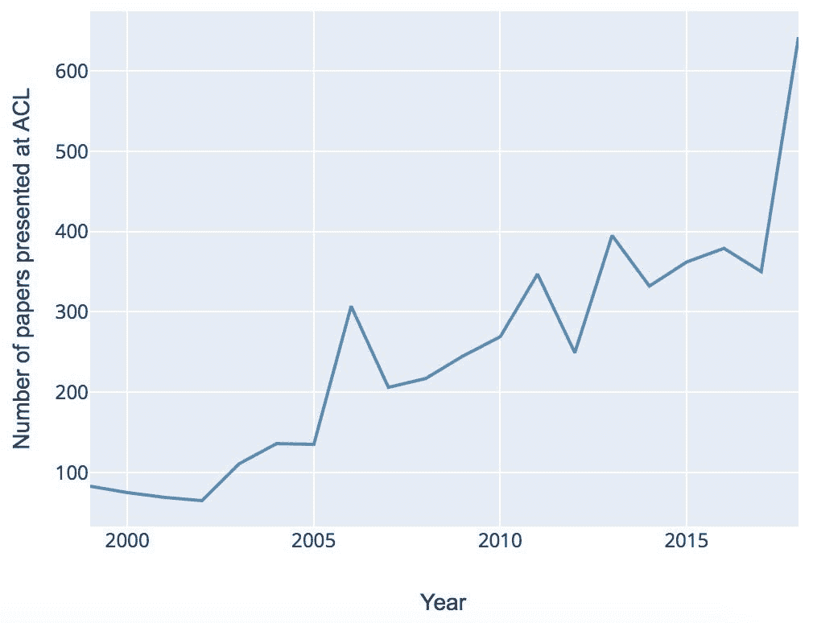
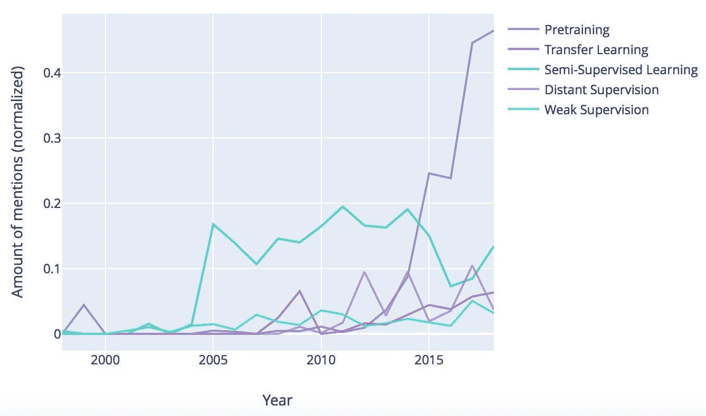
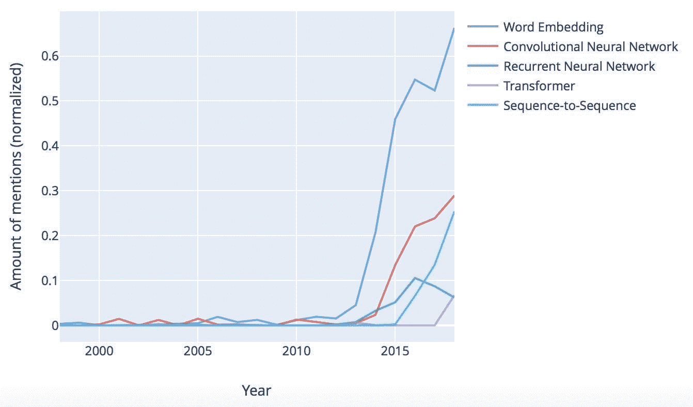
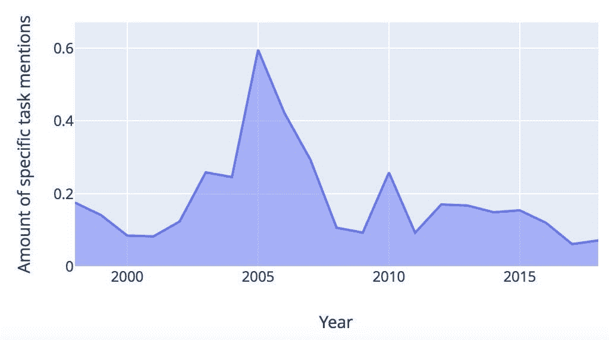
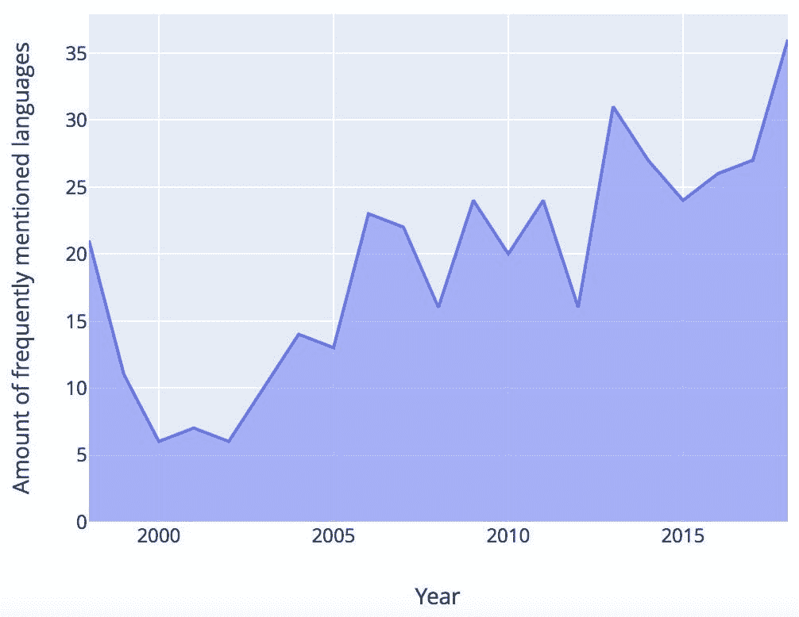
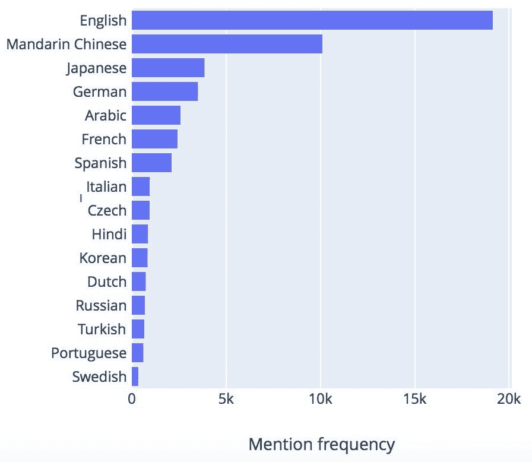

# 自然语言处理的主要趋势:前交叉韧带研究 20 年回顾

> 原文：<https://towardsdatascience.com/major-trends-in-nlp-a-review-of-20-years-of-acl-research-56f5520d473?source=collection_archive---------7----------------------->

## [深入分析](https://medium.com/towards-data-science/in-depth-analysis/home)

计算语言学协会(ACL 2019)第 57 届年会本周在意大利佛罗伦萨开幕。我们借此机会回顾了动画 NLP 领域的主要研究趋势，并从商业角度阐述了一些影响。这篇文章是由过去 20 年中基于统计和自然语言处理的 ACL 论文分析支持的。

# 1.动机

与其他物种相比，自然语言是人类思维的主要特征之一。NLP 是当今科技讨论中的一个主要术语，它涉及计算机如何理解和生成语言。过去几十年中，自然语言处理的兴起得到了几项全球发展的支持——围绕人工智能的普遍宣传，深度学习领域的指数级进步以及可用文本数据数量的不断增加。但是嗡嗡声背后的实质是什么呢？事实上，NLP 是一个高度复杂的跨学科领域，由语言学、数学和计算机科学的高质量基础研究不断提供。ACL 会议将这些不同的角度汇集在一起。如下图所示，研究活动在过去几年里蓬勃发展:

*图 1:各年在 ACL 会议上发表的论文数量*

在下文中，我们总结了数据策略、算法、任务以及多语言 NLP 方面的一些核心趋势。该分析基于自 1998 年以来发表的 ACL 论文，这些论文使用 NLP 和机器学习领域的特定领域本体进行处理。

# 2.数据:解决瓶颈问题

免费提供的文本数据的数量呈指数级增长，这主要是由于 Web 内容的大规模生产。然而，这一庞大的数据体带来了一些关键挑战。第一，大数据本来就有噪音。想想石油和金属等自然资源——它们需要经过提炼和提纯的过程，才能用于最终产品。数据也是如此。一般来说，生产渠道越“民主”,数据就越脏——这意味着需要花费更多的精力来清理数据。例如，来自社交媒体的数据将需要更长的清洗管道。除此之外，你还需要处理大量的自我表达，比如微笑和不规则的标点符号，这些在更正式的场合，比如科学论文或法律合同中通常是不存在的。

另一个主要挑战是标记的数据瓶颈:严格来说，大多数最先进的算法都是受监督的。他们不仅需要有标签的数据，还需要有标签的大数据。这与深度学习家族的高级复杂算法尤其相关。正如儿童的大脑在学习母语之前首先需要最大的输入量一样，为了“深入”，算法首先需要大量的数据来包含语言的整体复杂性。

传统上，小规模的训练数据是手工标注的。然而，对大型数据集进行专门的手动注释会带来效率上的损失，这是很难接受的，尤其是在业务环境中。

有哪些可能的解决方案？一方面，在管理方面有一些增强，包括众包和培训数据即服务(TDaaS)。另一方面，在机器学习社区中也提出了一系列创建带注释数据集的自动变通方法。下图显示了一些趋势:

*图 2:培训数据的创建和再利用方法的讨论(通过各年论文数量标准化的提及量)*

很明显，在过去的五年中，T2 的预培训已经有了最大的增长。在预训练中，首先在大型通用数据集上训练模型，随后使用特定于任务的数据和目标进行调整。它的流行很大程度上是因为谷歌和脸书等公司正在向开源社区提供开箱即用的大型模型。特别是 Word2Vec、FastText 和 BERT 等预训练的单词嵌入允许 NLP 开发人员跳到下一个级别。**迁移学习**是跨不同任务重用模型的另一种方法。如果不能重用现有模型，可以利用少量已标记的数据来自动标记更大量的数据，就像在**远距离**和**弱监督**中所做的那样——但是，请注意，这些方法通常会导致标记精度下降。

# 3.算法:深度学习中的一系列中断

在算法方面，近年来的研究主要集中在深度学习家族上:

*图 3:深度学习算法的讨论(按各年论文数量标准化的提及量)*

**单词嵌入**显然被占用了。Mikolov 等人(2013)介绍了单词嵌入的基本形式。单词嵌入背后的普遍语言学原则是分布相似性:一个单词可以通过它出现的上下文来表征。因此，作为人类，我们通常可以用合适的词，如“交易”或“合同”来完成句子“客户今天签署了 __”。单词嵌入允许自动完成这项工作，因此对于解决上下文感知问题的核心非常有效。

虽然最初的嵌入算法 **word2vec** 是基于统计的，并且没有考虑到诸如歧义、上下文敏感性和语言结构之类的生活复杂性，但是随后的方法已经用各种语言信息丰富了单词嵌入。顺便说一句，你不仅可以嵌入单词，还可以嵌入其他内容，如词义、句子和整个文档。

**神经网络**是深度学习的主力(参见 Goldberg 和 Hirst (2017)对 NLP 背景下基本架构的介绍)。**卷积神经网络**在过去几年中有所增长，而传统的**递归神经网络(RNN)** 的受欢迎程度正在下降。一方面，这是由于更高效的基于 RNN 的架构的可用性，如 **LSTM** 和 **GRU** 。另一方面，Sutskever 等人(2014)在**序列到序列** (seq2seq)模型中引入了一种新的、相当具有破坏性的顺序加工机制——注意。如果你使用谷歌翻译，你可能会注意到几年前翻译质量的飞跃——seq 2 seq 是罪魁祸首。虽然 seq2seq 仍然依赖于管道中的 RNNs，但从 2017 年开始的另一项重大进步, **transformer** 架构终于摆脱了递归，完全依赖于注意力机制(Vaswani et al. 2017)。

深度学习是一个充满活力和迷人的领域，但从应用的角度来看，它也可能相当令人生畏。当它出现时，请记住，大多数开发都是由大数据规模效率的提高、上下文感知以及对不同任务和语言的可扩展性所推动的。对于数学介绍，Young 等人(2018)对最先进的算法进行了出色的概述。

# 4.整合各种 NLP 任务

当我们观察特定的 NLP 任务时，如情感分析和命名实体识别，库存比底层算法稳定得多。多年来，从诸如句法分析和信息提取的词干提取的预处理任务到诸如情绪/情感分析和语义分析的面向语义的任务，已经有了梯度发展。这对应于 Cambria 等人(2014)描述的三条“全局”自然语言处理发展曲线——语法、语义和上下文感知。正如我们在上一节中看到的那样，第三条曲线——对更大环境的意识——已经成为新深度学习算法背后的主要驱动力之一。

从更普遍的角度来看，有一个有趣的趋势是任务不可知的研究。在第 2 节中，我们看到了现代数学方法的泛化能力是如何在迁移学习和预训练等场景中得到利用的。事实上，现代算法正在开发惊人的多任务能力——因此，手头特定任务的相关性降低了。下图显示了自 2006 年以来对特定 NLP 任务的讨论的总体下降趋势:

*图 4:特定 NLP 任务的讨论量*

# 5.多语研究札记

随着全球化的发展，走向国际成为企业发展的必要条件。传统上，英语是大多数 NLP 研究的起点，但是近年来对可扩展的多语言 NLP 系统的需求增加了。这种需求在研究界是如何体现的？将不同的语言视为我们观察同一个世界的不同镜头——它们共享许多属性，这一事实完全符合现代学习算法日益增强的抽象和概括能力。尽管如此，特定于语言的特性必须彻底解决，尤其是在预处理阶段。如下图所示，ACL 研究中涉及的语言多样性不断增加:

*图 5:每年频繁使用的语言(>每种语言 10 次提及)*

然而，正如在上一节中看到的 NLP 任务一样，一旦特定语言的差异被下一波算法抵消，我们可以期待一次整合。图 6 总结了最流行的语言。

*图 ACL research 研究的语言*

对其中一些语言来说，研究兴趣符合商业吸引力:英语、中文和西班牙语等语言汇集了大量可用数据、庞大的母语人口以及相应地理区域的巨大经济潜力。然而，大量的“小型”语言也表明，自然语言处理领域正在朝着理论上合理处理多语言和跨语言泛化的方向发展。

# 总结

在全球人工智能热潮的推动下，NLP 领域正在以新的方法和颠覆性的改进爆发。有一种向建模意义和上下文依赖的转变，这可能是人类语言中最普遍和最具挑战性的事实。现代算法的泛化能力允许跨不同任务、语言和数据集的有效扩展，从而显著加快 NLP 开发的 ROI 周期，并允许将 NLP 灵活高效地集成到各个业务场景中。

敬请关注 ACL 2019 的回顾和 NLP 趋势的更多更新！

# 参考

*   E.坎布里亚和 b .怀特(2014 年)。跳跃 NLP 曲线:自然语言处理研究综述【综述文章】。*比较。智能。玛格。* 9，2。
*   J.德夫林、m .魏、k .李和 k .图塔诺娃(2018)。BERT:用于语言理解的深度双向转换器的预训练。
*   Y.戈德堡和 g .赫斯特(2017)。自然语言处理中的神经网络方法。摩根&克莱普出版社。
*   T.Mikolov 等人(2013 年)。词和短语的分布式表示及其组合性。在*第 26 届国际神经信息处理系统会议录* —第 2 卷(NIPS’13)。
*   R.Prabhavalkar、K. Rao、Kanishka、T. Sainath、B. Li、L. Johnson 和 N. Jaitly (2017 年)。语音识别中序列间模型的比较。939–943.10.21437*/散点*. 2017–233。
*   I. Sutskever、O. Vinyals 和 Q. V. Le (2014 年)。用神经网络进行序列间学习。第 27 届国际神经信息处理系统会议论文集 —第 2 卷(NIPS'14)。
*   A.Vaswani，N. Shazeer，N. Parmar，J. Uszkoreit，L. Jones，A. N. Gomez，凯泽和 I .波洛苏欣(2017)。你需要的只是关注。第 31 届国际神经信息处理系统会议论文集(NIPS’17)。
*   T.Young、D. Hazarika、s .茯苓和 E. Cambria (2018 年)。基于深度学习的自然语言处理的最新趋势。IEEE 计算智能杂志 —第 13 卷。