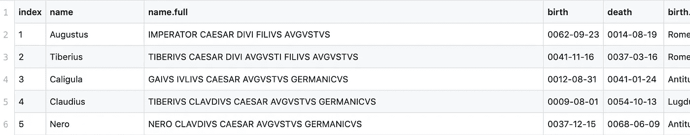
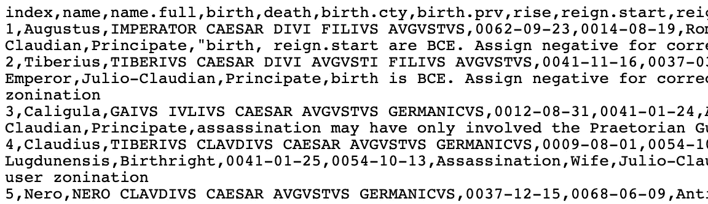
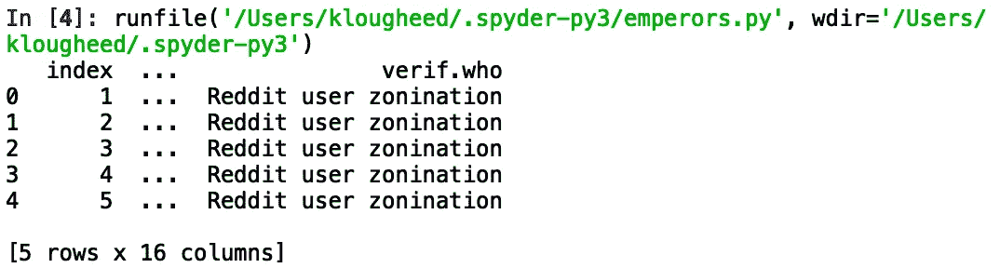
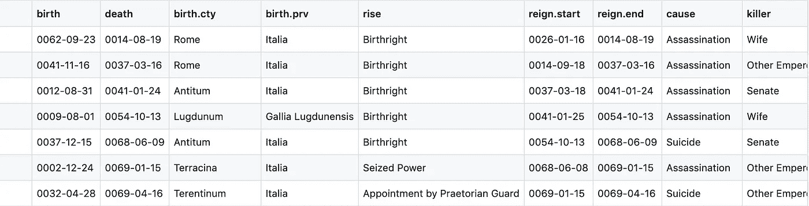
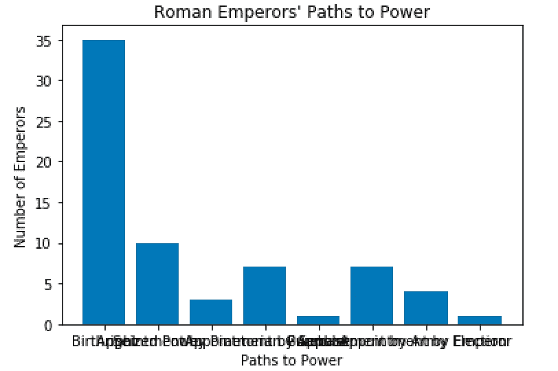
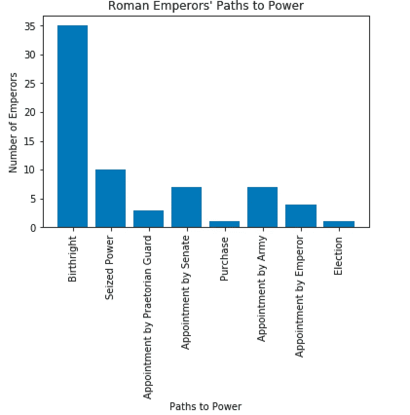
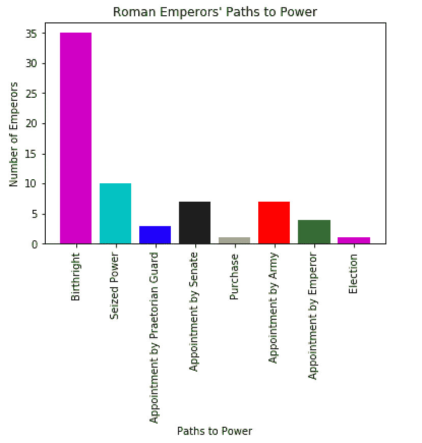

# 用 Python 做一个罗马皇帝掌权的柱状图

> 原文：<https://towardsdatascience.com/make-a-bar-chart-about-roman-emperors-rise-to-power-with-python-7d94e4131243?source=collection_archive---------23----------------------->


作为一个古代史和 Python 编程的爱好者，当我偶然发现[这个关于罗马皇帝](https://github.com/zonination/emperors)的数据集时，我知道我必须做什么……用它来制作 Python 中的数据可视化！

浏览这些专栏，我决定绘制皇帝们掌权的不同方式。当然，你可能生来就是皇帝的儿子，但是“夺权”实际上有多少次奏效了呢？

欢迎和我一起编写代码，学习如何阅读 CSV 文件和用 Python 制作条形图！本教程将假设您了解基本的 Python 编程知识，但是即使没有这些知识，您也可以继续学习。

为了查看数据可视化，我将在 [Spyder IDE](https://www.spyder-ide.org/) 中编码，您可以下载它作为 [Anaconda 发行版](https://www.anaconda.com/distribution/)的一部分。你也可以在笔记本上写代码。

# 用熊猫读取 CSV 文件

你可以在这里查看关于罗马皇帝[数据的 CSV 文件。这一切都在一个漂亮的数据表中进行了美化，隐藏了 CSV 的实际含义:逗号分隔的值。](https://github.com/zonination/emperors/blob/master/emperors.csv)



So pretty!

如果您查看[原始 CSV](https://raw.githubusercontent.com/zonination/emperors/master/emperors.csv) ，您将会看到所有数据被挤在一起，每一列仅由逗号分隔。呀！



Egads!

但实际上，CSV 是一种很好的文件类型。我们可以使用 Python 库 pandas 轻松读取 CSV 数据。

让我们从导入 pandas(这样我们就可以阅读这个 CSV)和 matplotlib 开始，matplotlib 是另一个允许我们生成一些出版物质量的数据可视化的库。

在代码的顶部，编写:

```
import pandas as pd
import matplotlib.pyplot as plt
```

使用简写`pd`来表示 pandas，使用`plt`来表示 matplotlib.pyplot 是相当标准的，这也为我们输入长库名省去了很多麻烦。

现在我们可以使用 pandas 来读取 CSV 文件:

```
df = pd.read_csv("[https://raw.githubusercontent.com/zonination/emperors/master/emperors.csv](https://raw.githubusercontent.com/zonination/emperors/master/emperors.csv)", encoding='latin-1')
```

是的，就是这么简单！好了，关于代码说几句:

*   为什么我在`df`中调用我存储 CSV 的变量？`df`是一个很常见的用于 [DataFrame](https://pandas.pydata.org/pandas-docs/version/0.23.4/generated/pandas.DataFrame.html) 对象的变量名，这是 pandas 在读取 CSV 文件时创建的。
*   那个`encoding='latin-1'`是怎么回事？当我第一次尝试读取这个 CSV 文件时，我得到了一个 UnicodeDecodeError。堆栈溢出建议我尝试用不同的编码读取文件，比如`latin-1`。瞧，电脑可以读取文件了！

看到变量中存储了什么总是好的。通过运行以下代码，我们可以看到数据框`df`的顶部和底部:

```
print(df.head())
print(df.tail())
```

你可以按下一个看起来像绿色的“播放”按钮来运行 Spyder 中的程序。


如果您可以在您的控制台中看到一些东西，看起来模糊地像一个带有索引号的数据表，那么您可能就在正确的轨道上！



In this printing of df.head(), you can only see the index and the last column, which credits a Reddit user for the data table. But, there are actually 16 columns!

# 将数据转换成字典

好的，我有 16 列数据。但是正如我之前提到的，我真正感兴趣的一个列是“上升”列。我想看看是生为皇帝的儿子更普遍，还是通过其他方式夺取权力更普遍。



Yeah, it starts out with a lot of “birthright,” but then things get interesting…

我最初认为我想做一个直方图，但是我从 [Python Graph Gallery](https://python-graph-gallery.com/barplot/) 中了解到，直方图只接受数字数据，并且只显示它的分布。另一方面，我有分类数据:不同的权力路径，比如“与生俱来的权力”和“夺取的权力”。我还需要计算第二个数字变量:有多少不同的皇帝以这种方式掌权。

有了一个分类变量和一个数值变量(待计算)，我想做的是一个**条形图**。

有了`df["rise"]`，我可以访问通往权力之路的整个栏目，一个长长的列表，比如“与生俱来的权利，与生俱来的权利，参议院的任命，军队的任命”等等。我需要某种方法来计算出生权的*数字*，军队任命的*数字*等等。

幸运的是，pandas 通过一个`value_counts()`方法提供了这个功能。如果我调用列`df["rise"]`上的`value_counts()`，它会给我一个数字列表:到底有多少皇帝是通过世袭、任命元老院等等获得权力的。

此外，我可以调用`value_counts()`上的`keys()`来找出哪些数字对应于哪种成为皇帝的方法。

将此代码添加到您的中，以获得数字和相应的电源路径:

```
numbers = df["rise"].value_counts()
paths = df["rise"].value_counts().keys()
```

现在，我有了一个通往权力的独特路径的列表，以及对应于每条路径的数字。

当然，打印变量的值总是一个好主意，只是为了确保它们包含您认为它们包含的内容。

是时候制作条形图了！

# 用 matplotlib.pyplot 制作条形图

用 Python 做图的代码太简单了，感觉不可能是真的。但事实如此。

添加此代码，用 Python 生成皇帝死因的条形图:

```
plt.title("Roman Emperors' Paths to Power")
plt.ylabel("Number of Emperors")
plt.xlabel("Paths to Power")
plt.bar(paths, numbers)
plt.show()
```



简直令人惊讶(除了 x 轴上的一些压扁的文本——我们很快会处理这个问题)。您会注意到前三行代码只是添加了标题并标记了轴。所有繁重的工作都是通过调用第四行中的`plt.bar()`来完成的。最后一行只是显示图表。

在这里，我们可以看到“与生俱来”的门槛似乎比其他的更高…所以这可能是比“夺取政权”更可靠的成为皇帝的方式！

# 收尾

好，所以你实际上看不到 x 轴上的标签，因为它们都被挤在一起了。

幸运的是，您可以用这行代码旋转 x 轴上的标签:

```
plt.xticks(rotation=90)
```

在调用`plt.show()`之前一定要加进去。



最后，我们需要添加一些颜色。我们的可视化应该是引人注目的！

当你调用`plt.bar()`时，你也可以通过`color`参数指定你想要的颜色。例如，如果我写:

```
plt.bar(paths, numbers, color='mcbkyrg')
```

也就是说，我希望第一列是品红色(m)，第二列是青色(c)，然后是蓝色(b)，黑色(k)，黄色(y)，红色(r)和绿色(g)。然后顺序又开始了。(点击阅读 matplotlib [中关于颜色的更多信息。)](https://matplotlib.org/2.0.2/api/colors_api.html)



完美！

# 扩展ˌ扩张

要为您的条形图添加更多功能，或者获得创建新功能的灵感，请访问 [Python Graph Gallery](https://python-graph-gallery.com/barplot/) 查看条形图！