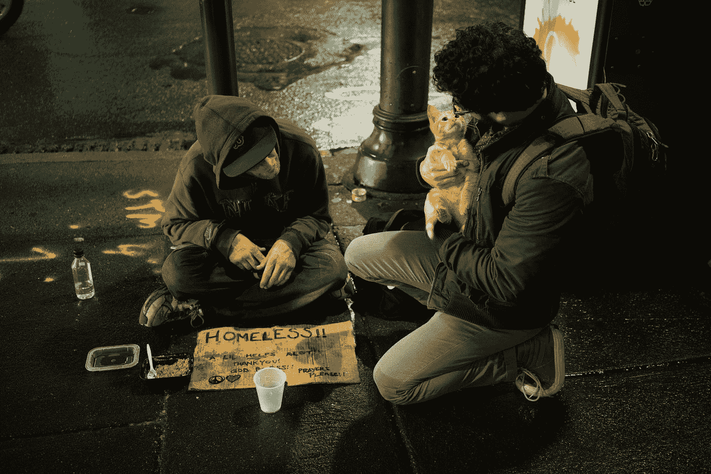

# 通过为这些开源项目做贡献来产生社会影响

> 原文：<https://towardsdatascience.com/make-a-social-impact-by-contributing-to-these-open-source-projects-1d6d34e2b8b1?source=collection_archive---------11----------------------->

## 玩得开心，一路上帮助数百万人

Photo by [Zac Durant](https://unsplash.com/@zacdurant?utm_source=medium&utm_medium=referral) on [Unsplash](https://unsplash.com?utm_source=medium&utm_medium=referral)

十月是庆祝开源软件的一个月，也被称为另一个标题 Hacktoberfest。

为了邀请其他人通过他们的工作产生影响， [Ovio](https://ovio.org/) 策划了一个[社会影响项目集](https://explore.ovio.org/projects/hacktoberfest/)供您参与。

这里有一个列表，列出了那些你可以用你的工作立即帮助和影响生活的项目。

# 开放式机器学习

这个知识库属于 OpenML，OpenML 是一个在线机器学习平台，用于共享和组织数据、机器学习算法和实验。

> 随着机器学习正在增强我们理解自然和建设更美好未来的能力，我们让研究、教育和工业领域的每个人都能够透明和轻松地使用它至关重要。

**技术** : CSS，PHP，JavaScript

你可以看到一个开放问题的列表，这里的也标注为 *hacktoberfest* [。](https://github.com/openml/OpenML/labels/Hacktoberfest)

# 自（动）调焦装置

这个存储库是一个使用数据科学和技术来解决一个重要问题的项目。

> 这个项目使用深度学习计算机视觉，根据图像中包含的动物来标记由运动激活的“相机陷阱”拍摄的图像。这项标记任务的精确模型可以解决野生动物保护工作的一个主要瓶颈。

**科技** : Jupyter 笔记本

您可以在此处[看到一个开放问题列表](https://github.com/uptake/autofocus/issues)，您可以立即参与其中。

# 木卫四

这个存储库包含 Callisto 的源代码，这是一个关于性侵犯的在线报告系统。

> 幸存者，为了幸存者。Callisto 是一个非营利组织，它创造技术来检测职业性胁迫和性侵犯的惯犯。

**技术** : Python

这里有一个[列表](https://github.com/project-callisto/callisto-core/issues)列出了您可以参与的未决问题。

# 奥皮亚

Oppia 打算在世界各地教育工作者的帮助下，通过提供免费的高质量课程，为学生提供优质教育。

> 通过在世界各地教育工作者的帮助下创建一套免费、高质量、明显有效的课程，Oppia 旨在为学生提供高质量的教育，无论他们身在何处，也无论他们可以获得哪些传统资源。Oppia 的使命是帮助任何人以有效和愉快的方式学习他们想要的任何东西。

它有许多开放的问题，你可以开始作出贡献。

**技术** : Python，TypeScript，HTML

您可以看到许多未决问题的列表，这些问题在这里也被标记为*。*

# *打开街道地图 iD*

*这个库属于 JavaScript 中的 OpenStreetMap 编辑器。*

***技术** : JavaScript，CSS*

*   **故意简单。它让您在不破坏他人数据的情况下完成最基本的任务。**
*   *它支持所有流行的现代桌面浏览器:Chrome、Firefox、Safari、Opera、Edge 和 IE11。*
*   **iD 还没有为移动浏览器设计，但这是我们希望添加的东西！**
*   **用 d3.js 渲染数据**

*它有许多开放的问题，你可以做出贡献，你可以在这里看到。*

# *签名*

*这个存储库属于 project SignDict，这是一个开放的手语词典，您可以在其中贡献其源代码，或者通过添加一个缺少的符号来贡献词典本身。*

> *SignDict 认为沟通是开放社会的关键。为了增加聋人社区的融合，我们创建了一个生活字典，并邀请每个人都来参与。我们的使命:帮助彼此了解。*

***技术**:药剂，HTML，Vue*

*它有许多未决的问题，其中许多被标为*T21 黑客节，你可以对它做出贡献，你可以在这里看到。**

# *操作码*

*这个存储库是应用程序操作代码的前端。*

***技术** : JavaScript，CSS*

> *我们 Operation Code 致力于为退伍军人和他们的家庭提供一条进入科技职业生涯的有效途径。我们直接与参议员、众议员和女议员合作，通过允许在新兵训练营编码中使用《退伍军人权利法案》,让退伍军人完全控制他们的未来。我们是致力于帮助退伍军人和家庭开始软件开发生涯的最大社区。*

*这个项目也有许多开放的问题，其中许多都有标签 *hacktoberfest* ，你可以在这里看到。*

# *操作码资源*

*这是与编程和网络安全相关的学习资源的操作代码 API 的存储库。*

***技术** : Python*

*这里有一个[列表](https://github.com/OperationCode/resources_api/labels/Hacktoberfest)，列出了许多你可以立即参与的未决问题。*

# *操作码 Pybot*

*这个库代表操作码的官方 Slackbot。*

***技术** : Python*

*这里有一个[列表](https://github.com/OperationCode/operationcode-pybot/labels/Hacktoberfest)，列出了许多你可以立即参与的开放性问题。*

# *HOTOSM 网站*

*这个知识库是人道主义 OpenStreetMap 团队的网站。*

> *HOT 是一个国际团队，致力于通过公开地图进行人道主义行动和社区发展。我们提供地图数据来革新灾害管理、降低风险，并为实现可持续发展目标做出贡献。HOT 通过提供培训、设备、知识交流和实地项目，使社区、非政府组织、国际组织和政府合作伙伴能够使用 OpenStreetMap 并为其做出贡献，以应对与当地相关的挑战。*

***技术** : HTML，CSS，JavaScript*

*这里有一个[列表](https://github.com/hotosm/hotosm-website/labels/Hacktoberfest)标有 *hacktoberfest* 的未决问题，您可以参与其中。*

# *开放食品网络*

*这个知识库是关于开放食品网络项目的，它连接了供应商、经销商和消费者来交易当地的农产品。*

> *开放食品网络是开放食品基金会的旗舰项目，旨在为公平和可持续的食品系统开发、积累和保护开源知识、代码、应用程序和平台。*

*这是一份[列表](https://github.com/openfoodfoundation/openfoodnetwork/labels/Hacktoberfest)中标记为 *hacktoberfest* 的未决问题，您可以参与其中。*

# *开放式食品事实服务器*

*这个存储库属于开放的食品事实产品数据库，这是一个由每个人制作的食品产品数据库，为每个人服务。*

> *开放食品事实是一个食品产品数据库，包括配料、过敏原、营养事实和我们可以在产品标签上找到的所有信息。*
> 
> *开放食品事实是一个非营利性的志愿者协会。像您这样的 25.000 多名贡献者已经添加了来自 150 个国家的 868.000 多件产品，他们使用我们的 Android、iPhone 或 Windows Phone 应用程序或他们的相机扫描条形码并上传产品图片和标签。*

***技术** : HTML，Perl*

*这个项目有许多未解决的问题，你可以在这里找到。*

# *打开食品事实 iOS*

*这个存储库代表了用 Swift 编写的 iOS 开放食品事实的本地版本。*

***科技**:雨燕*

*这里有一个[列表](https://github.com/openfoodfacts/openfoodfacts-ios/labels/hacktoberfest)，列出了许多你可以立即参与的未决问题。*

# *开放食品事实机器人*

*这个库代表了用 Java 编写的 Android 开放食品事实的本地版本。*

***技术** : Java*

*这里有一个[列表](https://github.com/openfoodfacts/openfoodfacts-androidapp/labels/hacktoberfest)，列出了许多你可以立即参与的开放性问题。*

# *尿布*

*这个存储库属于 Diaperbase，这是一个尿布库的库存系统。*

> *该应用程序是一个库存管理系统，旨在尽可能直接和明确地解决[尿布库](https://nationaldiaperbanknetwork.org/diaper-need-facts/)的需求。尿布银行维持库存，接受捐赠和其他吸收尿布(和相关用品)的方式，并向社区伙伴组织分发。像任何非营利组织一样，他们也需要对这些数据进行报告，并拥有他们需要的日常运营信息。该应用程序旨在满足所有这些需求，并尽可能方便尿布库自身的一般操作(例如，通过使用条形码阅读器、秤称重、库存审计)。*

***技术** : Ruby，HTML，CSS，JavaScript*

*这里有一个[列表](https://github.com/rubyforgood/diaper/labels/hacktoberfest)，上面有许多被标为 *hacktoberfest* 的未决问题，你可以立即参与其中。*

# *如果-我*

*这个存储库是一个开源应用程序，旨在用于与亲人分享健康经验。*

> *if-me 是一个心理健康体验社区，鼓励人们与信任的盟友分享他们的个人故事。处理心理健康是我们之所以为人的原因。但对我们大多数人来说，很难公开自己的想法。*

***技术** : Ruby，JavaScript，HTML，CSS*

*这是一份[列表](https://github.com/ifmeorg/ifme/labels/hacktoberfest)中的未决问题，标记为 *hacktoberfest* ，您可以参与其中。*

# *地形故事*

*该存储库属于应用程序，旨在使当地社区能够定位和映射他们自己关于对他们有重要意义或价值的地方的口头讲故事传统。*

> *Terrastories 由 Mapbox 平台提供支持，设计为完全离线兼容，因此远程社区可以完全访问该应用程序，而无需互联网连接。*

***技术** : Ruby JavaScript，HTML，CSS，Dockerfile*

*这里有一个[列表](https://github.com/Terrastories/terrastories/labels/hacktoberfest)标为 *hacktoberfest* 的未决问题，你可以参与其中。*

# *一切就绪*

*这个库是 AllReady 的源代码。*

> *AllReady 是一个开源解决方案，侧重于提高当地社区人道主义和救灾组织开展备灾活动的意识、效率和影响。*

***技术** : C#，HTML*

*这里有一个[列表](https://github.com/HTBox/allReady/labels/hacktoberfest)，上面标有 *hacktoberfest* ，你可以参与其中。*

# *讨论*

*这个 GitHub 存储库代表了 app *Talk* ，为记者提供了更好的评论体验。*

> *网上评论都断了。我们的开源评论平台 Coral 重新思考了审核、评论显示和对话的功能，为围绕您的工作进行更安全、更智能的讨论创造了机会。*

*这里有一个[列表](https://github.com/coralproject/talk/labels/hacktoberfest)标记为 *hacktoberfest* 的未决问题，您可以参与其中。*

# *乌沙迪*

*Ushahidi 是一个用于信息收集、可视化和交互式制图的开源 web 应用程序。*

> *我们是一家社会企业，为众多行业和公民社会提供软件和服务，以帮助改善自下而上的信息流。Ushahidi 在斯瓦希里语中翻译为“证词”，是在 2008 年肯尼亚大选后暴力事件后开发的暴力报告地图。我们相信，如果被边缘化的人能够容易地与那些旨在为他们服务的人沟通。Ushahidi 帮助您从以下来源收集信息:短信、Twitter、RSS 订阅源、电子邮件。它帮助你处理这些信息，分类，地理定位，并在地图上发布。*

***技术** : JavaScript，HTML*

*这里有一个[列表](https://github.com/ushahidi/platform-client/pulls)标记为未完成的拉动式请求，您可以查看。*

*这是一个很长的列表，应该有希望提供各种各样的项目，您可以从中选择帮助。*

*您不必成为 Python 专家，也不必掌握某个特定的框架来通过这些存储库产生影响。你甚至可以邀请其他人也为他们做贡献。*

****跟我上*** [***碎碎念***](https://www.twitter.com/fatosmorina/)*