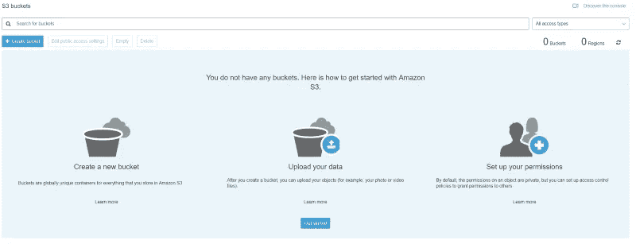
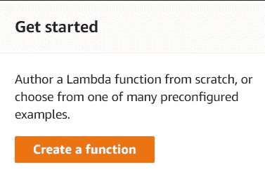
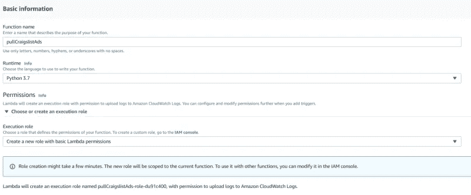
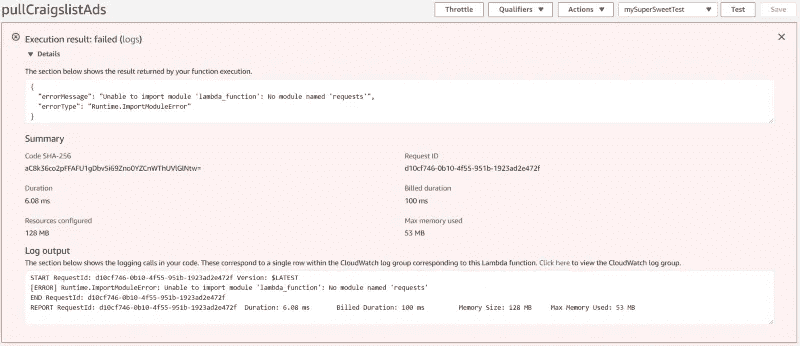
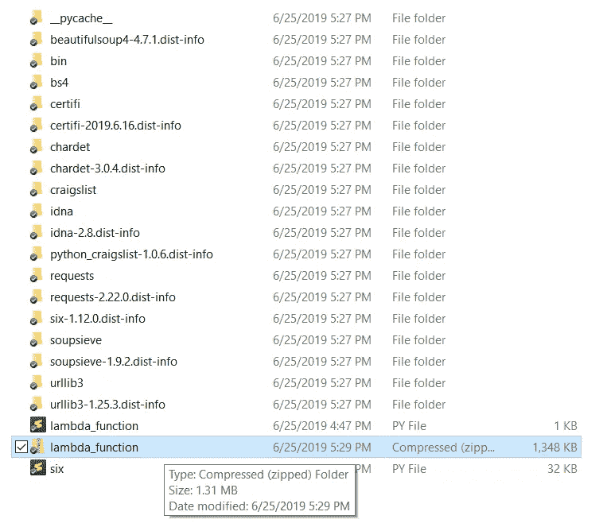
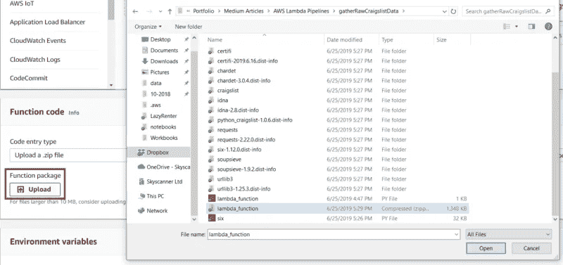
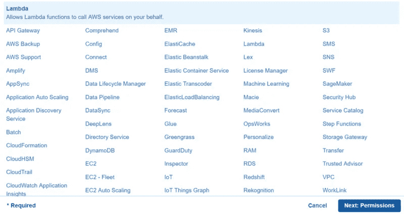
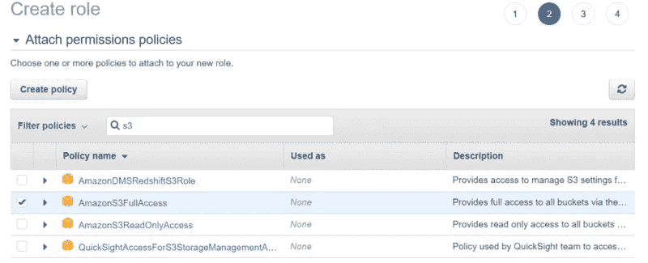
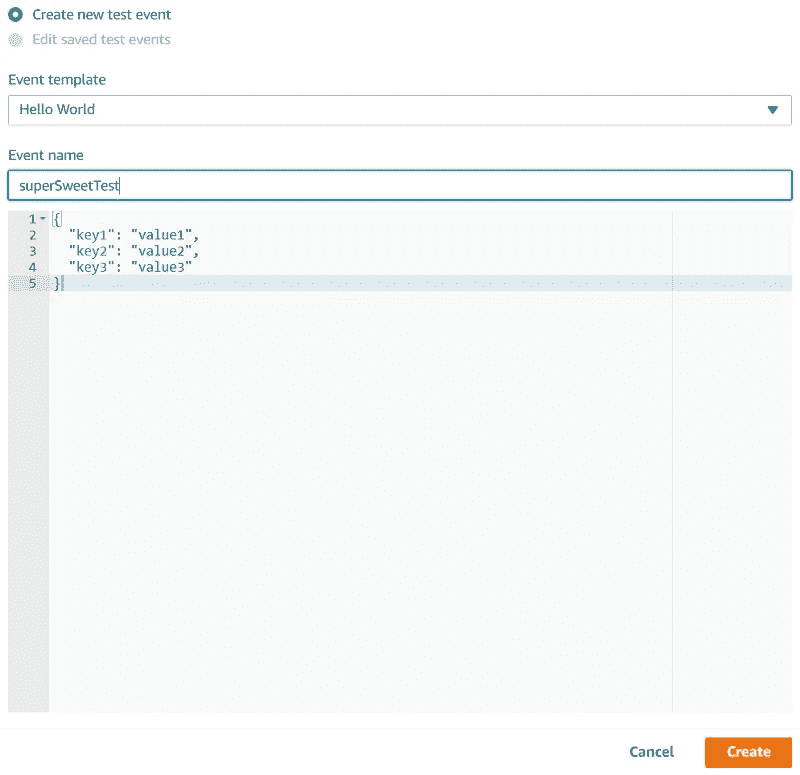
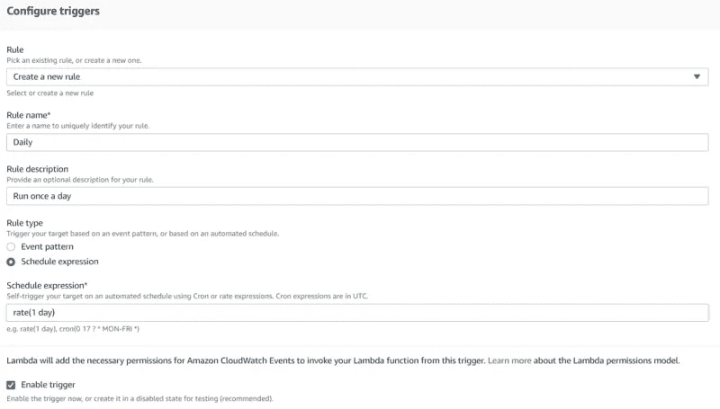

# 使用 AWS & Lambda (Python)通过 12 个步骤轻松获取数据

> 原文：<https://towardsdatascience.com/make-data-acquisition-easy-with-aws-lambda-python-in-12-steps-33fe201d1bb4?source=collection_archive---------4----------------------->

## **告别复杂的 ETL 管道、SQL 数据库和其他复杂系统**

本文将简要介绍 AWS Lambda 和构建一个完全无服务器的数据管道。这篇文章是为至少对 Python 有基本(我指的是*基本*)理解的人写的，但是你也可以是 AWS 的新手。我们将创建一个 AWS 帐户，然后有一个 Lambda 函数从 Craigslist 拉数据，并存储在 S3 桶为我们自动，每天。

**关于我:**数据科学家和爱好者，他不断尝试学习新技术，让我的生活更轻松。像数据科学社区中的许多人一样，我是自学的，没有统计学或 cs 背景。在前世，我是一名机械工程师，但那感觉像是很久以前的事了。这些年来，我对 Python 和 AWS 的掌握相当不错(我有一些认证)，因为我总是从别人那里学到很多东西，所以我认为该轮到我为社区做贡献了。如果你觉得这篇文章有用，请随时在 LinkedIn 上与我联系，或者查看我的 Github 个人资料。

**AWS Lambda — Your serveless swiss army knife!**

# **什么是 Lambda**

我经常会遇到“我编写了这个 Python 函数，需要它每天运行”的场景。您可以在您的机器上设置一个 Cron，但是如果您的计算机关闭了呢？另一个选择是转向云。用 AWS 做这件事的老方法是启动一个 EC2 实例，SSH 到其中，给它一个函数或者 docker 映像，在那里设置一个 Cron 作业，等等。还不算太糟，但是有点痛。此外，如果我只需要一些日常运行的东西，我真的需要一个 EC2 实例整天运行吗？输入 Lambda(是的，我知道您也可以为此使用 Batch，但这是一个 Lambda 教程)。

AWS 有很多服务，但也许我最喜欢的是 AWS Lambda。基本上，它让你专注于编写代码，而不是处理那些烦人的事情，比如 VPC、EC2 实例、MySQL 数据库等等。只要写一些 Python，把代码交给 Lambda，它就会在云端执行这些代码。更好的是，你可以用各种方式触发代码:每分钟，每天一次，当你把东西放进 S3 桶时，等等。Lambda 非常棒(而且便宜),很快成为我最常用的 AWS 服务。

# **我们将要做什么**

在 12 个简单的步骤中，我们将建立一个 Lambda 函数，每天自动从 Craigslist 获取数据，并将数据存储在 S3(JSON)中。这只是一个例子，但是您可以使用本教程以您指定的时间间隔自动运行任何 Python 函数。诚然，这篇文章有点长，但我想确保它很容易复制，尤其是对初学者来说。如果您遇到了问题，请随时联系我，我们可以尝试调试它。最后要注意的是，这里的一切都应该在免费层内，所以不会花你一分钱。Lambda 每月给你一百万个免费请求，所以除非你打算每秒钟都解雇这个宝贝，否则你应该很棒。

# **第一步:创建一个免费的 AWS 账户**

前往 https://aws.amazon.com 的，注册一个免费账户。请注意，您需要验证您的电话号码，但整个过程应该只需要几分钟。最后，选择“基本”计划，它将为你提供 12 个月的免费计算能力。

# **第二步:创建一个存储桶来存储我们的数据**

**Create An S3 Bucket**

S3 桶是我们可以存储数据(或者更具体地说是对象数据)的地方。它基本上就像你电脑上的一个文件夹，但是在云中！进入服务>存储> S3，你将被带到 S3 启动画面。点击“创建存储桶”,给你的存储桶起个名字，然后选择离你最近的地区。我用桶来命名“我的超级甜桶”，你可以随意命名你的桶。只要知道桶名必须是全球唯一的，所以你不能有我的可怕的桶名。在给出名称和区域之后，只需使用所有的缺省值(单击 Next，直到创建了您的 bucket)。这将创建您的 bucket，并记下您对它的命名，因为我们稍后会用到它。

# **第三步:创建一个 Lambda 函数**

现在我们有了一个存储来自 Lambda 的数据的桶，是时候创建我们的 Lambda 函数了。如果您将鼠标悬停在顶部的服务上，在计算下方，您会发现 Lambda。

**Lambda is found under computer (common AWS Cloud Practitioner exam question)**

因为你还没有制作 Lambda，你会看到一个闪屏，向你介绍 Lambda 的世界。点击“创建函数”按钮来创建您的 Lambda。

接下来，您将被要求命名您的函数，指定一种编程语言，并赋予它一个角色。

**Create your Lambda function**

> 先不说这个——什么是角色？亚马逊网络服务是一个巨大而神秘的怪兽，有很多事情在发生。值得注意的一点是，AWS 中的几乎所有东西都使用“最小权限”规则，基本上就是说，默认情况下，任何东西都没有访问任何东西的权限。例如，假设您在 AWS 网络中创建了一个名为 Bob 的用户。默认情况下，当 Bob 登录时，他不能访问任何 AWS 服务。鲍勃可以登录，但他不能使用 S3，EC2，Lambda 或其他任何东西。可怜的鲍勃。除非明确说明，否则不允许访问。总之，角色是一种以编程方式授予访问权限的方式。基本上，它会告诉 AWS“这是我的 Lambda 函数，我希望它能够访问 S3”。如果没有这个角色，你的 Lambda 函数将会像可怜的 Bob 一样无法访问。不要让你的 Lambda 像 Bob 一样。

**Details for your Lambda function**

不管怎样，你可以随意命名你的 Lambda 函数。我创造性地将我的名字命名为“pullCraigslistAds”。因为现在是 2019 年，我们是现代男女，我们将使用 Python 3.7，而不是任何 2.7 的废话。注意，Lambda 可以和许多其他编程语言一起使用，但是这里我们将使用 Python。现在权限可以设置为“创建一个具有基本 Lambda 权限的新角色”。我们将在教程的后面修正我们的角色。

# **第 4 步:为你的代码选择上传一个. zip 文件**

**Set your Lambda to take a Zip file**

Lambda 的全部意义在于让它为我们执行一些代码。一旦你创建了 Lambda 函数，你会注意到浏览器中有一个代码编辑器。通常你可以直接在编辑器中写代码。然而，在本教程中，我们将使用一些外部(不是内置于 Python 中的)库，比如请求，我们将需要通过上传一个 zip 文件来做一些不同的事情。**如果你不需要导入任何不附带 Python 的库，你可以直接内联编写。如果您确实需要导入库，我们将需要 Zip 文件。**也就是说，Lambda 可以毫无问题地运行你的 Python 代码——但是如果你不需要 Pandas、Requests、Matplotlib 之类的库或者你用 Pip 安装的任何其他库呢？在本教程中，我们将使用 python-craigslist 库，所以我们使用“上传”。zip 文件”选项。

# **第五步:我们函数的代码**

**注意:**如果你很急，想跳过一些步骤，你可以克隆 [**这个库**](https://github.com/scochran3/data_acquisition_aws_lambda) 它会提供你需要交给 Lambda 的最终 Zip 文件。如果您只是复制回购，您可以跳到步骤 8。

如果你不是懒惰的，并且想要跟随，那么在你的机器上的任何地方创建一个新的文件夹，并将下面的代码保存到一个名为" **lambda_function.py"** 的文件中。

**这是在做什么—** 基本上它是在用一个叫做 craigslist 的 [Python 库为我们抓取 craigslist。前几行导入我们的库。第 7 行是我们定义函数的地方，给出了**事件**和**上下文**的输入。如果你想变得书呆子气，去看看](https://pypi.org/project/python-craigslist/) [AWS 文档](https://docs.aws.amazon.com/lambda/latest/dg/python-programming-model-handler-types.html)。在高层次上，**事件**传递关于触发器的函数元数据，而**上下文**传递运行时信息给函数。对于这个函数，我们不需要过多地使用它们，但是在本系列的下一部分，我们将需要使用**事件。**例如，如果我们在某个东西被放入 S3 桶时触发一个 Lambda，我们可以使用**事件**来获取文件名，这通常很方便。

无论如何，对于使用过 Python 的人来说，函数的其余部分相当简单:实例化我们的类，告诉它要拉取什么数据，并将其存储在某个 JSON 中。第 28 到 31 行是我们如何使用 Boto3 将数据发送到 S3 的。如果你从未使用过 Boto3，它是一个 Python SDK，或者简单地说就是你如何通过 Python 与 AWS 交互。Boto3 允许你把东西放到 S3，调用 Lambda，创建一个桶，等等。如果您想从 Python 脚本中使用 AWS 资源，那么 Boto3 就是您的答案。这里我们使用它的一个最基本的特性:输出到我们的 S3 桶。在第 29 行，您需要将 bucket 的名称更新为您在步骤 2 中命名的名称。作为参考，下面是我们函数中的一些样本数据，这些数据来自 Craigslist 上的一个公寓广告。

**Sample data**

最后要注意的是，这只是我们的样本代码，但这可能是任何东西。例如，它可以调用 API，将数据转储到 JSON，并将 JSON 存储在 NoSQL 数据库中。这里我们将 JSON 输出到一个 S3 桶，但这可能是很多事情。

# **步骤 6: Pip 安装我们的依赖项**

Lambda 在云中为你运行 Python，但它的 Python 版本有什么？任何经常使用 Python 的人都高度依赖库，库是我们可以使用的开源预写代码块(“import pandas as pd”，有人吗)？举个例子，如果我导入请求，在我们的 Lambda 中会发生什么？

**Import requests library to our Lambda function**

**注意:**确保在点击测试之前保存你的函数，否则它将测试先前版本的代码而不包括请求。一个好的经验法则是总是保存你的 Lambda 函数，很容易忘记去做，然后你在调试过去的版本。

**Fail! Lambda won’t come with external libraries**

基本上我们的 Lambda 失败了，因为这个 Python 环境没有请求库。那么我们如何获得它(或任何库)？有几种方法，但这是我发现的最简单的方法。我们已经将我们的 **lambda_function.py** 文件保存在一个文件夹中。接下来，pip 将您依赖项安装到同一个文件夹中。回头看看我们的代码，我们唯一的依赖是 craigslist 库(json、datetime、os 和 boto3 是其他需要的库，它们都是内置的，所以 Lambda 已经有了它们)。直到最近，我都不知道你可以这样做来 pip 安装到你当前的目录，但是它工作得很好:

**Pip install the packages to your current directory**

这将把 python-craigslist(及其依赖项)和 lambda_function.py 一起安装到您的文件夹中

# **第七步:创建一个 Zip 文件**

回想一下 AWS 上的 Lambda 函数，我们选择了上传 Zip 文件的选项。现在，我的朋友们，是时候制作上述 Zip 文件了！选择你的文件夹中的所有文件，并将其放入一个 zip 文件，命名为 lambda_function.zip。我使用 7zip，所以我只是突出显示所有文件和文件夹，右键单击，选择 7Zip 并将其添加到一个 Zip 文件中。然后我把它重命名为 lambda_function.zip。你的目录应该看起来像下面这样，尽管现在你只需要那个 zip 文件。

**Your current directory after creating the Zip file**

# **第 8 步:上传你的 Zip 文件到 Lambda**

**Time to upload our Zip file**

首先，我能感觉到你对我使用 Windows 的评价，我不喜欢这样。无论如何，点击上传按钮，并选择您新创建的 zip 文件。完成后，点击右上角的“保存”按钮。这将把你的 lambda_function.py 带进内联编辑器，你的 lambda 环境现在将拥有你需要的所有库！同样，从现在开始，如果您需要对代码进行修改，您可以直接编辑它，而不必重新打包您的 zip 文件。您需要重新打包 zip 文件的唯一原因是您对另一个库有新的依赖。如果发生这种情况，请重复步骤 6-8。

# 步骤 9:创建你的环境变量

完全进入环境变量有点超出了这个已经很长的教程的范围，但是基本上你可以在 Lambda 中完成。如果你看看我们的代码，我们调用了一个环境变量“number_of_posts”，这是我们将拉多少帖子。让我们对 Craigslist 好一点，不要让他们的系统超载，所以只要把它设置成 5 或 10 这样低的值就行了。这就创建了一个环境变量，我们的代码在被调用时会得到这个变量。

**第十步:设置你的超时值**

**Set your max compute time for Lambda to 3 minutes**

即将到来的 AWS 开发人员助理考试问题！默认情况下，Lambda 允许 3 秒钟的执行时间。对于这个例子，时间根本不够。您可以在“基本设置”下更改该超时值。最多 15 分钟，但我们应该能在 3 分钟内离开。如果你很吝啬，把你的功能设置成拉很多广告，比如说 200 个，你会需要更多的时间。请注意，Lambda 向您收取内存和计算时间费用。

# **步骤 10:为你的 Lambda 函数添加权限**

我敢肯定，在这一点上，这篇文章就像简·奥斯汀的小说一样冗长，但是回想一下我们创建 Lambda 函数的第 3 步。我让你知道我们需要给 Lambda 一些权限来把东西放进 S3 桶。我们现在已经到了那个时候。我们是这样做的(尽可能简洁):

*   转到服务>安全、身份和合规性> IAM
*   转到左侧导航栏上的角色

**Select Roles**

*   单击创建角色
*   在“选择将使用此角色的服务”下，选择 Lambda 并单击“下一步:权限”

**Specify we are creating a role for Lambda**

*   现在您可以分配一个策略。从高层次上讲，策略就是如何授予权限。我们正在创建一个角色，为了让角色能够做任何事情，它需要附加一个定义权限的策略。也就是说，角色本身不授予任何权限。只有附加了策略，它才能访问资源。幸运的是，AWS 已经制定了一系列政策，所以在顶部搜索 S3 并选择“AmazonS3FullAccess”，单击复选框，然后单击下一步。

**Click the checkbox next to AmazonS3FullAccess and click Next**

*   不要添加任何标签，点击前进(本教程很长，但标签允许您应用元数据)。
*   在最后一步，我们命名我们的角色。我将把我的取名为 **LambdaS3AllAccess，**但是你可以随便给你的取名。单击“创建角色”按钮，我们就有了一个角色。
*   回到你的 Lambda 函数。
*   在“执行角色”下，选择您的新角色

**Apply our spiffy new role to our Lambda function**

*   保存你的 Lambda 函数

# **步骤 11:测试你的函数**

**The default test should be fine, just give it a name**

我们的 Lambda 终于可以接受测试了！那么，我们如何测试这篇文章是不是一派胡言，这些东西是否真的有用呢？幸运的是 Lambda 内置了一个测试函数！如果你看“保存”按钮的右边，有一个“测试”按钮。点击那个！它将要求您创建一个测试输入，但我们现在将跳过它，因为当我们只是从 API 中提取或抓取时不需要它。基本上，如果你的 Lambda 要响应某种类型的输入，你可以在这里给它一个测试输入。我们不需要它，我们只需要它运行，所以只要给它一个名称，然后单击“创建”来测试它。

现在您有了一个测试事件，再次单击“Test ”,您的函数应该运行了！如果神是好的，你应该看到一个巨大的绿色方块形式的正确执行的通用标志。

**Success!**

如果我们回想一下我们的函数正在做什么，它正在以 JSON blob 的形式向 S3 输出数据。因此，理论上，我们现在应该在我们的 S3 桶中有数据。

**Data in S3 from Lambda!**

如果你去你的 S3 桶，你现在应该有数据在那里！万岁。让我们进入最后一步:自动化！

# 第十二步:自动化！

Lambda 的美妙之处在于它可以以多种方式被触发或调用。你可以让 Lambda 函数在任何时候发生，当一个对象进入一个桶，当另一个 Lambda 执行时，或者在一个时间间隔。我们将在这里使用后者，并将其设置为基于时间间隔运行。转到函数顶部，选择“云观察事件”。这就是你如何设置一个标准的时间间隔事件来触发我们的 Lambda。

CloudWatch 有很多功能，但本质上它是一个获取 AWS 环境数据的监控工具。如果你想获得任何 AWS 认证，你需要了解 CloudWatch，因为它会出现在许多考试中。

**Add a CloudWatch Event to Fire Your Lambda**

下到最下面，保持为“创建新规则”。规则基本上就是控制事件何时触发的东西。我们将创造性地将其命名为“每日”,在描述中，因为创造性的汁液现在真的在流动，我们将说“每天跑一次”。选择“Schedule expression”并输入“rate(1 day)”作为值。注意，这既可以使用 rate()函数，也可以使用 Cron 调度程序。克朗是丑陋的，所以我要去与率，但使用任何浮动你的船。

**Setting up your CloudWatch trigger**

就是这样！点击“添加”将你的新规则应用到你的 Lambda 函数中，然后点击顶部的“保存”将其应用到你的 Lambda 函数中。你的 Lambda 函数现在将每天提取数据并将其转储到 S3！

# **总结**

Lambda 对于只想获取数据的开发人员或数据科学家来说是非常棒的，因为没有 EC2，没有数据库，没有硬件或其他令人痛苦的东西。它让我们只需简单地编写代码，让 AWS 处理所有烦人的事情。在本教程中，我们创建了一个 Python 函数，可以在本地机器上运行，并使用 Lambda 将其设置为每天在 AWS 上自动运行一次。第一次你可能会觉得很慢，但是一旦你习惯了 Lambda，你就可以开始快速部署了。当你第一次使用 AWS 和 Lambda 时，可能会有点害怕，但请坚持使用它，因为它对数据科学家来说有很多用途，特别是轻松获取数据。正如我提到的，如果你觉得这篇文章有用，请随时在 [LinkedIn](https://www.linkedin.com/in/shawn-cochran/) 上与我联系，分享你对 Lambda 的用例。