# 让你的数据处理代码在 5 分钟内飞起来

> 原文：<https://towardsdatascience.com/make-your-data-processing-code-fly-in-5-minutes-c4998e6da094?source=collection_archive---------6----------------------->

## 在 10 行代码内释放计算机的全部能力

尽管数据科学家被称为 21 世纪“最性感”的工作，但数据处理是数据从业者日常工作的重要组成部分，既费力又不有趣。在大数据时代，数据处理更加耗时，轻松需要几十个小时才能完成。这既是一个挫折，也阻碍了项目的进展。因此，数据从业者愿意编写复杂的代码，只是为了一点点的性能提升。然而，加速数据处理并不难！在本文中，我将介绍一些简单直观的方法来减少几种常见数据处理工作的运行时间。

# 全力以赴

**首先**，现代 CPU 快如闪电。像英特尔 i7 系列这样的流行 CPU 可以轻松实现 3 GHz 时钟，并且至少有 4 个内核，这意味着它们应该能够在合理的时间内执行大多数数据处理任务。然而，CPU 经常处于饥饿状态，这意味着代码受到其他因素的限制，如 I/O 延迟(磁盘到 RAM、RAM 到缓存等)。因此，减少 I/O 延迟至关重要。

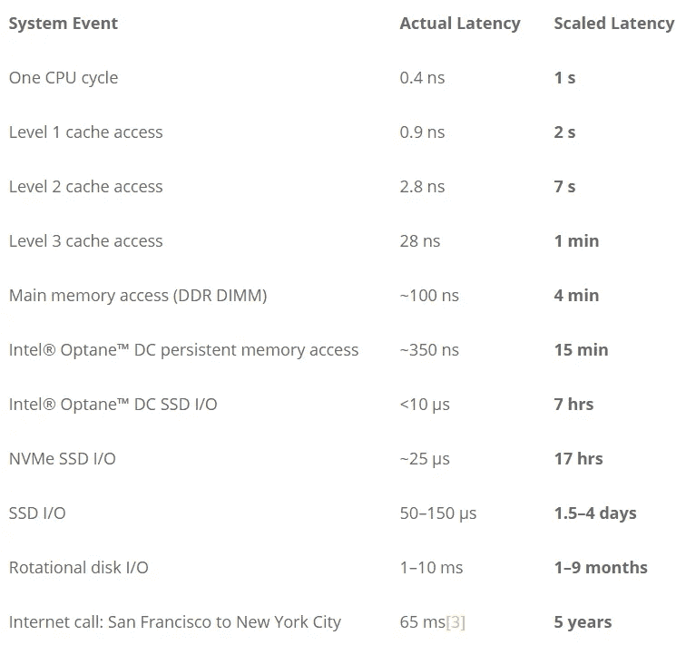

from David Jeppesen’s [‘Computer Latency at a Human Scale’](https://www.prowesscorp.com/computer-latency-at-a-human-scale/)

正如你所看到的，从硬盘(旋转磁盘)读取数据相当慢。因此，如果您的任务是 [**I/O 绑定的**，您可以通过将数据读/写文件夹移动到 SSD 来提高其速度。](https://stackoverflow.com/questions/868568/what-do-the-terms-cpu-bound-and-i-o-bound-mean)

**其次**，如果操作是 **CPU 受限的**，我们将不得不更深入地挖掘并行机制。并行性可以充分利用 CPU 的潜力，让您付出的每一分钱都物有所值。Python 提供了各种各样的并行计算库，但不幸的是，其中大多数都需要大量的额外设置代码和对线程/进程/同步等的理解。 **Dask** 是一个库，它提供了并行计算，而无需向用户暴露并行配置的本质细节。我将向您展示在 Dask 的帮助下加速代码是多么容易。

## 系统配置

Dask 默认安装在 Anaconda Python 环境中。如果没有安装 dask，只需在终端中输入这一行代码

```
pip3 install dask 
```

建立一个本地集群(集群中的每个核心都是一个工作者)

```
# in python
from dask.distributed import Client
client = Client(scheduler = 'threads') # set up a local cluster
client # prints out the url to dask dashboard, which can be helpful
```

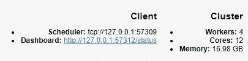

就是这样！你现在有几个工人供你支配。

# 容易加速的常见任务

## **a .文件格式转换**

***例 1:将 JSON 文件转换为 CSV***

将 JSON 转换为 CSV 是 web 爬行中的常见任务。处理 JSON 文件的一种常见方法是:

```
file_list = os.listdir(base_dir)
json_list = [file  for file in file_list if file.endswith('.json')]
for file in json_list:
    inp = os.path.join(base_dir, file)
    out = os.path.join(base_dir, new_name)
    json_process(inp, out) # convert each json to a csv
```

但是，这种串行方法没有充分发挥机器的潜力。稍加修改，我们就能写出更好的代码:

```
file_list = os.listdir(base_dir)
json_list = [file  for file in file_list if file.endswith('.json')]
parallel_work = []
for file in json_list:
    inp = os.path.join(base_dir, file)
    out = os.path.join(base_dir, new_name)
    **parallel_work.append(dask.delayed(json_process)(inp, out))# lazy
dask.compute(*parallel_work) # make dask compute**
```

**dask.delayed()是一个惰性信号，**这意味着它不会执行函数(在本例中为 json_process ),除非被明确告知这样做。使用 delayed()的好处是系统会**智能确定可并行化部分**。

例如，dask 可以在下面的操作中识别底层的任务依赖，然后同时处理尽可能多的操作(在本例中是 4 个任务)

```
def add(x,y):
    return x+y
def minus(x,y):
    return x-y;
x = 10
y = 1
result = dask.delayed(add)(x,y) * dask.delayed(minus)(x,y) +  dask.delayed(minus)(x,y)/dask.delayed(add)(x,y)
**result.visualize()# show task dependency**
```

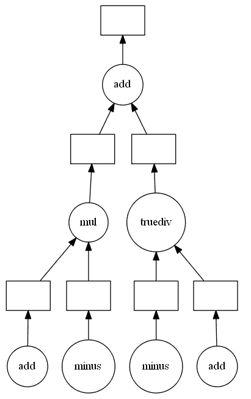

task dependency graph generated by dask

基准:将 JSON 文件处理成 CSV 格式的 dataframe。

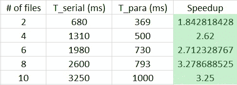

you can get the max speedup = # of cores

***例 2:将 CSV 合并成一个大 CSV***

数据从业者的另一个主要问题是合并 CSV。这是我在网上找到的一个代码:

```
#code 1
df = pd.read_csv(file)
for file in csv_list:
    a = pd.read_csv(os.path.join(base_dir, file))
    df = pd.concat([df,a])
```

这段代码的性能会很差，因为 pd.concat()是一个开销很大的函数。pd.concat(df1，df2)重新分配新的内存空间，并将两个数据帧都复制到新的数据帧中。上面的代码给你二次运行时间。

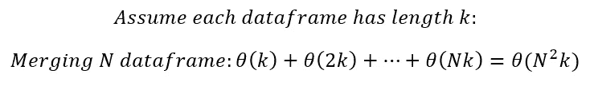

runtime analysis

更好的解决方案:

```
#code 2
df_list= []
for file in csv_list[1:]:
    df= pd.read_csv(os.path.join(base_dir, file))
    df_list.append(df)
df = pd.concat(my_list)
```

这段代码只复制数据帧一次，因此产生线性运行时间。我们不能显著改进这段代码，但是我们可以使用 dask 对它进行次线性改进。

```
#code 3 with dask
df_list =[]
for file in csv_list:
    df = dask.delayed(pd.read_csv)(os.path.join(base_dir, file))
    df_list.append(df)
df = dask.delayed(pd.concat)(df_list).compute)
```

基准

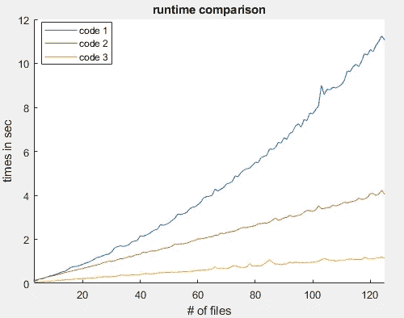

## **b .数据汇总**

Dask 提供了几种数据结构，dask.dataframe 是其中之一。Dask.dataframe 允许用户将一个巨大的数据帧分成多个块，这允许内核之间的协作。要创建 dask.dataframe，只需:

```
from dask import dataframe as dd
**dd_df = dd.from_pandas(df, npartitions=6)**
dd_df.visualize()
```

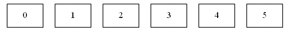

dask dataframe visualization

Dask.dataframe 对象与 pandas dataframe 非常相似(许多命令完全相同)。举个例子，

```
# in pandas
df.groupby(['Feature1']).sum()
df['Feature1'].min()
df['Feature1'].rolling(10).mean()# in dask
dd_df.groupby('Feature1').sum().compute()
dd_df['Feature1'].min().compute()
dd_df['Feature1'].rolling(10).mean().compute()
```

基准测试:groupby()

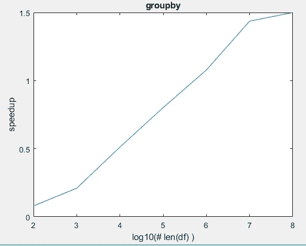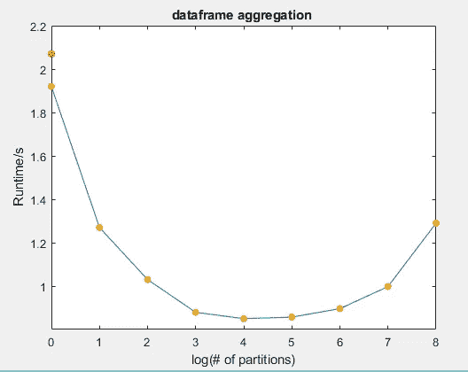

重要的一点是:数据帧分区不是随机的工作；根据您拥有的内核数量对数据进行分区是一个好主意。太多的分区将不可避免地增加通信开销。

## **c .特征工程**

特征工程是一个好模型的重要前提。尽可能对代码进行矢量化总是一个好主意。例如:

```
%timeit df['Feature3'] = df['Feature1'] **2
#47.3 ms ± 982 µs per loop (mean ± std. dev. of 7 runs, 10 loops each)
%timeit df['Feature3'] = df['Feature1'].apply(transformsform)
#2.62 s ± 47.8 ms per loop (mean ± std. dev. of 7 runs, 1 loop each)
```

Pandas 基于 [numpy 库](https://stackoverflow.com/questions/8385602/why-are-numpy-arrays-so-fast)，一个高性能的计算库，因此任何矢量化的操作都非常快。幸运的是，我们在 dask 中得到相同的 API:

```
dd_df['F1'] = dd_df['F1']**2 + dd_df['F2'] (lazy)
```

然而，并不是所有的作品都可以矢量化。例如:如果您的数据帧看起来像这样，并且您希望提取名字，您必须使用 apply()。

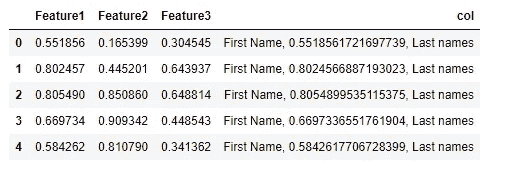

```
#you can't vectorize this
def operation(x):
    return x.split(':')[0]
```

因为矢量化的操作通常足够快，所以我将重点放在不可矢量化的操作上。

***例 1:列变换***

```
def operation(x):
#some un-vectorizable operations with process time M
return ydf['new'] = df.F1.apply(operation) # pandas
ddf['new'] = ddf.F1.apply(operation).compute(**scheduler ='processes'**) # dask
```

我将调度器设置为‘processes ’,因为这段代码完全由 operation()控制。在这种情况下，向其他进程发送数据以换取真正的并行性是合理的(每个进程在一个分区上工作)。参见 dask 提供的解释:

> [**引用**](http://docs.dask.org/en/latest/scheduling.html)*‘线程调度器……是轻量级的……它引入了非常少的任务开销(每个任务大约 50us 然而，由于 Python 的全局解释器锁(GIL)，该调度器仅在您的计算由非 Python 代码主导时提供并行性。”*
> 
> 多处理调度程序…每一个任务及其所有的依赖项都被 ***运至*** *的一个局部流程，执行完毕，然后它们的结果被* ***运回*** *的主流程。这意味着它能够* ***绕过 GIL*** *的问题，甚至在纯 Python 代码占主导地位的计算上提供并行性*

基准:

移动数据的成本很高，这就是为什么只有当您希望执行的操作比进程间通信成本更高时，使用进程调度程序才有帮助:

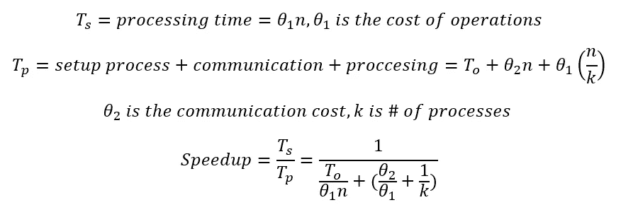

both n and theta play roles

正如你所看到的，大的 n 和大的θ可以使分母变小，从而使除法变大，这就是为什么我们想要大的 n 和θ。

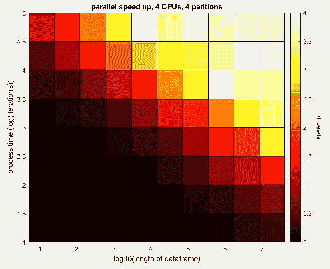

operation time and the length of dataframes both matter

你要尽可能靠近右上角。另一方面，如果您的操作不需要那么长时间，或者您的数据帧很小，您可以只使用 pandas。

***例 2:多特征工程***

如果有多列需要处理，可以同时处理这些列:

```
#pandas
operation1(df.F1)
operation2(df.F2)
operation3(df.F3)#dask
a = dask.delayed(operation1)(df.F1)
b = dask.delayed(operation2)(df.F2)
c = dask.delayed(operation3)(df.F3)
work = [a,b,c]
result = dask.compute(*work)
```

基准测试:和前面的例子一样，操作时间和数据长度都很重要。

# 摘要

数据处理可能非常耗时，尤其是由单线程处理时。我已经说明了利用 dask 充分发挥计算机的能力是多么容易。当然，还有其他多处理/线程库，但我认为 dask 是帮助数据从业者入门的最简单快捷的工具。

现在去加速你的代码吧！

# 相关材料

Dask 网站:[https://docs.dask.org/en/latest/why.html](https://docs.dask.org/en/latest/why.html)

深度 Dask 教程:[https://github.com/dask/dask](https://github.com/dask/dask)

达斯克概述:[https://www.youtube.com/watch?v=ods97a5Pzw0](https://www.youtube.com/watch?v=ods97a5Pzw0)