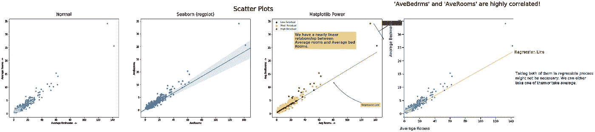
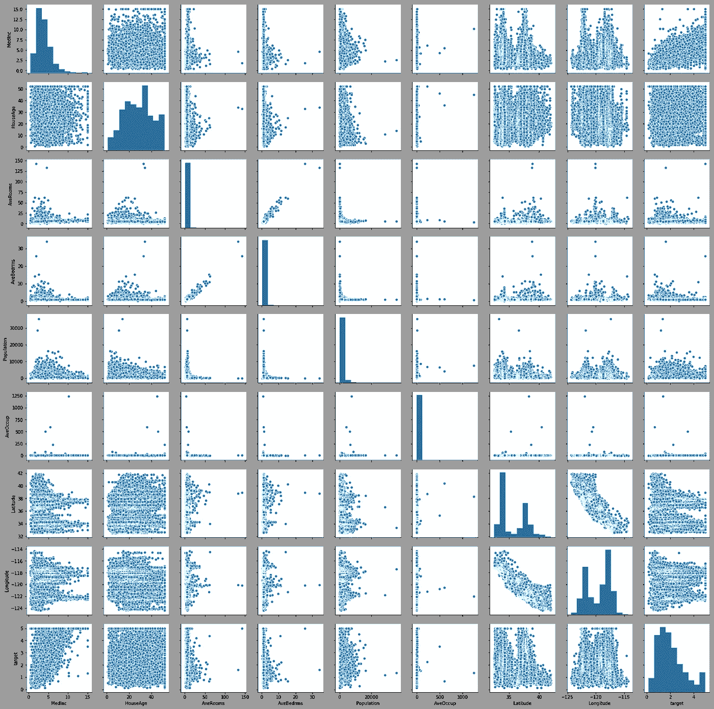
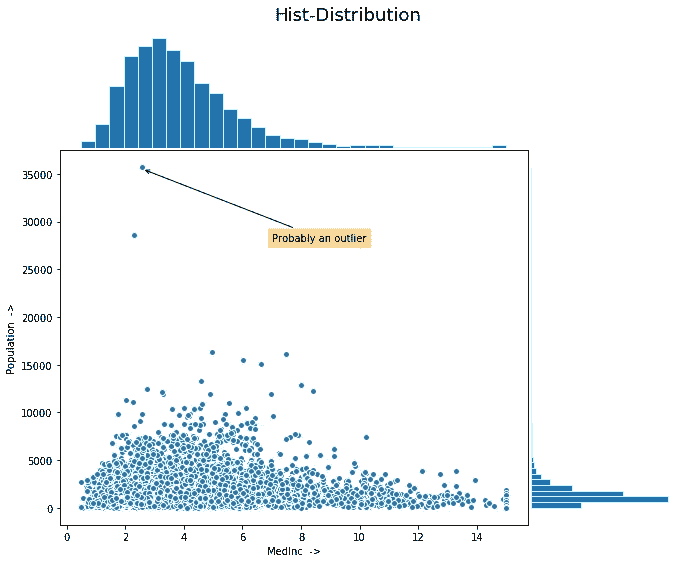
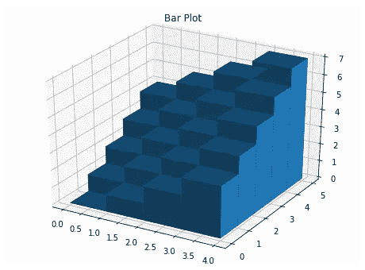

# 让您的数据说话！

> 原文：<https://towardsdatascience.com/make-your-data-talk-13072f84eeac?source=collection_archive---------7----------------------->

## 使用 matplotlib 和 seaborn 在可视化中从 0 到英雄


Photo by [Wynand van Poortvliet](https://unsplash.com/@wwwynand?utm_source=medium&utm_medium=referral) on [Unsplash](https://unsplash.com?utm_source=medium&utm_medium=referral)

如果**TL；博士** : [ [Link_To_Note](#2dd7)

**编辑:** [法维奥·巴斯克斯](https://medium.com/u/e8ec6fa4d7d4?source=post_page-----13072f84eeac--------------------------------) 给这个帖子+4 并回复

> “牛逼的文章！恭喜:)”*法维奥·巴斯克斯*

在[推特上](https://twitter.com/FavioVaz/status/1113471057619505152)！！感谢法维奥·巴斯克斯。

这是我在`Tackle`类别的帖子中的一个，可以在我的 github repo [这里](https://github.com/PuneetGrov3r/MediumPosts/tree/master/Tackle)找到。此类别的所有帖子:

1.  [如何从低内存的大数据文件中学习—增量学习](/how-to-learn-from-bigdata-files-on-low-memory-incremental-learning-d377282d38ff)
2.  [让您的数据说话！-使用 matplotlib 和 seaborn 在可视化中从 0 到英雄](https://medium.com/@grover.puneet1995/make-your-data-talk-13072f84eeac)

# 索引

1.  [简介](#f957)
2.  [单一分布图](#61c3)(希斯特，KDE，-【盒子，小提琴】)
3.  [关系图](#2ae6)(折线图、散点图、等高线、对)
4.  [分类图](#c965)(小节，+[框，小提琴])
5.  [多个地块](#7fc7)
6.  [互动剧情](#f2d6)
7.  [其他](#91c0)
8.  [延伸阅读](#c1d9)
9.  [参考文献](#352d)

```
***NOTE:*** This post goes along with ***Jupyter Notebook*** available in my Repo on Github:[[HowToVisualize](https://nbviewer.jupyter.org/github/PuneetGrov3r/MediumPosts/blob/master/Tackle/HowToVisualize.ipynb)]
```

# 1.简介 [^](#9520)

什么是数据，无非是数字。如果我们不把它形象化来更好地理解它里面的世界，我们就会错过很多东西。也就是说，我们可以把数据理解成数字，但是当你试图把它形象化时，奇迹就发生了。它变得更有意义，突然变得更容易理解。

我们是感性的生物，我们通过感官感知周围的事物。视觉、听觉、嗅觉、味觉和触觉。我们可以在一定程度上根据感官来区分周围的事物。对于数据来说，声音和视觉似乎是表示它的最佳选择，因为它可以很容易地转换。我们大多使用视觉作为感知数据的媒介，因为我们可能习惯于通过这种感觉来区分不同的对象，而且，尽管在较低的层次上，我们也习惯于通过这种感觉来感知更高维度的事物，这在多变量数据集中很方便。

在这篇文章中，我们将探讨 Python 中两个最流行的数据可视化库，并使用它们通过可视化让数据说话:

**1.1 Matplotlib**

Matplotlib 保持了 MATLAB 的绘图风格，尽管它也有一个面向对象的接口。

1.  *MATLAB 风格接口:*从 matplotlib 库中导入`pyplot`即可使用，使用类似 MATLAB 的函数。

使用该界面时，方法将自动选择当前图形和轴来显示绘图。在您使用`pyplot.show`方法或在 IPython 中执行您的单元之前，它将一直如此(也就是说，对于您的所有方法调用，这个当前数字将被一次又一次地选择)。

2.*面向对象接口:*可以这样用:

```
import matplotlib.pyplot as pltfigure, axes = **plt**.subplots(2) # for 2 subplots# Now you can configure your plot by using
# functions available for these objects.
```

这是一个低级的库，你可以完全控制你的地块。

**1.2 Seaborn**

Seaborn 是一个基于 matplotlib 的高级可视化库。它主要用于制作快速和有吸引力的情节，而没有太多的麻烦。虽然 seaborn 试图以一种奇特的方式控制你的情节，但你仍然不能从中获得你想要的一切。为此，你必须使用 matplotlib 的功能，*你也可以使用 seaborn(因为它是建立在 matplotlib 之上的)*。

# 2.分布图 [^](#9520)


Photo by [Daniel Leone](https://unsplash.com/@danielleone?utm_source=medium&utm_medium=referral) on [Unsplash](https://unsplash.com?utm_source=medium&utm_medium=referral)

分布图告诉我们一个变量是如何分布的。它给了我们在特定范围内找到变量的概率。也就是说，如果我们从一个变量的总范围内随机选择一个数字，它会给出这个变量在不同范围内的概率。

分布图应`Normally`分布，以获得更好的结果。这是所有线性模型的假设之一，即正态性。`Normal distribution`看起来像一个中间有[光尾巴](https://en.wikipedia.org/wiki/Heavy-tailed_distribution)的中等驼峰。

```
**Note:** If **TL;DR** (Too Long; Don’t wanna Read), just read initial function used to plot the sub-topic plot and then read through **Tips**. You can easily navigate through tips using **<** and **>** buttons.
Eg: here Tips #1 and plt.hist, below.
```

> **(:Tips # 1:)**[**>**](#835b) **1)**在大多数情况下，您可以使用`matplotlib.pyplot`函数为您的绘图提供的参数。请务必查看函数的参数及其描述。
> **2)** 所有`matplotlib`的函数甚至`seaborn`的函数都返回你的图在字典、列表或对象中的所有组成部分。从那里你也可以改变你的组件的任何属性(用`matplotlib`的语言`Artist` s)。

箱形图和小提琴图在[分类部分](#c965)中。

1.  **直方图和核密度估计图(kde):**

```
# Simple hist plot
_ = **plt**.hist(train_df['target'], bins=5, edgecolors='white')
```


```
# with seaborn
_ = **sns**.distplot(train_df['target'])
```


> **(:Tips # 2:)**[**<**](#142b)**[**>**](#7b52) **3)**为了给你的剧情提供一些有用的信息或者引起对剧情中某些东西的注意，你大多可以用`plt.text()`或者`plt.annotate()`逃脱。**
> 
> ****4)** 绘图最需要的参数是`*label*`，绘图最需要的方法是`*plt.xlabel*`、`*plt.ylabel*`、`*plt.title*`、`*plt.legend*`。**
> 
> **为了有效地传达你的信息，你应该从你的图中移除所有不想要的干扰，比如右轴和顶轴，以及你的图中任何其他不想要的结构。**

```
import matplotlib.pyplot as plt_ = **plt**.hist(data, bins=10, color='lightblue',
             label=lbl, density=True, ec='white')
**plt**.legend()
**plt**.title("Target variable distribution", fontdict={'fontsize': 19,
          'fontweight':0.5 }, pad=15)
**plt**.xlabel("Target Bins")
**plt**.ylabel("Probability");
```

********

**[Storytelling with Matplotlib](https://github.com/PuneetGrov3r/SWMat)**

**[**用 Matplotlib (SWMat)讲故事**](https://github.com/PuneetGrov3r/SWMat) **:****

**— — — — — — — — — — — — -**

```
import matplotlib.pyplot as plt
from SWMat.SWMat import SWMat**swm** = SWMat(plt) # Initialize your plot**swm**.hist(data, bins=10, ***highlight***=[2, 9])
**swm**.title("Carefully looking at the dependent variable revealed 
           some problems that might occur!")
**swm**.text("Target is a bi-model dependent feature.\nIt 
          can be <prop fontsize='18' color='blue'> hard to 
          predict.<\prop>");**#** **Thats all!** And look at your plot!!
```

****

**1) Normal Matplotlib, 2) Seaborn, 3) Matplotlib Power, 4) Storytelling With Matplotlib**

# **3.关系图 [^](#9520)**

****

**Photo by [Vincent van Zalinge](https://unsplash.com/@vincentvanzalinge?utm_source=medium&utm_medium=referral) on [Unsplash](https://unsplash.com?utm_source=medium&utm_medium=referral)**

**关系图对于获取两个或多个变量之间的关系非常有用。这些关系可以帮助我们更好地理解我们的数据，并可能帮助我们从现有的变量中产生新的变量。**

**这是`Data Exploration`和`Feature Engineering`中的重要一步。**

**[a)线条图](#d4de)**

**[b)散点图](#a4dd)**

**[c) 2D 直方图、十六进制图和等高线图](#5d68)**

**[d)配对图](#9a37)**

****a)线条图:** [**^**](#2ae6)**

**线图对于检查两个变量之间的线性关系，甚至二次关系、指数关系和所有此类关系非常有用。**

> ****(:提示# 3:)**[**<**](#835b)**[**>**](#2cd1)****
> 
> ******5)** 你可以通过使用参数'`color` ' / ' `c`'，'`alpha`，'`edgecolors` ' / ' `edgecolor`'来给你的剧情一个美学的外观。****
> 
> ******6)** `Seaborn`在它的大多数绘图方法中都有一个参数“`hue`”，您可以用它来显示这些图中分类变量的不同类别之间的对比。****
> 
> ****你应该用较浅的颜色来画出你想画的部分，但它们不是你想画的重点。****

```
****plt**.plot('AveRooms', 'AveBedrms', data=data, 
         label="Average Bedrooms")**plt**.legend() # To show label of y-axis variable inside plot
**plt**.title("Average Rooms vs Average Bedrooms")
**plt**.xlabel("Avg Rooms  ->")
**plt**.ylabel("Avg BedRooms  ->");**
```

********

****您也可以像这样手动对它们进行颜色编码:****

```
****plt**.plot('AveRooms', 'AveBedrms', data=data, c='lightgreen')
**plt**.plot('AveRooms', 'AveBedrms', data=data[(data['AveRooms']>20)], 
         c='y', alpha=0.7)
**plt**.plot('AveRooms', 'AveBedrms', data=data[(data['AveRooms']>50)], 
         c='r', alpha=0.7)**plt**.title("Average Rooms vs Average Bedrooms")
**plt**.xlabel("Avg Rooms  ->")
**plt**.ylabel("Avg BedRooms  ->");**
```

********

```
**# with seaborn
_ = **sns**.lineplot(x='AveRooms', y='AveBedrms', data=train_df)**
```

****************

****[Storytelling with Matplotlib](https://github.com/PuneetGrov3r/SWMat)****

****[**【用 Matplotlib (SWMat)讲故事】**](https://github.com/PuneetGrov3r/SWMat) **:******

****— — — — — — — — — — — — -****

```
****swm** = SWMat(plt)**swm**.line_plot(data_x, data_y, line_labels=[line_lbl], highlight=0, 
         ***label_points_after***=60, xlabel=xlbl, point_label_dist=0.9,    
         ***highlight_label_region_only***=True)
**swm**.title("There are some possible outliers in 'AveRooms' and 
           'AveBedrms'!", ttype="title+")
**swm**.text("This may affect our results. We should\ncarefully
          look into these and <prop color='blue'>finda\n 
          possible resolution.<\prop>", 
          position="out-mid-right", fontsize=20, 
          btw_line_dist=2.2);# '**point_label_dist**' (to adjust distance between points' labels and 
# lines) in `.line_plot` method and '**btw_line_dist**' (to adjust lines
# between two lines in text) in `.text` method are only used when
# result given by library is not what you want. Most of the times
# this library tries to give the right format, but still some
# mistakes can happen. I will try to make it fully automatic in 
# future.**
```

********

****1) Normal Matplotlib, 2) Seaborn, 3) Matplotlib Power, 4) Storytelling With Matplotlib****

******b)散点图:** [**^**](#2ae6)****

****并非两个变量之间的每一种关系都是线性的，实际上只有少数是线性的。这些变量中也有一些随机成分，这使得它们几乎是线性的，而其他情况下有一种完全不同的关系，我们很难用线性图来显示。****

****此外，如果我们有很多数据点，散点图可以方便地检查大多数数据点是否集中在一个区域，是否有任何异常值 w.r.t .这两个或三个变量，等等。****

****如果我们对 3D 图中的第四个变量进行颜色编码，我们可以绘制两个或三个甚至四个变量的散点图。****

> ******(:提示# 4:)**[**<**](#7b52)**[**>**](#e0d8)******
> 
> ******7)** 你可以用两种方式设置你的地块的大小。您可以从`matplotlib`中导入`figure`并使用类似于:`figure(figsize=(width, height))`{它将为当前图形设置该图形大小}的方法，或者您可以在使用类似于`figure, plots = plt.subplots(rows, cols, figsize=(x,y))`的面向对象接口时直接指定`figsize`。****
> 
> ****当你试图用数据传达信息时，你应该简明扼要。****

```
**from matplotlib.pyplot import figure
figure(figsize=(10, 7))**plt**.scatter('AveRooms', 'AveBedrms', data=data, 
            edgecolors='w', linewidths=0.1)**plt**.title("Scatter Plot of Average Rooms and Average Bedrooms")
**plt**.xlabel("Average Bedrooms  ->")
**plt**.ylabel("Average Rooms  ->");**
```

********

```
**# With Seaborn
from matplotlib.pyplot import figure
figure(figsize=(10, 7))**sns**.scatterplot(x='AveRooms', y='AveBedrms', data=train_df, 
                label="Average Bedrooms");**
```

********

> ******(:提示 5:)**[**<**](#2cd1)**[**>**](#4749)******
> 
> ******8)** 在`.text`和`.annotate`方法中有一个参数`bbox`，它使用一个字典来设置文本周围的框的属性。对于`bbox`，几乎所有情况下都可以用`pad`、`edgecolor`、`facecolor`、`alpha`蒙混过关。****
> 
> ******9)** 在`.annotate`方法中有一个用于设置箭头属性的参数，如果设置了`xytext`参数，就可以设置这个参数，它就是`arrowprops`。它以一个字典作为参数，你可以用`arrowstyle`和`color`蒙混过关。****
> 
> ******10)** 你可以使用`matplotlib`的`fill_between`或`fill_betweenx`来填充两条曲线之间的颜色。这可以方便地突出曲线的某些区域。****
> 
> ****你应该花时间考虑如何绘制数据，以及哪个特定的图能最大程度地传达你的信息。****

```
**from matplotlib.pyplot import figure
figure(figsize=(10, 7))**plt**.scatter('AveRooms', 'AveBedrms', data=data)
**plt**.plot(train_df['AveRooms'], Y, linewidth=1, color='red', 
         linestyle='-', alpha=0.8)**plt**.xlabel("Avg Rooms  ->")
**plt**.ylabel("Avg BedRooms  ->")# Adding annotations:
**plt**.annotate("Possible outliers", xy=(144, 31), xytext=(160, 34),
             arrowprops={'arrowstyle':'-[,widthB=4.0', 'color': 
                         'black'},
             bbox={'pad':4, 'edgecolor':'orange', 'facecolor': 
                   'orange', 'alpha':0.4})**plt**.annotate("Regression Line", xy=(80, 12), xytext=(120, 3),
             arrowprops={'arrowstyle':'->', 'color': 'black', 
                         "connectionstyle":"arc3,rad=-0.2"},
             bbox={'pad':4, 'edgecolor':'orange', 'facecolor': 
                   'orange', 'alpha':0.4});**
```

****************

****[Storytelling with Matplotlib](https://github.com/PuneetGrov3r/SWMat)****

****[**【用 Matplotlib (SWMat)讲故事】**](https://github.com/PuneetGrov3r/SWMat) **:******

****— — — — — — — — — — — — -****

```
****swm** = SWMat(plt)
**plt**.scatter(x, y, edgecolors='w', linewidths=0.3)
**swm**.line_plot(x, *Y*, highlight=0, highlight_color="#000088", 
              alpha=0.7, line_labels=["Regression Line"])
**swm**.title("'AveBedrms' and 'AveRooms' are highly correlated!", 
          ttype="title+")
**swm**.text("Taking both of them in regressioin process\nmight not be 
          necessary. We can either\n<prop color='blue'>take one of 
          them</prop> or <prop color='blue'>take average.</prop>",
          position='out-mid-right', btw_line_dist=5)
**swm**.axis(labels=["Average Rooms", "Average Bedrooms"])# 'SWMat' has an `axis` method with which you can set some Axes
# properties such as 'labels', 'color', etc. directly.**
```

********

****1) Normal Matplotlib, 2) Seaborn, 3) Matplotlib Power, 4) Storytelling With Matplotlib****

******c)二维直方图、十六进制图和等高线图:** [**^**](#2ae6)****

****2D 直方图和 Hex 图可用于检查特定位置数据的相对密度。****

****等值线图可用于绘制 2D 的 3D 数据，或绘制 4D 的 3D 数据。轮廓线(或填充轮廓中的色带)告诉我们函数具有常数值的位置。它让我们熟悉绘图中使用的所有变量。例如，它可以用于绘制深度学习中不同θ的成本函数。但是要做到准确，你需要大量的数据。至于绘制整个景观，你需要该景观中所有点的数据。如果你有一个关于那个景观的函数，你可以很容易地通过手动计算值来绘制这些图。****

```
**from matplotlib.pyplot import figure
figure(figsize=(10, 7))**plt**.hist2d('MedInc', 'target', bins=40, data=train_df)
**plt**.xlabel('Median Income  ->')
**plt**.ylabel('Target  ->')
**plt**.suptitle("Median Income vs Target", fontsize=18);**
```

********

****但是`seaborn`中没有单独的十六进制绘图/2D-历史绘图方法，您可以使用`jointplot`方法的`kind`参数来制作十六进制绘图。更多信息请查看`seaborn`上的[联合图](https://seaborn.pydata.org/examples/hexbin_marginals.html)。****

> ******(:提示# 6:)**[**<**](#e0d8)**[**>**](#3626)******
> 
> ****一个`colorbar`需要一个`Mappable`对象。默认情况下，`Contour`、`Scatter`和`hist2d`等图给出了它们。你可以简单地调用`plt.colorbar()`，它会在你的图旁边显示一个`colorbar`。对于其他图，如果需要，您可以手动制作一个`colorbar`。[在 Jupyter 笔记本的“历史”部分提供了一个例子。]****
> 
> ******E】**总是尽量选择一个简单的，群众容易理解的情节。****

```
**# Hexbin Plot:
from matplotlib.pyplot import figure
figure(figsize=(10, 7))**plt**.hexbin('MedInc', 'target', data=train_df, alpha=1.0, 
           cmap="inferno_r")**plt**.margins(0)
**plt**.colorbar()
**plt**.xlabel('Median Income  ->')
**plt**.ylabel('Target  ->')
**plt**.suptitle("Median Income vs Target", fontsize=18);**
```

********

```
**from matplotlib.pyplot import figure
figure(figsize=(10, 7))

**plt**.hist2d('MedInc', 'target', bins=40, data=train_df, 
           cmap='gist_heat_r') 
**plt**.colorbar()
**plt**.xlabel('Median Income  ->')
**plt**.ylabel('Target  ->')
**plt**.suptitle("Median Income vs Target", fontsize=18)# Adding annotations:
**plt**.annotate("Most Blocks have low med.\nincome and lower target.", 
             xy=(5, 1.5), xytext=(10, 2),
             arrowprops={'arrowstyle': '->', 'color': 'k'},
             bbox={'facecolor': 'orange', 'pad':4, 'alpha': 0.5, 
                   'edgecolor': 'orange'});**
```

********

*******等高线图*** *:* 等高线图是在 2D 图上可视化 3D 数据的一种方式。在`matplotlib`中有两种方法可用，即`.contour`和`.contourf`。第一个制作线条轮廓，第二个制作填充轮廓。您可以传递 z 值的 2D 矩阵，也可以为 X 值和 Y 值传递两个 2D 数组 X，Y，为所有相应的 z 值传递一个 2D 数组。****

```
**# For **contour plot**
from matplotlib.pyplot import figure
figure(figsize=(10, 7))**plt**.contourf(Z, levels=30, cmap="gist_heat_r")
**plt**.colorbar()**plt**.suptitle("Target Contour", fontsize=16)
**plt**.title("(with Medium Income and Population)", 
          position=(0.6, 1.03))
**plt**.xlabel("Medium Income  ->")
**plt**.ylabel("Population  ->")**
```

********

******d)配对图:** [**^**](#2ae6)****

****`seaborn`提供了一个方法`pairplot`,你可以用它一次绘制出所有可能的关系图。它可以用于快速查看数据中所有变量之间的关系，以及每个变量的分布。****

```
**_ = **sns**.pairplot(train_df)**
```

********

# ****4.分类图 [^](#9520)****

********

****Photo by [Sharon McCutcheon](https://unsplash.com/@sharonmccutcheon?utm_source=medium&utm_medium=referral) on [Unsplash](https://unsplash.com?utm_source=medium&utm_medium=referral)****

****分类图在数据探索步骤中也是必要的，因为它们告诉我们不同类别的变量在数据集中是如何分布的。如果我们有足够的数据，我们就可以从这些曲线图中得出该变量不同类别的结论。****

*****因为* `*seaborn*` *我在这里加了箱子剧情和小提琴剧情。在* `*seaborn*` *中有一些参数，您可以使用这些参数对不同的分类变量使用这些方法。*****

****a) [条形图](#88f0)****

****b) [方框图](#06ce)****

****c) [小提琴剧情](#d769)****

******一)条形图** [**^**](#c965)****

****条形图可用于类别之间的对比，其高度代表特定于该类别的某些值。****

```
**from matplotlib.pyplot import figure
figure(figsize=(10, 7))**plt**.bar(np.sort(data.unique()), data.value_counts().sort_index(), 
        alpha=0.7) **#** You might need to sort; Be carefully with
                   **#** which values are being plotted with each 
                   **#** other.**plt**.xlabel("Target  ->")
**plt**.ylabel("Frequency  ->");**
```

********

> ******(:提示# 7:)**[**<**](#4749)**[**>**](#31a6)******
> 
> ******12)** 如果在每个`matplotlib`和`seaborn`函数的输出中有你想要改变属性的补丁或对象，你可以通过使用`.set`函数将属性名作为字符串和属性值传递给它来改变它，或者你可以直接对那个属性使用 set 函数，如`set_color`、`set_lw`等。****
> 
> ****有近 8%的男性是色盲，近 1/10 的女性是色盲。但你还是应该小心他们。对比对他们中的大多数人都有效。****

```
**# Seaborn
from matplotlib.pyplot import figure
figure(figsize=(10, 7))**sns**.barplot(np.sort(data.unique()),data.value_counts().sort_index())**plt**.xlabel("Target  ->")
**plt**.ylabel("Frequency  ->");**
```

********

```
**from matplotlib.pyplot import figure
figure(figsize=(10, 7))**plt**.bar(np.sort(train_df['target_int'].unique()), 
        train_df['target_int'].value_counts().sort_index(), 
        alpha=0.7, width=0.6)**plt**.grid(True, alpha=0.3)
**plt**.xlabel("Target  ->", fontsize=14)
**plt**.ylabel("Frequency  ->", fontsize=14)
**plt**.title("Target Frequencies", fontsize=18)# Remove top and left spines:
ax = **plt**.gca() # Get current axis (gca)
**ax**.spines['right'].set_visible(False)
**ax**.spines['top'].set_visible(False)# Adding annotations:
counts = train_df['target_int'].value_counts().sort_index()
**plt**.annotate(str(counts[0]), xy=(0, counts[0]), 
             xytext=(0,counts[0]+400), ha = 'center',
             bbox={'boxstyle': 'round', 'pad': 0.5, 'facecolor': 
                   'orange', 'edgecolor': 'orange', 'alpha': 0.6},
             arrowprops={'arrowstyle':"wedge,tail_width=0.5", 
                         'alpha':0.6, 'color': 'orange'})
**plt**.annotate(str(counts[1]), xy=(1, counts[1]), 
             xytext=(1, counts[1]+400), ha = 'center',
             bbox={'boxstyle': 'round', 'pad': 0.5, 'facecolor': 
                   'orange', 'edgecolor': 'orange', 'alpha': 0.6},
             arrowprops={'arrowstyle':"wedge,tail_width=0.5", 
                         'alpha':0.6, 'color': 'orange'})
**plt**.annotate(str(counts[2]), xy=(2, counts[2]), 
             xytext=(2, counts[2]+400), ha = 'center',
             bbox={'boxstyle': 'round', 'pad': 0.5, 'facecolor': 
                   'orange', 'edgecolor': 'orange', 'alpha': 0.6},
             arrowprops={'arrowstyle':"wedge,tail_width=0.5", 
                         'alpha':0.6, 'color': 'orange'})
**plt**.annotate(str(counts[3]), xy=(3, counts[3]), 
             xytext=(3, counts[3]+400), ha = 'center',
             bbox={'boxstyle': 'round', 'pad': 0.5, 'facecolor': 
                   'orange', 'edgecolor': 'orange', 'alpha': 0.6},
             arrowprops={'arrowstyle':"wedge,tail_width=0.5", 
                         'alpha':0.6, 'color': 'orange'})
**plt**.annotate(str(counts[4]), xy=(4, counts[4]), 
             xytext=(4, counts[4]+400), ha = 'center',
             bbox={'boxstyle': 'round', 'pad': 0.5, 'facecolor': 
                   'orange', 'edgecolor': 'orange', 'alpha': 0.6},
             arrowprops={'arrowstyle':"wedge,tail_width=0.5", 
                         'alpha':0.6, 'color': 'orange'})
**plt**.xticks(ticks=[0, 1, 2, 3, 4], labels=["0 - 1", "1 - 2", "2 - 3",      
           "3 - 4", "4 - 5"], fontsize=12)
**plt**.ylim([0, 9500]);**
```

****************

****[Storytelling with Matplotlib](https://github.com/PuneetGrov3r/SWMat)****

****[**【用 Matplotlib (SWMat)讲故事】**](https://github.com/PuneetGrov3r/SWMat) **:******

****— — — — — — — — — — — — -****

```
****swm** = SWMat(plt)
**swm**.bar(cats, heights, highlight={"cat": [-1]}, highlight_type=
        {"data_type": "incrementalDown"}, cat_labels=["0-1", "1-2",
        "2-3", "3-4", "4-5"], highlight_color={"cat_color":
        "#FF7700"}, annotate=True)
**swm**.axis(labels=["Target values", "Frequency"])
**swm**.title("About most expensive houses in California...")
**swm**.text("California is a sea-side state. As most\nexpensive houses 
         are at sea-side we\ncan easily predict these values if 
         we\nsomehow <prop color='blue'>combine 'Latitude' 
         and\n'Longitude' variables </prop>and separate sea\nside 
         houses from non-sea-side houses.",
         btw_text_dist=.1);**
```

********

****1) Normal Matplotlib, 2) Seaborn, 3) Matplotlib Power, 4) Storytelling With Matplotlib****

******b)方框图** [**^**](#c965)****

****箱线图是分布图的统计版本。它给出了不同的四分位数，平均值和极值的范围。一些可能的用例是，如果某些点超出了盒须线的范围，您可以使用它来识别可以发现异常值的变量，或者您可以通过图中中间盒的相对位置来检查分布中的偏斜。****

```
**from matplotlib.pyplot import figure
figure(figsize=(15, 7))**plt**.boxplot(train_df['target'], vert=False)**plt**.xlabel("<-  Target Values  ->")
**plt**.ylabel("Target");**
```

********

```
**# With Seaborn:
from matplotlib.pyplot import figure
figure(figsize=(15, 7))sns.boxplot(train_df['MedInc']);**
```

********

> ******(:提示# 8:)**[**<**](#3626)**[**>**](#fbe9)******
> 
> ******13)** 您可以通过使用`plt.xlim`、`plt.ylim`、`ax.set_xlim`、`ax.set_ylim`功能来改变您的`Axes`的 x 极限、y 极限。您还可以通过将`plt.margings`或`ax.margins`用作`plt.margins(x=2, y=-3)`来放大和缩小您的绘图。****
> 
> ******14)** 您可以从`plt.style.available`中为您的图形使用不同的样式，为您的图形赋予不同的外观，并将其激活为`plt.style.use(stylename)`。最常用的款式是`'fivethirtyeight'`和`ggplot`。****
> 
> ******15)** `seaborn`和`matplotlib`有许多可用的色彩映射表，可用于设置连续变量图的颜色。你可以在这里找他们[，在这里](https://matplotlib.org/users/colormaps.html)找他们[。](https://seaborn.pydata.org/tutorial/color_palettes.html)****
> 
> ****只突出你想引起观众注意的情节部分，只突出那些部分。****

```
**from matplotlib.pyplot import figure
figure(figsize=(20, 7))bp = **plt**.boxplot([x1, x2], vert=False, patch_artist=True,
              flierprops={'alpha':0.6, 'markersize': 6,
                   'markeredgecolor': '#555555','marker': 'd',
                   'markerfacecolor': "#555555"}, 
              capprops={'color': '#555555', 'linewidth': 2},
              boxprops={'color': '#555555', 'linewidth': 2},
              whiskerprops={'color': '#555555', 'linewidth': 2},
              medianprops={'color': '#555555', 'linewidth': 2},
              meanprops={'color': '#555555', 'linewidth': 2})**plt**.grid(True, alpha=0.6)
**plt**.title("Box Plots", fontsize=18)
**plt**.xlabel("Values  ->", fontsize=14)
**plt**.ylabel("Features", fontsize=14)
**plt**.yticks(ticks=[1, 2], labels=['MedInc', 'Target'])bp['boxes'][0].set(facecolor='#727FFF')
bp['boxes'][1].set(facecolor="#97FF67")# Adding Text:
**plt**.text(11, 1.5, "There are many potential\nOutliers with respect 
         to\nMedian Income", fontsize=18,
         bbox={'facecolor': 'orange', 'edgecolor': 'orange', 
               'alpha': 0.4, 'pad': 8});**
```

****************

****[Storytelling with Matplotlib](https://github.com/PuneetGrov3r/SWMat)****

****[**用 Matplotlib (SWMat)讲故事**](https://github.com/PuneetGrov3r/SWMat) **:******

****— — — — — — — — — — — — —****

```
****swm** = SWMat(plt)
bp = **plt**.boxplot([x1, x2], vert=False, patch_artist=True,
              flierprops={'alpha':0.6, 'markersize': 6,
                   'markeredgecolor': '#555555','marker': 'd',
                   'markerfacecolor': "#555555"}, 
              capprops={'color': '#555555', 'linewidth': 2},
              boxprops={'color': '#555555', 'linewidth': 2},
              whiskerprops={'color': '#555555', 'linewidth': 2},
              medianprops={'color': '#555555', 'linewidth': 2},
              meanprops={'color': '#555555', 'linewidth': 2})
**plt**.xlabel("Values  ->", fontsize=14)
**plt**.ylabel("Features", fontsize=14)
**plt**.yticks(ticks=[1, 2], labels=['MedInc', 'Target'])
bp['boxes'][0].set(facecolor='#727FFF')
bp['boxes'][1].set(facecolor="#97FF67");**swm**.title("Many unusual outliers in 'MedInc' variable...")
**swm**.text(("It may be because of acquisition of sea side\n"
        "places by very wealthy people. This <prop 
           color='blue'>aquisition\n"
        "by many times greater earners</prop> and yet not much\n"
        "number has made box plot like this."),btw_line_dist=.15,    
         btw_text_dist=.01)**
```

********

****1) Normal Matplotlib, 2) Seaborn, 3) Matplotlib Power, 4) Storytelling With Matplotlib****

******c)小提琴剧情** [**^**](#c965)****

****小提琴情节是盒子情节的延伸。它也有均值、极值的指标，也可能有不同的四分位数。除此之外，它还显示了两边变量的概率分布。****

```
**from matplotlib.pyplot import figure
figure(figsize=(10, 7))**plt**.violinplot(train_df['target'])**plt**.title("Target Violin Plot")
**plt**.ylabel("Target values  ->");**
```

********

```
**# With Seaborn
from matplotlib.pyplot import figure
figure(figsize=(10, 7))**sns**.violinplot(train_df['target']);**
```

********

> ******(:提示# 9:)**[**<**](#31a6)**[**>**](#1875)******
> 
> ******16)** 您可以使用`plt.axhline`、`plt.axvline`或`ax.axline`、`ax.axvline`功能在绘图区内绘制垂直线或水平线。****
> 
> ****做一个善于讲故事的人，用大众容易理解的方式通过故事传达你的发现。****

```
**from matplotlib.pyplot import figure
figure(figsize=(10, 7))vp = **plt**.violinplot(train_df['target'], vert=False, showmeans=True, 
                     showmedians=True)**#** Returns a dictionary with keys : ['bodies', 'cbars', 'cmaxes', 
**#**                                   'cmeans', 'cmedians', 'cmins']
**#** Using these we can tinker with our plot:
vp['bodies'][0].set_edgecolor("k")
vp['bodies'][0].set_linewidth(2)
vp['bodies'][0].set_alpha(1.0)
vp['bodies'][0].set_zorder(10)vp['cmeans'].set_linestyle(":")
vp['cmeans'].set_color("r")
vp['cmeans'].set_zorder(101)
vp['cmeans'].set_segments(np.array([[[2.06855817, 0.7], [2.06855817, 1.3]]]))vp['cmedians'].set_linestyle("--")
vp['cmedians'].set_color("orange")
vp['cmedians'].set_zorder(100)
vp['cmedians'].set_segments(np.array([[[1.797, 0.7], [1.797, 1.3]]]))vp['cbars'].set_zorder(99)
vp['cbars'].set_color("k")
vp['cbars'].set_linewidth(0.5)vp['cmaxes'].set_visible(False)
vp['cmins'].set_visible(False)# Legend:
**plt**.legend(handles=[vp['bodies'][0], vp['cmeans'], vp['cmedians']], 
           labels=["Target", "Mean", "Median"], handlelength=5)
**plt**.title("Target Violin Plot")
**plt**.xlabel("Target")
**plt**.yticks([])
**plt**.grid(True, alpha=0.8)# Adding Text
**plt**.text(x, y, f"({train_df['target'].median()}) Median",
         bbox={'facecolor':'orange', 'edgecolor': 'orange', 'pad':4, 
               'alpha': 0.7}, zorder=12)
**plt**.text(x2, y2, f"Mean ({np.round(train_df['target'].mean(),3)})",
         bbox={'facecolor':'red', 'edgecolor': 'red', 'pad':4, 
               'alpha': 0.6}, zorder=11);**
```

****************

****[Storytelling with Matplotlib](https://github.com/PuneetGrov3r/SWMat)****

****[**【用 Matplotlib (SWMat)讲故事】**](https://github.com/PuneetGrov3r/SWMat) **:******

****— — — — — — — — — — — — —****

```
**TK Work in Progress...**
```

********

****1) Normal Matplotlib, 2) Seaborn, 3) Matplotlib Power, 4) Storytelling With Matplotlib****

# ****5.多个地块 [^](#9520)****

********

****Photo by [Ricardo Gomez Angel](https://unsplash.com/@ripato?utm_source=medium&utm_medium=referral) on [Unsplash](https://unsplash.com?utm_source=medium&utm_medium=referral)****

****您可以使用`plt.subplots`方法或通过指定方框坐标手动添加`Axes`到图形中，或使用`plt.GridSpec()`方法，根据需要绘制任意多的图形。即****

1.  ****要么使用:`fig, axess = plt.subplots(ncols=2, nrows=4)`然后你可以通过访问这些`Axes`中的任何一个作为`axess[col_num][row_rum]`来绘制它们，然后使用任何`Axes`方法来绘制它们。****
2.  ****或通过使用`plt.axes()`方法给出四个百分比值的列表，给出`Axes`的【左、下、宽、高】以在`figure`中制作。比如:`plt.axes([0.1, 0.1, 0.65, 0.65)`。****
3.  ****或者使用`plt.GridSpec()`方法。如`grid = plt.GridSpec(n_row, n_col)`。现在，当通过`plt.subplot()`方法制作`Axes`时，您可以使用此`grid`作为 2D 阵列来选择使用多少和哪些栅格来制作电流，一个，`Axes`。例如`plt.subplot(grid[0,:])`将选择整个第一行作为一个`Axes`。如果你愿意，你也可以留下一些。****

```
****plt**.figure(1, figsize=(10, 8))
**plt**.suptitle("Hist-Distribution", fontsize=18, y=1)# Now lets make some axes in this figure
axScatter = **plt**.axes([0.1, 0.1, 0.65, 0.65]) 
                **#** [left, bottom, width, height] in percent values
axHistx = **plt**.axes([0.1, 0.755, 0.65, 0.2])
axHisty = **plt**.axes([0.755, 0.1, 0.2, 0.65])**axHistx**.set_xticks([])
**axHistx**.set_yticks([])
**axHisty**.set_xticks([])
**axHisty**.set_yticks([])
**axHistx**.set_frame_on(False)
**axHisty**.set_frame_on(False)
**axScatter**.set_xlabel("MedInc  ->")
**axScatter**.set_ylabel("Population  ->")# Lets plot in these axes:
**axScatter**.scatter(x, y, edgecolors='w')
**axHistx**.hist(x, bins=30, ec='w', density=True, alpha=0.7)
**axHisty**.hist(y, bins=60, ec='w', density=True, alpha=0.7, 
             orientation='horizontal')
**axHistx**.set_ylabel("")# Adding annotations:
**axScatter**.annotate("Probably an outlier", xy=(2.6, 35500), 
                   xytext=(7, 28000),
                   arrowprops={'arrowstyle':'->'}, 
                   bbox={'pad':4, 'facecolor':'orange', 'alpha': 
                         0.4, 'edgecolor':'orange'});**
```

********

> ******(:提示# 10:)**[**<**](#fbe9)**[**>**](#a805)******
> 
> ******17)** `seaborn`有自己的网格/多点对象，即`Facet Grid`、`Pair Grid`和`Joint Grid`。他们有一些方法，如`.map`、`.map_diag`、`.map_upper`、`.map_lower`等，你可以研究一下，只在 2D 网格中的那些位置绘制图形。****
> 
> ****读一读科尔·奈弗利克的《用数据讲故事》。这是一本很好的读物，它用一个著名的数据通信者的例子涵盖了每个方面。****

```
**from matplotlib.pyplot import figure
figure(figsize=(10, 8))**sns**.jointplot(x, y);**
```

********

# ****6.互动剧情 [^](#9520)****

********

****Photo by [Ricardo Gomez Angel](https://unsplash.com/@ripato?utm_source=medium&utm_medium=referral) on [Unsplash](https://unsplash.com?utm_source=medium&utm_medium=referral)****

****默认情况下，`matplotlib`中的交互式绘图是关闭的。这意味着只有在您发出最后的`plt`命令或使用了触发`plt.draw`的命令(如`plt.show()`)后，该图才会显示给您。您可以通过`ion()`功能打开交互式绘图，通过`ioff()`功能关闭交互式绘图。打开它，每个`plt`功能都会触发`plt.draw`。****

****在现代 Jupyter 笔记本/IPython 世界中，有一个魔法命令可以打开这些笔记本中的交互/动画功能，那就是`%matplotlib notebook`，要关闭它，您可以在使用任何`plt`功能之前使用魔法命令`%matplotlib inline`。****

****`matplotlib`与许多用户界面工具包(wxpython、tkinter、qt4、gtk 和 macosx)配合使用，以显示交互式绘图。对于这些交互图，`matplotlib`使用`event`和事件处理程序/管理器(`fig.canvas.mpl_connect`)通过鼠标或键盘捕捉一些事件。****

****这个事件管理器用于将一些内置的事件类型查看器连接到一个自定义函数，如果特定类型的事件发生，该函数将被调用。****

****有许多可用的事件，如'按钮 _ 按压 _ 事件'，'按钮 _ 释放 _ 事件'，'绘制 _ 事件'，'调整大小 _ 事件'，'图形 _ 输入 _ 事件'，[等](https://matplotlib.org/users/event_handling.html)。可以像`fig.canvas.mpl_connect(event_name, func)`一样连接。****

****对于上面的例子，如果`event_name`事件发生，所有与该事件相关的数据都将被发送到您的函数`func`中，在这里您应该已经编写了一些代码来使用所提供的数据。该事件数据包含 x 和 y 位置、x 和 y 数据坐标、是否在`Axes`内点击等信息。如果它们与您的事件类型`event_name`相关。****

```
**%matplotlib notebook
# Example from matplotlib Docs**class** LineBuilder:
    **def** __init__(self, line):
        self.line = line
        self.xs = list(line.get_xdata())
        self.ys = list(line.get_ydata())
        self.cid = line.figure.\
                canvas.mpl_connect('**button_press_event**', self) **def** __call__(self, event):
        print('click', event)
        if event.inaxes!=self.line.axes: return
        self.xs.append(event.xdata)
        self.ys.append(event.ydata)
        self.line.set_data(self.xs, self.ys)
        self.line.figure.canvas.draw()fig = plt.figure()
ax = **fig**.add_subplot(111)
**ax**.set_title('click to build line segments')
line, = **ax**.plot([0], [0])  # empty line
linebuilder = LineBuilder(line)**# It worked with a class because this class has a __call__
# method.****
```

********

****Random lines drawn using above code (by consecutive clicking)****

# ****7.其他人 [^](#9520)****

********

****Photo by [rawpixel](https://unsplash.com/@rawpixel?utm_source=medium&utm_medium=referral) on [Unsplash](https://unsplash.com?utm_source=medium&utm_medium=referral)****

1.  ****[3D 绘图](#0ebb)****
2.  ****[地理地块](#12db)****
3.  ****[字云剧情](#dd21)****
4.  ****[动画](#7aec)****

******3D 剧情:** [**^**](#91c0)****

****`matplotlib`的 3D 图不在普通库中。在`mpl_toolkits`中是因为`matplotlib`开始只有 2D 图，后来在`mpl_toolkits`中增加了 3D 图。可以导入为`from mpl_toolkits import mplot3d`。****

****导入后，您可以通过将`projection='3d'`传递给任何`Axes`初始化器/maker 函数来制作任何`Axes` 3D 轴。****

```
****ax** = **plt**.gca(projection='3d') # Initialize...# Data for a three-dimensional line
zline = np.linspace(0, 15, 1000)
xline = np.sin(zline)
yline = np.cos(zline)
**ax**.plot3D(xline, yline, zline, 'gray')# Data for three-dimensional scattered points
zdata = 15 * np.random.random(100)
xdata = np.sin(zdata) + 0.1 * np.random.randn(100)
ydata = np.cos(zdata) + 0.1 * np.random.randn(100)
**ax**.scatter3D(xdata, ydata, zdata, c=zdata, cmap='Greens');**
```

********

> ******(:提示# 11:)**[**<**](#1875)**[**>**](#9e1e)******
> 
> ******18)** 在执行绘图功能之前，您可以通过运行`%matplotlib notebook`来交互查看 3D 绘图。****

****有许多 3D 绘图可用，如`line`、`scatter`、`wireframe`、`surface`、`contour`、`bar`等，甚至还有`subplot`可用。你也可以用`text`功能在这些图上写字。****

```
**# This import registers the 3D projection, but is otherwise unused.
from mpl_toolkits.mplot3d import Axes3D# setup the figure and axes
**plt**.figure(figsize=(8, 6))
**ax** = plt.gca(projection='3d')**ax**.bar3d(x, y, bottom, width, depth, top, shade=True)
**ax**.set_title('Bar Plot')**
```

********

******地理剧情:** [**^**](#91c0)****

****要用`matplotlib`绘制地理图，你必须安装另一个由`matplotlib`开发的名为`Basemap`的软件包。安装并不容易，在这里寻找官方说明[，或者你可以使用`conda`命令，如果你已经安装了 Anaconda:`conda install -c conda-forge basemap`，或者如果这些对你来说也不起作用，在这里](https://matplotlib.org/basemap/users/installing.html)寻找[(特别是最后的评论)。](https://www.researchgate.net/post/How_to_install_Basemap_in_Python3)****

```
**from mpl_toolkits.basemap import Basemapm = Basemap()
m.drawcoastlines()**
```

********

****实际上，您可以在这里使用 matplotlib 的大多数原始函数，如`text`、`plot`、`annotate`、`bar`、`contour`、`hexbin`，甚至是这些投影上的 3D 绘图。****

****它还有一些与地理图相关的功能，如`streamplot`、`quiver`等。****

```
****m** = Basemap(projection='ortho', lat_0=0, lon_0=0)
# There are a lot of projections available. Choose one you want. **m**.drawmapboundary(fill_color='aqua')
**m**.fillcontinents(color='coral',lake_color='aqua')
**m**.drawcoastlines()x, y = map(0, 0) # Converts lat, lon to plot's x, y coordinates.**m**.plot(x, y, marker='D',color='m')**
```

********

```
***# llcrnr: lower left corner; urcrnr: upper right corner*
**m** = Basemap(llcrnrlon=-10.5, llcrnrlat=33, urcrnrlon=10., 
            urcrnrlat=46., resolution='l', projection='cass', 
            lat_0 = 39.5, lon_0 = 0.)
**m**.bluemarble()
**m**.drawcoastlines()**
```

********

```
**from mpl_toolkits.mplot3d import Axes3D**m** = Basemap(llcrnrlon=-125, llcrnrlat=27, urcrnrlon=-113, 
             urcrnrlat=43, resolution='i')fig = **plt**.figure(figsize=(20, 15))
ax = **Axes3D**(fig)**ax**.set_axis_off()
**ax**.azim = 270 # Azimuth angle
**ax**.dist = 6   # Distance of eye-viewing point fro object point**ax**.add_collection3d(**m**.drawcoastlines(linewidth=0.25))
**ax**.add_collection3d(**m**.drawcountries(linewidth=0.35))
**ax**.add_collection3d(**m**.drawstates(linewidth=0.30))x, y = m(x, y)
**ax**.bar3d(x, y, np.zeros(len(x)), 30, 30, np.ones(len(x))/10,
         color=colors, alpha=0.8)**
```

********

****‘Target’ distribution (red -> high) in California. [From above used California Dataset]****

******字云剧情:** [**^**](#91c0)****

****词云在自然语言处理(NLP)中使用，在可以是云或不是云的某个边界内，显示具有最多频率的词，其大小取决于它们的频率。它将数据中单词之间的相对频率差异绘制为其字体的相对大小。在大多数情况下，仅仅通过查看单词云也很容易找到出现频率最高的单词。但这仍然是一种有趣的方式来传达数据，因为它很好理解和容易理解。****

****有一个 python 包`wordcloud`，你可以把`pip`当作`pip install wordcloud`来安装。****

****你可以先设置`WordCloud`的一些属性(比如使用`mask`参数设置云的形状，指定`max_words`，指定`stopwords`等。)然后为给定的文本数据生成具有指定属性的云。****

```
**from wordcloud import WordCloud, STOPWORDS# Create and generate a word cloud image:
wordcloud = **WordCloud**()\    # Use default properties
             .generate(text) # Display the generated image:
**plt**.imshow(wordcloud, interpolation='bilinear')
**plt**.axis("off")**
```

********

```
**from PIL import Image
mask = np.array(Image.open("jour.jpg")) # Searched "journalism 
                                        # black png" on google 
                                        # images...
stopwords = set(STOPWORDS)wc = **WordCloud**(background_color="white", max_words=1000, mask=mask,
               stopwords=stopwords)# Generate a wordcloud
**wc**.generate(text)# show
**plt**.figure(figsize=[20,10])
**plt**.imshow(wc, interpolation='bilinear')
**plt**.axis("off")
**plt**.show()**
```

********

******动画:** [**^**](#91c0)****

****你可以使用这两个类中的一个来轻松制作动画:****

1.  ****`FuncAnimatin`:反复调用函数`*func*`制作动画。****
2.  ****`ArtistAnimation`:使用一组固定的`Artist`对象的动画。****

> ******(:提示# 12:)**[**<**](#a805)****
> 
> ****始终保持对实例对象`Animation`的引用，否则将被垃圾回收。****
> 
> ******20)** 使用`Animation.save`或`Animation.to_html5_video`方法之一将动画保存到磁盘。****
> 
> ******21)** 您可以使用设置为`True`的参数`blit`来加速/优化动画的绘制。但是如果`blit=True`你将不得不返回一个由`init_func`重画的艺术家列表。****

****在`FuncAnimation`中，你需要传递至少一个当前的`fig`和一个将为每一帧调用的函数。除此之外，你还应该查看参数`frames` (iterable，int，generator，None 要传递给`func`和动画每一帧的数据源】、`init_func`(用于绘制清晰帧的函数，否则使用`frames`的第一帧)和`blit`(是否使用位块传输)。****

```
**%matplotlib notebookfig, ax = **plt**.subplots()
xdata, ydata = [], []
ln, = **plt**.plot([], [], 'ro')**def** init():
    ax.set_xlim(0, 2*np.pi)
    ax.set_ylim(-1, 1)
    return ln,**def** update(frame):
    xdata.append(frame)
    ydata.append(np.sin(frame))
    ln.set_data(xdata, ydata)
    return ln,
# Always keep reference to `Animation` obj
ani = **FuncAnimation**(fig, update, frames=np.linspace(0, 2*np.pi,
                    128), init_func=init, blit=True)**
```

********

# ****8.延伸阅读 [^](#9520)****

1.  ****[用数据讲故事——科尔·n·克纳弗里克](http://www.storytellingwithdata.com/book)(一本关于如何通过知名数据交流者使用图形/图表交流数据的好书)****
2.  ****[Python 数据科学手册— Jake VanderPlas](https://jakevdp.github.io/PythonDataScienceHandbook/04.00-introduction-to-matplotlib.html)****
3.  ****[在 Jupyter 中嵌入 Matplotlib 动画作为交互式 JavaScript 小部件— Louis Tiao](http://louistiao.me/posts/notebooks/embedding-matplotlib-animations-in-jupyter-as-interactive-javascript-widgets/)****
4.  ****[用 Python 生成单词云— Duong Vu](https://www.datacamp.com/community/tutorials/wordcloud-python)****
5.  ****[底图教程](https://basemaptutorial.readthedocs.io)****

# ****9.参考文献 [^](#9520)****

1.  ****用数据讲故事——Cole n . Knaflic(一本关于如何通过知名数据交流者使用图形/图表交流数据的好书)****
2.  ****[Python 数据科学手册——杰克·范德普拉斯](https://jakevdp.github.io/PythonDataScienceHandbook/04.00-introduction-to-matplotlib.html)****
3.  ****[在 Jupyter 中嵌入 Matplotlib 动画作为交互式 JavaScript 窗口小部件——Louis Tiao](http://louistiao.me/posts/notebooks/embedding-matplotlib-animations-in-jupyter-as-interactive-javascript-widgets/)****
4.  ****[用 Python 生成单词云— Duong Vu](https://www.datacamp.com/community/tutorials/wordcloud-python)****
5.  ****[Matplotlib 教程:Python 绘图— Karlijn Willems](https://www.datacamp.com/community/tutorials/matplotlib-tutorial-python)****
6.  ****[底图教程](https://basemaptutorial.readthedocs.io)****
7.  ****[Matplotlib 文档](https://matplotlib.org/contents.html)****
8.  ****[Matplotlib mplot3d 工具包](https://matplotlib.org/tutorials/toolkits/mplot3d.html)****
9.  ****[Matplotlib —交互式](https://matplotlib.org/users/interactive.html)****
10.  ****[Matplotlib —动画](https://matplotlib.org/api/animation_api.html)****
11.  ****Seaborn Docs****

```
**Suggestions and reviews are welcome.
Thank you for reading!**
```

****签名:****

********