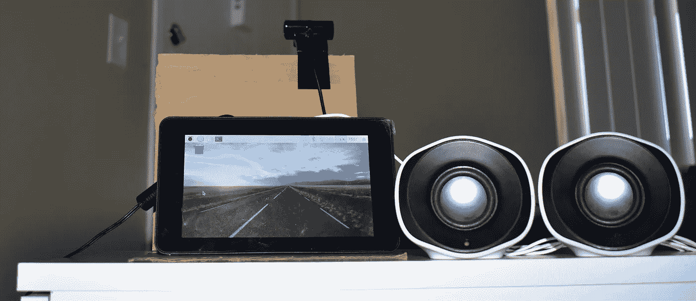
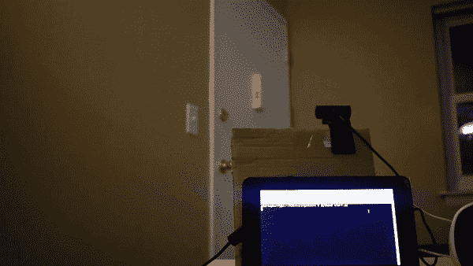
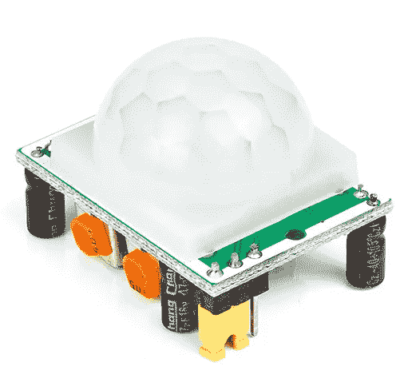
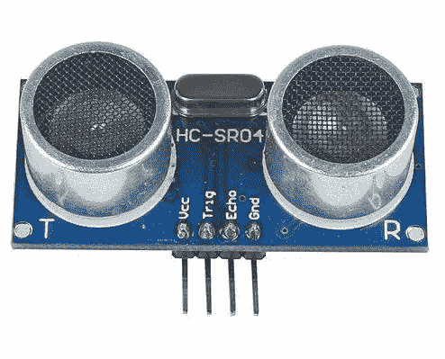

# 制作您自己的智能家庭安全摄像机

> 原文：<https://towardsdatascience.com/make-your-own-smart-home-security-camera-a89d47284fc7?source=collection_archive---------14----------------------->

Security Camera Set-up

## 一台可以进行面部识别的相机，成本不到 80 美元。

Demo

不久前，我想买一台好的智能相机，但我的需求与相关成本不相称。所以，我决定用我已经有的零件做一个。

## 所需零件:

*   树莓 PI 3
*   网络摄像头
*   PIR 传感器/超声波传感器

## 所需知识:

*   计算机编程语言
*   OpenCV
*   dlib

如果你想要更多关于 OpenCV 和 dlib 的信息，那么请看看我的旧文章。

# 什么是 PIR 传感器？

[Source: Google]

一个**被动红外传感器** ( **PIR 传感器**)是一个电子传感器，它测量从其视野内的物体发出的红外(IR)光。它们最常用于基于 PIR 的运动检测器。所有温度高于绝对零度的物体都以辐射的形式放出热能。通常这种辐射对人眼是不可见的，因为它以红外波长辐射，但它可以被 PIR 传感器检测到。

# 什么是超声波传感器？

[Source: Google]

超声波传感器是一种使用超声波测量物体距离的仪器。超声波以高于人类听觉范围的频率振动。它使用单个传感器发送脉冲并接收回波。传感器通过测量发送和接收超声波脉冲之间的时间间隔来确定到目标的距离。

# 方法

通俗地说，PIR 传感器将检测瞬间，摄像头将捕捉帧，Raspberry PI 将执行面部识别并提供最终输出。

更详细地说，我已经将 PIR 传感器与 Raspberry PI 连接起来，网络摄像头正对着我公寓的前门。我没有使用 AWS 或任何其他云服务来执行推理或发送通知。我正在进行局部推断，并在我的扬声器上播放关于谁进入的声音。

到目前为止，单独的 Raspberry PI 还不是一个理想的执行实时推理的嵌入式平台。因此，我使用 PIR 传感器来确定何时启动推理机并执行面部识别。你也可以使用超声波测距仪，但在我的情况下，我打算用它来完成我的另一个项目。

一旦门被打开，有人进入，PIR 传感器将开始检测。当 PIR 传感器检测到任何类型的移动时，摄像机将开始捕捉 10 秒钟的帧。与此同时，OpenCV 的“ [Haar Cascades](https://docs.opencv.org/3.4.3/d7/d8b/tutorial_py_face_detection.html) ”将开始检测人脸，dlib 的“ [68 点人脸标志检测](http://dlib.net/face_landmark_detection.py.html)”将检测到的人脸标志与保存的标志进行匹配，以检查它是否是入侵者？

使用 OpenCV，我们可以从网络摄像头捕捉帧，并将每个帧转换为 numpy 数组。这里，我们以 320x240 的速率记录帧。我们也可以录制全高清帧，但在 Raspberry PI 上执行人脸检测将花费大量时间。然后使用“haarcascade _ frontal face _ alt 2 . XML”模型，在给定的帧中检测人脸。一旦我们识别了所有的面孔，我们将把它们存储在一个列表中，以便将它们与保存的面孔进行比较。

我们会用 dlib 进行人脸对比。dlib 68 点人脸标志检测将为您提供给定人脸的标志。我们确实有一些已知的面部标志存储在 numpy 文件中，我们将在比较之前加载这些文件。一旦我们有了所有的地标，我们就能找到这些地标之间的距离。我们使用 0.6 作为阈值。给你阈值以下最小距离的面部标志是进入房间的已知人。如果值不低于阈值，那么它是一个入侵者！！

您可以在下面的 git 资源库中找到完整的代码，

 [## smitshilu/AISecurityCamera

### 在 GitHub 上创建一个帐户，为 smitshilu/AISecurityCamera 开发做出贡献。

github.com](https://github.com/smitshilu/AISecurityCamera) 

# 结论

你可以在家里开发一个智能摄像头来获取入侵者的状态。你也可以使用 AWS 或 Google Cloud 等服务向你的手机或短信发送通知。

如果你喜欢这篇文章，请关注我的**或*[***Github***](https://github.com/smitshilu)*或订阅我的 [***YouTube 频道***](http://www.youtube.com/c/SmitShilu) 。****