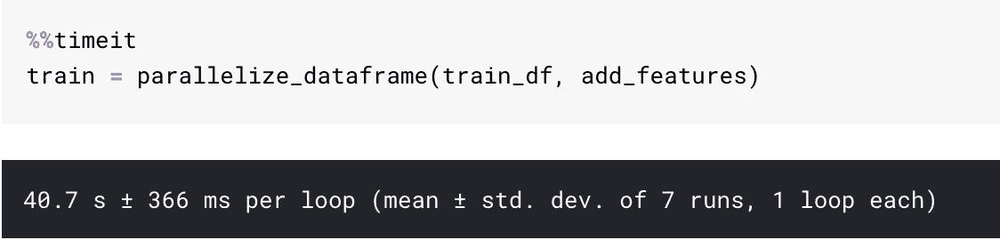
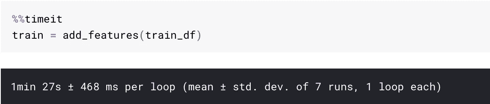

# 使用并行处理让你的熊猫更快地应用函数

> 原文：<https://towardsdatascience.com/make-your-own-super-pandas-using-multiproc-1c04f41944a1?source=collection_archive---------1----------------------->

## [蟒蛇短裤](https://towardsdatascience.com/tagged/python-shorts)

## 超级熊猫侠


Super Panda

***并行化牛逼。***

我们数据科学家已经有了四核、八核、睿频的笔记本电脑。我们使用具有更多内核和计算能力的服务器。

但是我们真的利用了我们手头的原始力量吗？

相反，我们等待耗时的过程结束。有时是几个小时，当紧急的交付品就在手边的时候。

我们能做得更好吗？我们能变得更好吗？

在这个名为**'**[**Python Shorts**](https://towardsdatascience.com/tagged/python-shorts)**，‘**的系列帖子中，我将解释由 [Python](https://amzn.to/2XPSiiG) 提供的一些简单构造，一些基本的技巧和我在数据科学工作中经常遇到的一些用例。

***这篇帖子讲的是利用我们手头的计算能力，把它应用到我们最常用的数据结构上。***

# 问题陈述

我们有一个巨大的熊猫数据框，我们想对它应用一个复杂的函数，这需要很多时间。

在这篇文章中，我将使用 Kaggle 上 Quora 非真诚问题分类的数据，我们需要创建一些数字特征，如长度、标点符号的数量等。这就去。

比赛是基于内核的比赛，代码需要在 2 小时内运行。所以每一分钟都是至关重要的，有太多的时间花在预处理上。

我们可以使用并行化来提高代码的性能吗？

是的，我们可以。

# 仅使用单个函数的并行化


Can we make all our cores run?

让我首先从定义我想用来创建我们的特征的函数开始。是我们希望应用于数据的玩具函数。

我们可以使用下面的函数来使用并行应用。

```
def parallelize_dataframe(df, func, n_cores=4):
    df_split = np.array_split(df, n_cores)
    pool = Pool(n_cores)
    df = pd.concat(pool.map(func, df_split))
    pool.close()
    pool.join()
    return df
```

它是做什么的？它将数据帧分成`n_cores`个部分，并产生`n_cores`进程，这些进程将函数应用于所有部分。

一旦它将函数应用于所有分割的数据帧，它就将分割的数据帧连接起来，并将完整的数据帧返回给我们。

## 我们如何使用它？

它使用起来非常简单。

```
train = parallelize_dataframe(train_df, add_features)
```

## 这有用吗？

为了检查这个并行化函数的性能，我在我的 Jupyter 笔记本的 Kaggle 内核中对这个函数运行了`%%timeit` magic。



与只使用现有功能相比:



如您所见，我通过使用并行化功能获得了一些性能。它使用的是只有两个 CPU 的 kaggle 内核。

在实际比赛中，涉及到大量的计算，我使用的`add_features`函数要复杂得多。这个并行化功能极大地帮助我减少了处理时间，并获得了[银牌](/what-my-first-silver-medal-taught-me-about-text-classification-and-kaggle-in-general-ebae0df16278)。

这里是带有完整代码的[内核](https://www.kaggle.com/mlwhiz/parallelization-kernel)。

# 结论

**并行化不是银弹；这是铅弹。它不会解决你所有的问题，你仍然需要优化你的功能，但是它是你的武器库中的一个很好的工具。**

时间一去不复返，有时我们也缺少时间。此时，我们应该能够轻松使用并行化。

> 并行化不是银弹，而是铅弹

另外，如果你想了解更多关于 [Python 3](https://coursera.pxf.io/0JMOOY) 的知识，我想向密歇根大学推荐一门关于学习[中级 Python](https://coursera.pxf.io/0JMOOY) 的优秀课程。一定要去看看。

将来我也会写更多初学者友好的帖子。让我知道你对这个系列的看法。在 [**媒体**](https://medium.com/@rahul_agarwal) 关注我或者订阅我的 [**博客**](https://mlwhiz.ck.page/a9b8bda70c) 了解他们。一如既往，我欢迎反馈和建设性的批评，可以通过 Twitter [@mlwhiz](https://twitter.com/MLWhiz) 联系到我。